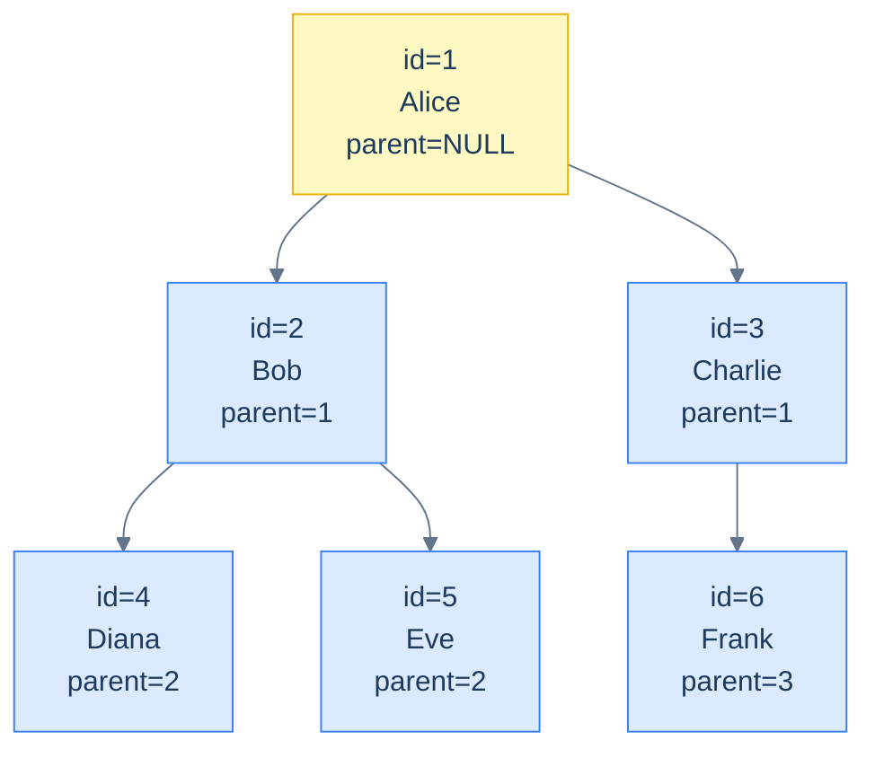

# 1. Hierarchies and Graphs

## The Hook

Recursive CTEs ([Recursive CTEs](/cortex/languages/sql/ctes-and-recursion/recursive-ctes)) handle hierarchies elegantly — but they iterate, and for deep trees on large data they're expensive. "All descendants of node X" might walk millions of rows.

For hot-path hierarchical queries, the schema-design choice matters. There are four canonical models for hierarchical/graph data: **adjacency list** (the default `parent_id` column), **closure table** (denormalised ancestor relationships), **materialised path** (a string like `'/1/4/12/'` per row), and **Postgres `ltree`** (a specialised type with operators).

Each has trade-offs. This chapter walks through them so you know when to reach for which.

---

## Table of contents

1. [Adjacency list](#adjacency-list)
2. [Closure table](#closure-table)
3. [Materialised path](#materialised-path)
4. [`ltree` (Postgres)](#ltree)
5. [When to use which](#when-to-use-which)
6. [Edge cases and pitfalls](#edge-cases-and-pitfalls)
7. [Production reality](#production-reality)
8. [Practice ladder](#practice-ladder)
9. [Cross-links](#cross-links)
10. [Final takeaway](#final-takeaway)

***

# Adjacency list

The simplest model: each row has a `parent_id` referencing its parent's `id`.

```sql
CREATE TABLE categories (
  id SERIAL PRIMARY KEY,
  name TEXT,
  parent_id INT REFERENCES categories(id)
);
```

**Pros:** simple, easy to insert and update.

**Cons:** querying "all ancestors" or "all descendants" requires a recursive CTE — `O(depth × N)` per query.



<p align="center"><strong>Adjacency list: each row points to its parent via <code>parent_id</code>. Walking up or down the tree requires recursive CTEs — fine for small trees, expensive for deep ones.</strong></p>

Use when: trees are small (< 10k rows), queries are mostly local (parent / direct children), writes are frequent.

---

# Closure table

A separate table stores *every ancestor-descendant pair*, including the row itself (depth 0):

```sql
CREATE TABLE categories (id SERIAL PRIMARY KEY, name TEXT);
CREATE TABLE category_paths (
  ancestor_id INT REFERENCES categories(id),
  descendant_id INT REFERENCES categories(id),
  depth INT,
  PRIMARY KEY (ancestor_id, descendant_id)
);
```

For node 12 with ancestors 1 → 4 → 12, you'd have rows:
- `(12, 12, 0)` — self
- `(4, 12, 1)` — parent
- `(1, 12, 2)` — grandparent

**Pros:** querying "all ancestors of X" is `WHERE descendant_id = X` — `O(log n)` with an index. Same for descendants.

**Cons:** writes are expensive — inserting one node adds N rows (one per ancestor). Deleting/moving a subtree requires recomputing the closure table for the subtree.

Use when: reads dominate (deep tree traversal in hot paths), writes are rare or batched.

---

# Materialised path

Each row stores its full path as a string:

```sql
CREATE TABLE categories (
  id SERIAL PRIMARY KEY,
  name TEXT,
  path TEXT             -- e.g., '/1/4/12'
);
CREATE INDEX categories_path_idx ON categories (path text_pattern_ops);
```

For node 12 with ancestors 1 → 4 → 12, `path = '/1/4/12'`.

Querying:
- "All descendants of node 4": `WHERE path LIKE '/1/4/%'` — uses prefix index.
- "All ancestors of node 12": parse the path string in application code.

**Pros:** queries via `LIKE` prefix are fast and indexable; no separate table.

**Cons:** moving a subtree requires rewriting paths for every descendant. String manipulation is awkward.

Use when: tree shape is mostly stable; you can manage path strings in application code.

---

# ltree

Postgres has a built-in `ltree` type for materialised paths, with operators tailored to hierarchical queries.

```sql
CREATE EXTENSION IF NOT EXISTS ltree;

CREATE TABLE categories (
  id SERIAL PRIMARY KEY,
  name TEXT,
  path LTREE
);
CREATE INDEX categories_path_gist ON categories USING GIST (path);

-- Find all descendants of node at path '1.4'.
SELECT * FROM categories WHERE path <@ '1.4';

-- Find all ancestors of '1.4.12'.
SELECT * FROM categories WHERE path @> '1.4.12';
```

`<@` is "is a descendant of"; `@>` is "is an ancestor of"; `~` matches `lquery` patterns. GiST indexing makes these operators fast.

**Pros:** hierarchical operators built into the type system; fast indexing; minimal application code.

**Cons:** Postgres-specific; learning curve for the operators.

For Postgres-native hierarchical data, `ltree` is the cleanest choice — modern code increasingly defaults to it.

---

# When to use which

| Use case | Model |
|---|---|
| Small tree, frequent writes | Adjacency list |
| Deep tree, deep ancestor/descendant queries, rare writes | Closure table |
| Stable tree, prefix queries dominate, no Postgres extensions | Materialised path |
| Postgres + heavy hierarchical querying | `ltree` |

---

# Edge cases and pitfalls

## Cycles

If the data is genuinely a graph (not a tree), the closure table grows quadratically with the number of nodes. Use sparingly. Real graph queries (shortest path, connected components) are better handled by graph databases (Neo4j, AWS Neptune) — SQL's strength is not graph traversal at scale.

## Updating ancestors/descendants

Closure tables and materialised paths require careful update logic. A move operation rewrites N rows. Most systems use triggers to keep them in sync; some accept eventual consistency between the source-of-truth and the denormalised structure.

## Deep trees and recursion limits

Postgres has a `max_stack_depth` setting; very deep recursive CTEs can hit it. Materialised paths and closure tables avoid this — they don't recurse.

---

# Production reality

E-commerce category trees, organisational charts, threaded comments, file system metadata, ACL groups — all these are hierarchies in real production systems. The choice of model depends on read/write ratio:

- **Threaded comments** (mostly written once, read many times) → closure table or `ltree`.
- **Org chart** (small, occasionally updated) → adjacency list.
- **File system metadata at scale** (deep, mutable) → materialised path with careful update logic, often with caching.

For graph-shaped data (user friendships, knowledge graphs), SQL is workable for small graphs but quickly hits limits. Hybrid systems (SQL for the data, dedicated graph store for the topology) are common at scale.

---

# Practice ladder

1. **Design an adjacency-list `categories` table. Write a recursive CTE to find all descendants of a given node.** *Hint: covered in [Recursive CTEs](/cortex/languages/sql/ctes-and-recursion/recursive-ctes).*
2. **Convert the same data to a closure table. Show the rows for a 3-level tree.** *Hint: every (ancestor, descendant, depth) triple.*
3. **Query "all ancestors of node 12" against a closure table.** *Hint: `WHERE descendant_id = 12`.*
4. **Query "all descendants of node 4" against a materialised path.** *Hint: `WHERE path LIKE '/1/4/%'`.*
5. **What's the trade-off between closure tables and adjacency lists?** *Hint: read speed vs write speed.*

***

# Cross-links

- **Previous module:** [Transactions and Concurrency](/cortex/languages/sql/transactions-and-concurrency/index).
- **Cited from:** [Recursive CTEs](/cortex/languages/sql/ctes-and-recursion/recursive-ctes) — when recursion is too slow.

***

# Final Takeaway

Hierarchical SQL has four canonical shapes. Three patterns to internalise:

1. **Adjacency list is the default.** Simple, write-friendly. Query with recursive CTEs.
2. **Closure table for read-heavy hot paths.** Trades write cost for read speed.
3. **Postgres `ltree` is the modern Postgres-native answer.** Built-in operators + GiST indexing.

## Your Turn

Before you move on, check your understanding with the coach — explain the idea, apply it, weigh the trade-offs, then defend your reasoning.

<div class="concept-coach"></div>
