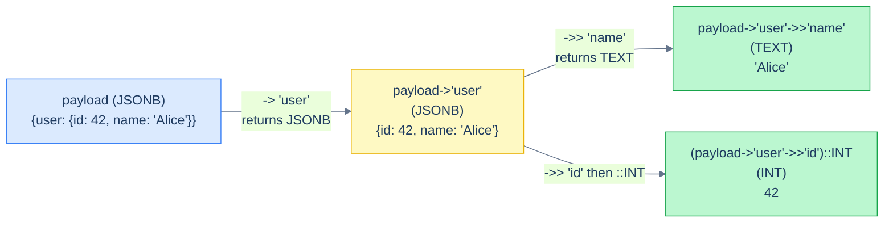

# 1. JSON in SQL

## The Hook

A webhook ingest table:

```sql
CREATE TABLE webhooks (
  id BIGINT PRIMARY KEY,
  received_at TIMESTAMPTZ NOT NULL,
  source TEXT NOT NULL,
  payload JSONB NOT NULL
);
```

`payload` holds arbitrary JSON the webhook sender sent. You can't predict its schema — different sources have different fields. Some are flat; some are deeply nested. You need to query it.

```sql
-- Get the user_id from a webhook payload.
SELECT id, payload->>'user_id' AS user_id FROM webhooks WHERE source = 'stripe';

-- Find webhooks where payload contains a specific status.
SELECT id FROM webhooks WHERE payload @> '{"status": "succeeded"}';

-- Sum amounts from nested object.
SELECT SUM((payload->'data'->>'amount')::NUMERIC) FROM webhooks WHERE source = 'stripe';
```

This is the `JSONB` toolkit — querying inside JSON, with index support. By the end you'll know when to use JSON, the operators that get you in and out of it, and how to index JSON paths so queries don't melt.

---

## Table of contents

1. [`JSON` vs `JSONB`](#json-vs-jsonb)
2. [Path operators](#path-operators)
3. [Containment and existence](#containment)
4. [`jsonb_path_query` and JSON Path](#jsonb_path_query)
5. [Indexing JSONB](#indexing-jsonb)
6. [When to use JSON in schemas](#when-to-use)
7. [Edge cases and pitfalls](#edge-cases-and-pitfalls)
8. [Production reality](#production-reality)
9. [Practice ladder](#practice-ladder)
10. [Cross-links](#cross-links)
11. [Final takeaway](#final-takeaway)

***

# JSON vs JSONB

Postgres has both:

- **`JSON`** — stored as text. Validated for syntax. Re-parsed on every query.
- **`JSONB`** — binary representation. Decomposed into a queryable form. Indexable. Slightly slower writes; much faster reads.

**Use `JSONB` for production.** `JSON` is text-as-text; `JSONB` is what you actually want.

> **Dialect note:** MySQL has `JSON` (binary internally). SQLite has `json` extension functions but no native type. SQL Server has `nvarchar` + JSON functions (no first-class type pre-2025). The Postgres `JSONB` model is the most powerful; the rest play catch-up.

---

# Path operators

Two operators to extract values:

- **`->` returns JSON** (i.e., the result is still JSONB).
- **`->>` returns text** (the result is unwrapped, as TEXT).



<p align="center"><strong>Chained JSON path extraction. Each <code>-></code> stays in JSONB; the final <code>->></code> unwraps to TEXT; explicit cast brings it to a SQL type.</strong></p>

```sql
-- payload = {"user": {"id": 42, "name": "Alice"}}
SELECT
  payload->'user'                AS user_obj,    -- {"id": 42, "name": "Alice"} as JSONB
  payload->'user'->>'name'       AS user_name,   -- 'Alice' as TEXT
  payload->'user'->'id'          AS user_id_jsonb, -- 42 as JSONB
  (payload->'user'->>'id')::INT  AS user_id_int   -- 42 as INT
;
```

Use `->>` (text) when you need the value out as a regular type. Cast as needed (`(payload->>'amount')::NUMERIC`).

For nested paths, chain the operators or use the `#>` / `#>>` form with an array of keys:

```sql
SELECT payload #>> '{user, name}' AS user_name FROM webhooks;
```

---

# Containment

`@>` is "left side contains right side." Both sides are JSONB:

```sql
-- Find webhooks where payload contains {"status": "succeeded"}.
SELECT * FROM webhooks WHERE payload @> '{"status": "succeeded"}';

-- Containment supports nesting.
SELECT * FROM webhooks WHERE payload @> '{"data": {"amount": 100}}';
```

`?` checks for top-level key existence:

```sql
SELECT * FROM webhooks WHERE payload ? 'amount';
-- Rows where the top-level JSON has an 'amount' key.

SELECT * FROM webhooks WHERE payload ?| ARRAY['amount', 'cost'];
-- Rows where 'amount' OR 'cost' exists.
```

`@>` is the workhorse for "find rows where the JSON has these specific values."

---

# jsonb_path_query

For complex queries — filtering inside nested arrays, path expressions — `jsonb_path_query` accepts a JSON Path expression:

```sql
-- Get all "items" from a nested cart.
SELECT id, jsonb_path_query(payload, '$.cart.items[*]') AS item
FROM webhooks
WHERE source = 'shopify';
```

JSON Path is a mini-language (similar to XPath) for navigating JSON. Postgres added it in 12. Useful for one-off complex queries; for routine queries, the `->`/`->>` operators are simpler.

---

# Indexing JSONB

`JSONB` is queryable; without indexes, queries scan every row.

**(1) GIN index for general containment:**

```sql
CREATE INDEX webhooks_payload_idx ON webhooks USING GIN (payload);
-- Now WHERE payload @> '{"status": "succeeded"}' is fast.
```

`gin_jsonb_ops` (the default) supports `@>`, `?`, `?|`, `?&`. `gin_jsonb_path_ops` is smaller / faster but supports only `@>`.

**(2) Expression index for specific paths:**

```sql
CREATE INDEX webhooks_user_id_idx ON webhooks ((payload->>'user_id'));
-- Now WHERE payload->>'user_id' = '42' is fast.
```

This is the right choice when you query one specific JSON path frequently — much smaller than a full GIN index.

**(3) Generated columns** (Postgres 12+):

```sql
ALTER TABLE webhooks ADD COLUMN user_id TEXT GENERATED ALWAYS AS (payload->>'user_id') STORED;
CREATE INDEX webhooks_user_id_gen_idx ON webhooks (user_id);
```

The generated column is automatically updated when `payload` changes; it's a real column with a B-tree index. Even cleaner than expression indexes.

---

# When to use JSON

**Yes:**
- Genuinely schemaless data — webhooks, audit logs, user-defined custom fields.
- Sparse data — dozens of optional fields where most rows have most fields NULL.
- Nested data where modelling each field as a column would be unwieldy.

**No:**
- Structured data with a known schema. Each meaningful field should be its own column. JSON loses type safety, NOT NULL enforcement, FK constraints.
- Data you'll JOIN on. JSONB joins are awkward and slow compared to typed columns.
- Anything that goes through an ORM that doesn't understand JSON well — your downstream code becomes a swamp of `payload['key']` accesses.

**Halfway**: a schema with explicit columns *and* a `payload JSONB` column for "extras." Common pattern; balances structure with flexibility.

---

# Edge cases and pitfalls

## NULL vs JSON null

`JSONB`'s `null` value is distinct from SQL `NULL`. `payload->>'foo'` returns `NULL` if `foo` doesn't exist OR if `foo` is JSON `null`. To distinguish, check `payload ? 'foo'`.

## Numeric precision

JSONB stores numbers as text-style strings (mostly accurate for integers, lossy for some fractions). Don't store money in JSON without thinking — extract to a real `NUMERIC` column.

## JSONB updates rewrite the whole value

Updating one field of a JSONB column rewrites the whole column. For JSONB columns of MB scale, partial updates are expensive.

## Deeply-nested JSON is awkward

A JSON column with 5 levels of nesting and dozens of fields is a sign you should be modelling it as separate tables. Use JSON for shallow flexibility, not as a workaround for schema design.

---

# Production reality

The codefolio `hello_events` table doesn't currently use JSONB, but a typical extension — adding per-event metadata — would:

```sql
ALTER TABLE hello_events ADD COLUMN metadata JSONB NOT NULL DEFAULT '{}';
CREATE INDEX hello_events_metadata_user_idx ON hello_events ((metadata->>'user_id')) WHERE metadata ? 'user_id';
```

The expression index (with `WHERE` for partial-index efficiency) makes per-user queries fast without adding a `user_id` column to every row.

A common production pattern: **structured columns for what you know, JSONB for what you don't**. Required fields with type/constraint enforcement become columns; arbitrary "additional" data goes in JSONB.

---

# Practice ladder

1. **Extract `payload->>'user_id'` from a webhooks table.** *Hint: `->>` for TEXT.*
2. **Find webhooks where payload contains `{"status": "succeeded"}`.** *Hint: `@>` operator.*
3. **Add a GIN index that makes (2) fast.** *Hint: `USING GIN (payload)`.*
4. **Add an expression index for `payload->>'user_id'`.** *Hint: `((payload->>'user_id'))`.*
5. **When should you use JSONB vs separate columns?** *Hint: schemaless / sparse / nested → JSONB. Structured → columns.*

***

# Cross-links

- **Previous in this module:** [Hierarchies and Graphs](/cortex/languages/sql/advanced-patterns/hierarchies-and-graphs).
- **Next in this module:** [Pivoting and Unpivoting](/cortex/languages/sql/advanced-patterns/pivoting-and-unpivoting).

***

# Final Takeaway

JSONB is Postgres's flexible-schema escape hatch. Three patterns to internalise:

1. **`JSONB` over `JSON`. Always.** Binary representation, queryable, indexable.
2. **Use `->>` for text, `->` for JSONB; cast at the boundary.** `(payload->>'amount')::NUMERIC` is the standard pattern.
3. **Index the paths you query.** GIN index for general containment; expression index or generated column for specific paths.

## Your Turn

Before you move on, check your understanding with the coach — explain the idea, apply it, weigh the trade-offs, then defend your reasoning.

<div class="concept-coach"></div>
