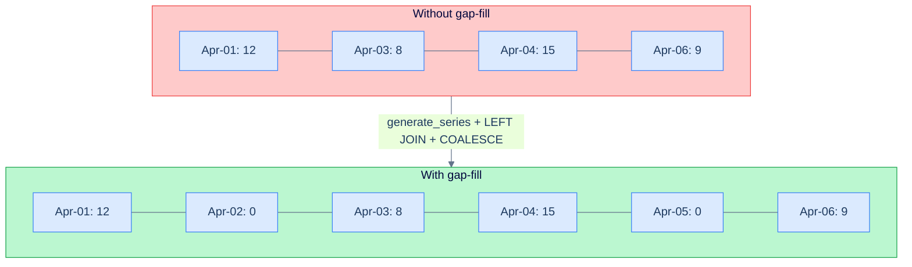

# 1. Time-Series Patterns

## The Hook

A growth chart for the last 30 days. The natural query:

```sql
SELECT DATE_TRUNC('day', TO_TIMESTAMP(timestamp_ms/1000.0)) AS day,
       COUNT(*) AS events
FROM hello_events
WHERE timestamp_ms >= NOW_MS - 30 * 86400000
GROUP BY day ORDER BY day;
```

Looks fine. But the result has **gaps** — days with zero events don't show up. The chart looks like the system intermittently went silent. The data is correct (no events that day), but the chart needs **every day present**, with `0` for empty days.

Time-series data has shape-specific challenges: bucketing into intervals, filling gaps, computing rolling metrics, sessionising activity. This chapter covers the patterns. Some have appeared in earlier chapters; this is the consolidated view.

---

## Table of contents

1. [Time bucketing](#time-bucketing)
2. [Gap filling](#gap-filling)
3. [Rolling windows](#rolling-windows)
4. [Cohorts and retention](#cohorts-and-retention)
5. [Time-bound aggregations with `FILTER`](#time-bound-aggregations)
6. [Edge cases and pitfalls](#edge-cases-and-pitfalls)
7. [Production reality](#production-reality)
8. [Practice ladder](#practice-ladder)
9. [Cross-links](#cross-links)
10. [Final takeaway](#final-takeaway)

***

# Time bucketing

Group events into intervals. From [Dates and Times](/cortex/languages/sql/row-functions/dates-and-times):

```sql
-- Hourly buckets.
SELECT DATE_TRUNC('hour', TO_TIMESTAMP(timestamp_ms/1000.0)) AS hour,
       COUNT(*) AS events
FROM hello_events GROUP BY hour ORDER BY hour;
```

Standard `DATE_TRUNC` units: `'second'`, `'minute'`, `'hour'`, `'day'`, `'week'`, `'month'`, `'quarter'`, `'year'`.

For **arbitrary-width buckets** (every 5 minutes, every 15 minutes), do integer arithmetic on the timestamp:

```sql
-- 5-minute buckets.
SELECT (timestamp_ms / 1000 / 300) * 300 AS bucket_s,
       COUNT(*)
FROM hello_events
GROUP BY bucket_s;
```

Postgres also has the `time_bucket` function in the TimescaleDB extension — purpose-built for this and very fast on partitioned hypertables.

---

# Gap filling

The chapter's hook bug. Solution: generate every bucket, then `LEFT JOIN` the actual data.



<p align="center"><strong>Without gap-fill, a chart of (date, count) skips empty days — looking like the system was silent. <code>generate_series</code> produces every bucket; <code>LEFT JOIN</code> + <code>COALESCE</code> fills empties with zero.</strong></p>

```sql
-- Generate every day in the last 30 days; LEFT JOIN events; COALESCE empty days to 0.
WITH days AS (
  SELECT generate_series(
    DATE_TRUNC('day', NOW()) - INTERVAL '29 days',
    DATE_TRUNC('day', NOW()),
    INTERVAL '1 day'
  )::DATE AS day
)
SELECT d.day,
       COALESCE(COUNT(e.id), 0) AS events
FROM days d
LEFT JOIN hello_events e
  ON DATE_TRUNC('day', TO_TIMESTAMP(e.timestamp_ms/1000.0))::DATE = d.day
GROUP BY d.day
ORDER BY d.day;
```

`generate_series` produces every day as a row; the `LEFT JOIN` matches actual events; `COALESCE(COUNT(...), 0)` ensures empty days show as 0, not NULL. The chart now has 30 data points, every day represented.

This is *the* canonical fix for time-series gaps.

---

# Rolling windows

7-day rolling average — covered in [Window Functions: Frames](/cortex/languages/sql/window-functions/frames):

```sql
SELECT day, events,
       AVG(events) OVER (ORDER BY day ROWS BETWEEN 6 PRECEDING AND CURRENT ROW) AS rolling_7d_avg
FROM daily_metrics;
```

For *true* 7-calendar-day windows (ignoring whether you have a row for every day), use `RANGE` with intervals (Postgres):

```sql
AVG(events) OVER (ORDER BY day RANGE BETWEEN INTERVAL '6 days' PRECEDING AND CURRENT ROW)
```

---

# Cohorts and retention

A classic analytics question: "of users who signed up in week N, how many returned in week N+1, N+2, ..., N+8?". The cohort-retention pivot.

```sql
WITH cohorts AS (
  SELECT user_id, DATE_TRUNC('week', signup_date) AS cohort_week
  FROM users
),
returns AS (
  SELECT user_id, DATE_TRUNC('week', activity_date) AS return_week
  FROM activity
)
SELECT c.cohort_week,
       (return_week - c.cohort_week) / 7 AS weeks_after,
       COUNT(DISTINCT r.user_id) AS active_users
FROM cohorts c
JOIN returns r ON r.user_id = c.user_id AND r.return_week >= c.cohort_week
GROUP BY c.cohort_week, weeks_after
ORDER BY c.cohort_week, weeks_after;
```

Result: rows per (cohort, weeks_after) with counts of returning users. Pivot this for the standard cohort-retention triangle.

---

# Time-bound aggregations with FILTER

From [Aggregate Functions: FILTER](/cortex/languages/sql/aggregation/aggregate-functions#filter-clause):

```sql
SELECT
  COUNT(*)                                                   AS total_30d,
  COUNT(*) FILTER (WHERE timestamp_ms >= NOW_MS - 86400000)  AS total_24h,
  COUNT(*) FILTER (WHERE timestamp_ms >= NOW_MS - 3600000)   AS total_1h
FROM hello_events
WHERE timestamp_ms >= NOW_MS - 30 * 86400000;
```

Three time-windowed counts, one pass. The "executive summary" shape.

---

# Edge cases and pitfalls

## Timezone in bucketing

`DATE_TRUNC('day', ts)` truncates in the session's timezone. For "yesterday in user X's timezone" reports, explicitly convert: `DATE_TRUNC('day', ts AT TIME ZONE 'America/New_York')`.

## DST in interval arithmetic

`INTERVAL '1 day'` is calendar-aware (handles DST); `INTERVAL '24 hours'` is wall-clock. Pick the one matching your business question.

## Massive scans

Every "all events in last 30 days" query potentially scans the time-bucketed range. Without an index on `timestamp_ms`, this scales linearly with table size. The B-tree index makes it logarithmic.

## Bucket gaps for non-existent data

The "gap filling" pattern is essential for any chart. Without it, dashboards have visual holes.

---

# Production reality

The codefolio `hello_events` table is naturally a time-series store. The patterns above are the daily working tools:

- **Hourly bucket charts:** time bucketing + gap filling.
- **24-hour rolling activity:** time bucketing + window function.
- **"Big numbers" dashboard summary:** time-bound aggregations with `FILTER`.

For codefolio-scale data (thousands of events / day), regular Postgres handles all of this without specialised tooling. At true time-series scale (hundreds of thousands of events / second), specialised engines like TimescaleDB or InfluxDB take over — purpose-built for time-series workloads, with hypertable partitioning and continuous aggregates.

---

# Practice ladder

1. **Generate every day in April 2026.** *Hint: `generate_series` with daily INTERVAL.*
2. **For each day in April, count `hello_events` (with 0 for empty days).** *Hint: `LEFT JOIN`, `COALESCE(COUNT, 0)`.*
3. **Compute a 7-day rolling average of daily events.** *Hint: window function with `ROWS BETWEEN 6 PRECEDING`.*
4. **What's the difference between `INTERVAL '1 day'` and `INTERVAL '24 hours'`?** *Hint: DST awareness.*

***

# Cross-links

- **Previous in this module:** [Pivoting and Unpivoting](/cortex/languages/sql/advanced-patterns/pivoting-and-unpivoting).
- **Module complete. SQL section complete.**
- **Cited:** [Dates and Times](/cortex/languages/sql/row-functions/dates-and-times), [Window Functions](/cortex/languages/sql/window-functions/index), [Aggregate Functions](/cortex/languages/sql/aggregation/aggregate-functions).

***

# Final Takeaway

Time-series SQL is the same SQL with a few patterns. Three to internalise:

1. **Bucket with `DATE_TRUNC` (or integer-divide for arbitrary widths).**
2. **Fill gaps with `generate_series` + `LEFT JOIN` + `COALESCE`.** Empty buckets must show as 0, not absent.
3. **`FILTER` aggregates for time-windowed summary stats.** "Total / last 24h / last hour" in one pass over the data.

With this chapter, the **SQL section is complete**: 38 chapters across 10 modules. Next sections in the [Languages](/cortex/languages/index) book — Python, Scala, etc. — are planned but not yet written.

## Your Turn

Before you move on, check your understanding with the coach — explain the idea, apply it, weigh the trade-offs, then defend your reasoning.

<div class="concept-coach"></div>
