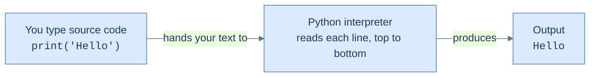

# What Python Is & Running Code — Your First Program

A program is a list of instructions, and **Python is a program that reads your instructions and does exactly what each one says, in order, from top to bottom.** That is the whole idea. Everything in this book — every loop, every function, every class — is built on instructions that run one after another, and the more literally you take "exactly what each one says," the fewer surprises you'll have. This first chapter gets you running code and watching the interpreter follow your instructions.

You do not need anything installed. Every code block with a ▶ Run button executes in a real Python sandbox in your browser. Click Run, change the code, run it again. Every output shown below was produced by running the code.

> **How to read the Intuition boxes.** Each one is built in three moves: (1) the **mechanism** — what the interpreter is *actually doing*; (2) a **concrete bite** — a specific, runnable way the naive assumption fails; (3) the **earned rule** — the decision heuristic, now justified rather than asserted, plus its cost.

---

## Table of contents

1. [A program is a list of instructions](#1-a-program-is-a-list-of-instructions)
2. [Python is an interpreter reading your text](#2-python-is-an-interpreter-reading-your-text)
3. [Two ways to run code: the REPL and scripts](#3-two-ways-to-run-code-the-repl-and-scripts)
4. [`print()` — how a program talks back](#4-print--how-a-program-talks-back)
5. [Comments — notes for humans](#5-comments--notes-for-humans)
6. [Mental-model summary](#6-mental-model-summary)
7. [Gotcha checklist](#7-gotcha-checklist)

---

## 1. A program is a list of instructions

Before any syntax: a **program** is just a list of **instructions** (also called **statements**) that a computer carries out one at a time. You write them down; the computer does them in the order you wrote them. Here is a complete, one-instruction Python program. It uses `print`, the instruction for "show this on the screen" — we'll look at it properly in §4; for now just run it.

```python run
print("Hello, world!")
```

**Output:**
```
Hello, world!
```

**Analysis.** Python read one instruction — "print the text `Hello, world!`" — and did it. The quotation marks tell Python that `Hello, world!` is a piece of text to be shown literally, not an instruction to interpret. The text between the quotes appeared on screen; the quotes themselves did not.

**Intuition.**
*Mechanism.* Python executes statements **one at a time, top to bottom**. It does the first line completely, then the second, and so on — it never skips ahead or reorders on its own.

*Concrete bite.* You can see the order directly, including what happens when one instruction is broken. Run this:

```python run
print("line 1 runs")
print("line 2 runs")
oops_this_line_is_a_typo
print("line 4 never runs")
```

The first two lines print, in order:

```
line 1 runs
line 2 runs
```

Then the program **stops** on line 3 with an error, and line 4 never runs at all:

```
Traceback (most recent call last):
  File "/w/main.py", line 3, in <module>
    oops_this_line_is_a_typo
NameError: name 'oops_this_line_is_a_typo' is not defined
```

Line 3 is a word Python doesn't recognise, so it raises an error and halts. The proof that execution is strictly in order is that lines 1–2 *did* run (their output is there) and line 4 *didn't* (its output is missing).

*Earned rule.* Order is everything: an instruction can only use what the instructions before it have set up, and **an error stops the program right there** — nothing after it runs. The cost of this halt-on-error behaviour is that a program which fails halfway leaves its earlier effects done and its later effects undone; later (Tutorial 19) you'll learn to catch errors so a single bad line doesn't sink everything.

---

## 2. Python is an interpreter reading your text

When you "run Python," a program called the **interpreter** reads your code — which is just **text** you typed — and carries it out. Your text is the *source code*; the interpreter is the thing that turns it into actions and output.



```python run
print("Python runs this line.")
```

**Output:**
```
Python runs this line.
```

**Analysis.** The interpreter read the text `print("Python runs this line.")`, recognised `print` as a built-in instruction, and executed it. Nothing about the sentence's *meaning* mattered to Python — only that it matched the form of an instruction it knows.

**Intuition.**
*Mechanism.* The interpreter matches the names you write **exactly** — character for character, including capitalisation. It does not guess what you meant; it looks up precisely the name you typed.

*Concrete bite.* Capitalise `print` and the match fails:

```python run
print("Starting up")
Print("Done")
```

The first line runs, then the second fails:

```
Starting up
```
```
Traceback (most recent call last):
  File "/w/main.py", line 2, in <module>
    Print("Done")
    ^^^^^
NameError: name 'Print' is not defined. Did you mean: 'print'?
```

`print` and `Print` are different names to Python. It even guesses your mistake — *"Did you mean: 'print'?"* — but it will not silently fix it for you.

*Earned rule.* Spelling and capitalisation must be exact; Python is literal, not telepathic. The upside of that strictness is that errors are loud and specific — a `NameError` with a "did you mean" hint points straight at the typo. The cost is that there is no "do what I meant"; a single wrong letter is a hard stop, so read the error's last line and the `^^^^^` markers, which point at the exact problem.

---

## 3. Two ways to run code: the REPL and scripts

There are two ways to run Python, and the difference trips up beginners. A **script** is code saved in a file (or in a block like the ones here) that runs start to finish. The **REPL** (Read–Eval–Print Loop) is an interactive prompt where you type one line, press Enter, and Python immediately shows you the result — handy for quick experiments. The runnable blocks in this book behave like **scripts**.

The distinction that matters: in the REPL, typing a bare value *echoes* it back; in a script, a bare value is computed and then thrown away. Run this script:

```python run
42
print(42)
```

**Output:**
```
42
```

**Analysis.** There are two `42`s in the code but only one in the output. The first line, `42`, is a value sitting on its own — the script computes it and discards it, showing nothing. Only the second line, `print(42)`, actually displays anything. (In a REPL, by contrast, typing `42` and pressing Enter *would* echo `42` — which is exactly why beginners expect the bare line to print here, and are surprised when it doesn't.)

**Intuition.**
*Mechanism.* In a script, an expression's value is computed and then dropped unless you do something with it — like hand it to `print`. The REPL is the special case: it adds an automatic "print the result of each line" step that scripts do not have.

*Concrete bite.* The output above is the demonstration: two `42`s written, one `42` shown. The bare `42` left no trace; only the `print(42)` did.

*Earned rule.* In scripts (and in these blocks), **use `print()` to see anything** — don't expect a bare value to appear. The cost of forgetting is the most common beginner confusion: a program that runs without error but "does nothing," because every result was computed and silently discarded.

---

## 4. `print()` — how a program talks back

`print` is a **function** — a named, reusable action you can call. You "call" it by writing its name followed by parentheses, and you put what you want it to act on *inside* the parentheses (those inputs are called **arguments**). `print`'s job is to display its arguments. You can give it more than one, separated by commas.

```python run
print("Python", "is", "fun")
print("a", "b")
```

**Output:**
```
Python is fun
a b
```

**Analysis.** The first call has three arguments; `print` showed them with single spaces between, on one line. The second call's two arguments came out as `a b` — again with a space inserted. And the two `print` calls produced two separate lines, even though we never wrote anything about a new line.

**Intuition.**
*Mechanism.* `print` does two automatic things: it joins its arguments with a single space between them, and it ends with a "new line" so the next `print` starts fresh on the line below. (These defaults have names — `sep=" "` for the separator, `end="\n"` for the ending — which you can change.)

*Concrete bite.* The automatic space surprises people who expect the arguments to be glued together:

```python run
print("a", "b")
```
```
a b
```

That's `a b`, **not** `ab`. If you want a different separator, say so with `sep`:

```python run
print("2024", "12", "25", sep="-")
```
```
2024-12-25
```

*Earned rule.* Commas between `print` arguments insert spaces and the call ends a line for you; reach for `sep=` to change the separator, or (from the next chapter) an f-string when you want full control of the layout. The cost of the convenient defaults is that the automatic space bites exactly when you wanted no gap — `print("$", price)` gives `$ 100`, not `$100`.

---

## 5. Comments — notes for humans

A **comment** is a note in your code for people to read; Python ignores it completely. Anything from a `#` to the end of that line is invisible to the interpreter.

```python run
# This whole line is a comment — Python ignores it
print("code runs")  # an inline comment, ignored too
# print("this line is commented out, so it never runs")
```

**Output:**
```
code runs
```

**Analysis.** Three lines mention nothing but two of them are comments. The first line (a full-line comment) did nothing. The second line ran `print("code runs")` and ignored the note after the `#`. The third line *looks* like a `print` call, but because it starts with `#`, Python treated the whole thing as a comment — so it never ran, and `this line is commented out…` never appeared.

**Intuition.**
*Mechanism.* While reading your text, the interpreter discards everything from a `#` to the end of that line before it does anything else. The discarded text never becomes an instruction.

*Concrete bite.* The missing third line proves it: the output is only `code runs`. Putting `#` in front of `print("this line is commented out…")` — called "commenting out" — disabled that instruction entirely.

*Earned rule.* Use comments to explain **why** something is done, not to restate **what** the code obviously does; and "comment out" a line to disable it temporarily. The cost is that comments are never checked against the code — a comment that's gone stale will confidently tell you a lie, so keep them honest or delete them.

---

## 6. Mental-model summary

| Principle | Consequence |
|---|---|
| A program is instructions run top to bottom, one at a time | Order matters; a line can only use what earlier lines set up |
| An error halts the program at that line | Lines after an error don't run; earlier effects already happened |
| The interpreter matches names exactly, including case | `Print` ≠ `print`; typos are loud `NameError`s, not silent guesses |
| Scripts discard bare values; only `print` shows output | A program with no `print` runs fine and shows nothing |
| `print` joins arguments with spaces and ends the line | `print("a","b")` → `a b`; use `sep=` to change it |
| `#` to end of line is ignored by Python | Comments are for humans; "commenting out" disables code |

## 7. Gotcha checklist

- **Nothing prints, no error →** you computed values but never called `print`; wrap what you want to see in `print(...)`.
- **`NameError: name 'X' is not defined` →** a typo or wrong capitalisation; check the spelling against the "Did you mean" hint and the `^^^^^` markers.
- **Output runs together / has unwanted spaces →** `print`'s comma puts a space between arguments; use `sep=""` or an f-string (next chapter).
- **A line that should run doesn't →** it starts with `#`, so it's a comment; remove the `#`.
- **Program stops partway, later output missing →** an error earlier halted everything after it; read the traceback's last line for the cause.

---

*Predict, then check.* Look at the §1 four-line program with the typo on line 3 again. Before re-running it, write down exactly which lines will print and which won't, and why. Then change the broken line 3 to `print("line 3 runs")` and predict the new output before clicking Run. If your prediction matches, you've internalised the single most important rule in this book: **Python does exactly what each line says, in order.**

## Your Turn

Before you move on, check your understanding with the coach — explain the idea, apply it, weigh the trade-offs, then defend your reasoning.

<div class="concept-coach"></div>
