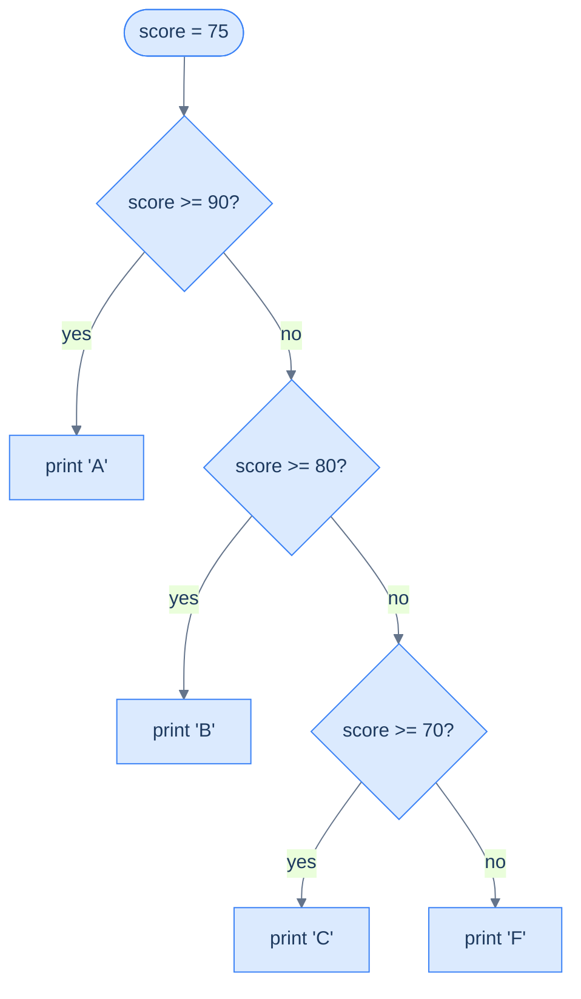

# Conditionals — Running Code Only When It Should

A conditional runs a block of code **only when a condition is true**. That's the whole idea, and it rests directly on [the previous chapter](/synapse/programming-languages/python/control-flow/booleans-and-logic): `if` checks a bool (or any truthy value) and decides whether to run the indented block beneath it. The thesis to hold onto: **indentation is not cosmetic — it is how Python knows which lines belong to the `if`.** Get that, and conditionals are straightforward; miss it, and you get the errors this chapter shows.

Every output below was produced by running the code.

> **How to read the Intuition boxes.** Each one is built in three moves: (1) the **mechanism** — what the interpreter is *actually doing*; (2) a **concrete bite** — a specific, runnable way the naive assumption fails; (3) the **earned rule** — the decision heuristic, now justified rather than asserted, plus its cost.

---

## Table of contents

1. [The `if` statement](#1-the-if-statement)
2. [`if` / `else`](#2-if--else)
3. [`if` / `elif` / `else` chains](#3-if--elif--else-chains)
4. [Nesting conditionals](#4-nesting-conditionals)
5. [Idiomatic conditions](#5-idiomatic-conditions)
6. [Mental-model summary](#6-mental-model-summary)
7. [Gotcha checklist](#7-gotcha-checklist)

---

## 1. The `if` statement

An `if` is the keyword `if`, a condition, a colon, and then an **indented block** — the lines that run only when the condition is true. The standard indent is four spaces.

```python run
temp = 30
if temp > 25:
    print("It's warm")
print("Done")
```

**Output:**
```
It's warm
Done
```

**Analysis.** `temp > 25` is `True`, so the indented `print("It's warm")` ran. `print("Done")` is **not** indented, so it's outside the `if` — it runs no matter what. The indentation is the only thing marking where the conditional block starts and stops.

**Intuition.**
*Mechanism.* The colon opens a block, and Python uses the **indentation** of the following lines to decide which statements are "inside" the `if`. Same-indented lines form one block; a line dedented back to the original level is outside it.

*Concrete bite.* Forget to indent the body and Python refuses to run the file at all:

```python run
temp = 30
if temp > 25:
print("It's warm")
```
```
  File "/w/main.py", line 3
    print("It's warm")
    ^^^^^
IndentationError: expected an indented block after 'if' statement on line 2
```

After `if ...:`, Python *requires* an indented block; an unindented next line is an `IndentationError`, raised before anything runs.

*Earned rule.* End every `if` line with `:` and indent its body (four spaces, consistently). The cost of Python's indentation rule is strictness — a stray space or a missing indent is an error, not a warning — but the payoff is that the visual structure of the code always matches what runs, with no `{ }` to misplace.

---

## 2. `if` / `else`

`else` provides the "otherwise" branch: a block that runs exactly when the `if` condition was false. Exactly one of the two blocks runs.

```python run
age = 15
if age >= 18:
    print("Adult")
else:
    print("Minor")
```

**Output:**
```
Minor
```

**Analysis.** `age >= 18` is `False`, so the `if` block is skipped and the `else` block runs, printing `Minor`. `else` takes no condition of its own — it's simply "when the `if` wasn't true."

**Intuition.**
*Mechanism.* `if`/`else` is a fork: Python evaluates the condition once and runs exactly one of the two branches. `else` aligns (same indentation) with its `if` and needs its own `:` and indented block.

*Concrete bite.* Writing `=` instead of `==` in the condition — assignment where a comparison belongs — is caught as a syntax error:

```python run
age = 18
if age = 18:
    print("yes")
```
```
  File "/w/main.py", line 2
    if age = 18:
       ^^^^^^^^
SyntaxError: invalid syntax. Maybe you meant '==' or ':=' instead of '='?
```

A condition must be an *expression* that yields a value; `age = 18` is an assignment *statement*, which isn't allowed there. Python even suggests the fix: `==`.

*Earned rule.* Use `==` to compare in a condition; `=` only assigns. The cost of the mix-up is mercifully a loud `SyntaxError` (Python forbids assignment in an `if` condition precisely to catch this) — heed the "Maybe you meant '=='?" hint and move on.

---

## 3. `if` / `elif` / `else` chains

For more than two outcomes, `elif` ("else if") adds extra conditions. Python checks them top to bottom and runs the **first** block whose condition is true, then skips the rest.

```python run
score = 75
if score >= 90:
    print("A")
elif score >= 80:
    print("B")
elif score >= 70:
    print("C")
else:
    print("F")
```

**Output:**
```
C
```



**Analysis.** `score >= 90` is false, `score >= 80` is false, `score >= 70` is true → it prints `C` and stops, never reaching `else`. As the diagram shows, the checks run in order and the first "yes" wins; everything below it is skipped.

**Intuition.**
*Mechanism.* An `if`/`elif`/`else` chain is *one* decision with several branches. Python tests conditions top to bottom and the moment one is true, runs its block and exits the whole chain — later conditions aren't even evaluated.

*Concrete bite.* Because the *first* match wins, a too-broad condition placed early hides the ones below it:

```python run
score = 95
if score >= 70:
    print("C or better")
elif score >= 90:
    print("A")     # never reached: the first test already matched
```
```
C or better
```

`score` is `95` — clearly an "A" — but `score >= 70` is checked first, matches, and wins. The `elif score >= 90` can *never* run, because anything ≥ 90 is also ≥ 70. The order silently swallowed a case.

*Earned rule.* Order `elif` branches from **most specific / most restrictive to least** (highest score first). The cost of bad ordering is invisible — no error, just a branch that can never execute — so when a case "never happens," check whether an earlier condition is catching it first.

---

## 4. Nesting conditionals

An `if` block can contain another `if`. Each level of nesting is another level of indentation, and the inner conditional is only reached when the outer one is true.

```python run
logged_in = True
is_admin = False
if logged_in:
    if is_admin:
        print("Admin panel")
    else:
        print("User dashboard")
else:
    print("Please log in")
```

**Output:**
```
User dashboard
```

**Analysis.** `logged_in` is true, so we enter the outer block. Inside, `is_admin` is false, so the inner `else` runs: `User dashboard`. The outer `else` (`Please log in`) belongs to the *outer* `if` — indentation is what pairs each `else` with the right `if`.

**Intuition.**
*Mechanism.* Indentation depth encodes the nesting: the inner `if`/`else` sits one level deeper, so it's part of the outer `if`'s block and only considered when the outer condition held.

*Concrete bite.* Deep nesting quickly becomes hard to read, and a misaligned `else` attaches to the wrong `if`. The cleaner alternative is usually to **combine conditions** with `and` instead of nesting:

```python run
logged_in = True
is_admin = False
if logged_in and is_admin:
    print("Admin panel")
elif logged_in:
    print("User dashboard")
else:
    print("Please log in")
```
```
User dashboard
```

Same result, one level of indentation, and each branch's full requirement is visible on its own line.

*Earned rule.* Nest when the inner decision only makes sense after the outer one; otherwise flatten with `and`/`elif`. The cost of nesting is readability — every extra level is another indent to track and another place for an `else` to attach wrongly — so prefer the flattest structure that still reads clearly.

---

## 5. Idiomatic conditions

Because any value is truthy or falsy ([previous chapter](/synapse/programming-languages/python/control-flow/booleans-and-logic)), you write `if name:` rather than `if name != "":`. Lean on that — but don't compare to `True`/`False` directly.

```python run
name = "Ada"
if name:                 # truthy check (preferred)
    print("Has a name")
if name == True:         # comparing to True (almost always wrong)
    print("This will not print")
print("checked")
```

**Output:**
```
Has a name
checked
```

**Analysis.** `if name:` ran because `"Ada"` is truthy. But `if name == True:` did **not** — and that's the surprise: `"Ada"` is *truthy*, yet it does not *equal* `True`. Truthiness ("does this count as yes?") and equality to the literal `True` ("is this exactly the value `True`?") are different questions.

**Intuition.**
*Mechanism.* `if x:` asks whether `x` is truthy. `if x == True:` asks whether `x` is *equal to the bool `True`* — a much narrower test that only non-`bool` values fail even when they're truthy.

*Concrete bite.* The output above is the proof: `"Ada"` is truthy (first `if` ran) but `"Ada" == True` is `False` (second `if` didn't). So `if name == True:` rejects every real name. Comparing to `True` breaks exactly when you rely on truthiness.

*Earned rule.* Write `if x:` and `if not x:` — never `== True` / `== False`. The cost of the explicit comparison isn't just verbosity; it changes the meaning from "truthy" to "is literally the bool," which silently fails for the truthy non-bool values you usually care about.

---

## 6. Mental-model summary

| Principle | Consequence |
|---|---|
| `if cond:` runs the indented block only when `cond` is truthy | Indentation marks the block; a missing indent is an `IndentationError` |
| `else` runs when the `if` was false | Exactly one of `if`/`else` runs; `else` takes no condition |
| `elif` chain runs the first true branch, then exits | Order most-specific first, or an early broad test hides later ones |
| Conditions are expressions; `=` is assignment | `if x = 1:` is a `SyntaxError`; use `==` |
| Any value works as a condition (truthiness) | `if name:` means non-empty; but `name == True` is a different, narrower test |

## 7. Gotcha checklist

- **`IndentationError: expected an indented block` →** indent the body under `if`/`elif`/`else`/`while` (four spaces).
- **`SyntaxError ... Maybe you meant '=='?` →** you wrote `=` in a condition; use `==`.
- **A branch never runs →** an earlier `elif`/`if` condition is broader and matches first; reorder most-specific first.
- **An `else` pairs with the wrong `if` →** check indentation; `else` binds to the `if` at its own indent level.
- **`if x == True:` skips a truthy value →** compare nothing; write `if x:` (and `if not x:`).

---

*Predict, then check.* Write a grade classifier for `score = 85` using `if`/`elif`/`else` that prints `A` (≥90), `B` (≥80), `C` (≥70), else `F`. Predict the output. Now deliberately reorder it worst-first (`if score >= 70` at the top) and predict what `85` prints with the broken order. Build both as runnable blocks and confirm — the contrast is the lesson of §3.

## Your Turn

Before you move on, check your understanding with the coach — explain the idea, apply it, weigh the trade-offs, then defend your reasoning.

<div class="concept-coach"></div>
