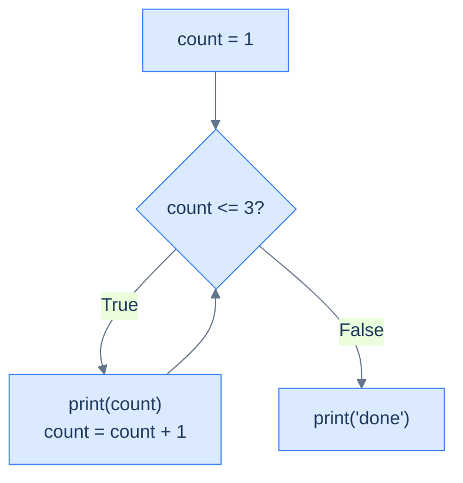

# Loops — Repeating Work Without Copy-Paste

A loop is how you tell the computer to **repeat work** without writing it out N times. Python has two, and the thesis is to pick by what you're repeating *for*: **`while` repeats as long as a condition stays true; `for` repeats once per item in a sequence.** Most "do this to each thing" jobs are `for` loops; `while` is for "keep going until something changes." Both run an indented block, exactly like the conditionals in [the last chapter](/synapse/programming-languages/python/control-flow/conditionals).

Every output below was produced by running the code.

> **How to read the Intuition boxes.** Each one is built in three moves: (1) the **mechanism** — what the interpreter is *actually doing*; (2) a **concrete bite** — a specific, runnable way the naive assumption fails; (3) the **earned rule** — the decision heuristic, now justified rather than asserted, plus its cost.

---

## Table of contents

1. [The `while` loop](#1-the-while-loop)
2. [The `for` loop and `range()`](#2-the-for-loop-and-range)
3. [Looping over a string](#3-looping-over-a-string)
4. [`range(start, stop, step)`](#4-rangestart-stop-step)
5. [Nested loops](#5-nested-loops)
6. [Mental-model summary](#6-mental-model-summary)
7. [Gotcha checklist](#7-gotcha-checklist)

---

## 1. The `while` loop

A `while` loop repeats its block **as long as a condition is true**. It checks the condition, runs the body, and checks again — over and over — until the condition becomes false.

```python run
count = 1
while count <= 3:
    print(count)
    count = count + 1
print("done")
```

**Output:**
```
1
2
3
done
```



**Analysis.** `count` starts at 1. The condition `count <= 3` is true, so the body prints `count` and increases it — then control loops back to the condition. This repeats for 1, 2, 3; when `count` reaches 4 the condition is false, the loop exits, and `print("done")` (outside the loop) runs.

**Intuition.**
*Mechanism.* A `while` re-checks its condition before every pass. For the loop to ever end, something **inside** the body must eventually make the condition false — here, `count = count + 1`.

*Concrete bite.* If the body doesn't move the condition toward false, the loop never stops — an **infinite loop**. The opposite, subtler mistake is moving it *too far* and stopping early, an off-by-one:

```python run
count = 1
while count < 3:        # < instead of <= stops one short
    print(count)
    count = count + 1
```
```
1
2
```

We wanted 1, 2, 3 but got 1, 2: with `<` instead of `<=`, the loop exits as soon as `count` is `3`, one iteration short.

*Earned rule.* Guarantee progress toward the exit (update the loop variable) and check the **boundary** condition carefully — `<` vs `<=` is a whole iteration. The cost of getting it wrong is a hang (infinite loop — forgetting `count = count + 1` here would print `1` forever) or a quiet off-by-one. If a `while` ever hangs, the body isn't changing what the condition tests.

---

## 2. The `for` loop and `range()`

A `for` loop runs its body **once for each item** in a sequence, binding a name to each item in turn. To repeat a fixed number of times, loop over `range(n)`, which produces the numbers `0` up to but not including `n`.

```python run
for i in range(5):
    print(i)
```

**Output:**
```
0
1
2
3
4
```

**Analysis.** `range(5)` yields `0, 1, 2, 3, 4` — five numbers, **starting at 0 and stopping before 5**. The name `i` takes each value in turn, and the body runs five times. There's no condition to maintain and no counter to increment by hand — `for` handles both.

**Intuition.**
*Mechanism.* `for x in seq:` asks `seq` for its items one at a time and runs the body with `x` bound to each. `range(n)` is a sequence of integers from `0` to `n − 1` — `n` numbers, but the last is `n − 1`, not `n`.

*Concrete bite.* The "stops before n" rule catches everyone at first:

```python run
for i in range(3):
    print(i)        # 0, 1, 2 - not 1, 2, 3
```
```
0
1
2
```

`range(3)` is `0, 1, 2` — three values, but they're `0`-based, so the largest is `2`. It does **not** include `3`, and it does **not** start at `1`.

*Earned rule.* `range(n)` gives `n` values, `0` to `n − 1`. To count `1` to `n`, use `range(1, n + 1)` (next section). The cost of zero-based, stop-exclusive ranges is the constant temptation to off-by-one — but it's the same rule as string indexing ([Tutorial 4](/synapse/programming-languages/python/first-steps/strings-the-basics)) and slicing, so it pays to internalise once.

---

## 3. Looping over a string

`for` works on any sequence, and a string is a sequence of characters ([Tutorial 4](/synapse/programming-languages/python/first-steps/strings-the-basics)). Looping over a string gives you each **character**, in order.

```python run
for letter in "cat":
    print(letter)
```

**Output:**
```
c
a
t
```

**Analysis.** The loop bound `letter` to `"c"`, then `"a"`, then `"t"` — the characters themselves, not their positions. This is the natural way to process text one character at a time, with no indexing needed.

**Intuition.**
*Mechanism.* Iterating a string yields its characters directly. The loop variable holds the *character*, not the *index* — Python's `for` is a "for each item" loop, not a "for each index" loop like in some other languages.

*Concrete bite.* Expecting the loop variable to be an index (0, 1, 2) and using it to subscript the string fails:

```python run
word = "cat"
for i in word:
    print("cat"[i])
```
```
Traceback (most recent call last):
  File "/w/main.py", line 3, in <module>
    print("cat"[i])
          ~~~~~^^^
TypeError: string indices must be integers, not 'str'
```

`i` is `"c"`, `"a"`, `"t"` — *characters* — so `"cat"[i]` tries to index with a string and raises `TypeError`. The loop already gave you the character; there's nothing to index.

*Earned rule.* Loop directly over items (`for letter in word`) and use the item. The cost/boundary: when you genuinely need the position too, ask for both with `enumerate` — `for i, letter in enumerate(word)` gives index *and* character — rather than looping over indices and re-indexing.

---

## 4. `range(start, stop, step)`

`range` takes up to three arguments: where to **start**, where to **stop** (exclusive), and the **step** between values. A negative step counts down.

```python run
for n in range(0, 10, 2):
    print(n)
```

**Output:**
```
0
2
4
6
8
```

**Analysis.** `range(0, 10, 2)` starts at `0`, steps by `2`, and stops *before* `10`: `0, 2, 4, 6, 8`. The stop is exclusive here too, so `10` itself never appears.

**Intuition.**
*Mechanism.* `range(start, stop, step)` yields `start`, `start + step`, `start + 2·step`, … and halts as soon as it reaches or passes `stop` (which is never included). A negative `step` walks downward.

*Concrete bite.* A negative step gives a countdown — and shows the stop-exclusive rule from the other direction:

```python run
for n in range(3, 0, -1):
    print(n)
print("liftoff")
```
```
3
2
1
liftoff
```

`range(3, 0, -1)` counts `3, 2, 1` — it stops *before* `0`, so `0` isn't printed. To count down to and include `0`, you'd write `range(3, -1, -1)`.

*Earned rule.* Read `range(a, b, s)` as "from `a`, step `s`, stop before `b`." The cost is that the exclusive `stop` flips meaning with a negative step (it's now a lower bound you stop before), so countdowns need a `stop` one past where you want to end.

---

## 5. Nested loops

A loop can contain another loop. For every pass of the outer loop, the **entire** inner loop runs. This is how you walk a grid, a table, or all pairs.

```python run
for row in range(2):
    for col in range(3):
        print(row, col)
```

**Output:**
```
0 0
0 1
0 2
1 0
1 1
1 2
```

**Analysis.** The outer loop runs for `row = 0`, then `row = 1`. For *each* of those, the inner loop runs fully (`col = 0, 1, 2`). So the body runs 2 × 3 = 6 times, producing every `(row, col)` pair. The inner loop completes before the outer loop advances.

**Intuition.**
*Mechanism.* Nesting multiplies iterations: the inner loop restarts and runs to completion on every single pass of the outer loop. Total body executions = outer count × inner count.

*Concrete bite.* That multiplication is easy to underestimate — the output above is six lines from loops of "2" and "3," not five. With larger ranges it compounds fast: two nested `range(1000)` loops run the body **a million** times. A triple nest of 1000 is a *billion*.

*Earned rule.* Reach for nested loops to cover every combination (grids, pairs), but watch the multiplied cost — it's the difference between instant and frozen. The boundary: when nesting gets deep or slow, that's the signal to look for a better data structure or algorithm, a theme [Performance](/synapse/programming-languages/python/advanced/performance-and-profiling) returns to in Tier 5.

---

## 6. Mental-model summary

| Principle | Consequence |
|---|---|
| `while cond:` repeats until `cond` is false | The body must move toward the exit, or it loops forever |
| `for x in seq:` runs once per item, binding `x` | No manual counter; `x` is the item, not its index |
| `range(n)` is `0 … n−1` (stop-exclusive) | `range(3)` is `0,1,2`; count `1..n` with `range(1, n+1)` |
| Iterating a string yields characters | Use the character directly; `enumerate` if you also need the index |
| `range(a, b, s)` steps by `s`, stops before `b` | Negative `s` counts down; `b` is a bound you stop before |
| Nested loops multiply: outer × inner runs | Watch the cost — it compounds fast with size |

## 7. Gotcha checklist

- **Loop never ends (hang) →** the `while` body doesn't change what the condition tests; ensure progress toward false.
- **Loop runs one too few/many times →** off-by-one; check `<` vs `<=`, and that `range` stop is exclusive.
- **`range(n)` didn't include `n` / started at 0 →** by design; use `range(1, n+1)` for `1..n`.
- **`TypeError: string indices must be integers` →** the `for` variable is the item (a character), not an index; use it directly or `enumerate`.
- **Nested loop is unexpectedly slow →** iterations multiply; reconsider the structure for large sizes.

---

*Predict, then check.* Without running it, write down everything this prints: `for i in range(1, 4):` with a nested `for j in range(1, 4):` whose body is `print(i, "x", j, "=", i * j)`. How many lines? Then change the outer to `range(1, 10)` and (don't run) estimate how many lines a full times-table would be. Build the 1–3 version and confirm your line-by-line prediction.

## Your Turn

Before you move on, check your understanding with the coach — explain the idea, apply it, weigh the trade-offs, then defend your reasoning.

<div class="concept-coach"></div>
