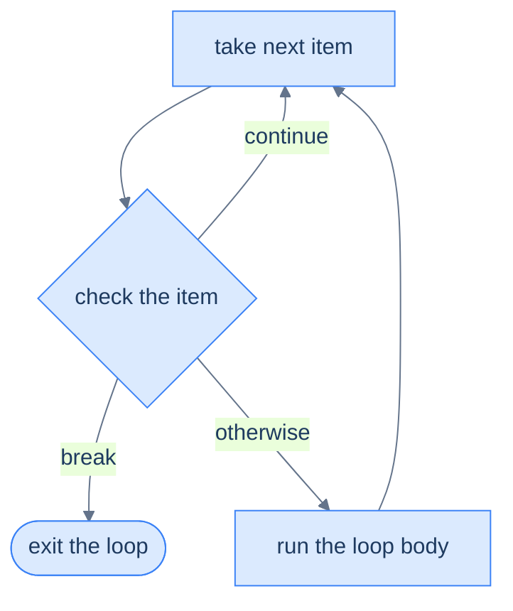

# Loop Control & Patterns — break, continue, and Accumulators

The loops in [the last chapter](/synapse/programming-languages/python/control-flow/loops) ran to completion. This chapter adds the controls to **steer** them — `break` to stop early, `continue` to skip a pass — and the handful of **accumulator patterns** that turn a loop into an answer: a running sum, a count, a built-up list. The thesis: **almost every useful loop is a simple loop plus one of a few reusable shapes**, and once you recognise the shapes, you stop reinventing them.

<div style="border-left:4px solid #195045;background:rgba(25,80,69,0.08);padding:0.6rem 1rem;border-radius:0 0.5rem 0.5rem 0;margin:1.25rem 0">

💡 **The core idea.**

- `break` stops a loop early; `continue` skips a pass.
- Accumulator patterns turn a loop into an answer: a sum, a count, a built-up list.
- **Almost every useful loop is a simple loop plus one of a few reusable shapes.**

</div>

Every output below was produced by running the code.

<div style="border-left:4px solid #15448e;background:rgba(21,68,142,0.08);padding:0.6rem 1rem;border-radius:0 0.5rem 0.5rem 0;margin:1.25rem 0">

📘 **How to read the Intuition boxes.** Each one is built in three moves:

1. **The mechanism** — what the interpreter is *actually doing*.
2. **A concrete bite** — a specific, runnable way the naive assumption fails.
3. **The earned rule** — the decision heuristic, now justified rather than asserted, plus its cost.

</div>

---

## Table of contents

1. [`break` — exit early](#1-break--exit-early)
2. [`continue` — skip to the next pass](#2-continue--skip-to-the-next-pass)
3. [The loop `else`](#3-the-loop-else)
4. [Accumulator patterns: sum and count](#4-accumulator-patterns-sum-and-count)
5. [Building a list](#5-building-a-list)
6. [Mental-model summary](#6-mental-model-summary)
7. [Gotcha checklist](#7-gotcha-checklist)

---

## 1. `break` — exit early

`break` stops the loop immediately — no more iterations, even if the sequence has items left. It's how you stop as soon as you've found what you were looking for.

```python run
for n in range(1, 10):
    if n * n > 20:
        print("first square over 20:", n)
        break
```

**Output:**
```
first square over 20: 5
```

**Analysis.** The loop tries `n = 1, 2, 3, …`. At `n = 5`, `5 * 5 = 25 > 20` is true, so it prints and `break`s — the loop ends right there, never trying `6, 7, 8, 9`. Without `break`, it would keep going and print for every `n` from 5 up.

**Intuition.**
*Mechanism.* `break` exits the loop it's in, immediately, skipping any remaining iterations and jumping to the first statement after the loop. It's the "I'm done here" instruction.

*Concrete bite.* With **nested** loops, `break` only exits the **innermost** one — not all of them:

```python run
for a in range(3):
    for b in range(3):
        if b == 1:
            break          # exits only the inner loop
        print(a, b)
```
```
0 0
1 0
2 0
```

For each `a`, the inner loop prints `b = 0`, then hits `b == 1` and `break`s the *inner* loop — but the *outer* loop keeps going. So `a` still runs `0, 1, 2`; only the inner loop is cut short each time.

<div style="border-left:4px solid #195045;background:rgba(25,80,69,0.08);padding:0.6rem 1rem;border-radius:0 0.5rem 0.5rem 0;margin:1.25rem 0">

💡 **Earned rule.** Use `break` to stop as soon as you're done, but remember it escapes only one loop level. The cost of that scoping: to break out of nested loops you need another mechanism — a flag variable, or (cleaner) moving the inner loop into a function and `return`ing ([Tutorial 11](/synapse/programming-languages/python/control-flow/functions-the-basics)).

</div>

---

## 2. `continue` — skip to the next pass

`continue` skips the **rest of the current iteration** and jumps straight to the next one. The loop keeps going; only this pass's remaining lines are abandoned.

```python run
for n in range(1, 7):
    if n % 2 == 0:
        continue          # skip the even numbers
    print(n)
```

**Output:**
```
1
3
5
```



**Analysis.** For each `n`, if `n` is even, `continue` skips the rest of the body — so `print(n)` never runs for `2, 4, 6`. Odd numbers fall through to the `print`. The result is the odds only. As the diagram shows, `continue` loops back to the top while `break` leaves entirely.

**Intuition.**
*Mechanism.* `continue` abandons the current pass and re-enters the loop at the next item. Any statements below the `continue` in the body are skipped for that iteration only.

*Concrete bite.* The output proves the skip: `2`, `4`, `6` never print, because `continue` jumped past their `print(n)`. Anything after a `continue` is unreachable on the passes where it fires — a common source of "why didn't this line run?" when a `continue` sits above it.

<div style="border-left:4px solid #195045;background:rgba(25,80,69,0.08);padding:0.6rem 1rem;border-radius:0 0.5rem 0.5rem 0;margin:1.25rem 0">

💡 **Earned rule.** Use `continue` to skip uninteresting items early and keep the body flat (avoiding a big `if` wrapping everything). The cost: code after a `continue` runs only on the passes that *didn't* skip, so put work you always want *above* the `continue` or outside the loop.

</div>

---

## 3. The loop `else`

A `for` or `while` can have an `else` block. It runs **only if the loop finished normally** — that is, only if no `break` happened. It's purpose-built for "I searched the whole thing and didn't find it."

```python run
target = 7
for n in range(1, 6):
    if n == target:
        print("found")
        break
else:
    print("not found")     # runs because the loop never broke
```

**Output:**
```
not found
```

**Analysis.** `target` is `7`, but the loop only goes `1..5`, so `n == 7` never matches and `break` never fires. Because the loop ran to its natural end without breaking, the `else` runs: `not found`.

**Intuition.**
*Mechanism.* Loop `else` means "no `break` occurred." If the loop completes by exhausting its items, `else` runs; if a `break` cut it short, `else` is skipped. (It's a confusing keyword — read it as "no-break," not "otherwise.")

*Concrete bite.* Contrast: when the item *is* found and we `break`, the `else` is skipped:

```python run
for n in range(1, 6):
    if n == 3:
        print("found 3")
        break
else:
    print("not found")     # skipped because we broke out
```
```
found 3
```

Here `n == 3` matches, we `print` and `break`, so the `else` does **not** run. The two snippets together define it: `else` fires exactly when no `break` did.

<div style="border-left:4px solid #195045;background:rgba(25,80,69,0.08);padding:0.6rem 1rem;border-radius:0 0.5rem 0.5rem 0;margin:1.25rem 0">

💡 **Earned rule.** Use loop `else` for search-and-report-failure without a separate "found" flag. The cost is readability — the keyword genuinely misleads, so a brief comment (`# no break: not found`) earns its place every time.

</div>

---

## 4. Accumulator patterns: sum and count

The most common loop shape: a variable initialised **before** the loop, updated **inside** it. A running total, a count, a max-so-far — all accumulators.

```python run
total = 0
count = 0
for n in range(1, 6):
    total = total + n
    count = count + 1
print("sum:", total)
print("count:", count)
print("average:", total / count)
```

**Output:**
```
sum: 15
count: 5
average: 3.0
```

**Analysis.** `total` and `count` start at `0` *before* the loop. Each pass adds to them. After the loop, `total` is `1+2+3+4+5 = 15`, `count` is `5`, and the average is `15 / 5 = 3.0` (a float, because `/` always is — [Tutorial 3](/synapse/programming-languages/python/first-steps/numbers-and-arithmetic)).

**Intuition.**
*Mechanism.* An accumulator carries information *across* iterations. That only works if it's created **outside** the loop — initialise it once, then let each pass build on the previous value.

*Concrete bite.* Initialise it *inside* the loop and it resets every pass, keeping only the last contribution:

```python run
for n in range(1, 6):
    total = 0           # BUG: this resets total every pass
    total = total + n
print(total)
```
```
5
```

We expected `15`, but `total` is `5` — because `total = 0` runs at the *start of every iteration*, wiping the running sum. The final value reflects only the last `n` (5). The accumulator never accumulated.

<div style="border-left:4px solid #195045;background:rgba(25,80,69,0.08);padding:0.6rem 1rem;border-radius:0 0.5rem 0.5rem 0;margin:1.25rem 0">

💡 **Earned rule.** Initialise accumulators **before** the loop; update them **inside**. The cost of misplacing the initialiser is a silent wrong answer (no error), and it's the single most common loop bug — when a total comes out as just the last item, look for an initialiser hiding inside the loop.

</div>

---

## 5. Building a list

A list accumulator builds up a collection: start empty, `append` to it each pass. (Lists get their own chapter next; here we use just the empty `[]` and `.append()`.)

```python run viz=array:squares
squares = []                 # an empty list (full details in Tutorial 10)
for n in range(1, 6):
    squares.append(n * n)    # add to the end
print(squares)
```

**Output:**
```
[1, 4, 9, 16, 25]
```

**Analysis.** `squares` starts empty. Each pass appends `n * n` to the end, so after the loop it holds every square from `1` to `25`. This "start empty, append in a loop" shape is how you transform or filter a sequence into a new list — the most-used pattern in everyday Python.

**Intuition.**
*Mechanism.* `list.append(x)` **changes the list in place** — it adds `x` to the end and returns `None`, because its job is the side effect, not producing a value. (This is the opposite of string methods, which return a new string and change nothing — [Tutorial 4](/synapse/programming-languages/python/first-steps/strings-the-basics).)

*Concrete bite.* So assigning the result of `append` back — as you would with a string method — destroys your list:

```python run
squares = []
squares = squares.append(5)   # BUG: append changes the list and returns None
print(squares)
```
```
None
```

`append` added `5` to the list, then returned `None`; `squares = ...` then rebound `squares` to that `None`, throwing the list away. Now `squares` is `None`, not a list.

<div style="border-left:4px solid #195045;background:rgba(25,80,69,0.08);padding:0.6rem 1rem;border-radius:0 0.5rem 0.5rem 0;margin:1.25rem 0">

💡 **Earned rule.** Call `list.append(x)` as a statement — never `lst = lst.append(x)`. The cost/boundary is remembering which methods mutate-and-return-`None` (list `append`/`sort`/`reverse`) versus which return a new value (string methods); when a value mysteriously becomes `None`, suspect an assigned-back in-place method.

</div>

---

## 6. Mental-model summary

| Principle | Consequence |
|---|---|
| `break` exits the loop immediately | Stops early; in nested loops it exits only the inner one |
| `continue` skips the rest of this pass | Lines below a `continue` don't run on skipped iterations |
| Loop `else` runs only if no `break` happened | Ideal for "searched all, found nothing"; read it as "no-break" |
| Accumulators are initialised before, updated inside | Initialising inside resets every pass → keeps only the last item |
| `list.append(x)` mutates in place and returns `None` | `lst = lst.append(x)` destroys the list; call append as a statement |

## 7. Gotcha checklist

<div style="border-left:4px solid #da5233;background:rgba(218,82,51,0.08);padding:0.6rem 1rem;border-radius:0 0.5rem 0.5rem 0;margin:1.25rem 0">

- **`break` didn't escape all loops →** it exits one level; use a function + `return`, or a flag, for nested loops.
- **A line after `continue` never runs →** `continue` skips the rest of the pass; move always-needed work above it.
- **Loop `else` ran when you didn't expect →** it runs whenever no `break` fired; that includes empty/normal completion.
- **A running total equals only the last item →** the accumulator is initialised inside the loop; move it above.
- **A list became `None` →** you wrote `lst = lst.append(x)`; append mutates and returns `None` — call it as a statement.

</div>

---

<div style="border-left:4px solid #6d28d9;background:rgba(109,40,217,0.08);padding:0.6rem 1rem;border-radius:0 0.5rem 0.5rem 0;margin:1.25rem 0">

🧪 **Predict, then check.** Build a loop over `range(1, 11)` that adds up only the numbers divisible by 3, using `continue` to skip the rest. Predict the total before running. Then add a loop `else` that prints `"scan complete"`, and predict whether it runs (did you `break`?). Finally, predict what happens if you move the `total = 0` line inside the loop. Build it and confirm all three predictions.

</div>

## Your Turn

Before you move on, check your understanding with the coach — explain the idea, apply it, weigh the trade-offs, then defend your reasoning.

<div class="concept-coach"></div>
