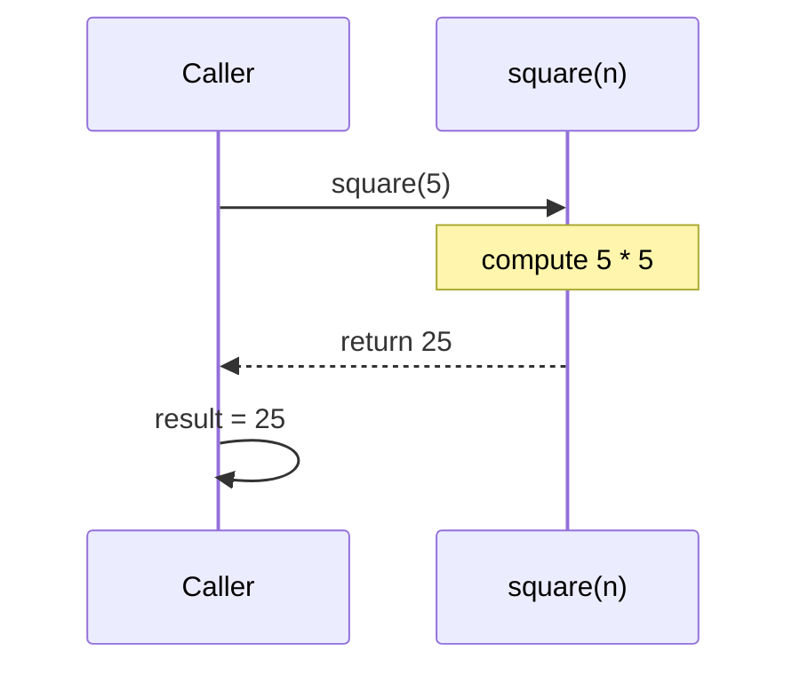

# Functions, the Basics — Naming a Piece of Work

A **function** packages a piece of work under a name so you can run it again with different inputs, instead of copy-pasting. The thesis for this gentle pass: **a function takes inputs (parameters), does work, and hands back a result (`return`)** — and keeping "hands back" (`return`) distinct from "prints" (`print`) is the distinction that trips up every beginner. This is the foundation [Functions in Depth](/synapse/programming-languages/python/how-python-works/functions-in-depth) builds on later for closures, decorators, and more; here we cover the everyday core.

Every output below was produced by running the code.

> **How to read the Intuition boxes.** Each one is built in three moves: (1) the **mechanism** — what the interpreter is *actually doing*; (2) a **concrete bite** — a specific, runnable way the naive assumption fails; (3) the **earned rule** — the decision heuristic, now justified rather than asserted, plus its cost.

---

## Table of contents

1. [Defining and calling](#1-defining-and-calling)
2. [Parameters and arguments](#2-parameters-and-arguments)
3. [`return` vs `print`](#3-return-vs-print)
4. [Default parameters](#4-default-parameters)
5. [Scope: local vs global](#5-scope-local-vs-global)
6. [Mental-model summary](#6-mental-model-summary)
7. [Gotcha checklist](#7-gotcha-checklist)

---

## 1. Defining and calling

You **define** a function with `def`, a name, parentheses, and a colon, then an indented body. Defining it doesn't run the body — you **call** the function (its name followed by `()`) to do that, as many times as you like.

```python run
def greet():
    print("Hello!")
greet()
greet()
```

**Output:**
```
Hello!
Hello!
```

**Analysis.** `def greet(): ...` created a function but ran nothing yet. Each `greet()` then executed the body, so `Hello!` printed twice. Define once, call many — that's the whole point: the work lives in one place.

**Intuition.**
*Mechanism.* `def` is itself a statement that *runs* (top to bottom, like everything) and binds the name `greet` to a function object. Until that `def` line executes, the name doesn't exist. Calling is a separate step that runs the stored body.

*Concrete bite.* Call a function before its `def` has run and the name isn't defined yet:

```python run
greet()
def greet():
    print("Hello!")
```
```
Traceback (most recent call last):
  File "/w/main.py", line 1, in <module>
    greet()
    ^^^^^
NameError: name 'greet' is not defined
```

Line 1 calls `greet`, but the `def` on line 2 hasn't run, so the name doesn't exist yet — `NameError`, the same "use before defined" rule as variables ([Tutorial 2](/synapse/programming-languages/python/first-steps/variables-and-types)).

*Earned rule.* Define a function before the code that calls it. The cost is just ordering discipline — and the boundary worth knowing: a function may *call* another function defined later in the file, as long as the *call happens* after both `def`s have run (e.g. both are defined, then `main()` runs at the bottom).

---

## 2. Parameters and arguments

Functions get useful when they take **inputs**. A name inside the `def` parentheses is a **parameter**; the value you pass when calling is an **argument**. The parameter is an ordinary name, usable inside the body.

```python run
def greet(name):
    print(f"Hello, {name}!")
greet("Ada")
greet("Linus")
```

**Output:**
```
Hello, Ada!
Hello, Linus!
```

**Analysis.** `name` is a parameter. Calling `greet("Ada")` runs the body with `name` set to `"Ada"`; `greet("Linus")` runs it again with `name` as `"Linus"`. One definition, different results per call — the reuse that functions are for.

**Intuition.**
*Mechanism.* Calling binds each argument to the matching parameter (by position), then runs the body with those names in scope. The parameter exists only during the call.

*Concrete bite.* The number of arguments must match the parameters — omit a required one and Python refuses:

```python run
def greet(name):
    print(f"Hello, {name}!")
greet()
```
```
Traceback (most recent call last):
  File "/w/main.py", line 3, in <module>
    greet()
    ~~~~~^^
TypeError: greet() missing 1 required positional argument: 'name'
```

`greet()` supplied no argument for the required `name`, so the call fails with a `TypeError` that names exactly what's missing.

*Earned rule.* Pass one argument per required parameter, in order. The cost of a mismatch is an immediate, specific `TypeError` (Python won't guess a missing value) — the message tells you which parameter went unfilled, so it's a fast fix. Defaults (§4) let you make some arguments optional.

---

## 3. `return` vs `print`

This is the distinction that matters most. `print` **shows** a value to the user. `return` **hands a value back** to whoever called the function, so the caller can use it. They are not the same, and confusing them is the classic beginner bug.

```python run
def square(n):
    return n * n
result = square(5)
print(result)
print(square(3) + square(4))
```

**Output:**
```
25
25
```



**Analysis.** `square` *returns* `n * n`. So `square(5)` evaluates to `25`, which we store in `result` and print. And because it returns a value, `square(3) + square(4)` is `9 + 16 = 25` — you can use the result in further expressions. The diagram shows the round trip: the caller hands over an argument, the function computes, and the value comes *back*.

**Intuition.**
*Mechanism.* `return x` ends the function and sends `x` back as the value of the call, so `square(5)` *becomes* `25` in the calling code. `print` only writes to the screen and produces no usable value — a function with no `return` hands back `None` ([Tutorial 5](/synapse/programming-languages/python/first-steps/input-and-output)).

*Concrete bite.* Swap `return` for `print` and the function can't be used in a calculation — its result is `None`:

```python run
def square(n):
    print(n * n)        # prints but does not return
result = square(5)
print("result is:", result)
```
```
25
result is: None
```

The `25` you see is from the *inside* `print`. But `square(5)` itself returned nothing, so `result` is `None` — you can't add it, store it meaningfully, or build on it. The function showed a number but didn't give one back.

*Earned rule.* Use `return` to produce a value the caller will use; use `print` only for output meant for a human. The cost of confusing them: a function that "works" (you see the number) but is useless in expressions, because it returns `None` — when `result` is mysteriously `None`, check whether the function `print`s where it should `return`.

---

## 4. Default parameters

A parameter can have a **default value**, making the argument optional. If the caller omits it, the default is used; if they pass one, theirs wins.

```python run
def greet(name, greeting="Hello"):
    print(f"{greeting}, {name}!")
greet("Ada")
greet("Ada", "Welcome")
```

**Output:**
```
Hello, Ada!
Welcome, Ada!
```

**Analysis.** `greeting="Hello"` is a default. `greet("Ada")` omits `greeting`, so it falls back to `"Hello"`. `greet("Ada", "Welcome")` supplies it, overriding the default. `name` has no default, so it's still required.

**Intuition.**
*Mechanism.* Parameters with defaults are optional; those without are required. Python fills positional arguments left to right, so **every parameter after the first default must also have a default** — otherwise a required parameter could be left with no value.

*Concrete bite.* Put a required parameter after a defaulted one and Python rejects the definition itself:

```python run
def greet(greeting="Hi", name):
    print(greeting, name)
```
```
  File "/w/main.py", line 1
    def greet(greeting="Hi", name):
                             ^^^^
SyntaxError: parameter without a default follows parameter with a default
```

If `greeting` has a default but `name` (after it) doesn't, a call like `greet("Ada")` would be ambiguous — is `"Ada"` the greeting or the name? Python forbids the definition outright with a `SyntaxError`.

*Earned rule.* List required parameters first, defaulted ones last. The cost is just ordering — and a *warning* for later: defaults are evaluated **once**, when the function is defined, which is harmless for simple values like `"Hello"` but a notorious trap for mutable defaults like `[]`, covered in [Functions in Depth](/synapse/programming-languages/python/how-python-works/functions-in-depth).

---

## 5. Scope: local vs global

Names created **inside** a function are **local** — they exist only during the call and vanish when it returns. A function can *read* a name from the surrounding (global) scope, but *assigning* to a name makes it local.

```python run
message = "global"
def show():
    print(message)      # a function can READ an outer name
show()
```

**Output:**
```
global
```

**Analysis.** `message` is defined outside the function (global). `show` doesn't define its own `message`, so when it reads `message`, Python looks outward and finds the global one. Reading an enclosing name from inside a function just works.

**Intuition.**
*Mechanism.* Python decides a name is **local** to a function if the function *assigns* to it anywhere in its body; otherwise a read looks outward to the enclosing scope. So assignment, not reading, is what makes a name local.

*Concrete bite.* This means trying to *update* a global by assigning to it backfires — the name becomes local and is used before it has a value:

```python run
counter = 0
def increment():
    counter = counter + 1    # assigning makes counter local -> error
increment()
```
```
Traceback (most recent call last):
  File "/w/main.py", line 4, in <module>
    increment()
    ~~~~~~~~~^^
  File "/w/main.py", line 3, in increment
    counter = counter + 1    # assigning makes counter local -> error
              ^^^^^^^
UnboundLocalError: cannot access local variable 'counter' where it is not associated with a value
```

Because `increment` *assigns* to `counter`, Python treats `counter` as local throughout the function — so the `counter + 1` on the right tries to read a *local* `counter` that hasn't been set yet. The global `counter` is shadowed, and you get `UnboundLocalError`.

*Earned rule.* Don't mutate globals from inside functions; instead, take inputs as parameters and hand results back with `return` (`counter = increment(counter)`). The cost of the local rule is this surprising `UnboundLocalError` — and the boundary is that the proper escape hatches (`global` and `nonlocal`) exist but are usually a design smell, a topic [Functions in Depth](/synapse/programming-languages/python/how-python-works/functions-in-depth) treats fully.

---

## 6. Mental-model summary

| Principle | Consequence |
|---|---|
| `def` binds a name; calling runs the body | Calling before the `def` runs → `NameError` |
| Arguments fill parameters by position | A missing required argument → `TypeError` naming it |
| `return` hands a value back; `print` only shows it | A `print`-instead-of-`return` function yields `None` |
| Defaults make parameters optional; required ones come first | A non-default after a default → `SyntaxError` |
| Assigning a name in a function makes it local | Updating a global by assignment → `UnboundLocalError`; pass in, return out |

## 7. Gotcha checklist

- **`NameError` calling a function →** the `def` hasn't run yet (called too early) or the name is misspelled.
- **`TypeError: missing ... required positional argument` →** you passed too few arguments; match one per required parameter.
- **A function's result is `None` →** it `print`s instead of `return`s; use `return` to hand a value back.
- **`SyntaxError: parameter without a default follows ...` →** reorder so required parameters come before defaulted ones.
- **`UnboundLocalError` →** you assigned to a name that's also global; pass it in as a parameter and `return` the new value.

---

*Predict, then check.* Write `def total_price(price, tax_rate=0.1):` that returns `price + price * tax_rate`. Predict the result of `total_price(100)` and `total_price(100, 0.2)`. Now predict what `print(total_price(100))` shows versus a *broken* version that `print`s inside and returns nothing — what is `result = broken(100)` then? Build both and confirm. This `return`-vs-`print` distinction is the one to carry into every function you write.

## Your Turn

Before you move on, check your understanding with the coach — explain the idea, apply it, weigh the trade-offs, then defend your reasoning.

<div class="concept-coach"></div>
