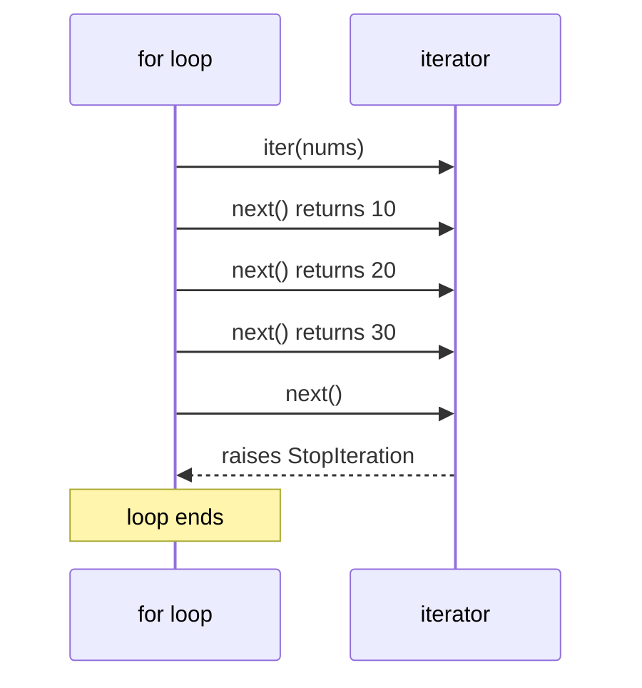

# Iterators, Iterables & Generators — How `for` Really Works

Every `for` loop you've written ([Tutorial 8](/synapse/programming-languages/python/control-flow/loops)) and every comprehension and generator expression ([Tutorial 14](/synapse/programming-languages/python/working-with-data/comprehensions)) rests on one small protocol. The thesis: **`for` is syntactic sugar — under it, `iter()` produces an *iterator*, `next()` pulls one item at a time, and a `StopIteration` signal ends the loop** — and `yield` is the easy way to write your own iterators that produce values *lazily*, one at a time, without ever building a list.

<div style="border-left:4px solid #195045;background:rgba(25,80,69,0.08);padding:0.6rem 1rem;border-radius:0 0.5rem 0.5rem 0;margin:1.25rem 0">

💡 **The core idea.**

- `for` is **syntactic sugar** over a small protocol.
- `iter()` makes an iterator; `next()` pulls one item at a time.
- `StopIteration` ends the loop.
- `yield` writes your own iterators that produce values **lazily**.

</div>

This is the deep pass of [loops](/synapse/programming-languages/python/control-flow/loops) and [generator expressions](/synapse/programming-languages/python/working-with-data/comprehensions). Every output below was produced by running the code.

<div style="border-left:4px solid #15448e;background:rgba(21,68,142,0.08);padding:0.6rem 1rem;border-radius:0 0.5rem 0.5rem 0;margin:1.25rem 0">

📘 **How to read the Intuition boxes.** Each one is built in three moves:

1. **The mechanism** — what the interpreter is *actually doing*.
2. **A concrete bite** — a specific, runnable way the naive assumption fails.
3. **The earned rule** — the decision heuristic, now justified rather than asserted, plus its cost.

</div>

---

## Table of Contents

1. [The iteration protocol](#1-the-iteration-protocol)
2. [Iterable vs iterator](#2-iterable-vs-iterator)
3. [Generators with `yield`](#3-generators-with-yield)
4. [Laziness and infinite streams](#4-laziness-and-infinite-streams)
5. [Generator pipelines](#5-generator-pipelines)
6. [Mental-model summary](#6-mental-model-summary)
7. [Gotcha checklist](#7-gotcha-checklist)

---

## 1. The iteration protocol

A `for` loop doesn't have magic access to a sequence's contents. It calls two functions: `iter(obj)` to get an **iterator**, then `next(iterator)` repeatedly to pull items. You can do this by hand.

```python run viz=array:nums
nums = [10, 20, 30]
it = iter(nums)
print(next(it))
print(next(it))
print(next(it))
```

**Output:**
```
10
20
30
```



**Analysis.** `iter(nums)` produced an iterator over the list; each `next(it)` returned the next item. A `for` loop does exactly this — call `iter`, then `next` over and over — and stops when the iterator signals it's done. The diagram shows the full conversation, including the final `next()` that ends it.

**Intuition.**
*Mechanism.* The protocol is two dunder methods: `iter(x)` calls `x.__iter__()` to get an iterator, and `next(it)` calls `it.__next__()` to get the next value. When there's nothing left, `__next__` raises **`StopIteration`** — the agreed "I'm done" signal that `for` catches silently to end the loop.

*Concrete bite.* Call `next` past the end yourself and you see the signal a `for` loop normally hides:

```python run
it = iter([1])
print(next(it))
print(next(it))   # nothing left to give
```
```
1
Traceback (most recent call last):
  File "/w/main.py", line 3, in <module>
    print(next(it))   # nothing left to give
          ~~~~^^^^
StopIteration
```

The first `next` returns `1`; the second finds the iterator empty and raises `StopIteration`. Inside a `for` loop you never see this — the loop catches it and stops — but by hand it's a real, uncaught exception.

<div style="border-left:4px solid #195045;background:rgba(25,80,69,0.08);padding:0.6rem 1rem;border-radius:0 0.5rem 0.5rem 0;margin:1.25rem 0">

💡 **Earned rule.** Think of `for x in obj` as "get an iterator from `obj`, pull with `next` until `StopIteration`." This is why anything implementing the protocol — lists, strings, dicts, files, generators — works in a `for` loop with no special-casing. The cost of the abstraction is that calling `next` manually means handling `StopIteration` yourself (or passing a default: `next(it, None)`).

</div>

---

## 2. Iterable vs iterator

Two related words, one crucial difference. An **iterable** is anything you *can* iterate (a list, a string) — it can produce a *fresh* iterator on demand. An **iterator** is the one-shot cursor that actually walks through, and it gets **used up**.

```python run
nums = [1, 2, 3]
print(list(nums))
print(list(nums))   # a list re-iterates
it = iter(nums)
print(list(it))
print(list(it))     # an iterator is single-use
```

**Output:**
```
[1, 2, 3]
[1, 2, 3]
[1, 2, 3]
[]
```

**Analysis.** The list `nums` is an *iterable*: `list(nums)` works twice, each time starting fresh. But `it = iter(nums)` is an *iterator*: the first `list(it)` drains it completely, so the second `list(it)` finds it empty and returns `[]`. Same data, but the iterator is a consumable cursor over it.

**Intuition.**
*Mechanism.* An iterable's `__iter__` returns a *new* iterator each call (so you can loop it again and again). An iterator's `__iter__` returns *itself* — it is its own cursor — and once its items are pulled, it's exhausted for good.

*Concrete bite.* You can see the self-return directly:

```python run
nums = [1, 2, 3]
it = iter(nums)
print(iter(it) is it)      # an iterator returns ITSELF
print(iter(nums) is nums)  # a list does not
```
```
True
False
```

`iter(it) is it` is `True` — an iterator handed back itself. `iter(nums) is nums` is `False` — a list handed back a *separate* iterator object. That's why a list survives repeated looping and a raw iterator doesn't.

<div style="border-left:4px solid #195045;background:rgba(25,80,69,0.08);padding:0.6rem 1rem;border-radius:0 0.5rem 0.5rem 0;margin:1.25rem 0">

💡 **Earned rule.** Store **iterables** (lists, ranges) when you need to loop more than once; treat **iterators** (and generators, §3) as single-use streams. The cost of confusing them is the silent `[]` (or a loop body that never runs) on the second pass — when a second iteration mysteriously does nothing, you're re-using a spent iterator.

</div>

---

## 3. Generators with `yield`

Writing the `__iter__`/`__next__` pair by hand is tedious. A **generator function** — any `def` containing `yield` — does it for you: each `yield` produces a value and *pauses*, resuming where it left off on the next pull.

```python run
def countdown(n):
    while n > 0:
        yield n
        n -= 1

for x in countdown(3):
    print(x)
print(list(countdown(3)))
```

**Output:**
```
3
2
1
[3, 2, 1]
```

**Analysis.** `countdown` looks like a normal function but `yield` makes it a generator. Iterating it runs the body until a `yield`, hands back that value, and freezes the function's state; the next pull resumes right after the `yield`. So it produces `3, 2, 1` lazily, and `list()` collects them all.

**Intuition.**
*Mechanism.* Calling a generator function doesn't run its body — it returns a **generator object** (an iterator). The body runs only as items are pulled, pausing at each `yield` with all local state intact and resuming on the next `next()`.

*Concrete bite.* That "runs only when pulled" is visible — the body doesn't execute at call time:

```python run
def gen():
    print("running the body")
    yield 1

g = gen()             # the body has NOT run yet
print("created")
print(next(g))        # only now does the body run
```
```
created
running the body
1
```

`gen()` printed nothing — it just built the generator. Only `next(g)` ran the body (`running the body`) up to the `yield`. The "created" line printing *before* "running the body" proves the laziness.

<div style="border-left:4px solid #195045;background:rgba(25,80,69,0.08);padding:0.6rem 1rem;border-radius:0 0.5rem 0.5rem 0;margin:1.25rem 0">

💡 **Earned rule.** Use a generator (`yield`) whenever you'd otherwise build a list just to loop over it once — it's lazy, memory-light, and reads like ordinary code. The cost is that it's an iterator: single-use, no `len()`, no indexing. When you need those, collect it with `list(...)`.

</div>

---

## 4. Laziness and infinite streams

Because a generator produces items only on demand, it can represent a stream with **no end** — something impossible for a list.

```python run
import itertools
def naturals():
    n = 1
    while True:
        yield n
        n += 1

print(list(itertools.islice(naturals(), 5)))
```

**Output:**
```
[1, 2, 3, 4, 5]
```

**Analysis.** `naturals()` is an infinite generator — `while True` never stops yielding. That's fine because nothing is computed until pulled: `itertools.islice(..., 5)` pulls exactly five values and stops. (Calling `list(naturals())` with no limit would *never return* — it would try to build an infinite list. Don't run that.)

**Intuition.**
*Mechanism.* Laziness means an infinite generator costs almost nothing until consumed — it holds only its current state, not its (unbounded) output. You bound it at *consumption* time with tools like `itertools.islice` or `itertools.takewhile`, not at definition time.

*Concrete bite.* The memory difference between eager and lazy is dramatic and measurable:

```python run
import sys
big_list = [n for n in range(100000)]
gen = (n for n in range(100000))
print(sys.getsizeof(big_list), 'bytes (list)')
print(sys.getsizeof(gen), 'bytes (generator)')
```

**Output (exact sizes are CPython-specific):**
```
800984 bytes (list)
192 bytes (generator)
```

The list holds 100,000 integers — ~800 KB. The generator holds ~192 bytes regardless of how many values it will eventually produce, because it stores its *recipe*, not its *results*.

<div style="border-left:4px solid #195045;background:rgba(25,80,69,0.08);padding:0.6rem 1rem;border-radius:0 0.5rem 0.5rem 0;margin:1.25rem 0">

💡 **Earned rule.** Reach for generators for large or unbounded streams and for "compute as you go" pipelines — constant memory, no upfront cost. The cost/boundary is real: an infinite generator must always be bounded by the consumer (`islice`, `takewhile`, a `break`), or it hangs forever. Never call `list()`, `sum()`, or `sorted()` on an unbounded generator.

</div>

---

## 5. Generator pipelines

Generators compose. One can consume another, building a **pipeline** where data flows through stages, one item at a time, computed only when the end pulls.

```python run
def squares(nums):
    for n in nums:
        print("squaring", n)
        yield n * n

pipe = squares([1, 2, 3])   # nothing computed yet
print("pipeline built")
print(next(pipe))           # only now: squaring 1
print(next(pipe))           # squaring 2
```

**Output:**
```
pipeline built
squaring 1
1
squaring 2
4
```

**Analysis.** Building `pipe` printed nothing — `squares` hasn't run. "pipeline built" prints first; only the first `next(pipe)` runs the body far enough to `yield` the first square (`squaring 1`, then `1`). The second `next` resumes and produces the next (`squaring 2`, then `4`). Work happens *per pull*, never ahead of demand.

**Intuition.**
*Mechanism.* Each generator in a chain pulls from the one before it on demand, so the whole pipeline is lazy end-to-end: nothing flows until the final consumer asks, and then exactly one item threads through all stages. No stage builds an intermediate list.

*Concrete bite.* The interleaved output is the proof: `squaring 1` appears *between* the two `print(next(...))` calls, not all at once up front. If `squares` eagerly built a list, you'd see `squaring 1`, `squaring 2`, `squaring 3` immediately at construction — instead you see each only when pulled. Demand drives computation.

<div style="border-left:4px solid #195045;background:rgba(25,80,69,0.08);padding:0.6rem 1rem;border-radius:0 0.5rem 0.5rem 0;margin:1.25rem 0">

💡 **Earned rule.** Chain generators to process streams (read → filter → transform → consume) with flat memory and early termination — the consumer can stop after one item and upstream stages never run for the rest. The cost is the usual iterator caveats (single-use, no random access) plus harder debugging: because nothing runs until consumed, a bug in an early stage only surfaces when the end pulls. ([The Data Model](/synapse/programming-languages/python/advanced/the-data-model) shows how this protocol unifies with the rest of Python.)

</div>

---

## 6. Mental-model summary

| Principle | Consequence |
|-----------|-------------|
| `for` = `iter()` then `next()` until `StopIteration` | Any object with the protocol works in a `for` loop |
| An **iterable** makes fresh iterators; an **iterator** is single-use | Loop a list many times; an iterator drains to `[]` |
| `iter(iterator) is iterator` | An iterator is its own cursor; a list returns a new one |
| A generator function returns a generator; the body runs lazily | Calling it prints/computes nothing until pulled |
| Generators are lazy → can be infinite, and use ~constant memory | Bound them with `islice`/`takewhile`; never `list()` an infinite one |
| Chained generators form a lazy pipeline | One item threads through all stages, only on demand |

## 7. Gotcha checklist

<div style="border-left:4px solid #da5233;background:rgba(218,82,51,0.08);padding:0.6rem 1rem;border-radius:0 0.5rem 0.5rem 0;margin:1.25rem 0">

- **`StopIteration` from a manual `next()` →** the iterator is exhausted; use `next(it, default)` or a `for` loop, which handles it.
- **Second loop over it does nothing / returns `[]` →** you re-used a spent iterator/generator; rebuild it, or keep the iterable instead.
- **A generator function "didn't run" →** calling it only builds the generator; iterate (or `next`) it to run the body.
- **`list()`/`sum()` on an infinite generator hangs →** bound it with `itertools.islice`/`takewhile` or a `break`.
- **`len(gen)` / `gen[0]` fails →** generators have no length or indexing; collect with `list(gen)` first if you need them.

</div>

---

<div style="border-left:4px solid #6d28d9;background:rgba(109,40,217,0.08);padding:0.6rem 1rem;border-radius:0 0.5rem 0.5rem 0;margin:1.25rem 0">

🧪 **Predict, then check.** Write `def evens():` that yields `0, 2, 4, …` forever. Predict what `list(itertools.islice(evens(), 4))` produces, and what `list(evens())` would do (don't run the second). Then build a tracing generator like §5's `squares` and predict the exact interleaving of `"pipeline built"` and the per-item prints for two `next()` calls. The interleaving is the whole point — when you can predict it, you understand laziness.

</div>

## Your Turn

Before you move on, check your understanding with the coach — explain the idea, apply it, weigh the trade-offs, then defend your reasoning.

<div class="concept-coach"></div>
