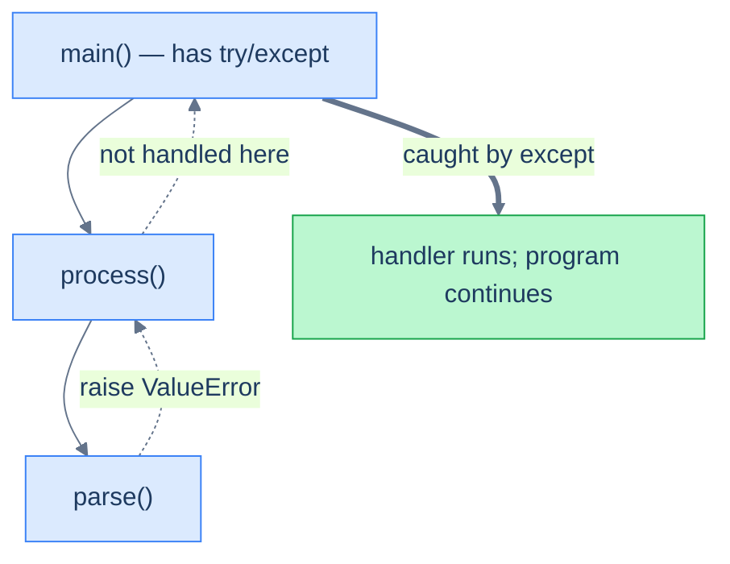

# Errors & Exceptions — Failing Loudly, Recovering Gracefully

You've seen exceptions since [Tutorial 1](/synapse/programming-languages/python/first-steps/what-is-python) — every traceback in this book is one. Now you learn to *handle* them. The thesis: **an exception is a value that propagates *up* the call stack, aborting each function in turn, until some `try`/`except` catches it — or it reaches the top and crashes the program.** Handling is about deciding *where* to catch and *what* to do, and Python's culture leans toward "try the operation and handle failure" (EAFP) over "check everything first" (LBYL).

<div style="border-left:4px solid #195045;background:rgba(25,80,69,0.08);padding:0.6rem 1rem;border-radius:0 0.5rem 0.5rem 0;margin:1.25rem 0">

💡 **The core idea.**

- An exception is a **value** that propagates *up* the call stack.
- It aborts each function until a `try`/`except` catches it — or the program crashes.
- Handling is deciding **where** to catch and **what** to do.
- Python culture prefers EAFP ("try it") over LBYL ("check first").

</div>

Every output below was produced by running the code — including the deliberate tracebacks.

<div style="border-left:4px solid #15448e;background:rgba(21,68,142,0.08);padding:0.6rem 1rem;border-radius:0 0.5rem 0.5rem 0;margin:1.25rem 0">

📘 **How to read the Intuition boxes.** Each one is built in three moves:

1. **The mechanism** — what the interpreter is *actually doing*.
2. **A concrete bite** — a specific, runnable way the naive assumption fails.
3. **The earned rule** — the decision heuristic, now justified rather than asserted, plus its cost.

</div>

---

## Table of Contents

1. [Catching exceptions with `try`/`except`](#1-catching-exceptions-with-tryexcept)
2. [The exception hierarchy](#2-the-exception-hierarchy)
3. [`else` and `finally`](#3-else-and-finally)
4. [Raising and custom exceptions](#4-raising-and-custom-exceptions)
5. [EAFP vs LBYL](#5-eafp-vs-lbyl)
6. [Mental-model summary](#6-mental-model-summary)
7. [Gotcha checklist](#7-gotcha-checklist)

---

## 1. Catching exceptions with `try`/`except`

A `try` block runs code that might fail; an `except` block catches a matching exception and handles it, so the program continues instead of crashing.

```python run
try:
    x = int("not a number")
except ValueError:
    print("caught a ValueError")
print("program continues")
```

**Output:**
```
caught a ValueError
program continues
```



**Analysis.** `int("not a number")` raised `ValueError`. The `except ValueError` matched it, so instead of crashing, the handler printed its message and execution continued to the last line. The diagram shows the general shape: an exception raised deep in a call chain travels *up* through each function that doesn't handle it, until a `try`/`except` catches it.

**Intuition.**
*Mechanism.* When code raises, Python abandons the current line and looks for an enclosing `except` that matches the exception's type — first in this function, then in its caller, then *its* caller, walking **up the call stack**. The first match runs; if none is found anywhere, the program crashes with the traceback you've seen.

*Concrete bite.* An `except` only catches types it names — the wrong type doesn't match, so the exception keeps propagating:

```python run
try:
    x = int("oops")
except KeyError:          # wrong type - does not match
    print("caught")
```
```
Traceback (most recent call last):
  File "/w/main.py", line 2, in <module>
    x = int("oops")
ValueError: invalid literal for int() with base 10: 'oops'
```

`int("oops")` raises `ValueError`, but the `except` only catches `KeyError`. No match, so the `ValueError` propagates uncaught and crashes — the handler never runs.

<div style="border-left:4px solid #195045;background:rgba(25,80,69,0.08);padding:0.6rem 1rem;border-radius:0 0.5rem 0.5rem 0;margin:1.25rem 0">

💡 **Earned rule.** Catch the **specific** exception type(s) you expect and know how to handle. The cost of matching the wrong type is no protection at all (the real error still crashes you); the benefit of specificity is in §2 — a narrow `except` won't accidentally swallow unrelated failures.

</div>

---

## 2. The exception hierarchy

Exceptions form a class hierarchy. `ValueError` and `KeyError` are subclasses of `Exception`; `IndexError` and `KeyError` share the parent `LookupError`. An `except` for a base class catches all its subclasses.

```python run
try:
    [1, 2][5]
except LookupError as e:   # IndexError is a subclass of LookupError
    print("caught via base class:", type(e).__name__)
```

**Output:**
```
caught via base class: IndexError
```

**Analysis.** `[1, 2][5]` raises `IndexError`. We caught `LookupError` — its parent — and it matched, because catching a base class catches every subclass. `as e` binds the exception object so we can inspect it; `type(e).__name__` confirms the *actual* class was `IndexError`.

**Intuition.**
*Mechanism.* `except SomeClass` matches `SomeClass` and any subclass of it. Since almost everything derives from `Exception`, `except Exception` catches almost everything — which is exactly why it's dangerous.

*Concrete bite.* A too-broad `except` swallows bugs you never meant to catch — including typos:

```python run
try:
    result = compute()        # typo: compute is not defined
except Exception:
    print("something went wrong")   # silently hides the real bug
```
```
something went wrong
```

`compute` doesn't exist, so this raises `NameError` — a *programming* bug, not a runtime condition. But `except Exception` catches it too, printing a bland message and hiding a typo that should have crashed loudly. You'd debug for hours.

<div style="border-left:4px solid #195045;background:rgba(25,80,69,0.08);padding:0.6rem 1rem;border-radius:0 0.5rem 0.5rem 0;margin:1.25rem 0">

💡 **Earned rule.** Catch the **narrowest** type that covers what you actually expect (`except ValueError`, not `except Exception`); reserve broad catches for top-level "log and keep the server alive" boundaries, and even then re-raise or log the full traceback. The cost of a bare `except:` or `except Exception:` is masked bugs — it turns a loud, locatable crash into a silent wrong behavior.

</div>

---

## 3. `else` and `finally`

A `try` can have two more clauses. `else` runs only if the `try` block raised *nothing*. `finally` runs **always** — exception or not, caught or not — making it the place for cleanup.

```python run
try:
    n = int("42")
except ValueError:
    print("bad input")
else:
    print("parsed", n)       # runs only if no exception
finally:
    print("cleanup always runs")
```

**Output:**
```
parsed 42
cleanup always runs
```

**Analysis.** `int("42")` succeeded, so no `except` ran; the `else` ran (`parsed 42`) because the `try` was clean; and `finally` ran (`cleanup always runs`), as it always does. Keeping the "success only" code in `else` (not in `try`) means the `except` can't accidentally catch an exception from *that* code.

**Intuition.**
*Mechanism.* `else` runs after a `try` that raised nothing — code that should only run on success. `finally` runs no matter how the `try` exits: normal completion, a caught exception, an *uncaught* exception (just before it propagates), or even a `return`. It's the guaranteed-cleanup hook.

*Concrete bite.* `finally` runs even when the exception is **not** caught and is about to crash the program:

```python run
try:
    x = 1 / 0
finally:
    print("finally runs even as the error propagates")
```
```
finally runs even as the error propagates
Traceback (most recent call last):
  File "/w/main.py", line 2, in <module>
    x = 1 / 0
        ~~^~~
ZeroDivisionError: division by zero
```

There's no `except` here, so the `ZeroDivisionError` propagates and crashes — but `finally` *still ran first*, printing its message before the traceback. Cleanup happens whether or not anyone handles the error.

<div style="border-left:4px solid #195045;background:rgba(25,80,69,0.08);padding:0.6rem 1rem;border-radius:0 0.5rem 0.5rem 0;margin:1.25rem 0">

💡 **Earned rule.** Put success-only logic in `else`, and guaranteed cleanup (closing files, releasing locks) in `finally`. The cost of skipping `finally` is leaked resources when an error strikes mid-operation — though for the common case of files and locks, the `with` statement ([Tutorial 21](/synapse/programming-languages/python/how-python-works/files-and-context-managers)) does this for you more cleanly.

</div>

---

## 4. Raising and custom exceptions

You raise an exception with `raise`. For domain-specific errors, define your own by subclassing `Exception` — a named type callers can catch precisely.

```python run
class WithdrawalError(Exception):
    pass

def withdraw(balance, amount):
    if amount > balance:
        raise WithdrawalError(f"cannot withdraw {amount} from {balance}")
    return balance - amount

try:
    withdraw(100, 150)
except WithdrawalError as e:
    print("error:", e)
```

**Output:**
```
error: cannot withdraw 150 from 100
```

**Analysis.** `WithdrawalError` is a custom exception — a class inheriting from `Exception`, needing no body (`pass`). `withdraw` raises it with a descriptive message when the rule is violated; the caller catches that *specific* type and reads the message via `as e`. Custom types let callers distinguish your errors from built-in ones.

**Intuition.**
*Mechanism.* `raise SomeException("msg")` creates the exception object and starts it propagating up the stack. A custom exception is just a subclass of `Exception`; the message you pass is stored and shown by `str(e)`. Raising must be given an *exception instance or class* — nothing else qualifies.

*Concrete bite.* Raising a non-exception (a bare string, say) is itself an error:

```python run
raise "something broke"   # a string is not an exception
```
```
Traceback (most recent call last):
  File "/w/main.py", line 1, in <module>
    raise "something broke"   # a string is not an exception
    ^^^^^^^^^^^^^^^^^^^^^^^
TypeError: exceptions must derive from BaseException
```

You can't `raise "string"` — Python requires an exception. The fix is `raise ValueError("something broke")` (or your own subclass).

<div style="border-left:4px solid #195045;background:rgba(25,80,69,0.08);padding:0.6rem 1rem;border-radius:0 0.5rem 0.5rem 0;margin:1.25rem 0">

💡 **Earned rule.** Raise built-in types when one fits (`ValueError` for a bad value, `TypeError` for a bad type), and define custom exceptions for your domain so callers can catch them by name. The cost of custom exceptions is a little ceremony (a class per error category); the payoff is precise handling — callers catch `WithdrawalError` without also catching every unrelated `Exception`.

</div>

---

## 5. EAFP vs LBYL

Two styles for "this might not work." **LBYL** ("Look Before You Leap") checks preconditions first. **EAFP** ("Easier to Ask Forgiveness than Permission") just tries the operation and catches the failure. Python favors EAFP.

```python run
d = {"a": 1}
if "b" in d:                 # LBYL: look before you leap
    print(d["b"])
else:
    print("LBYL: missing")
try:                          # EAFP: easier to ask forgiveness
    print(d["b"])
except KeyError:
    print("EAFP: missing")
```

**Output:**
```
LBYL: missing
EAFP: missing
```

**Analysis.** Both styles reach the same conclusion that `"b"` is absent. LBYL tests `"b" in d` first; EAFP just accesses `d["b"]` and catches the `KeyError`. For a single dict key, `d.get("b", default)` ([Tutorial 13](/synapse/programming-languages/python/working-with-data/dictionaries-and-sets)) is cleaner than either — but the styles diverge sharply when the precondition is hard to test correctly.

**Intuition.**
*Mechanism.* LBYL's correctness depends on your *check* exactly matching what the *operation* requires — and those can drift apart. EAFP sidesteps the gap: it lets the operation itself be the test, catching the precise failure it actually produces.

*Concrete bite.* A plausible LBYL check is often subtly wrong, rejecting valid input the operation would accept:

```python run
s = "-42"
if s.isdigit():              # LBYL check
    print(int(s))
else:
    print("isdigit says not a number")   # WRONG: -42 is a valid int
try:                          # EAFP just tries
    print(int(s))
except ValueError:
    print("not a number")
```
```
isdigit says not a number
-42
```

`"-42".isdigit()` is `False` — `isdigit` rejects the minus sign — so the LBYL branch wrongly declares `-42` "not a number." But `int("-42")` happily returns `-42`. The check didn't match the operation; EAFP, which *is* the operation, gets it right.

<div style="border-left:4px solid #195045;background:rgba(25,80,69,0.08);padding:0.6rem 1rem;border-radius:0 0.5rem 0.5rem 0;margin:1.25rem 0">

💡 **Earned rule.** Prefer EAFP — try the operation, catch the specific exception — especially when the precondition is tricky (number parsing, file access, network calls) or could change between check and use. The cost of LBYL is double work and the subtle bug above (a check that disagrees with the operation); the cost of EAFP is needing to know which exception to catch — but that's knowable and precise.

</div>

---

## 6. Mental-model summary

| Principle | Consequence |
|-----------|-------------|
| An exception propagates **up the call stack** until caught | Uncaught → crash with a traceback; catch where you can handle it |
| `except T` matches `T` and its subclasses | `except Exception` catches almost everything — usually too much |
| `else` runs on success; `finally` runs **always** | Put success code in `else`, cleanup in `finally` (runs even on crash) |
| `raise` needs an exception instance/class | `raise "str"` is a `TypeError`; subclass `Exception` for custom errors |
| EAFP (try it) beats LBYL (check first) | A precondition check can disagree with the operation (`"-42".isdigit()`) |

## 7. Gotcha checklist

<div style="border-left:4px solid #da5233;background:rgba(218,82,51,0.08);padding:0.6rem 1rem;border-radius:0 0.5rem 0.5rem 0;margin:1.25rem 0">

- **The error still crashed despite an `except` →** the `except` type didn't match; catch the actual type (read the traceback's last line).
- **A typo/logic bug vanished →** a broad `except Exception`/bare `except:` swallowed it; catch narrowly.
- **A resource leaked on error →** put cleanup in `finally` (or use `with`, Tutorial 21).
- **`TypeError: exceptions must derive from BaseException` →** you raised a non-exception; `raise ValueError(msg)` or a custom subclass.
- **A validity check rejects valid input →** the LBYL check disagrees with the operation; switch to EAFP (`try` the operation, catch its specific error).

</div>

---

<div style="border-left:4px solid #6d28d9;background:rgba(109,40,217,0.08);padding:0.6rem 1rem;border-radius:0 0.5rem 0.5rem 0;margin:1.25rem 0">

🧪 **Predict, then check.** Write a `safe_divide(a, b)` that returns `a / b` but catches `ZeroDivisionError` and returns `None` instead, with a `finally` that prints `"done"`. Predict the full output of `safe_divide(10, 2)` and `safe_divide(10, 0)`, including the order of the `finally` print. Then predict whether `"3.14".isdigit()` is `True` or `False`, and what `int("3.14")` does — a two-part trap that captures why EAFP wins.

</div>

## Your Turn

Before you move on, check your understanding with the coach — explain the idea, apply it, weigh the trade-offs, then defend your reasoning.

<div class="concept-coach"></div>
