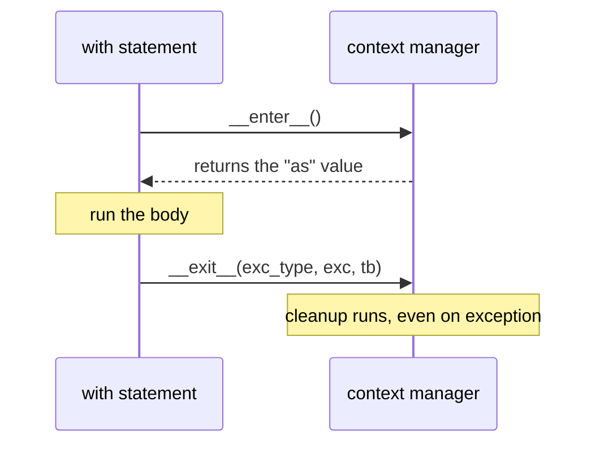

# Files & Context Managers — Guaranteed Cleanup with `with`

Some resources must be released — files closed, locks freed, connections returned. The thesis: **the `with` statement pairs setup with guaranteed teardown through the context-manager protocol (`__enter__`/`__exit__`), so cleanup happens no matter how the block exits** — normal end, `return`, or exception. Files are the everyday example, and `with open(...)` is the idiom you'll use most.

<div style="border-left:4px solid #195045;background:rgba(25,80,69,0.08);padding:0.6rem 1rem;border-radius:0 0.5rem 0.5rem 0;margin:1.25rem 0">

💡 **The core idea.**

- `with` pairs setup with **guaranteed teardown**.
- The context-manager protocol is `__enter__`/`__exit__`.
- Cleanup happens no matter how the block exits.
- Files are the everyday example — `with open(...)`.

</div>

This connects to [`finally`](/synapse/programming-languages/python/how-python-works/errors-and-exceptions) (guaranteed cleanup) and is itself a protocol like [iteration](/synapse/programming-languages/python/how-python-works/iterators-and-generators). The runnable blocks below write and read real files in the sandbox; every output was produced by running the code.

<div style="border-left:4px solid #15448e;background:rgba(21,68,142,0.08);padding:0.6rem 1rem;border-radius:0 0.5rem 0.5rem 0;margin:1.25rem 0">

📘 **How to read the Intuition boxes.** Each one is built in three moves:

1. **The mechanism** — what the interpreter is *actually doing*.
2. **A concrete bite** — a specific, runnable way the naive assumption fails.
3. **The earned rule** — the decision heuristic, now justified rather than asserted, plus its cost.

</div>

---

## Table of Contents

1. [Reading and writing files](#1-reading-and-writing-files)
2. [Why `with`: guaranteed close](#2-why-with-guaranteed-close)
3. [The context-manager protocol](#3-the-context-manager-protocol)
4. [`__exit__` and exceptions](#4-__exit__-and-exceptions)
5. [Writing context managers with `contextlib`](#5-writing-context-managers-with-contextlib)
6. [Mental-model summary](#6-mental-model-summary)
7. [Gotcha checklist](#7-gotcha-checklist)

---

## 1. Reading and writing files

`open(path, mode)` opens a file; the `with` statement binds it and closes it for you. Mode `"w"` writes (truncating), `"r"` reads (the default), `"a"` appends.

```python run
with open("greeting.txt", "w") as f:
    f.write("hello\n")
    f.write("world\n")
with open("greeting.txt") as f:
    print(f.read())
```

**Output:**
```
hello
world

```

**Analysis.** The first `with` opened `greeting.txt` for writing and wrote two lines (each `\n` is a newline). The second opened it for reading (default mode) and `f.read()` returned the whole contents, `"hello\nworld\n"` — which `print` shows as two lines plus a trailing blank line (the final `\n` in the file, then `print`'s own newline). Each `with` closed the file automatically at the end of its block.

**Intuition.**
*Mechanism.* `open` returns a file object — itself a context manager. `with open(...) as f:` binds the file to `f` for the block and **closes it when the block ends**, flushing buffered writes to disk. Mode `"w"` *truncates* (empties) the file first; `"a"` appends to the end.

*Concrete bite.* The truncation in `"w"` is a real trap: opening an existing file for writing **erases it immediately**, before you write anything. Open your important `data.txt` with `"w"` by mistake and its previous contents are gone the instant `open` returns — no warning, no undo. (`"a"` appends; `"r+"` reads-and-writes without truncating.) Choosing the wrong mode is how people accidentally wipe files.

<div style="border-left:4px solid #195045;background:rgba(25,80,69,0.08);padding:0.6rem 1rem;border-radius:0 0.5rem 0.5rem 0;margin:1.25rem 0">

💡 **Earned rule.** Always open files with `with open(...) as f:`, and pick the mode deliberately: `"r"` to read, `"w"` to replace, `"a"` to add. The cost of `"w"` is the silent truncation — when in doubt about whether a file exists and matters, read it first or use `"a"`. The cost of `read()` on a huge file is loading it all into memory; iterate line by line (`for line in f:`) instead.

</div>

---

## 2. Why `with`: guaranteed close

You *can* open and close manually, but `with` guarantees the close even when the body raises — which manual code routinely fails to do.

```python run
f = open("data.txt", "w")
f.write("x")
f.close()
print("manually closed")
with open("data.txt") as f:
    data = f.read()
print("after with, closed?", f.closed)
print("data:", data)
```

**Output:**
```
manually closed
after with, closed? True
data: x
```

**Analysis.** The manual version (`open`, `write`, `close`) works — but only if nothing between `open` and `close` raises. The `with` version reads the file and, crucially, `f.closed` is `True` *after* the block: `with` closed it for us. Note `f` still refers to the (now-closed) file object outside the block — `with` closes the file, it doesn't delete the variable.

**Intuition.**
*Mechanism.* `with` calls the file's cleanup (`__exit__`, which closes it) on *every* exit path from the block — normal completion, `return`, `break`, or an exception. Manual `close()` only runs if execution actually reaches that line, so an exception in the middle skips it and leaks the open file.

*Concrete bite.* The naive manual pattern leaks the file on error. If `process(f.read())` below raises, `f.close()` is never reached:

```python
f = open("data.txt")
process(f.read())   # if this raises, the next line never runs...
f.close()           # ...so the file is never closed (a leak)
```

The fix is `with open("data.txt") as f:`, which closes `f` even if `process` raises. (Or, the older defensive form, `try: ... finally: f.close()` — exactly what `with` packages up for you.)

<div style="border-left:4px solid #195045;background:rgba(25,80,69,0.08);padding:0.6rem 1rem;border-radius:0 0.5rem 0.5rem 0;margin:1.25rem 0">

💡 **Earned rule.** Use `with` for every file (and lock, connection, etc.) — it's the leak-proof default, equivalent to a `try/finally: close()` but shorter and impossible to forget. The cost is essentially nil; the cost of *not* using it is leaked file descriptors that, under load, exhaust the OS limit and crash a long-running program.

</div>

---

## 3. The context-manager protocol

`with` works on any object implementing two dunder methods: `__enter__` (setup; its return value is bound by `as`) and `__exit__` (teardown). You can write your own.

```python run
class Timer:
    def __enter__(self):
        print("enter")
        return self
    def __exit__(self, exc_type, exc_val, exc_tb):
        print("exit")
        return False

with Timer():
    print("inside the block")
```

**Output:**
```
enter
inside the block
exit
```



**Analysis.** Entering the `with` called `Timer.__enter__` (printing `enter`); its return value would be bound if we wrote `as t`. Then the body ran (`inside the block`). On exit, `__exit__` ran (`exit`). The three `__exit__` parameters carry exception info (all `None` here, since the block didn't raise). The diagram shows this fixed enter → body → exit sequence.

**Intuition.**
*Mechanism.* `with expr as v:` calls `expr.__enter__()` and binds its result to `v`, runs the body, then *always* calls `expr.__exit__(exc_type, exc_val, exc_tb)`. If the body raised, those three arguments describe the exception; if not, they're all `None`. This is the same "protocol = a pair of dunder methods" pattern as iteration ([Tutorial 17](/synapse/programming-languages/python/how-python-works/iterators-and-generators)).

*Concrete bite.* A common mistake is forgetting that `as` binds the **return value of `__enter__`**, not the object itself. If `__enter__` returns `None` (e.g. you forgot `return self`), then `with Thing() as t:` makes `t` be `None`, and using `t` in the body fails with `AttributeError`. The object you wrote isn't automatically what `as` gives you — only what `__enter__` returns is.

<div style="border-left:4px solid #195045;background:rgba(25,80,69,0.08);padding:0.6rem 1rem;border-radius:0 0.5rem 0.5rem 0;margin:1.25rem 0">

💡 **Earned rule.** Implement `__enter__` (returning the resource, usually `self`) and `__exit__` (cleanup) to make any object usable with `with`. The cost is two methods; the payoff is leak-proof setup/teardown your callers get for free — and you must remember to `return self` from `__enter__` if you want `as` to bind the object.

</div>

---

## 4. `__exit__` and exceptions

`__exit__` runs even when the body raises — and its **return value decides the exception's fate**: return `True` to *suppress* it, return falsy (the default) to let it propagate.

```python run
class Suppress:
    def __enter__(self):
        return self
    def __exit__(self, exc_type, exc_val, exc_tb):
        print("exit saw:", exc_type.__name__ if exc_type else None)
        return True   # True suppresses the exception

with Suppress():
    raise ValueError("boom")
print("program continues - exception was suppressed")
```

**Output:**
```
exit saw: ValueError
program continues - exception was suppressed
```

**Analysis.** The body raised `ValueError`. `__exit__` ran with `exc_type` set to `ValueError` (it *saw* the exception), printed it, and returned `True` — which **swallowed** the exception. So execution continued past the `with` to the final print, as if nothing went wrong.

**Intuition.**
*Mechanism.* When the body raises, Python calls `__exit__` with the exception details. If `__exit__` returns a **truthy** value, Python treats the exception as handled and *suppresses* it; if it returns falsy (or nothing — `None`), the exception **resumes propagating** after cleanup.

*Concrete bite.* The default (no return → `None` → falsy) means cleanup runs *and then the exception still propagates* — which is usually what you want:

```python run
class NoSuppress:
    def __enter__(self):
        return self
    def __exit__(self, exc_type, exc_val, exc_tb):
        print("exit ran")
        # no return -> falsy -> the exception propagates

with NoSuppress():
    raise ValueError("boom")
```
```
exit ran
Traceback (most recent call last):
  File "/w/main.py", line 9, in <module>
    raise ValueError("boom")
ValueError: boom
```

`__exit__` ran its cleanup (`exit ran`) — but because it returned `None` (falsy), the `ValueError` was *not* suppressed and crashed the program. Cleanup happened; the error still surfaced.

<div style="border-left:4px solid #195045;background:rgba(25,80,69,0.08);padding:0.6rem 1rem;border-radius:0 0.5rem 0.5rem 0;margin:1.25rem 0">

💡 **Earned rule.** Return falsy from `__exit__` (the default) so cleanup runs *and* errors still surface — suppressing exceptions is rarely right and hides bugs (the §2 lesson of [Errors & Exceptions](/synapse/programming-languages/python/how-python-works/errors-and-exceptions) again). Only return `True` when suppression is the deliberate point (like `contextlib.suppress`). The cost of accidentally returning `True` is a silently swallowed error — the context-manager version of a too-broad `except`.

</div>

---

## 5. Writing context managers with `contextlib`

Writing a class with two dunder methods is verbose for simple cases. `contextlib.contextmanager` turns a **generator** into a context manager: code before `yield` is `__enter__`, code after is `__exit__`.

```python run
from contextlib import contextmanager

@contextmanager
def tag(name):
    print(f"<{name}>")
    yield
    print(f"</{name}>")

with tag("p"):
    print("content")
```

**Output:**
```
<p>
content
</p>
```

**Analysis.** `@contextmanager` ([a decorator](/synapse/programming-languages/python/how-python-works/functions-in-depth)) makes `tag` a context-manager factory. The code *before* `yield` runs on enter (`<p>`); the `yield` hands control to the body (`content`); the code *after* `yield` runs on exit (`</p>`). One readable generator replaces the whole `__enter__`/`__exit__` class.

**Intuition.**
*Mechanism.* `@contextmanager` wraps a generator: calling `next` once runs it up to the `yield` (that's `__enter__`, and the yielded value is what `as` binds); on exit it resumes the generator past the `yield` (that's `__exit__`). It's the iteration protocol ([Tutorial 17](/synapse/programming-languages/python/how-python-works/iterators-and-generators)) repurposed for setup/teardown.

*Concrete bite.* The catch: if the body raises, the exception is thrown *at the `yield`*, so cleanup code placed plainly after `yield` is **skipped** unless you protect it. To guarantee teardown, wrap the `yield` in `try`/`finally`:

```python
@contextmanager
def tag(name):
    print(f"<{name}>")
    try:
        yield
    finally:
        print(f"</{name}>")   # runs even if the body raises
```

Without the `try/finally`, a `raise` inside the `with` block would skip the closing `</p>` — the generator never resumes past a `yield` that raised. The `finally` restores the guarantee `with` is supposed to provide.

<div style="border-left:4px solid #195045;background:rgba(25,80,69,0.08);padding:0.6rem 1rem;border-radius:0 0.5rem 0.5rem 0;margin:1.25rem 0">

💡 **Earned rule.** Use `@contextmanager` for simple setup/teardown — it's far less boilerplate than a class — but **wrap the `yield` in `try/finally`** whenever the teardown must run on errors too. The cost of forgetting the `try/finally` is the exact bug `with` exists to prevent: cleanup that silently doesn't happen when the body fails.

</div>

---

## 6. Mental-model summary

| Principle | Consequence |
|-----------|-------------|
| `with open(...) as f:` opens and **always closes** the file | Leak-proof; manual `close()` is skipped if the body raises |
| File mode `"w"` truncates; `"r"` reads; `"a"` appends | Opening an existing file with `"w"` erases it immediately |
| `with` = `__enter__` (setup, returns the `as` value) + `__exit__` (teardown) | Any object with the pair works in `with` |
| `__exit__` runs on every exit; its truthy return **suppresses** the exception | Return falsy (default) so cleanup runs *and* errors propagate |
| `@contextmanager` turns a generator into a context manager | Before `yield` = enter, after = exit; wrap `yield` in `try/finally` |

## 7. Gotcha checklist

<div style="border-left:4px solid #da5233;background:rgba(218,82,51,0.08);padding:0.6rem 1rem;border-radius:0 0.5rem 0.5rem 0;margin:1.25rem 0">

- **A file leaked / "too many open files" →** you opened without `with`; use `with open(...) as f:`.
- **A file's contents vanished →** you opened it with `"w"` (truncates); use `"a"` to append or `"r"` to read.
- **`as` target is `None` →** your `__enter__` didn't `return self` (or the resource).
- **An exception silently disappeared in a `with` →** an `__exit__` returned `True`; return falsy unless suppression is intended.
- **`@contextmanager` cleanup skipped on error →** wrap the `yield` in `try/finally`.

</div>

---

<div style="border-left:4px solid #6d28d9;background:rgba(109,40,217,0.08);padding:0.6rem 1rem;border-radius:0 0.5rem 0.5rem 0;margin:1.25rem 0">

🧪 **Predict, then check.** Predict the exact output of writing `"a\nb\nc\n"` to a file with `"w"`, then re-opening it and printing `f.read()` (how many lines, including blanks?). Then trace the `Suppress` vs `NoSuppress` classes: for each, predict whether `print("after")` runs after a `with` block that raises `ValueError`. The difference is one `return True` — and it's the same "don't silently swallow errors" lesson from exceptions, wearing a context-manager hat.

</div>

## Your Turn

Before you move on, check your understanding with the coach — explain the idea, apply it, weigh the trade-offs, then defend your reasoning.

<div class="concept-coach"></div>
