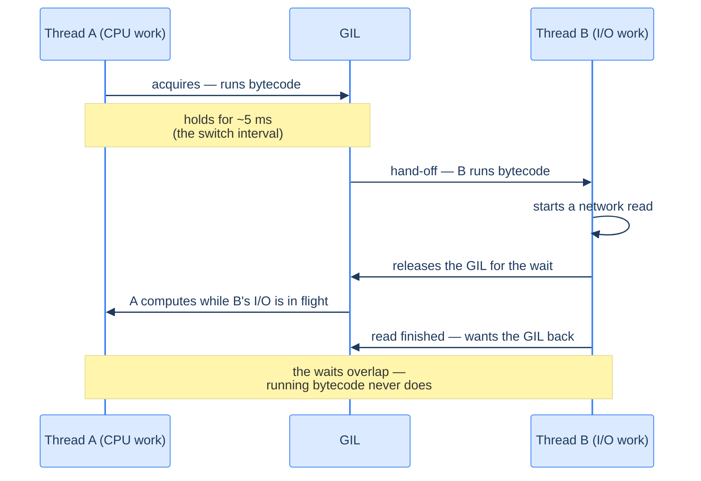

# Concurrency: Threads, Processes & the GIL

"Make it faster by doing things at once" is more subtle in Python than in most languages, because of one design decision. The thesis: **CPython has a Global Interpreter Lock (GIL) that lets only one thread execute Python bytecode at a time** — so threads give you concurrency for *waiting* (I/O-bound work overlaps), but **not** parallelism for *computing* (CPU-bound work doesn't speed up); for that you need separate *processes*, which sidestep the GIL but can't share memory directly. This chapter builds that model from the ground up — what a thread actually *is*, what the GIL actually *protects*, when it lets go — because with the mechanism in hand, every "why is my code not faster?" question answers itself.

This builds on [functions](/synapse/programming-languages/python/how-python-works/functions-in-depth) and sets up [Async Python](/synapse/programming-languages/python/advanced/async-python) and [Async in Practice](/synapse/programming-languages/python/advanced/async-in-practice). Every runnable output below was produced by running the code; timing figures are marked illustrative (they vary), and the multiprocessing and free-threaded examples are static — the sandbox can't spawn processes or swap interpreters — with outputs captured on a normal machine.

> **How to read the Intuition boxes.** Each one is built in three moves: (1) the **mechanism** — what the interpreter is *actually doing*; (2) a **concrete bite** — a specific, runnable way the naive assumption fails; (3) the **earned rule** — the decision heuristic, now justified rather than asserted, plus its cost.

---

## Table of Contents

1. [What a thread and a process actually are](#1-what-a-thread-and-a-process-actually-are)
2. [Threads with `concurrent.futures`](#2-threads-with-concurrentfutures)
3. [The GIL: what it protects and when it lets go](#3-the-gil-what-it-protects-and-when-it-lets-go)
4. [Shared state, atomicity, and locks](#4-shared-state-atomicity-and-locks)
5. [Handing off work: `queue.Queue`](#5-handing-off-work-queuequeue)
6. [Processes for CPU-bound parallelism](#6-processes-for-cpu-bound-parallelism)
7. [The free-threaded future](#7-the-free-threaded-future)
8. [Choosing the right tool](#8-choosing-the-right-tool)
9. [Mental-model summary](#9-mental-model-summary)
10. [Gotcha checklist](#10-gotcha-checklist)

---

## 1. What a thread and a process actually are

Before any API, the two words themselves — because everything in this chapter follows from what they share and don't. Your running program is a **process**: the operating system gives it a private slab of memory (where every object, module, and global you've made lives) plus at least one **thread**. A thread is the thing the OS actually *runs*: a call stack and a current position in the code, which the OS scheduler can pause and resume at any moment — **preemptively**, without asking your code. One process can hold many threads, and here is the crucial layout: **each thread gets its own stack, but they all share the process's one heap of objects.** A Python thread is not a simulation — `threading.Thread` creates a real OS thread, and you can see the layering directly:

```python run
import os, threading

def report(label):
    print(f"{label:8} pid={os.getpid()}  os_thread_id={threading.get_native_id()}")

report("main")
worker = threading.Thread(target=report, args=("worker",))
worker.start()
worker.join()
```

**Output (illustrative — the pid and thread ids vary per run):**
```
main     pid=89408  os_thread_id=3480381
worker   pid=89408  os_thread_id=3480382
```

**Analysis.** Same `pid`, different `os_thread_id`: two genuine OS threads inside one process. The worker isn't a copy of your program — it's a second path of execution through the *same* memory, so it sees every object the main thread has made, for free. Contrast a second *process*: its own memory, its own objects, and nothing shared — any data must be explicitly sent across. That trade — threads share everything, processes share nothing — is the entire menu this chapter chooses from:

```d2
direction: right

proc: "one process — threads live inside it" {
  heap: "shared heap\n(all objects, modules, globals)" {
    shape: rectangle
  }
  gil: "one GIL" {
    shape: oval
  }
  t1: "thread 1\n(own stack)" {
    shape: rectangle
  }
  t2: "thread 2\n(own stack)" {
    shape: rectangle
  }
  t1 -> heap: "sees every object"
  t2 -> heap: "sees every object"
  t1 -> gil: "must hold to run bytecode"
  t2 -> gil: "must hold to run bytecode"
}

pa: "process A" {
  heapA: "own heap" {
    shape: rectangle
  }
  gilA: "own GIL" {
    shape: oval
  }
}

pb: "process B" {
  heapB: "own heap" {
    shape: rectangle
  }
  gilB: "own GIL" {
    shape: oval
  }
}

pa <-> pb: "no shared memory —\ndata is pickled across" {
  style.stroke-dash: 3
}
```

**Intuition.**
*Mechanism.* The OS scheduler hands each runnable thread a slice of CPU time, on any available core, in an order you don't control. Two threads on two cores *can* genuinely execute at the same instant — that part of the multithreading story is fully real in Python. What CPython adds is one constraint on top (the oval in the diagram): to run *Python bytecode*, a thread must hold the process's single GIL — §3 explains what that lock is for.

*Concrete bite.* "Threads share everything" cuts both ways. Passing a 100 MB structure to a thread costs nothing (it's the same object); passing it to a process means serialising all 100 MB across. But sharing is also the danger: two threads *mutating* the same object interleave unpredictably (§4), a problem processes are immune to by construction.

*Earned rule.* Threads = cheap to share, dangerous to mutate; processes = safe by isolation, expensive to communicate. Every concurrency decision in Python is a position on that line. The cost of learning the layout is nil — it's the same picture in every language; what's CPython-specific is only the GIL on top.

---

## 2. Threads with `concurrent.futures`

The modern way to run work concurrently is `ThreadPoolExecutor`. Its `.map` runs a function over many inputs using a pool of threads — ideal when each call spends time *waiting* (network, disk).

```python run
from concurrent.futures import ThreadPoolExecutor
import time

def fetch(url):
    time.sleep(0.1)          # pretend this is a slow network call
    return f"got {url}"

urls = ["a", "b", "c"]
with ThreadPoolExecutor(max_workers=3) as pool:
    results = list(pool.map(fetch, urls))
print(results)
```

**Output:**
```
['got a', 'got b', 'got c']
```

**Analysis.** Three `fetch` calls each "wait" 0.1s. Run sequentially they'd take ~0.3s; with three threads they overlap and finish in ~0.1s. `pool.map` preserves input order in the results. This is the sweet spot for threads: work that's mostly *waiting*, where overlapping the waits is a real win.

**Intuition.**
*Mechanism.* A `ThreadPoolExecutor` runs callables on worker threads that share the process's memory (§1). While one thread is blocked on I/O (like `sleep` or a socket read), Python hands the GIL to another — so the *waits* overlap even though only one thread runs Python code at any instant.

*Concrete bite.* The catch is what overlaps: threads help only when the work *releases the GIL* (I/O, `sleep`). For pure computation they don't (§3). Many people add threads to a CPU-heavy loop expecting a speedup and get none — the bite is in the next section, where the timing makes it undeniable.

*Earned rule.* Reach for `ThreadPoolExecutor` to overlap **I/O-bound** work (HTTP requests, file/db reads) — the win scales with how much time is spent waiting. The cost: threads share memory, so any *shared mutable state* needs locking (§4), and they do nothing for CPU-bound work.

---

## 3. The GIL: what it protects and when it lets go

Now the lock itself — and first, *why it exists*, because the GIL is not a design mistake; it's a bargain. CPython manages memory by **reference counting** ([Tutorial 16](/synapse/programming-languages/python/how-python-works/the-object-model)): every object carries a count of the names and containers holding it, incremented and decremented constantly as your code runs. Those little `+1`/`-1` updates — and a raft of other interpreter internals — are exactly the kind of read-modify-write that threads corrupt (§4 shows the pattern). CPython's founding bargain: instead of taking a fine-grained lock around every one of those updates (slow for everyone, always), take **one big lock around the whole interpreter** — single-threaded code pays nothing, and the interpreter's own bookkeeping can never race. The GIL *protects the interpreter's internals*, and your single-threaded speed, at the price of one-bytecode-at-a-time.

The letting-go has two triggers. First, a clock — a running thread is asked to release the GIL every *switch interval* so others get a turn:

```python run
import sys
print(sys.getswitchinterval())
```

**Output:**
```
0.005
```

Second — and this is the load-bearing one — **a thread releases the GIL when it's about to block on I/O** (socket reads, file reads, `time.sleep`), because waiting on the network needs no bytecode. That release is exactly why §2's fetches overlapped:



For pure computation, though, the clock-driven hand-off just makes threads take turns. Splitting a *computation* across threads doesn't make it finish faster:

```python run
import time
from concurrent.futures import ThreadPoolExecutor

def burn(n):
    s = 0
    for i in range(n):
        s += i
    return s

N = 5_000_000
t = time.perf_counter()
burn(N); burn(N)
seq = time.perf_counter() - t

t = time.perf_counter()
with ThreadPoolExecutor(max_workers=2) as pool:
    list(pool.map(burn, [N, N]))
par = time.perf_counter() - t

print(f"sequential={seq:.3f}s  2-threads={par:.3f}s")
```

**Output (illustrative — exact times vary, but the two are roughly equal):**
```
sequential=0.246s  2-threads=0.219s
```

**Analysis.** Two CPU-bound `burn` calls take about the same wall-clock time whether run one after another or on two threads (~0.25s either way). If the threads ran in parallel, two-at-once would be ~half the sequential time — but it isn't: the diagram's hand-off is all that happens, 5 ms of thread A, 5 ms of thread B, one core's worth of progress in total. The threads interleave; they don't co-execute.

**Intuition.**
*Mechanism.* The GIL is a single lock every thread must hold to run Python bytecode. CPU-bound code holds it until the switch interval expires (tunable via `sys.setswitchinterval`, though you almost never should); blocking I/O calls release it *for the entire wait*. So the GIL costs you nothing when threads mostly wait — and everything when they mostly compute.

*Concrete bite.* The numbers are the bite: `2-threads` is *not* meaningfully faster than `sequential` — nowhere near the ~2× a real parallel speedup would give. Adding threads to CPU-bound work buys nothing (and can be slightly slower from switching overhead). The intuitive "more threads = faster" is simply false for computation in CPython.

*Earned rule.* Don't use threads to speed up CPU-bound work — use **processes** (§6), or read §7 for where CPython itself is heading. Threads are for overlapping waits. The cost/boundary: this is a *CPython* property, the price of its no-locks-in-single-threaded-code bargain; one more C-extension nuance worth knowing is that heavy NumPy/hash-computation code often releases the GIL itself, which is why "it scaled fine in NumPy" and "pure-Python loops don't scale" are both true.

---

## 4. Shared state, atomicity, and locks

Threads share memory (§1), which is convenient and dangerous: when two threads update the same variable, the updates can interleave and corrupt it. A `Lock` serialises access to shared state.

```python run
import threading

counter = 0
lock = threading.Lock()

def work():
    global counter
    for _ in range(100000):
        with lock:
            counter += 1

threads = [threading.Thread(target=work) for _ in range(4)]
for t in threads:
    t.start()
for t in threads:
    t.join()
print(counter)
```

**Output:**
```
400000
```

**Analysis.** Four threads each increment 100,000 times; with the `Lock`, the total is exactly `400000`. The `with lock:` block ensures only one thread performs the read-modify-write at a time, so no updates are lost. Remove the lock and you're gambling — the result is *sometimes* right and sometimes short, depending on thread timing.

**Intuition.**
*Mechanism.* `counter += 1` is not atomic — it compiles to *several* bytecodes. Disassembling it shows the read-modify-write:

```python run
import dis
def inc(c):
    c += 1
    return c
dis.dis(inc)
```
```
  2           RESUME                   0

  3           LOAD_FAST                0 (c)
              LOAD_CONST               1 (1)
              BINARY_OP               13 (+=)
              STORE_FAST               0 (c)

  4           LOAD_FAST                0 (c)
              RETURN_VALUE
```

*Concrete bite.* `c += 1` is `LOAD_FAST` (read) → `BINARY_OP` (add) → `STORE_FAST` (write) — three steps. If a thread switch happens *between* the read and the write, two threads read the same value, both add one, and both write back the same result: **one increment is lost**. The GIL guarantees each *bytecode* is atomic, but not a *sequence* of them. Here is the properly unsettling part: on today's CPython this race is *hard to catch* — the switch interval is an eternity next to three bytecodes, so the unlocked counter usually comes out right, run after run (even deliberately shrinking the interval rarely exposes it). "The GIL is not your lock" is therefore a rule you must take from the mechanism, not from a failing test — the race is real, it simply hides until production load, a slower compound update, or a different interpreter build (§7) finally lands a switch inside the window.

*Earned rule.* Protect every shared mutable variable with a `Lock` (or avoid sharing — pass data via a `queue.Queue` (§5), or return results from `pool.map`). Don't trust the GIL to make your updates safe: it serialises bytecodes, not your logic. The cost of a lock is contention (threads wait for it) and the risk of deadlock if you hold several — so keep critical sections small and lock ordering consistent.

---

## 5. Handing off work: `queue.Queue`

The lock in §4 defends shared state; a often-better move is to *stop sharing state*. `queue.Queue` is a thread-safe conveyor belt: producers `put`, consumers `get`, and all the locking lives inside the queue — your code never touches a shared variable at all.

```python run
import queue, threading, time

q = queue.Queue(maxsize=2)          # bounded, like a conveyor belt
DONE = object()                     # sentinel: "no more work"

def producer():
    for item in ["a", "b", "c", "d", "e"]:
        q.put(item)                 # blocks while the queue is full
        print(f"produced {item}")
    q.put(DONE)

def consumer(name):
    while True:
        item = q.get()              # blocks while the queue is empty
        if item is DONE:
            q.put(DONE)             # pass the sentinel on to other consumers
            break
        time.sleep(0.05)            # pretend to work on it
        print(f"    {name} consumed {item}")

threads = [threading.Thread(target=producer),
           threading.Thread(target=consumer, args=("c1",)),
           threading.Thread(target=consumer, args=("c2",))]
for t in threads: t.start()
for t in threads: t.join()
print("all done")
```

**Output (illustrative — the interleaving varies per run; this is one real run):**
```
produced a
produced b
produced c
produced d
    c1 consumed a
    c2 consumed b
produced e
    c1 consumed c
    c2 consumed d
    c1 consumed e
all done
```

**Analysis.** One producer feeds two consumers through a bounded queue and *no user code ever locks anything*. The `maxsize=2` bound applies **backpressure** — the producer runs at most two items ahead, then blocks in `put` until a consumer catches up, so memory can't balloon. Shutdown is a protocol, not a flag: the `DONE` sentinel rides the same channel as the data, and each consumer re-enqueues it on the way out so the *other* consumer finds it too. Items are consumed exactly once — the queue's internal lock guarantees no two consumers get the same item.

**Intuition.**
*Mechanism.* `queue.Queue` wraps a deque in exactly the lock-and-wait machinery you'd otherwise hand-write: `put` on a full queue and `get` on an empty one park the thread until the condition changes, then the queue wakes exactly the right waiters. It's §4 done by the standard library, plus flow control.

*Concrete bite.* The subtle shutdown bug: with two consumers and only *one* sentinel that isn't re-enqueued, one consumer exits and the other blocks in `q.get()` forever — the program never finishes. Coordination bugs move from "corrupted data" to "hangs"; the sentinel-passing idiom (or one sentinel per consumer) is the standard cure.

*Earned rule.* Prefer message passing over shared state: threads connected by queues, each owning its own data, with ownership *transferred* by `put`/`get`. The cost is queue overhead and an explicit shutdown protocol — a price worth paying because the failure mode shifts from silent corruption (races) to visible hangs, and hangs get found. You'll meet this exact pattern again with one thread and `asyncio.Queue` in [Async in Practice](/synapse/programming-languages/python/advanced/async-in-practice).

---

## 6. Processes for CPU-bound parallelism

For real CPU parallelism you need separate **processes**, each with its own interpreter and its own GIL (§1's right-hand diagram). `ProcessPoolExecutor` has the same API as `ThreadPoolExecutor`. (This sandbox can't spawn processes, so both examples below are shown statically, with outputs captured on a normal machine — an Apple-silicon laptop, Python 3.13.)

```python
import time
from concurrent.futures import ProcessPoolExecutor

def burn(n):
    s = 0
    for i in range(n):
        s += i
    return s

if __name__ == "__main__":                     # required guard for process pools
    N = 10_000_000
    t = time.perf_counter()
    for _ in range(4):
        burn(N)
    seq = time.perf_counter() - t

    t = time.perf_counter()
    with ProcessPoolExecutor(max_workers=4) as pool:
        results = list(pool.map(burn, [N] * 4))
    par = time.perf_counter() - t

    print(f"sequential={seq:.2f}s  4-processes={par:.2f}s  speedup={seq/par:.1f}x")
```

**Output (real captured run; times are illustrative):**
```
sequential=1.05s  4-processes=0.34s  speedup=3.1x
```

**Analysis.** The speedup threads could never deliver: four CPU-bound `burn` calls on four cores finish 3.1× faster than sequentially (not quite 4× — process startup and result-pickling take their cut). Each process has its own GIL, so nothing serialises them. The `if __name__ == "__main__":` guard ([Tutorial 20](/synapse/programming-languages/python/how-python-works/modules-and-packages)) is mandatory — process pools import your module afresh in each worker (on macOS and Windows a worker *spawns* a brand-new interpreter; some Linux setups instead *fork* a copy — either way, code at module top-level runs again, so the pool creation must be guarded).

And the no-shared-memory rule isn't just a performance note — mutations literally vanish:

```python
from concurrent.futures import ProcessPoolExecutor

results = []                        # lives in the parent process

def worker(n):
    results.append(n)               # mutates the WORKER's copy
    return len(results)

if __name__ == "__main__":
    with ProcessPoolExecutor(max_workers=2) as pool:
        seen = list(pool.map(worker, [1, 2, 3, 4]))
    print(f"worker saw list lengths: {seen}")
    print(f"parent's results list:   {results}")
```

**Output (real captured run; the lengths vary with how tasks distribute across workers):**
```
worker saw list lengths: [1, 2, 3, 4]
parent's results list:   []
```

**Analysis.** Each worker appends to *its own* copy of `results` — the lengths grow inside the workers — while the parent's list stays `[]` untouched. Code that "worked" with threads (mutating a shared list) silently does nothing with processes. The only data that crosses the boundary is what you *return* (via pickling), which is why `pool.map`'s return-results style is the right default.

**Intuition.**
*Mechanism.* `ProcessPoolExecutor` starts separate Python interpreters and ships work to them. They don't share memory, so there's no GIL contention between them — true parallelism. The cost is that arguments and results must be **pickled** (serialised) to cross the process boundary, plus per-process startup overhead.

*Concrete bite.* The vanishing-mutation demo above is the trap in its purest form — no error, no warning, just a parent list that never changes. The variants all follow: unpicklable arguments (lambdas, open files, sockets) raise at submit time; huge arguments make pickling the bottleneck; and forgetting the `__main__` guard spawns workers that re-execute your top-level code.

*Earned rule.* Use processes for **CPU-bound** parallelism — heavy computation that the GIL otherwise serialises; one worker per core is the usual sizing. Communicate by *returning* results; reach for `multiprocessing.Queue` or shared memory only when returns genuinely can't express the flow. The cost is real — pickling, startup, isolation, the guard — so processes pay off for *coarse* chunks of heavy work, not for many tiny tasks where the overhead dominates.

---

## 7. The free-threaded future

Everything above described CPython's founding bargain (§3). That bargain is being renegotiated: **PEP 703** adds a build of CPython *without* a GIL — **free-threading** — official since 3.13 as an optional, separately compiled interpreter (installers ship both), with performance and ecosystem support improving through 3.14. What it removes is only the interpreter-wide lock: reference counting and internals become thread-safe by finer-grained means. What it does *not* remove is a single one of §4's obligations — your races are still races; without the GIL's coarse serialisation they get *more* opportunities to fire, not fewer. Same machine as §6, same `burn`, two threads, the free-threaded 3.13 build (static — this sandbox runs the standard build):

```python
import sys, time, threading

print(f"Python {sys.version.split()[0]}  GIL enabled: {sys._is_gil_enabled()}")

def burn(n):
    s = 0
    for i in range(n):
        s += i
    return s

N = 5_000_000
t = time.perf_counter()
burn(N); burn(N)
seq = time.perf_counter() - t

t = time.perf_counter()
t1 = threading.Thread(target=burn, args=(N,))
t2 = threading.Thread(target=burn, args=(N,))
t1.start(); t2.start(); t1.join(); t2.join()
par = time.perf_counter() - t

print(f"sequential={seq:.3f}s  2-threads={par:.3f}s  speedup={seq/par:.1f}x")
```

**Output (real captured run on the CPython 3.13.11 free-threaded build; times illustrative):**
```
Python 3.13.11  GIL enabled: False
sequential=0.266s  2-threads=0.137s  speedup=1.9x
```

**Analysis.** The same two-thread CPU experiment that ran at 1.0× in §3 runs at **1.9×** here — threads finally computing in parallel, in pure Python, in one process. (`sys._is_gil_enabled()` confirms which build you're on; on the standard build it returns `True` and this program prints §3's flat timings.) The catch shows up where you can't see it: single-threaded code on the free-threaded build runs several percent slower — the fine-grained safety that replaces the GIL isn't free — and C extensions need explicit support, which the ecosystem is still rolling out.

**Intuition.**
*Mechanism.* Free-threading replaces the one-big-lock strategy with per-object locking and a redesigned (biased/deferred) reference-counting scheme, so interpreter internals stay consistent without stopping the world. The interpreter becomes what most other languages' runtimes already are — genuinely multi-threaded — bringing with it the memory-visibility discipline those languages have always needed.

*Concrete bite.* §4's hidden race is the bite, sharpened: code that silently relied on the GIL's coarse atomicity ("it's just a dict update, the GIL makes it safe-ish") loses that accidental protection here. The lesson's locking rules weren't pedantry — they were forward compatibility.

*Earned rule.* Write locking-correct threaded code *today* (locks around shared mutations, queues for hand-off) and it runs correctly on both builds — the GIL build forgives, the free-threaded build rewards. The cost of adopting free-threading now: single-thread overhead, maturing C-extension support, and a second build to test against; the benefit, when it fits: §6-style parallelism without pickling, in shared memory.

---

## 8. Choosing the right tool

The decision reduces to one question: is the work **I/O-bound** (waiting) or **CPU-bound** (computing)?

```python run
# A quick way to classify your own workload before choosing:
work = [
    ("download 100 URLs", "I/O-bound", "threads or async"),
    ("resize 100 images", "CPU-bound", "processes"),
    ("query a database", "I/O-bound", "threads or async"),
    ("train a model in pure Python", "CPU-bound", "processes"),
]
for task, kind, tool in work:
    print(f"{task:32} {kind:11} -> {tool}")
```

**Output:**
```
download 100 URLs                I/O-bound   -> threads or async
resize 100 images                CPU-bound   -> processes
query a database                 I/O-bound   -> threads or async
train a model in pure Python     CPU-bound   -> processes
```

**Analysis.** I/O-bound work (waiting on the network or disk) overlaps beautifully with threads — or with [async](/synapse/programming-languages/python/advanced/async-python), which scales to far more concurrent waits per thread. CPU-bound work (pure computation) needs processes to use multiple cores — today; on a free-threaded build (§7), threads become a real contender for CPU work too, once your dependencies support it. The GIL is why this split exists at all.

**Intuition.**
*Mechanism.* Threads and async overlap *waiting* (the GIL is released or yielded during I/O); processes overlap *computing* (each has its own GIL). Matching the tool to the bottleneck is the whole game — using the wrong one gives no speedup (threads on CPU work) or needless complexity (processes for a few HTTP calls).

*Concrete bite.* The classic mistake is reaching for `ProcessPoolExecutor` to "speed up" downloading many URLs. Processes there add pickling and startup cost for work that's just *waiting* — threads (or async) would overlap the waits with none of that overhead. Tool-to-workload mismatch makes concurrent code slower *and* more complex than the sequential version.

*Earned rule.* I/O-bound → threads (`ThreadPoolExecutor`) or async; CPU-bound → processes (`ProcessPoolExecutor`), with free-threaded builds as the emerging alternative; neither → keep it sequential (concurrency adds bugs and overhead — only pay for it when there's a real bottleneck). The cost of every concurrency tool is added complexity (races, deadlocks, pickling, debugging), so reach for it only when measurement ([Performance & Profiling](/synapse/programming-languages/python/advanced/performance-and-profiling)) shows the bottleneck is real.

---

## 9. Mental-model summary

| Principle | Consequence |
|-----------|-------------|
| A Python thread is a real OS thread: own stack, shared heap, preempted at will | Sharing data is free; mutating shared data is a race |
| The GIL protects the interpreter's internals (refcounts) — one big lock, zero single-thread cost | One thread runs bytecode at a time; threads overlap *waiting*, not *computing* |
| The GIL releases at the switch interval (~5 ms) and around blocking I/O | I/O-bound threads genuinely overlap; CPU-bound threads just take turns |
| `x += 1` is multiple bytecodes, not atomic | Shared mutable state needs a `Lock` — and the race hides on the GIL build, so trust the mechanism, not the test |
| `queue.Queue` moves data instead of sharing it | Backpressure via `maxsize`; shutdown via sentinel; failure mode becomes a visible hang, not corruption |
| Processes each have their own interpreter and GIL | True CPU parallelism, but no shared memory — mutations vanish; return results (pickled) |
| Free-threaded CPython (PEP 703) removes the GIL, not your races | Locking-correct code today is correct there too; single-thread speed and C-extensions are the price |
| Match the tool to the bottleneck | I/O → threads/async; CPU → processes (or free-threaded builds); neither → sequential |

## 10. Gotcha checklist

- **Threads didn't speed up my computation →** the GIL serialises CPU work; use `ProcessPoolExecutor` (or a free-threaded build).
- **A shared counter/list is occasionally wrong →** a race; guard shared mutable state with a `Lock` (don't trust the GIL — the race hiding in testing is the trap, not the reassurance).
- **A multi-consumer queue program hangs at shutdown →** a consumer is blocked in `get()` with no sentinel left; re-enqueue the sentinel (or use one per consumer).
- **Process pool: changes to a shared object vanish →** processes don't share memory; return results or use explicit IPC.
- **`ProcessPoolExecutor` errors at startup →** add the `if __name__ == "__main__":` guard; ensure args/results are picklable.
- **Assumed free-threading is the default →** it's a separate build; check `sys._is_gil_enabled()` before concluding anything about parallelism.
- **Concurrency made it slower →** wrong tool (processes for I/O) or overhead exceeds the gain on tiny tasks; measure first.

---

*Predict, then check.* Take the §2 `fetch` example and predict its result list (and roughly its wall time vs sequential). Then predict whether wrapping the §3 `burn` in *four* threads instead of two would approach a 4× speedup — and why not — and what the same change does on a free-threaded build. Next, §5's queue: predict what happens if the producer forgets to `put(DONE)` entirely. Finally, reason about the §4 counter: with the `Lock` it's `400000`; without it, why is the result *unpredictable in principle yet usually correct in practice* — and why is that the worst possible combination for testing? That last question is the GIL's subtlety in one sentence.

## Your Turn

Before you move on, check your understanding with the coach — explain the idea, apply it, weigh the trade-offs, then defend your reasoning.

<div class="concept-coach"></div>
