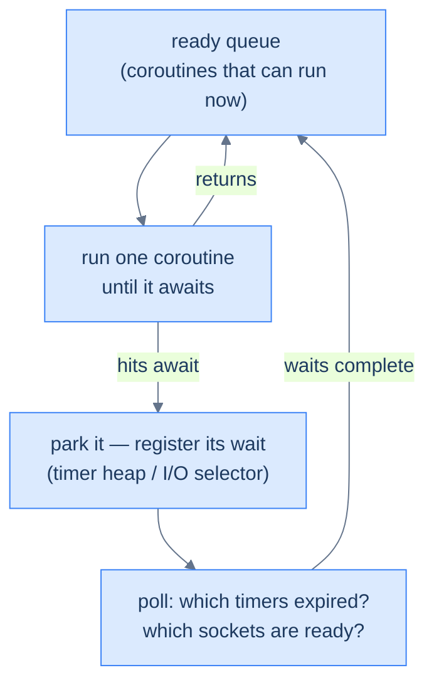
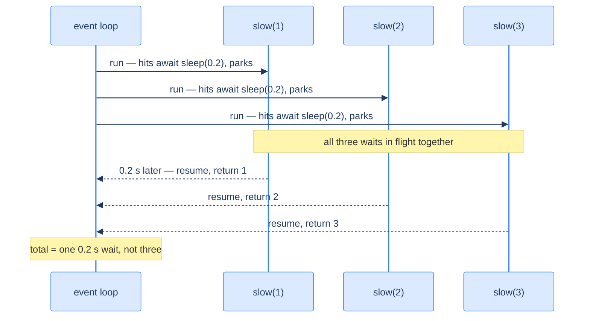

# Async Python — Cooperative Concurrency on One Thread

Async is the other answer to "do many things at once," and it's a different shape from threads. The thesis: **`async`/`await` is *cooperative, single-threaded* concurrency — a coroutine runs until it hits an `await`, where it voluntarily yields control back to the event loop, which runs another coroutine while the first waits.** One thread juggles thousands of in-flight I/O operations, with no GIL contention and no locks (because only one piece of code runs at a time). Where threads are *preempted* by the OS at any instant ([last chapter](/synapse/programming-languages/python/advanced/concurrency-and-the-gil)), coroutines switch only at the `await`s you wrote — the switch points are visible in your source. The price is that you must use it "all the way," and a single blocking call freezes everything.

This is the I/O-bound alternative to [threads](/synapse/programming-languages/python/advanced/concurrency-and-the-gil), built directly on [generators/coroutines](/synapse/programming-languages/python/how-python-works/iterators-and-generators) — this chapter cashes that connection in. The toolbox for running async at scale (tasks, task groups, timeouts, async iteration) is the [next chapter](/synapse/programming-languages/python/advanced/async-in-practice); this one builds the machine they all run on. Every runnable output below was produced by running the code; timing figures are illustrative (they vary slightly).

> **How to read the Intuition boxes.** Each one is built in three moves: (1) the **mechanism** — what the interpreter is *actually doing*; (2) a **concrete bite** — a specific, runnable way the naive assumption fails; (3) the **earned rule** — the decision heuristic, now justified rather than asserted, plus its cost.

---

## Table of Contents

1. [Coroutines and `await`](#1-coroutines-and-await)
2. [The event loop is just a scheduler](#2-the-event-loop-is-just-a-scheduler)
3. [Concurrency with `gather`](#3-concurrency-with-gather)
4. [Don't block the event loop](#4-dont-block-the-event-loop)
5. [`await` only works inside `async`](#5-await-only-works-inside-async)
6. [Mental-model summary](#6-mental-model-summary)
7. [Gotcha checklist](#7-gotcha-checklist)

---

## 1. Coroutines and `await`

An `async def` defines a **coroutine**. Calling it doesn't run it — it returns a coroutine object. You run the top one with `asyncio.run`, and *inside* async code you `await` other coroutines.

```python run
import asyncio

async def greet(name):
    await asyncio.sleep(0.01)
    return f"Hello, {name}"

print(asyncio.run(greet("Ada")))
```

**Output:**
```
Hello, Ada
```

**Analysis.** `greet` is a coroutine; `asyncio.run(greet("Ada"))` starts the event loop, runs the coroutine to completion, and returns its result. The `await asyncio.sleep(0.01)` is a *non-blocking* pause — it yields control to the loop, which could run other coroutines during that hundredth of a second.

What *is* the coroutine object that `greet("Ada")` builds? Exactly what [Tutorial 17](/synapse/programming-languages/python/how-python-works/iterators-and-generators)'s generators were: a **paused stack frame you can resume**. It even speaks the generator protocol — you can drive it by hand, no event loop anywhere:

```python run
async def greet(name):
    return f"Hello, {name}"

coro = greet("Ada")
try:
    coro.send(None)              # drive it by hand, like next() on a generator
except StopIteration as done:
    print(f"returned: {done.value!r}")
```

**Output:**
```
returned: 'Hello, Ada'
```

**Analysis.** `send(None)` resumed the frame; it ran to its `return`, which surfaced as `StopIteration` carrying the return value — the generator machinery, verbatim. This demystifies the whole system: *an event loop is just code that calls `send` on many of these frames, in a smart order.* `await` marks where a frame pauses; the loop decides who resumes next. That's §2.

**Intuition.**
*Mechanism.* `async def` makes a coroutine function; calling it builds a coroutine object — a suspended frame — that does nothing until *driven*: by `asyncio.run` (at the top), by `await` (inside other coroutines), or in principle by `send`, as above. `await x` runs `x` and suspends the current coroutine until `x` is done, handing the loop a chance to run others meanwhile.

*Concrete bite.* The #1 async mistake: calling a coroutine without `await` or `run`, so the body never executes:

```python run
import asyncio

async def greet(name):
    return f"Hello, {name}"

result = greet("Ada")          # no await / no run - body does NOT execute
print(type(result).__name__)   # a coroutine object, not the string
```
```
coroutine
```

`greet("Ada")` returned a *coroutine object*, not `"Hello, Ada"` — the function body never ran. (Python also prints a `RuntimeWarning: coroutine 'greet' was never awaited` to stderr.) The result is useless until you `await` it or pass it to `asyncio.run`.

*Earned rule.* Always `await` a coroutine (or hand it to `asyncio.run`/`gather`); a bare call just builds a frame. The cost of forgetting is silent no-ops and a `RuntimeWarning` — so when async code "does nothing," look for a missing `await` first.

---

## 2. The event loop is just a scheduler

"The event loop" sounds mystical; it's a `while` loop you could sketch on a napkin. It owns three data structures: a **ready queue** (coroutines that can run right now), a **timer heap** (who's sleeping until when), and an **I/O selector** (which sockets the OS should watch). Its life is one cycle, forever:



Take a coroutine off the ready queue, `send()` into it (§1), and let it run — *uninterrupted* — until it either finishes or hits an `await` on something not ready. Then park it where its wait belongs (timer heap for `sleep`, selector for a socket), poll for completed waits, move the newly-ready back onto the queue, repeat. You can watch the hand-offs happen — `await asyncio.sleep(0)` means "I'm not waiting for anything, but let someone else run":

```python run
import asyncio

async def worker(tag):
    for step in (1, 2, 3):
        print(f"{tag}{step}", end=" ")
        await asyncio.sleep(0)       # yield: "loop, run anyone else who's ready"

async def main():
    await asyncio.gather(worker("A"), worker("B"))

asyncio.run(main())
print()
```

**Output:**
```
A1 B1 A2 B2 A3 B3 
```

**Analysis.** Perfect alternation — and, unlike every thread example in the last chapter, **deterministic**: the same order every run. A runs until its `await`, the loop switches to B, B yields back, and so on. Nothing preempts anyone; the interleaving is exactly the one the `await`s spell out. This is the deep contrast with threads: thread interleavings are the scheduler's whim (that's why they race), while coroutine interleavings are *in your source code*. Between two `await`s, a coroutine can never be interrupted — which is why async code shares state without locks.

**Intuition.**
*Mechanism.* `asyncio.run` builds the loop and runs the cycle above until the top coroutine finishes. `await` compiles to "suspend this frame and tell the loop what I'm waiting for"; resumption is the loop calling `send` when that wait completes. The "async magic" is bookkeeping: a queue, a heap, and one OS call (`select`/`kqueue`/`epoll`) that sleeps until *any* watched event fires — which is how one thread waits on ten thousand sockets at once.

*Concrete bite.* The loop runs coroutines *one at a time, to their next `await`* — so a coroutine that takes 3 seconds between awaits keeps everyone else frozen for 3 seconds. That's not a bug in your tasks; it's the contract: cooperative means *you* are the scheduler's only source of switch points (§4 shows it going wrong).

*Earned rule.* Read `await` as "safe pause point — the loop may run others here," and structure async code as short hops between awaits. The cost of the cooperative bargain: fairness is your job; one greedy stretch of code with no `await` starves the whole program, and no OS preemption will save you.

---

## 3. Concurrency with `gather`

`await`ing coroutines one at a time runs them *sequentially*. To run them *concurrently* — overlapping their waits — pass them to `asyncio.gather`.

```python run
import asyncio, time

async def slow(x):
    await asyncio.sleep(0.2)
    return x

async def main():
    t = time.perf_counter()
    r = await asyncio.gather(slow(1), slow(2), slow(3))
    return r, round(time.perf_counter() - t, 1)

print(asyncio.run(main()))
```

**Output (illustrative timing):**
```
([1, 2, 3], 0.2)
```



**Analysis.** Three `slow` calls each wait 0.2s. `gather` schedules all three; each runs to its `await` and parks (the diagram's top half), so all three sleeps are in flight together and the *total* is ~0.2s, not 0.6s. `gather` returns results in the **order you passed them** (`[1, 2, 3]`), regardless of which finished first. This scales absurdly well: `gather(*(fetch(u) for u in thousand_urls))` keeps a thousand waits in flight on one thread — where threads would need a thousand stacks, the loop needs a thousand parked frames.

**Intuition.**
*Mechanism.* `gather` wraps each coroutine in a task on the loop and completes when all of them do. Each runs until its `await asyncio.sleep`, yields, and the loop moves to the next — §2's cycle, with the timer heap holding three timers at once. Total time ≈ the *longest* single wait, not the sum.

*Concrete bite.* Awaiting them one at a time instead is serial — the waits don't overlap:

```python run
import asyncio, time

async def slow(x):
    await asyncio.sleep(0.2)
    return x

async def main():
    t = time.perf_counter()
    a = await slow(1)     # await one...
    b = await slow(2)     # ...then the next: SEQUENTIAL
    return [a, b], round(time.perf_counter() - t, 1)

print(asyncio.run(main()))
```
```
([1, 2], 0.4)
```

Two 0.2s waits awaited in sequence take ~0.4s — each `await` finishes before the next starts. Writing `await` per call is the easy way to *accidentally* serialise concurrent work; `gather` is what makes it overlap.

*Earned rule.* Use `gather` (or the [next chapter](/synapse/programming-languages/python/advanced/async-in-practice)'s tasks and task groups) to run independent coroutines concurrently; reserve sequential `await`s for steps that genuinely depend on each other. The cost is failure handling you must choose deliberately: by default, the first exception propagates to your `await` while the *other coroutines keep running* — `gather` does **not** cancel the rest — and `return_exceptions=True` changes the contract again. The next chapter demonstrates all three failure modes side by side.

---

## 4. Don't block the event loop

The loop is **one thread**. A coroutine keeps control until it `await`s — so a *blocking* call (one that doesn't yield, like `time.sleep` or heavy computation) freezes every other coroutine.

```python run
import asyncio, time

async def bad(x):
    time.sleep(0.2)        # BLOCKING - freezes the event loop
    return x

async def main():
    t = time.perf_counter()
    await asyncio.gather(bad(1), bad(2), bad(3))
    return round(time.perf_counter() - t, 1)

print(asyncio.run(main()))
```

**Output (illustrative timing):**
```
0.6
```

**Analysis.** This is the §3 program with one change — `time.sleep` instead of `await asyncio.sleep` — and the time jumps from 0.2s to 0.6s. `time.sleep` is *blocking*: it doesn't yield to the loop, so each `bad` runs to completion before the next starts (§2's concrete bite, measured). `gather` couldn't overlap anything, because no coroutine ever gave up control.

And here is the same program *repaired* without an async version of the blocking call existing at all — `asyncio.to_thread` ships the blocking work to a worker thread and awaits it:

```python run
import asyncio, time

async def fixed(x):
    await asyncio.to_thread(time.sleep, 0.2)   # blocking call, pushed off the loop
    return x

async def main():
    t = time.perf_counter()
    await asyncio.gather(fixed(1), fixed(2), fixed(3))
    return round(time.perf_counter() - t, 1)

print(asyncio.run(main()))
```

**Output (illustrative timing):**
```
0.2
```

**Analysis.** Back to ~0.2s. Each `fixed` awaits a *thread* doing the blocking sleep, so the loop stays free and the three blocking calls overlap in the thread pool — the last chapter's tool, embedded as the escape hatch inside this one. This is the standard bridge for sync libraries (an old DB driver, `requests`) that you can't replace today.

**Intuition.**
*Mechanism.* Concurrency happens only at `await` points. A blocking call (`time.sleep`, a synchronous DB driver, a big CPU loop) holds the single thread without yielding, so the loop can't switch — every other coroutine stalls until it returns. `to_thread` converts a blocking call into an awaitable wait: the loop parks the coroutine on "that thread finished" exactly as it parks on a timer or socket.

*Concrete bite.* The output is the bite: `0.6` instead of `0.2`. Swapping in the blocking `time.sleep` silently destroyed the concurrency — the program is now as slow as sequential, despite the `gather`. A real-world version is calling a synchronous `requests.get` (instead of an async HTTP client) inside a coroutine: it looks async, runs serial.

*Earned rule.* Inside `async` code, use **async-native** calls (`await asyncio.sleep`, `aiohttp`, async DB drivers); for unavoidable blocking work, push it off the loop with `await asyncio.to_thread(fn, ...)`. The cost of one stray blocking call is the loss of *all* concurrency — which is why async demands async libraries throughout, and why `to_thread` (a thread per blocked call) is a bridge, not the architecture.

---

## 5. `await` only works inside `async`

`await` is syntax that only the event loop understands, so it's only legal inside an `async def`. This is why async tends to "spread": to await something, your function must itself be `async`.

```python run
async def regular():
    pass

def bad():
    await regular()   # await outside an async function
```

**Output:**
```
  File "/w/main.py", line 5
    await regular()   # await outside an async function
    ^^^^^^^^^^^^^^^
SyntaxError: 'await' outside async function
```

**Analysis.** `bad` is a plain (`def`) function, so `await` inside it is a `SyntaxError` — caught at parse time, before anything runs. To call an async function and use its result, the caller must itself be `async` (or be the top-level `asyncio.run`).

**Intuition.**
*Mechanism.* `await` compiles to "suspend this coroutine and yield to the loop" — meaningless outside a coroutine, so Python rejects it syntactically. The consequence is **"async all the way"**: a sync function can't `await`, so making one function async tends to force its callers async too, up to the `asyncio.run` at the top.

*Concrete bite.* The `SyntaxError` above is the bite — you can't sprinkle `await` into ordinary code. Teams discover this when adding one async call deep in a sync codebase forces a cascade of `async def`s up the call chain (or an awkward `asyncio.run` in the middle, which has its own problems). Async is a property of the whole call stack, not a single function.

*Earned rule.* Decide async at the *boundary*: an async program has `asyncio.run` once at the top and `async`/`await` throughout the I/O path. The cost is that async is "colored" — it doesn't mix freely with sync code — so adopt it for I/O-heavy programs as a whole, not as a local tweak to one function.

---

## 6. Mental-model summary

| Principle | Consequence |
|-----------|-------------|
| `async def` makes a coroutine — a resumable frame, generator machinery underneath | A bare call returns the frame unrun; `send(None)`/`await`/`run` are what drive it |
| The event loop = ready queue + timer heap + I/O selector, in a cycle | One thread waits on thousands of events with one OS poll call |
| Switches happen only at `await` — cooperative, not preemptive | Interleavings are deterministic and visible in source; no locks needed |
| `await` suspends and yields to the loop | Sequential `await`s are serial; `gather` overlaps them |
| The loop is single-threaded | A blocking call (`time.sleep`, sync I/O) freezes all coroutines; `to_thread` is the escape hatch |
| On first failure, plain `gather` raises but does *not* cancel siblings | Choose a failure mode deliberately — the next chapter's task groups do cancel |
| `await` is illegal outside `async def` | Async is "colored" — it spreads up the call stack to `asyncio.run` |

## 7. Gotcha checklist

- **Coroutine "didn't run" / `RuntimeWarning: never awaited` →** you called it without `await`/`asyncio.run`.
- **Async code is as slow as sequential →** you `await`ed serially (use `gather`) or made a blocking call (use async I/O / `asyncio.to_thread`).
- **`SyntaxError: 'await' outside async function` →** the enclosing function must be `async def`.
- **One sync call ruined concurrency →** `time.sleep`/`requests`/sync drivers block the loop; use async equivalents or `to_thread`.
- **Assumed `gather` cancels the rest when one fails →** it doesn't — the exception surfaces while siblings keep running; use a `TaskGroup` (next chapter) when you want all-or-nothing.
- **Async feels like it's spreading everywhere →** it is ("colored"); commit to it at the program boundary, with one `asyncio.run` at the top.

---

*Predict, then check.* Predict the total time of `gather(slow(1), slow(2))` versus `await slow(1); await slow(2)` when each `slow` waits 0.3s. Then predict the §2 interleaving if `worker("A")` used `await asyncio.sleep(0)` but `worker("B")` printed all three steps with *no* await — and why B's part is then uninterruptible. Finally, predict what happens to the §4 timing if you change `time.sleep(0.2)` to `await asyncio.sleep(0.2)`. Those predictions are the entire async model: awaited overlaps, unawaited hogs, blocking ruins it.

## Your Turn

Before you move on, check your understanding with the coach — explain the idea, apply it, weigh the trade-offs, then defend your reasoning.

<div class="concept-coach"></div>
