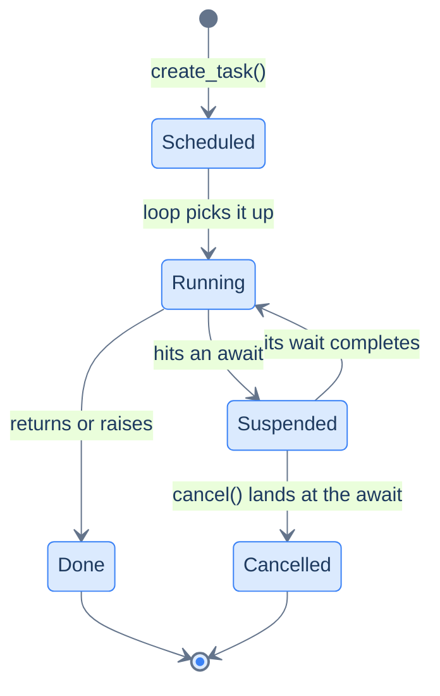

# Async in Practice — Tasks, Failure & Flow

The last chapter built the machine: coroutines are resumable frames, the event loop schedules them, `gather` overlaps their waits. This chapter is how you *run* that machine in a real program, and the thesis is one idea: **concurrency you start, you must own — every task needs an owner who awaits it, a plan for when it fails, and a deadline for how long it may wait.** `asyncio.create_task` starts background work; `TaskGroup` gives a set of tasks an owner and all-or-nothing failure semantics; `asyncio.timeout` and cancellation put bounds on waiting; and `async for` plus `asyncio.Queue` move streams of results between coroutines. None of it is new machinery — every tool here is the last chapter's loop, packaged for production.

This continues [Async Python](/synapse/programming-languages/python/advanced/async-python) (read it first — this chapter assumes the loop model) and completes the concurrency story begun with [threads and processes](/synapse/programming-languages/python/advanced/concurrency-and-the-gil); the capstone deliberately mirrors that chapter's `queue.Queue` pipeline in async form. Every runnable output below was produced by running the code; where scheduling makes output vary, it's labeled illustrative.

> **How to read the Intuition boxes.** Each one is built in three moves: (1) the **mechanism** — what the interpreter is *actually doing*; (2) a **concrete bite** — a specific, runnable way the naive assumption fails; (3) the **earned rule** — the decision heuristic, now justified rather than asserted, plus its cost.

---

## Table of Contents

1. [Tasks: `create_task` starts work *now*](#1-tasks-create_task-starts-work-now)
2. [Structured concurrency: `TaskGroup`](#2-structured-concurrency-taskgroup)
3. [When things fail: `gather`'s three modes vs `TaskGroup`](#3-when-things-fail-gathers-three-modes-vs-taskgroup)
4. [Deadlines: timeouts and cancellation](#4-deadlines-timeouts-and-cancellation)
5. [Streams: `async for` and async generators](#5-streams-async-for-and-async-generators)
6. [Capstone: an `asyncio.Queue` pipeline](#6-capstone-an-asyncioqueue-pipeline)
7. [Mental-model summary](#7-mental-model-summary)
8. [Gotcha checklist](#8-gotcha-checklist)

---

## 1. Tasks: `create_task` starts work *now*

A bare coroutine is inert — it runs only while something awaits it. A **`Task`** is a coroutine handed to the loop's ready queue immediately: `asyncio.create_task(coro)` schedules it *now*, and it makes progress every time you await anything else. `await task` then just collects a result that may already be there.

```python run
import asyncio

async def background():
    await asyncio.sleep(0.1)
    return "background result"

async def main():
    task = asyncio.create_task(background())   # scheduled to start NOW
    print("just created:   done =", task.done())
    await asyncio.sleep(0.2)                   # meanwhile, do other awaited work
    print("after 0.2s:     done =", task.done())
    print("await task ->  ", await task)       # already finished — returns instantly

asyncio.run(main())
```

**Output:**
```
just created:   done = False
after 0.2s:     done = True
await task ->   background result
```



**Analysis.** The task was `done() == False` right after creation — creating it doesn't run it, it *queues* it. Then `main` awaited an unrelated sleep, which handed the loop control — and the loop ran the task to completion in the background of that wait. By the time `main` awaited the task itself, the result was sitting there. The lifecycle diagram is the last chapter's loop from one task's point of view: queued, run to each `await`, parked, resumed, done — or *cancelled*, the new state this chapter is about.

**Intuition.**
*Mechanism.* `create_task` wraps the coroutine in a `Task` object and puts it on the ready queue. From then on the loop drives it interleaved with everything else — you don't need to await it for it to progress; you await it to *collect* it (or to propagate its exception, which is stored in the task until someone looks).

*Concrete bite.* Fire-and-forget is a leak: if you `create_task` and drop the reference, the task can be garbage-collected mid-flight, and if it fails, the exception is reported only as a cryptic "Task exception was never retrieved" at some later, unrelated moment. A task with no owner is a bug you'll meet weeks later in a log file.

*Earned rule.* `create_task` when you want work progressing *while you do something else*; plain `await` when you need the result before the next line. But every task you create, something must eventually await (or explicitly cancel) — keep the reference. The cost of tasks is precisely that ownership obligation, and §2 is the tool that automates it.

---

## 2. Structured concurrency: `TaskGroup`

Task ownership by discipline ("remember to await everything") doesn't survive contact with real codebases. **`asyncio.TaskGroup`** (3.11+) makes it structural: tasks are created *inside* an `async with` block, and the block does not exit until every task is finished. The scope owns its tasks the way a `with open(...)` owns its file — and if one task fails, the group **cancels the siblings** and re-raises the failures as an `ExceptionGroup`, caught with `except*`:

```python run
import asyncio

async def steady(x):
    await asyncio.sleep(0.05)
    print(f"steady({x}) finished")
    return x

async def boom():
    await asyncio.sleep(0.01)
    raise ValueError("boom")

async def victim():
    try:
        await asyncio.sleep(1)
    except asyncio.CancelledError:
        print("victim: cancelled because a sibling failed")
        raise                           # always re-raise CancelledError

async def main():
    try:
        async with asyncio.TaskGroup() as tg:
            tg.create_task(steady(1))
            tg.create_task(boom())
            tg.create_task(victim())
    except* ValueError as eg:
        print(f"caught: {[str(e) for e in eg.exceptions]}")

asyncio.run(main())
```

**Output:**
```
victim: cancelled because a sibling failed
caught: ['boom']
```

**Analysis.** Three tasks started; `boom` failed at 0.01s. The group immediately cancelled the others — note what *didn't* print: `steady(1) finished` (it was cancelled during its 0.05s sleep, silently) — while `victim` observed its cancellation in an `except CancelledError` and re-raised it, as a well-behaved task must. The `ValueError` then surfaced at the `async with` as an `ExceptionGroup`, matched by `except*`. One failure, clean shutdown of everything in the scope, error delivered to exactly one place.

**Intuition.**
*Mechanism.* The group tracks its tasks; when the body and all tasks complete, the `async with` exits. On a task failure it calls `cancel()` on the survivors — which makes their current `await` raise `CancelledError` inside them (that's what cancellation *is*) — waits for them to actually finish, then raises the collected real failures as an `ExceptionGroup`. `except*` is the [Tutorial 19](/synapse/programming-languages/python/how-python-works/errors-and-exceptions) `except`, generalised to match *inside* a group.

*Concrete bite.* Two of them. `except ValueError` does **not** catch an `ExceptionGroup` containing `ValueError`s — you need `except*`, and forgetting is a crash in your error handler. And a task that catches `CancelledError` without re-raising *swallows its own cancellation*: the group then waits forever for a task that decided not to die. Cancellation is a request delivered as an exception — handle, clean up, re-raise.

*Earned rule.* Default to `TaskGroup` for any set of related concurrent tasks: nothing leaks, failure is all-or-nothing, and errors arrive structured. The cost is the discipline it enforces — `except*` at the boundary, `CancelledError` always re-raised, no fire-and-forget — which is exactly the discipline §1's bite showed you need anyway.

---

## 3. When things fail: `gather`'s three modes vs `TaskGroup`

The last chapter warned that `gather`'s failure story must be chosen deliberately. Here are the modes, measured. **Mode 1 — plain `gather`:** the first exception propagates to your `await`, but the siblings *keep running*, unowned:

```python run
import asyncio

async def survivor():
    await asyncio.sleep(0.05)
    print("survivor: still ran to completion")
    return "done"

async def boom():
    await asyncio.sleep(0.01)
    raise ValueError("boom")

async def main():
    try:
        await asyncio.gather(survivor(), boom())
    except ValueError as e:
        print(f"caught {e!r} — but the sibling was NOT cancelled...")
        await asyncio.sleep(0.1)     # give it time to prove it's still running

asyncio.run(main())
```

**Output:**
```
caught ValueError('boom') — but the sibling was NOT cancelled...
survivor: still ran to completion
```

**Mode 2 — `return_exceptions=True`:** nothing raises; every slot delivers either a result or the exception *as a value*, and you triage:

```python run
import asyncio

async def ok(x):
    await asyncio.sleep(0.05)
    return x

async def boom():
    await asyncio.sleep(0.01)
    raise ValueError("boom")

async def main():
    results = await asyncio.gather(ok(1), boom(), ok(3), return_exceptions=True)
    print(results)

asyncio.run(main())
```

**Output:**
```
[1, ValueError('boom'), 3]
```

**Mode 3 — `TaskGroup`** (§2): first failure cancels the siblings and everything ends before the scope exits. Three different contracts for the same three coroutines.

**Analysis.** Mode 1 is the trap: the `except` block ran while `survivor` was still going — after your error handling, orphaned work is still mutating state, still holding connections. Mode 2 never cancels *and* never raises: results and failures come back mixed, positionally aligned with the inputs (`[1, ValueError('boom'), 3]`), which is right when partial success is acceptable — a fan-out where 98 of 100 fetches succeeding is a good outcome. Mode 3 is all-or-nothing. The choice is a *semantic* decision about your program, not a style preference.

**Intuition.**
*Mechanism.* `gather` aggregates task results into a list; its `return_exceptions` flag only changes how failures are *delivered* (raised vs returned). It has no scope, so it has no basis for cancelling anyone. `TaskGroup` is a scope; ownership is what makes cancellation meaningful.

*Concrete bite.* Mode 1's output *is* the bite — "caught the error" and "the work stopped" are different claims, and the survivor printing after the `except` proves it. In production this is the request handler that returned an error to the user while its orphaned sub-tasks kept writing to the database.

*Earned rule.* Choose by outcome semantics: **all-or-nothing → `TaskGroup`**; **best-effort partial results → `gather(..., return_exceptions=True)`** then triage the list; plain `gather` only when its keep-running behavior is genuinely what you want (rare — treat it as legacy default, not a choice). The cost of the safe options: `except*` ceremony for the group, `isinstance` triage for the list.

---

## 4. Deadlines: timeouts and cancellation

Every real await — a network call, a queue read — can hang forever. `asyncio.timeout(seconds)` (3.11+) puts a deadline on everything inside its block: when the clock expires, the waiting coroutine is **cancelled at its `await`**, cleanup runs, and the block raises `TimeoutError`:

```python run
import asyncio

async def slow_fetch():
    try:
        await asyncio.sleep(1)          # pretend: a stuck network call
        return "data"
    finally:
        print("slow_fetch: cleanup ran (finally)")

async def main():
    try:
        async with asyncio.timeout(0.1):
            await slow_fetch()
    except TimeoutError:
        print("caught TimeoutError after 0.1s")

asyncio.run(main())
```

**Output:**
```
slow_fetch: cleanup ran (finally)
caught TimeoutError after 0.1s
```

**Analysis.** Read the order: the *cleanup printed first*. At 0.1s the timeout cancelled `slow_fetch` — its `await asyncio.sleep(1)` raised `CancelledError` right there in the frame, the `finally` ran (this is where you'd close a connection or release a resource), the cancellation propagated out, and the timeout block converted it to `TimeoutError` for the caller. Cancellation isn't a force-kill; it's an exception delivered *at the await*, giving the coroutine one structured chance to clean up on its way out — the same protocol §2's `victim` followed.

**Intuition.**
*Mechanism.* `task.cancel()` — whether called by you, a `TaskGroup`, or a timeout — arranges for the task's current (or next) `await` to raise `CancelledError` inside it. Between awaits, code is uninterruptible as always; cancellation lands only at suspension points. `asyncio.timeout` is a context manager that starts a timer and cancels whatever is inside when it fires; `asyncio.wait_for(coro, s)` is the older one-shot form of the same thing.

*Concrete bite.* Two failure patterns. A coroutine with a long stretch of *non-awaiting* work can't be cancelled during it — the deadline fires, but the cancellation waits for the next `await`, so the "0.1s timeout" takes as long as your longest await-free stretch. And a `finally` that itself awaits (say, an async close) can be *hit by the same cancellation again* — cleanup in cancellation paths should be quick and ideally synchronous.

*Earned rule.* Put a deadline on **every** await whose completion you don't control — external calls, queue gets, joins; no exceptions for "it's always fast in dev." Write tasks cancellation-safe: cleanup in `finally`, `CancelledError` re-raised, cleanup itself cheap. The cost is ceremony on every boundary and the cancellation-safety discipline — the benefit is a program with no wait that can hang it forever.

---

## 5. Streams: `async for` and async generators

`gather` collects *all* results at the end. When results should be handled *as they arrive*, you want a stream — and the iterator protocol from [Tutorial 17](/synapse/programming-languages/python/how-python-works/iterators-and-generators) has an async twin: an **async generator** (`async def` + `yield`) produces values with awaits in between, and **`async for`** consumes them, yielding to the loop at each step:

```python run
import asyncio, time

async def stream_results():
    for i in range(3):
        await asyncio.sleep(0.05)       # each result takes time to arrive
        yield f"result-{i}"

async def main():
    t = time.perf_counter()
    async for r in stream_results():
        print(f"got {r} at {time.perf_counter() - t:.2f}s")

asyncio.run(main())
```

**Output (illustrative timing):**
```
got result-0 at 0.05s
got result-1 at 0.10s
got result-2 at 0.15s
```

**Analysis.** The consumer handled each result the moment it was ready — at 0.05s, 0.10s, 0.15s — instead of waiting 0.15s for a complete list. That's the streaming shape: constant memory (one item in flight), first result fast, and the loop free to run other coroutines during every gap. The same protocol powers `async with` (an async context manager awaits in its enter/exit — an async database transaction, a connection pool lease) — the sync protocols of Tutorials 17 and 21, each given an awaitable form.

**Intuition.**
*Mechanism.* `async for` calls `__anext__` and awaits it: each iteration is a real suspension point. An async generator is a coroutine frame that can *yield* as well as return — paused either at a `yield` (waiting for the consumer) or at an `await` (waiting for data). It's the last chapter's "coroutines are generators" kinship, now visible in the API itself.

*Concrete bite.* `for` over an async generator is a `TypeError` (`'async_generator' object is not iterable`) — the sync protocol can't await. And an abandoned async generator (you `break` out and drop it) still holds whatever its `finally`/`async with` was guarding until the loop gets around to closing it; `async with contextlib.aclosing(gen)` makes the release deterministic.

*Earned rule.* Stream (`async for`) when results should be processed as they arrive or the collection is large/unbounded; gather when you genuinely need everything before proceeding. The cost of streams: ordering is arrival-order by construction, and lifecycle (closing abandoned generators) becomes your concern.

---

## 6. Capstone: an `asyncio.Queue` pipeline

Everything at once — and deliberately, the [threads chapter](/synapse/programming-languages/python/advanced/concurrency-and-the-gil)'s `queue.Queue` pipeline, rebuilt async. Same pattern, same sentinel protocol, same backpressure; the difference is *one thread and no locks anywhere* — and a `TaskGroup` owning all of it:

```python run
import asyncio

DONE = object()                          # sentinel: "no more work"

async def producer(q, items):
    for item in items:
        await asyncio.sleep(0.02)        # pretend: fetch the next item
        await q.put(item)
    await q.put(DONE)

async def consumer(name, q):
    while True:
        item = await q.get()
        if item is DONE:
            await q.put(DONE)            # pass the sentinel to other consumers
            return
        await asyncio.sleep(0.05)        # pretend: process it
        print(f"{name} processed {item}")

async def main():
    q = asyncio.Queue(maxsize=2)         # bounded: backpressure
    async with asyncio.TaskGroup() as tg:
        tg.create_task(producer(q, ["a", "b", "c", "d"]))
        tg.create_task(consumer("c1", q))
        tg.create_task(consumer("c2", q))
    print("pipeline drained")

asyncio.run(main())
```

**Output (illustrative — which consumer takes which item varies):**
```
c1 processed a
c2 processed b
c1 processed c
c2 processed d
pipeline drained
```

**Analysis.** One producer, two consumers, connected by a bounded `asyncio.Queue`: `put` on a full queue and `get` on an empty one are *awaits* — suspension points where the loop runs someone else — instead of thread blocks. The sentinel hand-off shuts both consumers down cleanly, the `TaskGroup` guarantees `pipeline drained` prints only after every task is truly finished, and if any stage raised, the group would cancel the rest instead of leaving a producer feeding dead consumers. Put this next to the threaded version: the *architecture* is identical, which is the real lesson — producers, consumers, bounded queues, and sentinels are concurrency design; threads vs async is an execution detail chosen by workload (§8 of the threads chapter).

**Intuition.**
*Mechanism.* `asyncio.Queue` is the loop-native version of `queue.Queue`: same discipline, but waiting is parking a frame, not blocking a thread — so a thousand idle consumers cost a thousand parked frames, not a thousand stacks. Since only one coroutine runs at a time, the queue needs no lock at all internally beyond the loop's own single-threadedness.

*Concrete bite.* The two worlds don't mix silently: `queue.Queue.get()` inside a coroutine *blocks the loop* (the last chapter's cardinal sin), and `asyncio.Queue` offers no thread-safe access from outside the loop. Crossing the boundary has dedicated bridges (`asyncio.to_thread`, `loop.call_soon_threadsafe`) — reaching for the wrong queue type is the classic symptom of a design that hasn't decided which world each component lives in.

*Earned rule.* Structure async programs as stages connected by bounded queues inside a `TaskGroup` — ownership, backpressure, failure, and shutdown all have one obvious home. The cost is the same as the threaded version (queue overhead, a shutdown protocol) plus one decision the threaded version didn't need: every component must know which world — loop or threads — it belongs to.

---

## 7. Mental-model summary

| Principle | Consequence |
|-----------|-------------|
| `create_task` queues work to run during *any* subsequent await | Background progress without threads — but every task needs an owner |
| A dropped task reference = possible GC mid-flight + swallowed exceptions | Keep the reference; better, use a scope that keeps it for you |
| `TaskGroup` scopes tasks: exit only when all finish; one failure cancels the rest | Structured concurrency — errors arrive as `ExceptionGroup`, caught with `except*` |
| Plain `gather` raises on first failure but leaves siblings running | Choose deliberately: TaskGroup (all-or-nothing) vs `return_exceptions=True` (partial results) |
| Cancellation = `CancelledError` raised at the task's await | Clean up in `finally`, re-raise, keep cleanup cheap; between awaits, code is uninterruptible |
| `asyncio.timeout` cancels its block and raises `TimeoutError` | Every uncontrolled await gets a deadline — no wait may hang the program |
| `async for` / async generators stream results as they arrive | First result fast, constant memory; the iterator protocol with awaits inside |
| `asyncio.Queue` + sentinel + `TaskGroup` = the async pipeline | Same architecture as the threaded version; the worlds don't mix without bridges |

## 8. Gotcha checklist

- **"Task exception was never retrieved" long after the fact →** a fire-and-forget task failed; every task needs an eventual `await` (or a `TaskGroup`).
- **`except ValueError` didn't catch the TaskGroup failure →** groups raise `ExceptionGroup`; use `except*` at the scope boundary.
- **The group hangs forever after a failure →** a task caught `CancelledError` and didn't re-raise; cancellation must propagate.
- **You handled the `gather` error but work kept happening →** plain `gather` doesn't cancel siblings; use a `TaskGroup` for all-or-nothing.
- **A "0.1s timeout" took much longer →** cancellation lands only at awaits; a long await-free stretch delays it.
- **`TypeError: 'async_generator' object is not iterable` →** you used `for` on an async generator; it needs `async for`.
- **A coroutine blocks the whole loop at `queue.get()` →** that's the *threading* queue; inside coroutines use `asyncio.Queue` (and bridge worlds explicitly).

---

*Predict, then check.* Predict §1's three printed lines if you delete the `await asyncio.sleep(0.2)` — when does the task actually run, and what does `await task` do? Then predict §3 Mode 2's list if *all three* coroutines raise. Next, §4: predict the output order if `slow_fetch` had no `try/finally` at all. Finally, predict what §6 prints if the producer forgets `await q.put(DONE)` — which awaits deadlock, and would the `TaskGroup` exit? Each answer is one of this chapter's rules applied once.

## Your Turn

Before you move on, check your understanding with the coach — explain the idea, apply it, weigh the trade-offs, then defend your reasoning.

<div class="concept-coach"></div>
