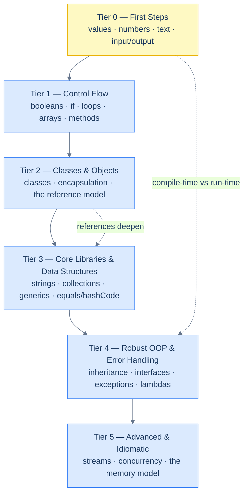

# Java

Most Java tutorials hand you a pile of features and ask you to remember them. This one does the opposite: it finds the **one generative idea** under each topic and shows every rule as a *consequence* of it. You should finish each chapter able to re-derive the rules, not just recite them — and able to predict what a snippet prints, or *whether it even compiles*, before you run it.

The book is a single text, read top to bottom. It starts assuming **you have never written a line of code in any language** and ends on generics, concurrency, the memory model, and modern idioms. Early chapters introduce every term before using it; later chapters assume the earlier ones are done and move at a fluent reader's pace. What never changes is the standard of explanation: every claim is backed by code that was actually compiled and run, and every rule comes with its cost. One idea recurs from the first page to the last — **Java checks your program twice, at compile time and at run time, and the two stages fail in different ways** — so learning to read both kinds of message is learning the language.

## Reading conventions

- **Every code block with a Run button is real.** Cortex compiles and runs it in a sandboxed **Java 21 (OpenJDK)** runner — the same one that produced every `Output:` block in this book. Click ▶ Run, edit the code, run it again. The output you see is the output we verified.
- **When the lesson is a compile error, the block is labelled `Compiler error:`** and shows the real `javac` diagnostic — because in Java, many of the most important lessons happen *before* the program runs.
- **Blocks without a Run button are deliberate** — short fragments, or programs shown precisely because they need keyboard input the sandbox can't supply. Their output is still shown and still real.
- **Every chapter is built on a thesis** stated in its first paragraph, and a fixed rhythm: concept → code → verified output → analysis ("what happened") → an **Intuition** box ("why it must be so").

📘 **How to read the Intuition boxes.** Each one is built in three moves:

1. **The mechanism** — what the compiler and the JVM are *actually doing*.
2. **A concrete bite** — a specific, runnable failure (often a real compiler error), shown so the trap is visible.
3. **The earned rule** — the decision heuristic, now justified rather than asserted, plus its cost.

This note repeats, word for word, at the top of every chapter, so a returning reader can skip it.

---

## The six tiers

The book climbs six tiers. Earlier tiers are prerequisites for later ones; topics that matter most return later at greater depth (the **spiral** — e.g. `==` vs `.equals` gets a gentle pass with strings in Tier 0, a rigorous "object model" pass in Tier 2, and a third pass in the `equals`/`hashCode` contract in Tier 3, each referencing back rather than re-teaching).

---

## Curriculum map

**Tier 0 — First Steps** *(zero programming background)* — you compile and run your first program and work with values, numbers, text, and I/O.

1. [What Java Is & Running Code](/synapse/programming-languages/java/first-steps/what-java-is-and-running-code)
2. [Variables & Primitive Types](/synapse/programming-languages/java/first-steps/variables-and-primitive-types)
3. [Numbers & Arithmetic](/synapse/programming-languages/java/first-steps/numbers-and-arithmetic)
4. [Strings, the Basics](/synapse/programming-languages/java/first-steps/strings-the-basics)
5. [Input & Output](/synapse/programming-languages/java/first-steps/input-and-output)

**Tier 1 — Control Flow** *(beginner)* — make decisions and repeat work; first real programs.

6. [Booleans & Logic](/synapse/programming-languages/java/control-flow/booleans-and-logic)
7. [Conditionals](/synapse/programming-languages/java/control-flow/conditionals)
8. [Loops](/synapse/programming-languages/java/control-flow/loops)
9. [Loop Control & Patterns](/synapse/programming-languages/java/control-flow/loop-control-and-patterns)
10. [Arrays](/synapse/programming-languages/java/control-flow/arrays)
11. [Methods](/synapse/programming-languages/java/control-flow/methods)

**Tier 2 — Classes & Objects** *(early intermediate — the OOP leap)* — the move from procedural code to objects, and the reference model underneath.

12. [Classes & Objects](/synapse/programming-languages/java/classes-and-objects/classes-and-objects)
13. [Encapsulation & Access Modifiers](/synapse/programming-languages/java/classes-and-objects/encapsulation-and-access-modifiers)
14. [`static` vs Instance](/synapse/programming-languages/java/classes-and-objects/static-vs-instance)
15. [References, Equality & the Object Model](/synapse/programming-languages/java/classes-and-objects/references-equality-and-the-object-model)

**Tier 3 — Core Libraries & Data Structures** *(intermediate)* — the standard data structures and the contracts that make objects usable in them.

16. [Strings in Depth](/synapse/programming-languages/java/core-libraries/strings-in-depth)
17. [The Collections Framework](/synapse/programming-languages/java/core-libraries/the-collections-framework)
18. [Sets & Maps](/synapse/programming-languages/java/core-libraries/sets-and-maps)
19. [`equals` & `hashCode`](/synapse/programming-languages/java/core-libraries/equals-and-hashcode)
20. [Generics](/synapse/programming-languages/java/core-libraries/generics)
21. [Enums & Records](/synapse/programming-languages/java/core-libraries/enums-and-records)

**Tier 4 — Robust OOP & Error Handling** *(intermediate → advanced)* — the full object model: polymorphism, abstraction, errors, and the bridge to functional Java.

22. [Inheritance & Polymorphism](/synapse/programming-languages/java/robust-oop/inheritance-and-polymorphism)
23. [Abstract Classes & Interfaces](/synapse/programming-languages/java/robust-oop/abstract-classes-and-interfaces)
24. [Exceptions](/synapse/programming-languages/java/robust-oop/exceptions)
25. [Nested & Anonymous Classes; Lambdas](/synapse/programming-languages/java/robust-oop/nested-and-anonymous-classes-and-lambdas)
26. [Sealed Classes & Pattern Matching](/synapse/programming-languages/java/robust-oop/sealed-classes-and-pattern-matching)
27. [Packages, Modules & the Build](/synapse/programming-languages/java/robust-oop/packages-modules-and-the-build)

**Tier 5 — Advanced & Idiomatic** *(advanced)* — functional Java, concurrency and the memory model, I/O, modern idioms, and shipping.

28. [Functional Java & the Streams API](/synapse/programming-languages/java/advanced/functional-java-and-streams)
29. [Concurrency: the Basics](/synapse/programming-languages/java/advanced/concurrency-the-basics)
30. [Concurrency: Coordination](/synapse/programming-languages/java/advanced/concurrency-coordination)
31. [Concurrency: High-Level & Virtual Threads](/synapse/programming-languages/java/advanced/concurrency-high-level-and-virtual-threads)
32. [The Java Memory Model & Performance](/synapse/programming-languages/java/advanced/the-java-memory-model-and-performance)
33. [I/O, Files & NIO.2](/synapse/programming-languages/java/advanced/io-files-and-nio2)
34. [Modern Java Idioms & the Type System](/synapse/programming-languages/java/advanced/modern-java-idioms)
35. [Testing, Tooling & Packaging](/synapse/programming-languages/java/advanced/testing-tooling-and-packaging)

---

## Three reading paths

**Path A — Your first programming language ever.** Start at Tutorial 1 and walk straight through. Do not skip; each chapter assumes the one before it. Type every example, then change it and predict the new output — or whether it still compiles — before running. Tiers 0–1 are the whole game at first: values, decisions, loops, methods. Everything after is built on those.

**Path B — You program in another language, new to Java.** Skim Tier 0 for the syntax and the surprises (integer division truncates, `int` overflow wraps silently, `==` vs `.equals`), then slow down at **Tier 2 — Classes & Objects**. The reference model (stack vs heap, values vs references, aliasing) and the equality/`hashCode` contract are where Java differs most from scripting-language mental models, and where transferred assumptions cause the subtlest bugs.

**Path C — You know Java, filling gaps.** Use the tier map to find your boundary and read forward. The highest-leverage deep passes are the object model (15), `equals`/`hashCode` (19), generics and erasure (20), the Streams API (28), and concurrency with the memory model (29–32).

---

## A note on the runner

Every runnable block compiles and runs in an isolated **Java 21 (OpenJDK)** sandbox — no setup, no install, nothing to break. The sandbox compiles your code as a class named `Main`, so the examples here use that name; each block runs on its own (state does not carry from one block to the next), so self-contained examples repeat any setup they need. Anonymous runs work; signing in lets you edit-and-run and raises your hourly quota. One limit worth knowing early: the sandbox cannot pause to read keyboard input, so the interactive `Scanner(System.in)` programs in [Tutorial 5](/synapse/programming-languages/java/first-steps/input-and-output) are shown statically, each paired with a runnable twin that reads from a fixed source. You do **not** need Java installed locally to read this book — though by Tier 5 you'll want it, and Tutorial 35 shows how to set it up properly.
