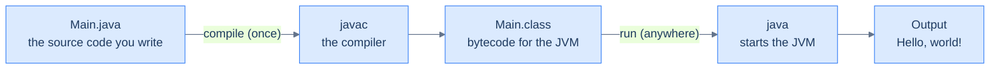

# What Java Is & Running Code — Your First Program

Java is a **compiled** language, and that one fact shapes everything you are about to do. You write **source code** — text, like the program below. Before it can run, a tool called the **compiler** reads the *whole* file, checks it for mistakes, and translates it into **bytecode**: instructions for an imaginary computer called the **Java Virtual Machine** (the **JVM**). The JVM is a real program on your machine that reads that bytecode and carries it out. So running Java is always two steps — **compile, then run** — and the payoff is portability: because the bytecode targets the *virtual* machine and not your specific laptop, the same compiled program runs unchanged on Windows, macOS, or Linux. "Write once, run anywhere" is not a slogan; it is the consequence of that extra compile step.

This chapter gets you running real Java and shows you both halves of that loop — including what it looks like when each half says *no*, because Java says no in two very different ways. You don't need anything installed: every block with a ▶ Run button compiles and runs in a sandboxed **Java 21** environment — the same one that produced every `Output:` block below. Every output here was produced by compiling and running the code.

> **How to read the Intuition boxes.** Each one is built in three moves: (1) the **mechanism** — what the compiler and the JVM are *actually doing*; (2) a **concrete bite** — a specific, runnable failure (often a real compiler error), shown so the trap is visible; (3) the **earned rule** — the decision heuristic, now justified rather than asserted, plus its cost.

---

## Table of contents

1. [A first Java program](#1-a-first-java-program)
2. [Compile, then run: `javac`, bytecode, and the JVM](#2-compile-then-run-javac-bytecode-and-the-jvm)
3. [Reading `public static void main(String[] args)`](#3-reading-public-static-void-mainstring-args)
4. [`System.out.println` — how a program talks back](#4-systemoutprintln--how-a-program-talks-back)
5. [Comments — notes for humans](#5-comments--notes-for-humans)
6. [Mental-model summary](#6-mental-model-summary)
7. [Gotcha checklist](#7-gotcha-checklist)

---

## 1. A first Java program

A **program** is a list of **instructions** (also called **statements**) carried out in order. In Java, every instruction must live inside a **method** (a named block of instructions), which lives inside a **class** (a named container). That is more scaffolding than some languages ask for, and §3 explains every word of it; for now, here is the smallest complete Java program. Run it.

```java run
public class Main {
    public static void main(String[] args) {
        System.out.println("Hello, world!");
    }
}
```

**Output:**
```
Hello, world!
```

**Analysis.** The program is three nested parts. The outer `public class Main { ... }` is the **class** — a container with a name, `Main`. Inside it, `public static void main(String[] args) { ... }` is the **method** named `main`, the block the JVM runs first. Inside *that* sits the single instruction `System.out.println("Hello, world!");`, which prints a line of text. The text between the double quotes — `Hello, world!` — is shown literally; the quotes themselves are not part of it. The `;` ends the instruction, the way a period ends a sentence.

**Intuition.**
*Mechanism.* Running this is two phases, not one. First the **compiler** (`javac`) reads the entire file and translates it to bytecode; only if that succeeds does the **JVM** start executing `main`, one statement at a time, top to bottom. The compiler's job is to check *before* anything runs.

*Concrete bite.* Because compiling is a gate, a single missing `;` means the program never runs at all — there is no partial output, only a compiler complaint pointing at the spot. Click Run and see for yourself:

```java run
public class Main {
    public static void main(String[] args) {
        System.out.println("Hello, world!")
    }
}
```

**Compiler error:**
```
Main.java:3: error: ';' expected
        System.out.println("Hello, world!")
                                           ^
1 error
```

The compiler read the whole file, found that the statement on line 3 had no `;`, and refused to produce bytecode. Nothing ran; there is no `Hello, world!` anywhere, because there was nothing to run.

*Earned rule.* Java checks first and runs second, so a program that doesn't compile produces **no** output — not even the lines before the mistake. The cost is up-front strictness: you must satisfy the compiler before you see anything happen. The benefit, which compounds with every chapter, is that a whole category of mistakes is caught *before* your program ever touches real data — the compiler is a proof-checker you run for free.

---

## 2. Compile, then run: `javac`, bytecode, and the JVM

You just met the two phases as error messages; now meet them as commands. When you install Java you install the **JDK** (Java Development Kit) — a toolbox. Two of its tools matter here: `javac`, the **compiler**, and `java`, the **launcher** that starts the JVM.



On a terminal the loop is explicit — two commands:

```
javac Main.java   # compile: reads Main.java, writes Main.class (bytecode)
java Main          # run: starts the JVM, which executes Main.class
```

`javac` turns your `Main.java` into a new file, `Main.class`, holding bytecode. `java Main` hands that bytecode to the JVM, which runs it. Note `java Main`, not `java Main.class` — you name the **class**, not the file. Since Java 11 there is also a shortcut for a single file: `java Main.java` does both steps at once, compiling in memory and running without leaving a `.class` behind — handy for small programs, and essentially what the Run buttons here do for you.

```java run
public class Main {
    public static void main(String[] args) {
        System.out.println("compiled to bytecode,");
        System.out.println("then run by the JVM.");
    }
}
```

**Output:**
```
compiled to bytecode,
then run by the JVM.
```

**Analysis.** Behind the Run button, two things happened in order: `javac` checked and translated both statements into bytecode, then the JVM executed them top to bottom — first line, then second. On a terminal you would have typed `javac Main.java` and then `java Main` to get the same two lines.

**Intuition.**
*Mechanism.* `java` does not run your *source* — it runs the *bytecode* the compiler produced. The launcher loads a compiled class and looks inside it for instructions; by then the `.java` text is irrelevant.

*Concrete bite.* Ask the JVM to run a class that was never compiled and it has nothing to load:

```
java Ghost
```
```
Error: Could not find or load main class Ghost
Caused by: java.lang.ClassNotFoundException: Ghost
```

There is no `Ghost.class`, so the JVM stops before running a single instruction. This is a *run-time* failure — the JVM complaining — not a *compile-time* one; the two are different stages with different error styles, a distinction the next section sharpens.

*Earned rule.* Compiling and running are separate steps with separate failures: `javac` rejects bad *source* (compile-time); the JVM rejects missing or broken *bytecode* (run-time). The cost of two steps is the ceremony of compiling before running; the benefit is **portability** — `Main.class` is plain bytecode, so the very same file runs on any machine with a JVM, which is why a Java program built on a developer's Mac runs unchanged on a Linux server.

For quick experiments there is a third tool, **jshell**, a Java REPL (Read–Eval–Print Loop) that evaluates one expression at a time with no class and no `main`:

```
jshell> 1 + 1
$1 ==> 2
jshell> "Java" + "!"
$2 ==> "Java!"
```

Type an expression, press Enter, and jshell shows the result (`$1`, `$2` are names it invents for them). It is the fastest way to answer "what does this do?" — but real programs are compiled classes, which is what the rest of this book writes.

---

## 3. Reading `public static void main(String[] args)`

That line is the one piece of ceremony every Java program repeats, so it is worth understanding rather than copying on faith. Each word is a real instruction to the JVM about *how* to start, and none of it is decoration. We will only sketch each part now and return to most in later tiers:

- `public` — an **access level**: this method can be called from outside the class. The JVM starts your program from *outside* it, so the entry point must be reachable. *(Access levels: Tier 2.)*
- `static` — this method belongs to the **class itself**, not to an **object** built from it. The JVM must call `main` *before* your program has created any objects, so `main` cannot require one. *(Objects: Tier 2 — a forward promise you'll cash in then.)*
- `void` — the **return type**: `main` hands no value back when it finishes. *(Methods and return types: Tutorial 11, in Tier 1.)*
- `main` — the **name** the JVM looks for; it must be spelled exactly `main`. Java is **case-sensitive**, so `Main` (the class) and `main` (the method) are different names doing different jobs — the class is the container, the method is the starting instruction.
- `String[] args` — a **parameter**: a slot where command-line arguments (extra words typed after `java Main`) arrive as a list of text values. You rarely need it at first, but the JVM always passes it. *(Arrays: Tutorial 10, in Tier 1.)*

Read as a whole, the line says: "a publicly reachable, class-level method named `main` that returns nothing and accepts a list of text arguments." The JVM is hard-wired to find exactly that and call it.

```java run
public class Main {
    public static void main(String[] args) {
        System.out.println("The JVM called main.");
    }
}
```

**Output:**
```
The JVM called main.
```

**Analysis.** The JVM loaded `Main`, found a method matching the exact shape `public static void main(String[] args)`, and called it. Every word of that signature had to match for the call to happen.

**Intuition.**
*Mechanism.* The JVM does not run "the class" — it looks specifically for a method named `main` with exactly this signature and calls *that*. The name and shape are a contract; miss any part and there is nothing for the JVM to call.

*Concrete bite.* Rename `main` to `greet`. The class still **compiles** — it is a perfectly legal class — but at run time the JVM cannot find its entry point:

```java run
public class Main {
    public static void greet(String[] args) {
        System.out.println("never printed");
    }
}
```
```
Error: Main method not found in class Main, please define the main method as:
   public static void main(String[] args)
or a JavaFX application class must extend javafx.application.Application
```

It compiled (the method is valid Java), but it never ran `greet`, because the JVM only ever calls `main`. The error even reminds you of the exact shape it wants. `never printed` never printed.

*Earned rule.* The entry point must be exactly `public static void main(String[] args)` — the JVM matches it literally. The cost is that a typo in the *signature* (a capital `Main`, a missing `static`, a wrong parameter) gives you not a helpful compile error but a run-time "main method not found," because the method you wrote is legal — it is just not the one the JVM calls. When a program compiles but won't start, check the `main` signature first.

**A note on newer Java.** Since JDK 25 you can write a simpler entry point — `void main()` with no `public`, no `static`, no `String[] args`, not even the surrounding class — as a convenience for learning and small scripts. This book targets **JDK 21**, the current long-term-support release, and teaches the classic `public static void main(String[] args)` because it is what nearly all existing code uses and what runs everywhere today. When you meet the short form later, you will understand exactly what it leaves out — and why dropping it was safe.

---

## 4. `System.out.println` — how a program talks back

A program that cannot show anything is useless, and `System.out.println` is the instruction that prints. Read it in pieces: `System.out` is the program's standard text **output** — the console; `println` is an action you ask of it — "print this, then move to the next line." The value you want printed goes inside the parentheses.

```java run
public class Main {
    public static void main(String[] args) {
        System.out.println("first line");
        System.out.println("second line");
    }
}
```

**Output:**
```
first line
second line
```

**Analysis.** Two `println` calls produced two lines. Each printed its text and then ended the line, so the second call started fresh below the first — even though we never wrote anything about a line break. The "ln" in `println` *is* that automatic newline.

**Intuition.**
*Mechanism.* There are two related actions: `println` prints its argument **and** ends the line; `print` (no "ln") prints its argument and **stops there**, leaving whatever comes next on the same line.

*Concrete bite.* Mix them and the difference is visible — `print` keeps the cursor on the line, `println` breaks it:

```java run
public class Main {
    public static void main(String[] args) {
        System.out.print("a");
        System.out.print("b");
        System.out.println("c");
        System.out.println("d");
    }
}
```
```
abc
d
```

The `a`, `b`, and `c` all landed on one line (`abc`) because only the `println` at `c` ended it; then `d` printed on the next line. Swap a `print` for a `println` earlier and the line would split sooner.

*Earned rule.* Use `println` when you want each piece on its own line, `print` when you are building a line in parts. The cost of confusing them is cosmetic but common: a row of `print` calls runs your output together (`abc`), and a stray `println` breaks a line you meant to keep whole. When in doubt, `println` is the safe default — most output is line-at-a-time.

---

## 5. Comments — notes for humans

Not every line in a file is for the computer. A **comment** is a note for the people reading the code; the compiler skips it entirely. Java has two forms: `//` ignores the rest of *that line*; `/* ... */` ignores everything between the markers, across as many lines as you like.

```java run
public class Main {
    public static void main(String[] args) {
        // This whole line is a comment — the compiler ignores it
        System.out.println("code runs");  // an inline comment, ignored too
        /* a block comment
           spanning two lines, also ignored */
        // System.out.println("this line is commented out, so it never runs");
    }
}
```

**Output:**
```
code runs
```

**Analysis.** Four of the lines inside `main` are comments, and only one printed anything. The `//` line did nothing; the inline `// ...` after the working statement was ignored while the statement itself ran; the `/* ... */` block vanished across both its lines; and the last line — a real `println` with a `//` in front — never ran, so `this line is commented out…` never appeared. Putting `//` before a line to disable it is called **commenting out**.

**Intuition.**
*Mechanism.* While reading your source, the compiler discards `//` to end-of-line and everything between `/*` and `*/` before it does anything else. Commented text never becomes bytecode, so it can neither run nor contain a mistake the compiler will catch — it is invisible.

*Concrete bite.* The missing line is the proof: the output is only `code runs`. The commented-out `println` was legal code, but because it sat behind `//` the compiler never saw it as an instruction, so it produced nothing.

*Earned rule.* Comment to explain **why**, not to restate **what** the code plainly does; and "comment out" a line to disable it while you experiment. The cost is that comments are never checked against the code — the compiler ignores them, so a comment gone stale will state a falsehood with total confidence. Keep them honest, or delete them.

---

## 6. Mental-model summary

| Principle | Consequence |
|---|---|
| Java runs in two phases: compile (`javac`), then run (the JVM) | A program that doesn't compile produces no output at all |
| `javac` turns source into portable **bytecode** (`.class`); the JVM runs the bytecode | The same compiled class runs on any machine with a JVM — "write once, run anywhere" |
| Compile-time and run-time are different failure stages | `javac` rejects bad source; the JVM rejects missing bytecode or a missing `main` |
| Every statement lives in a method, inside a class; statements run top to bottom | The `class`/`main` wrapper is required, not decoration |
| The JVM calls exactly `public static void main(String[] args)` | A wrong signature compiles but won't start — a run-time "main method not found" |
| `println` ends the line; `print` does not | A row of `print`s runs together; `println` is the line-at-a-time default |
| `//` and `/* */` are ignored by the compiler | Comments are for humans; "commenting out" disables code; stale comments can lie |

## 7. Gotcha checklist

- **`error: ';' expected` →** a statement is missing its terminating `;`; the caret `^` points just past where it belongs.
- **`Could not find or load main class X` →** you ran `java X` but there is no compiled `X.class` (you didn't compile, or mistyped the name); compile first with `javac X.java`, and name the *class*, not the file.
- **Compiles fine but `Main method not found` at run time →** your entry method isn't exactly `public static void main(String[] args)`; check spelling, `static`, and the parameter.
- **Output runs together on one line →** you used `print` where you meant `println`; the "ln" is the line break.
- **A line you expected to run did nothing →** it is behind `//` or inside `/* */`; remove the comment markers.
- **Edited the code but the output didn't change (on a terminal) →** you re-ran `java` without re-running `javac`, so the old `.class` ran; recompile after every edit. (The Run button here recompiles for you.)

---

*Predict, then check.* Look again at the §3 program whose method is named `greet` instead of `main`. Before re-running it, answer two questions: does it **compile**? And does it **run**? Then fix it by renaming `greet` to `main`, and predict the output before clicking Run. If you can explain why the broken version compiles but won't start, you have understood the most important idea in this chapter: **Java checks your program at compile time and again at run time, and the two stages fail in different ways.**

## Your Turn

Before you move on, check your understanding with the coach — explain the idea, apply it, weigh the trade-offs, then defend your reasoning.

<div class="concept-coach"></div>
