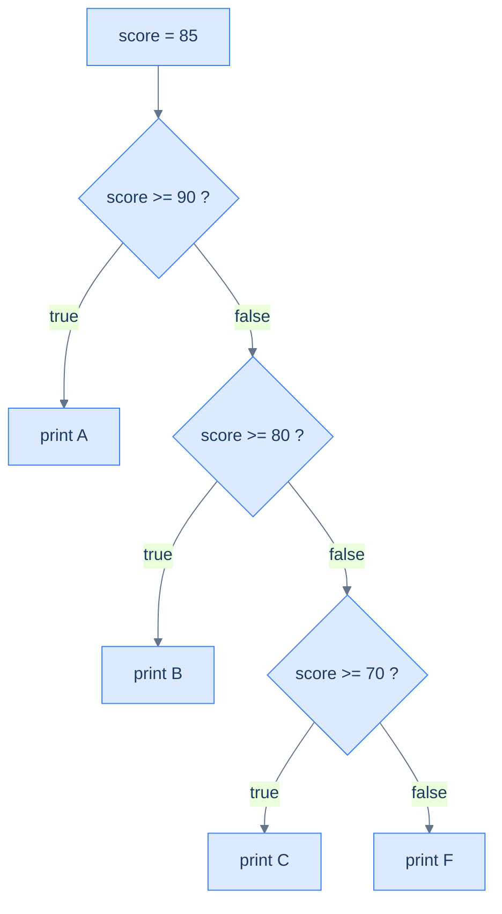

# Conditionals — Choosing a Path

A program that always does the same thing is a calculator with one button. **Conditionals** let it choose: run this code when a condition holds, that code otherwise. Every choice rests on a `boolean` — the [yes/no type from the last chapter](/synapse/programming-languages/java/control-flow/booleans-and-logic) — and Java offers four shapes for branching: `if`/`else` for one decision, `else if` chains for many, `switch` for selecting among constant values, and the ternary `?:` for a choice that *produces a value*. The newest shape, the `switch` **expression**, fixes the oldest `switch` trap by design.

Every output below was produced by compiling and running the code.

> **How to read the Intuition boxes.** Each one is built in three moves: (1) the **mechanism** — what the compiler and the JVM are *actually doing*; (2) a **concrete bite** — a specific, runnable failure (often a real compiler error), shown so the trap is visible; (3) the **earned rule** — the decision heuristic, now justified rather than asserted, plus its cost.

---

## Table of contents

1. [`if` and `else`](#1-if-and-else)
2. [`else if` chains](#2-else-if-chains)
3. [The `switch` statement](#3-the-switch-statement)
4. [`switch` expressions](#4-switch-expressions)
5. [The ternary operator `?:`](#5-the-ternary-operator-)
6. [Mental-model summary](#6-mental-model-summary)
7. [Gotcha checklist](#7-gotcha-checklist)

---

## 1. `if` and `else`

An `if` runs its block only when a `boolean` condition is `true`. An optional `else` runs when it is `false`.

```java run
public class Main {
    public static void main(String[] args) {
        int temp = 5;
        if (temp < 10) {
            System.out.println("cold");
        } else {
            System.out.println("warm");
        }
    }
}
```

**Output:**
```
cold
```

**Analysis.** `temp < 10` is `true`, so the `if` block ran and the `else` block was skipped. Exactly one of the two blocks runs, never both. The condition must be a `boolean` (from the last chapter, `if (1)` would not compile).

**Intuition.**
*Mechanism.* `if (cond) { … }` guards a **block** — everything inside the braces. Without braces, `if (cond) stmt;` guards only the *single statement* that immediately follows it; the next statement is not part of the `if` at all, no matter how it is indented.

*Concrete bite.* That single-statement rule, plus misleading indentation, is a classic trap:

```java run
public class Main {
    public static void main(String[] args) {
        boolean cold = false;
        if (cold) System.out.println("wear a coat");
            System.out.println("leave the house");
    }
}
```

**Output:**
```
leave the house
```

`cold` is `false`, so `wear a coat` is correctly skipped — but `leave the house` printed anyway. The indentation suggests both lines are guarded; in fact only the first is. The braceless `if` controls exactly one statement, and the second runs unconditionally.

*Earned rule.* Always use braces, even for a one-line body: `if (cond) { … }`. The cost is two extra characters; the benefit is that "what does this `if` control?" has one answer — the block — instead of depending on where the semicolons fall, which is how a guarded line and an always-run line end up looking identical.

---

## 2. `else if` chains

To choose among more than two paths, chain `else if`. Java tests each condition in order and runs the **first** block whose condition is `true`, skipping the rest.

```java run
public class Main {
    public static void main(String[] args) {
        int score = 85;
        if (score >= 90) System.out.println("A");
        else if (score >= 80) System.out.println("B");
        else if (score >= 70) System.out.println("C");
        else System.out.println("F");
    }
}
```

**Output:**
```
B
```



**Analysis.** `score` is `85`. The chain checks `>= 90` (false), then `>= 80` (true) — so it prints `B` and skips the remaining tests, including `>= 70`, which would also have been true. First match wins; the rest never run.

**Intuition.**
*Mechanism.* The chain is evaluated top to bottom, and the first true condition's block executes; once one matches, the entire chain is done. This means a later condition is reached only when every earlier one was false — so order encodes priority.

*Concrete bite.* Put a broad condition before a narrow one and the narrow one becomes unreachable:

```java run
public class Main {
    public static void main(String[] args) {
        int score = 95;
        if (score >= 70) System.out.println("C");
        else if (score >= 90) System.out.println("A");
        else System.out.println("F");
    }
}
```

**Output:**
```
C
```

`95` deserves an `A`, but `score >= 70` is checked first and matches, so it prints `C` and never reaches `>= 90`. The compiler sees nothing wrong — the logic is legal, just ordered backwards.

*Earned rule.* In an `else if` chain, order conditions from most specific (narrowest) to least, because the first match wins. The cost of getting it wrong is a *silent* misclassification, not an error — so when ranges overlap, read the chain as "first true wins" and put the tightest test on top.

---

## 3. The `switch` statement

When you are choosing based on one value against several constants, a `switch` is clearer than a long chain. Each `case` labels a constant; `break` ends the chosen branch; `default` catches everything else.

```java run
public class Main {
    public static void main(String[] args) {
        int day = 3;
        switch (day) {
            case 1: System.out.println("Mon"); break;
            case 2: System.out.println("Tue"); break;
            case 3: System.out.println("Wed"); break;
            default: System.out.println("other");
        }
    }
}
```

**Output:**
```
Wed
```

**Analysis.** `day` is `3`, so execution jumped to `case 3`, printed `Wed`, and `break` ended the switch. The other cases were skipped entirely.

**Intuition.**
*Mechanism.* A `switch` statement *jumps* to the matching `case` label and then runs **straight down** until it hits a `break` (or the end). The `break` is not decoration — without it, execution "falls through" into the next case's code, ignoring that case's label.

*Concrete bite.* Drop the `break`s and one match runs several cases:

```java run
public class Main {
    public static void main(String[] args) {
        int day = 1;
        switch (day) {
            case 1: System.out.println("Mon");
            case 2: System.out.println("Tue");
            case 3: System.out.println("Wed"); break;
            default: System.out.println("other");
        }
    }
}
```

**Output:**
```
Mon
Tue
Wed
```

`day` is `1`, so it entered `case 1` and printed `Mon` — then, with no `break`, fell through into `case 2` (`Tue`) and `case 3` (`Wed`), stopping only at the `break`. One value, three lines printed.

*Earned rule.* End every `case` of a `switch` *statement* with `break` (or `return`) unless you deliberately want fall-through. The cost of the colon-and-`break` form is exactly this footgun — a forgotten `break` is silent and runs too much code — which is precisely what the arrow form in the next section removes.

---

## 4. `switch` expressions

Since JDK 14, a `switch` can be an **expression** that produces a value, using `case … ->` arrows. There is no fall-through, and you can assign the whole thing to a variable.

```java run
public class Main {
    public static void main(String[] args) {
        int day = 3;
        String name = switch (day) {
            case 1 -> "Mon";
            case 2 -> "Tue";
            case 3 -> "Wed";
            default -> "other";
        };
        System.out.println(name);
    }
}
```

**Output:**
```
Wed
```

**Analysis.** The `switch (day) { … }` evaluated to `"Wed"`, which was assigned to `name`. Each arrow case yields a value and *only* that case runs — no `break` needed, no fall-through possible. The trailing `;` ends the assignment statement.

**Intuition.**
*Mechanism.* An arrow `case X -> value` runs just its right-hand side and produces a value for the whole `switch`. Because the result is *used* (assigned, returned, printed), the compiler insists the `switch` is **exhaustive** — every possible input must be covered, or it will not compile.

*Concrete bite.* Leave a gap with no `default` and the compiler refuses:

```java run
public class Main {
    public static void main(String[] args) {
        int day = 3;
        String name = switch (day) {
            case 1 -> "Mon";
            case 2 -> "Tue";
        };
        System.out.println(name);
    }
}
```

**Compiler error:**
```
Main.java:4: error: the switch expression does not cover all possible input values
        String name = switch (day) {
                      ^
1 error
```

An `int` can be more than `1` or `2`, and a `switch` *expression* must always produce a value, so the missing cases are a compile error — not a run-time surprise. Add a `default ->` and it compiles.

*Earned rule.* Prefer arrow `switch` expressions when you are computing a value from one of several cases: they cannot fall through, and exhaustiveness is checked at compile time. The cost is that you must handle every case (or add a `default`) — which is the point: the compiler turns "I forgot a branch" from a run-time bug into a build error. (This exhaustiveness becomes even more powerful with `sealed` types and pattern matching in Tier 4.)

---

## 5. The ternary operator `?:`

For the smallest choice — pick one of two *values* based on a condition — the ternary operator `cond ? a : b` is a conditional that is itself an expression: it evaluates to `a` when `cond` is true, else `b`.

```java run
public class Main {
    public static void main(String[] args) {
        int age = 20;
        String status = age >= 18 ? "adult" : "minor";
        System.out.println(status);
        int a = 7, b = 3;
        System.out.println(a > b ? a : b);
    }
}
```

**Output:**
```
adult
7
```

**Analysis.** `age >= 18` is true, so the ternary produced `"adult"`. In the second, `a > b` is true, so it produced `a` (`7`) — a one-line "max." The ternary *yields a value*, so it can sit on the right of `=` or inside a `println`.

**Intuition.**
*Mechanism.* `?:` is an **expression** — it has a value — whereas `if` is a **statement** — it does not. That is why a ternary can be assigned or printed directly, and an `if` cannot.

*Concrete bite.* Try to use `if` where a value is required and it fails to compile, because a statement has no value to assign:

```java run
public class Main {
    public static void main(String[] args) {
        boolean cond = true;
        String s = if (cond) "yes" else "no";
        System.out.println(s);
    }
}
```

**Compiler error** *(first of several as the parser recovers):*
```
Main.java:4: error: illegal start of expression
        String s = if (cond) "yes" else "no";
                   ^
```

`if` cannot start an expression, so `String s = if …` is rejected. The ternary `String s = cond ? "yes" : "no";` is the expression form that works.

*Earned rule.* Reach for `?:` to choose between two *values* in one expression (`max = a > b ? a : b`), and `if` to choose between two *actions*. The cost of `?:` is readability: nesting ternaries (`a ? b : c ? d : e`) quickly becomes unreadable, so keep them to a single, simple choice and use `if`/`else` or a `switch` expression for anything branchier.

---

## 6. Mental-model summary

| Principle | Consequence |
|---|---|
| `if` guards a block; braceless `if` guards one statement | Always use braces, or an "indented" line runs unconditionally |
| An `else if` chain runs the first true branch, then stops | Order conditions narrowest-first; a broad test first hides later ones |
| A `switch` *statement* falls through without `break` | A forgotten `break` runs into the next case — end each with `break` |
| A `switch` *expression* (`->`) yields a value, no fall-through | It must be exhaustive — a missing case is a compile error |
| `?:` is an expression (has a value); `if` is a statement | Use `?:` to choose a value, `if`/`else` to choose an action |

## 7. Gotcha checklist

- **A line runs even though the `if` was false →** no braces; the `if` guarded only the previous statement. Add `{ }`.
- **A value gets the wrong branch in an `if`/`else if` chain →** a broader condition is listed before a narrower one; reorder narrowest-first.
- **A `switch` prints several cases for one value →** missing `break`s caused fall-through; add `break` (or switch to the arrow form).
- **`the switch expression does not cover all possible input values` →** an arrow `switch` used as a value isn't exhaustive; add the missing cases or a `default ->`.
- **`illegal start of expression` on an `if` →** you used `if` where a value was needed; use the ternary `cond ? a : b`.

---

*Predict, then check.* For the §2 grade chain, predict the printed letter for `score = 90`, then `score = 70`, then `score = 69`. Now take the §3 `switch` and predict the output for `day = 2` **with** the `break`s, and again **without** them. Finally, rewrite the grade chain as a `switch` expression that assigns the letter to a `String` and prints it — and decide what its `default` should be. Build it and confirm.

## Your Turn

Before you move on, check your understanding with the coach — explain the idea, apply it, weigh the trade-offs, then defend your reasoning.

<div class="concept-coach"></div>
