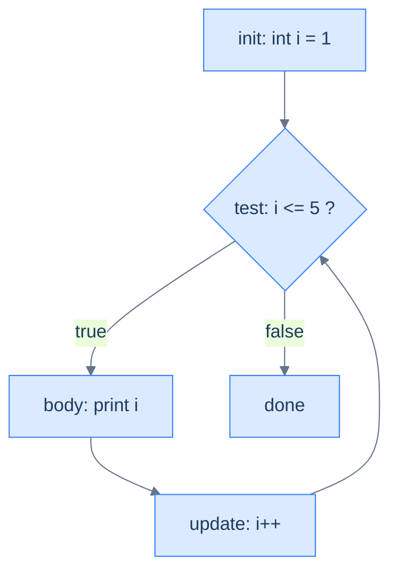

# Loops — Repeating Work

Computers are good at doing the same thing many times, and a **loop** is how you ask for that: repeat a block of code while a `boolean` condition stays true. Java gives you four loop shapes, and they differ only in *when* the condition is checked and *what* drives the repetition. `while` checks before each pass; `do-while` checks after; the classic `for` bundles a counter's setup, test, and step onto one line; and the enhanced `for` walks a collection of values directly. Master the counter and the boundary, and every loop you meet is a variation on these.

This rests on [boolean conditions](/synapse/programming-languages/java/control-flow/booleans-and-logic) — the same `<`, `==`, `&&` that drive an `if` drive a loop. Every output below was produced by compiling and running the code.

> **How to read the Intuition boxes.** Each one is built in three moves: (1) the **mechanism** — what the compiler and the JVM are *actually doing*; (2) a **concrete bite** — a specific, runnable failure (often a real compiler error), shown so the trap is visible; (3) the **earned rule** — the decision heuristic, now justified rather than asserted, plus its cost.

---

## Table of contents

1. [`while`: test before each pass](#1-while-test-before-each-pass)
2. [`do-while`: test after each pass](#2-do-while-test-after-each-pass)
3. [The classic `for`](#3-the-classic-for)
4. [The enhanced `for` (for-each)](#4-the-enhanced-for-for-each)
5. [Mental-model summary](#5-mental-model-summary)
6. [Gotcha checklist](#6-gotcha-checklist)

---

## 1. `while`: test before each pass

A `while` loop checks its condition, and if it is `true`, runs the body — then checks again, and again, until the condition becomes `false`. Something inside the body must move toward that end, or the loop never stops.

```java run
public class Main {
    public static void main(String[] args) {
        int i = 0;
        while (i < 5) {
            System.out.print(i + " ");
            i++;
        }
        System.out.println();
    }
}
```

**Output:**
```
0 1 2 3 4 
```

**Analysis.** `i` starts at `0`. The loop printed `0`, incremented to `1`, checked `1 < 5` (true), and so on — printing `0 1 2 3 4`. When `i` reached `5`, the test `5 < 5` was `false`, so the loop stopped *before* printing `5`. The `i++` is what advanced the counter toward the exit.

**Intuition.**
*Mechanism.* `while (cond)` evaluates `cond` *before* each pass; the body runs only while it is true. If the body never changes what `cond` depends on, the condition stays true forever — an infinite loop.

*Concrete bite.* The boundary is where loops go wrong. Change `<` to `<=` and the loop runs one extra time:

```java run
public class Main {
    public static void main(String[] args) {
        int i = 0;
        while (i <= 5) {
            System.out.print(i + " ");
            i++;
        }
        System.out.println();
    }
}
```

**Output:**
```
0 1 2 3 4 5 
```

The same loop with `<=` prints `0` through `5` — six numbers, not five. "Count five things starting at zero" means `i < 5` (indices `0..4`); `i <= 5` is the off-by-one that does one too many.

*Earned rule.* Write the condition so the body advances toward making it false, and pin down the boundary deliberately: `i < n` counts `n` times from `0`. The cost of a loose boundary is an off-by-one — one too many or too few passes — and the cost of *no* advance is an infinite loop, the one bug that doesn't produce wrong output, just a program that never returns.

---

## 2. `do-while`: test after each pass

A `do-while` runs the body **first**, then checks the condition — so the body always executes at least once, even if the condition is false from the start.

```java run
public class Main {
    public static void main(String[] args) {
        int n = 10;
        while (n < 5) { System.out.println("while body"); n++; }
        System.out.println("while done");

        int m = 10;
        do { System.out.println("do body"); m++; } while (m < 5);
        System.out.println("do done");
    }
}
```

**Output:**
```
while done
do body
do done
```

**Analysis.** Both loops start with their variable at `10` and a condition `< 5` that is already false. The `while` checked first, found `10 < 5` false, and ran its body **zero** times — `while body` never printed. The `do-while` ran its body **once** before checking, so `do body` printed, then `11 < 5` was false and it stopped.

**Intuition.**
*Mechanism.* The only difference is the order of test and body: `while` is test-then-body (zero or more passes); `do-while` is body-then-test (one or more passes). The `do-while` guarantees the body runs at least once.

*Concrete bite.* The output above is the demonstration: identical conditions, but `while body` is absent and `do body` is present. When the starting condition is false, the two loops disagree on whether the body runs at all.

*Earned rule.* Use `do-while` only when the body *must* run once before any test makes sense — prompting for input you then validate, for instance. The cost of reaching for it by habit is a body that runs even when it shouldn't; `while` (or `for`) is the right default, because most loops should be able to run zero times.

---

## 3. The classic `for`

Counting loops have three moving parts — a starting value, a continue-condition, and a step — and the `for` loop puts all three on one line: `for (init; test; update)`. It is the same logic as the `while` in §1, gathered in one place.

```java run
public class Main {
    public static void main(String[] args) {
        for (int i = 1; i <= 5; i++) {
            System.out.print(i + " ");
        }
        System.out.println();
    }
}
```

**Output:**
```
1 2 3 4 5 
```



**Analysis.** `int i = 1` ran once at the start. Then the cycle: test `i <= 5`; if true, run the body; then `i++`; then test again. This time the boundary is `<= 5` *because* the count starts at `1` — printing `1 2 3 4 5`. The init/test/update sit together, which makes the loop's intent easy to read at a glance.

**Intuition.**
*Mechanism.* The `init` runs once; then `test`, `body`, `update`, `test`, … until `test` is false. The loop variable declared in `init` lives **only inside the loop** — its scope is the `for` and its body, nothing after.

*Concrete bite.* Use the loop variable after the loop and the compiler can't find it:

```java run
public class Main {
    public static void main(String[] args) {
        for (int i = 0; i < 3; i++) {
            System.out.println(i);
        }
        System.out.println(i);
    }
}
```

**Compiler error:**
```
Main.java:6: error: cannot find symbol
        System.out.println(i);
                           ^
  symbol:   variable i
  location: class Main
1 error
```

`i` exists only within the `for`; after the closing brace it is gone, so referencing it is a compile error. (If you need the final value afterward, declare the variable *before* the loop instead.)

*Earned rule.* Use a `for` when you know the counting structure up front — a fixed range, a step — and let its declared variable stay scoped to the loop. The cost of that tidy scoping is that the counter vanishes at the loop's end; the benefit is that you cannot accidentally read a stale loop counter later, and two adjacent loops can both use `i` without colliding.

---

## 4. The enhanced `for` (for-each)

When you simply want *each element* of a collection, the enhanced `for` — read `for (T x : items)` as "for each `x` in `items`" — hands you the elements one at a time, with no counter and no index to manage. Here we iterate an **array**, a fixed list of values (arrays get their full treatment in [Tutorial 10](/synapse/programming-languages/java/control-flow/arrays); for now, just read it as "a list of numbers"):

```java run
public class Main {
    public static void main(String[] args) {
        int[] nums = {2, 4, 6};
        int sum = 0;
        for (int n : nums) {
            sum += n;
        }
        System.out.println(sum);
    }
}
```

**Output:**
```
12
```

**Analysis.** The loop ran once per element: `n` was `2`, then `4`, then `6`, adding each to `sum` (`0 → 2 → 6 → 12`). No index, no boundary to get wrong — the loop visits every element exactly once and stops. This is the safest loop when "every element, in order" is all you need.

**Intuition.**
*Mechanism.* Each pass copies the next element into the loop variable. That variable is a **copy** of the element, not the slot it came from — so assigning to it changes the copy, never the array.

*Concrete bite.* Trying to modify elements through the loop variable does nothing:

```java run
public class Main {
    public static void main(String[] args) {
        int[] nums = {1, 2, 3};
        for (int n : nums) {
            n = n * 10;   // changes the copy, not the array
        }
        int sum = 0;
        for (int n : nums) {
            sum += n;
        }
        System.out.println(sum);
    }
}
```

**Output:**
```
6
```

The first loop "multiplied each element by 10," yet the second loop sums to `6` (`1 + 2 + 3`), not `60` — proof the array was never touched. `n = n * 10` updated a throwaway copy each pass.

*Earned rule.* Reach for the enhanced `for` whenever you need each element and nothing more — it removes the index, and with it the off-by-one bugs. The cost is exactly what it hides: you get no index (so you cannot say "the 3rd element" or compare neighbours) and you cannot write *back* into the array through the loop variable. When you need the position or want to modify elements in place, use the classic `for` with `nums[i]`.

---

## 5. Mental-model summary

| Principle | Consequence |
|---|---|
| `while` tests before the body | It can run zero times; the body must advance toward the exit, or it loops forever |
| `do-while` tests after the body | It always runs at least once, even when the condition starts false |
| `for` bundles init/test/update; its variable is loop-scoped | Tidy counting in one line; the counter doesn't exist after the loop |
| The boundary (`<` vs `<=`) sets the count | `i < n` from `0` runs `n` times; `<=` is the classic off-by-one |
| The enhanced `for` gives each element as a copy | No index, and assigning to the loop variable doesn't change the array |

## 6. Gotcha checklist

- **The loop runs one too many / too few times →** off-by-one at the boundary; `i < n` from `0` counts `n` times.
- **The program hangs and prints nothing →** an infinite loop; the body never changes what the condition depends on. Ensure the counter advances.
- **`cannot find symbol` using the counter after the loop →** a `for`-declared variable is scoped to the loop; declare it before the loop if you need it afterward.
- **A loop body that should sometimes be skipped always runs once →** you used `do-while`; switch to `while`/`for` so zero passes is possible.
- **Modifying elements in a for-each has no effect →** the loop variable is a copy; use the classic `for` with `nums[i]` to write back.

---

*Predict, then check.* Predict the exact output of `for (int i = 10; i > 0; i -= 2) System.out.print(i + " ");` — how many numbers, and which? Now predict how many times each loop body runs when the variable starts at `3` and the condition is `< 3`: a `while`, then a `do-while`. Finally, rewrite the §1 `while` (printing `0 1 2 3 4`) as a `for` loop, and confirm it prints the same line.

## Your Turn

Before you move on, check your understanding with the coach — explain the idea, apply it, weigh the trade-offs, then defend your reasoning.

<div class="concept-coach"></div>
