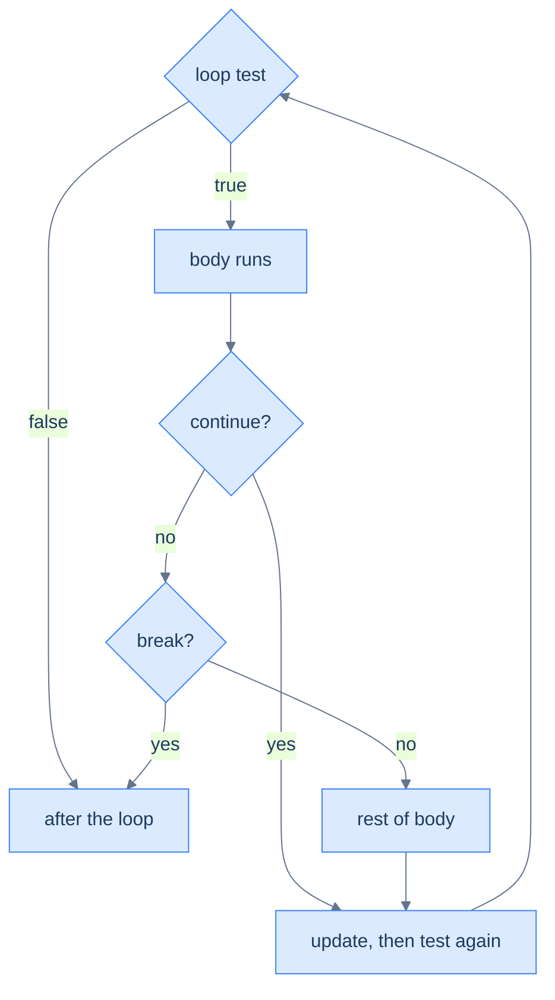

# Loop Control & Patterns — Steering the Repetition

A plain loop runs its body start to finish, every pass. Real loops need to *steer*: stop as soon as you've found what you're looking for, skip the passes that don't apply, or break out of a nested search entirely. Java gives you three controls — `break` (leave the loop now), `continue` (skip to the next pass), and the **labeled** `break` (leave an *outer* loop) — and one quiet rule governs all of them: each affects only the **innermost** loop unless you name another. On top of these sit the handful of **accumulation patterns** — sum, count, max, "found it?" — that almost every loop turns out to be.

This builds on [loops](/synapse/programming-languages/java/control-flow/loops) and the [boolean conditions](/synapse/programming-languages/java/control-flow/booleans-and-logic) that gate them. Every output below was produced by compiling and running the code.

> **How to read the Intuition boxes.** Each one is built in three moves: (1) the **mechanism** — what the compiler and the JVM are *actually doing*; (2) a **concrete bite** — a specific, runnable failure (often a real compiler error), shown so the trap is visible; (3) the **earned rule** — the decision heuristic, now justified rather than asserted, plus its cost.

---

## Table of contents

1. [`break`: leave the loop now](#1-break-leave-the-loop-now)
2. [`continue`: skip to the next pass](#2-continue-skip-to-the-next-pass)
3. [Labeled `break`: escape nested loops](#3-labeled-break-escape-nested-loops)
4. [Accumulation patterns](#4-accumulation-patterns)
5. [Mental-model summary](#5-mental-model-summary)
6. [Gotcha checklist](#6-gotcha-checklist)

---

## 1. `break`: leave the loop now

`break` stops a loop immediately and jumps to the code after it. It is how you search: scan until you find a match, then stop — there is no point continuing.

```java run
public class Main {
    public static void main(String[] args) {
        int found = -1;
        for (int i = 21; i < 100; i++) {
            if (i % 7 == 0) {
                found = i;
                break;
            }
        }
        System.out.println(found);
    }
}
```

**Output:**
```
21
```

**Analysis.** The loop checked `21` first; `21 % 7 == 0` is true, so it stored `21` in `found` and `break` ended the loop on the spot — it never tested `22`, `23`, or any later number. `break` turns "look at everything" into "look until you find it."

**Intuition.**
*Mechanism.* `break` exits the **single loop that encloses it** — the innermost one — and only that loop. It does not exit the method, and in nested loops it does not exit the outer loop.

*Concrete bite.* Put a `break` in an inner loop and the outer loop keeps right on going:

```java run
public class Main {
    public static void main(String[] args) {
        for (int i = 1; i <= 3; i++) {
            for (int j = 1; j <= 3; j++) {
                if (j == 2) break;
                System.out.println(i + "," + j);
            }
        }
    }
}
```

**Output:**
```
1,1
2,1
3,1
```

For each `i`, the inner loop printed `j = 1`, then hit `break` at `j == 2` — but that `break` only ended the *inner* loop. The outer loop dutifully moved to the next `i` and started a fresh inner loop, three times over. `break` stopped the inner search, not the whole thing.

*Earned rule.* Use `break` to stop a scan the moment its job is done; just remember it leaves only the innermost loop. The cost of that scoping is that a `break` meant to abandon a *nested* search stops only the inner loop and silently lets the outer one continue — which is exactly what the labeled `break` in §3 fixes.

---

## 2. `continue`: skip to the next pass

`continue` abandons the *rest of the current pass* and jumps straight to the loop's next step — the update and test. It is how you filter: skip the elements that don't qualify, keep looping for the ones that do.

```java run
public class Main {
    public static void main(String[] args) {
        for (int i = 0; i < 5; i++) {
            if (i == 2) continue;
            System.out.print(i + " ");
        }
        System.out.println();
    }
}
```

**Output:**
```
0 1 3 4 
```



**Analysis.** When `i` was `2`, `continue` skipped the `print` and went to the next pass — so `2` is missing, but the loop did **not** stop: it printed `3` and `4` afterward. The diagram shows why: `continue` routes back to the update/test, while `break` routes out of the loop entirely.

**Intuition.**
*Mechanism.* `continue` jumps over everything *below* it in the body and proceeds to the loop's update-and-test. In a `for`, that update (`i++`) still runs — so the loop always advances. In a `while`, the increment is part of the body, so a `continue` placed *before* it skips it.

*Concrete bite.* The "rest of the body is skipped" is the whole behavior — the lines after `continue` run only on passes that don't `continue`:

```java run
public class Main {
    public static void main(String[] args) {
        for (int i = 0; i < 4; i++) {
            System.out.println("checking " + i);
            if (i % 2 == 0) continue;
            System.out.println("  " + i + " is odd");
        }
    }
}
```

**Output:**
```
checking 0
checking 1
  1 is odd
checking 2
checking 3
  3 is odd
```

`checking i` prints every pass (it is *above* the `continue`); `i is odd` prints only for odd `i`, because for even `i` the `continue` skipped it. The `continue` cut the body short without ending the loop.

*Earned rule.* Use `continue` to skip the passes that don't apply and keep the body flat instead of wrapping it all in an `if`. The cost is the `for`-vs-`while` asymmetry: a `for` always runs its update, but a `while` whose increment sits below a `continue` will skip the increment and spin forever — so in a `while`, advance the counter *before* any `continue`.

---

## 3. Labeled `break`: escape nested loops

When a `break` needs to leave more than the innermost loop, give the outer loop a **label** — a name followed by `:` — and write `break label`. That exits the named loop and everything inside it.

```java run
public class Main {
    public static void main(String[] args) {
        outer:
        for (int i = 1; i <= 3; i++) {
            for (int j = 1; j <= 3; j++) {
                if (i * j == 4) {
                    System.out.println("stop at " + i + "," + j);
                    break outer;
                }
                System.out.println(i + "," + j);
            }
        }
        System.out.println("done");
    }
}
```

**Output:**
```
1,1
1,2
1,3
2,1
stop at 2,2
done
```

**Analysis.** The loops ran until `i * j == 4` (at `i = 2, j = 2`), then `break outer` left **both** loops at once — execution jumped past the outer loop to `done`. A plain `break` there would have ended only the inner loop and let the outer one continue to `i = 3`; the label is what made it abandon the whole nested search.

**Intuition.**
*Mechanism.* A label names a statement; `break label` exits *that* statement. The label must sit on an **enclosing** loop — you cannot break to a label that isn't above you in the nesting.

*Concrete bite.* Reference a label that doesn't enclose the `break` and it won't compile:

```java run
public class Main {
    public static void main(String[] args) {
        outer:
        for (int i = 0; i < 2; i++) {
            for (int j = 0; j < 2; j++) {
                break inner;
            }
        }
    }
}
```

**Compiler error:**
```
Main.java:6: error: undefined label: inner
                break inner;
                ^
1 error
```

There is no label `inner` on any enclosing loop (the only label is `outer`), so the compiler rejects it. Labels are checked at compile time, so a mistyped one is caught immediately.

*Earned rule.* Reach for a labeled `break` only to escape genuinely nested loops in one move; name the label for what it leaves (`search:`, `outer:`). The cost is that labels are rare enough to surprise the next reader, and overusing them recreates the tangled "goto" control flow structured loops were meant to replace — so prefer extracting the nested search into its own method (Tutorial 11) and `return`ing from it once that tool is available.

---

## 4. Accumulation patterns

Most loops are one of a few shapes: build up a **sum**, keep a **count**, track a running **max** or **min**, or set a **flag** when something is found. The skeleton is always the same — initialize an accumulator before the loop, update it each pass.

```java run viz=array:data
public class Main {
    public static void main(String[] args) {
        int[] data = {4, 8, 15, 16, 23, 42};
        int sum = 0, count = 0, max = Integer.MIN_VALUE;
        for (int x : data) {
            sum += x;
            count++;
            if (x > max) max = x;
        }
        System.out.println("sum=" + sum + " count=" + count + " max=" + max);
    }
}
```

**Output:**
```
sum=108 count=6 max=42
```

**Analysis.** Three accumulators, one pass: `sum` adds each value (ending at `108`), `count` ticks up once per element (`6`), and `max` keeps the largest seen so far (`42`). Each starts at a value that is correct for "nothing seen yet": `sum` and `count` at `0`, and `max` at `Integer.MIN_VALUE` so the very first element is guaranteed to beat it.

**Intuition.**
*Mechanism.* An accumulator's **initial value** must be the right answer for an empty sequence: `0` adds nothing to a sum, and the smallest possible `int` loses to any real value in a `max`. The loop then folds each element into that running result.

*Concrete bite.* Initialize a `max` to `0` and any all-negative data defeats it:

```java run viz=array:temps
public class Main {
    public static void main(String[] args) {
        int[] temps = {-5, -2, -9, -1};
        int max = 0;
        for (int t : temps) {
            if (t > max) max = t;
        }
        System.out.println(max);
    }
}
```

**Output:**
```
0
```

The real maximum is `-1`, but `0` was never in the data — it was a bad starting value that no negative element could beat, so the loop reported `0`, a value that isn't even in `temps`. The logic is right; the *seed* was wrong.

*Earned rule.* Seed an accumulator with the identity for its operation — `0` for a sum, `Integer.MIN_VALUE` (or the first element) for a max, `Integer.MAX_VALUE` for a min — never a "convenient" `0` that happens to be a valid value. The cost of a wrong seed is a silent wrong answer that survives every test using positive data and only breaks on the negative (or empty) case you forgot.

---

## 5. Mental-model summary

| Principle | Consequence |
|---|---|
| `break` leaves the innermost loop and jumps past it | A `break` in a nested loop stops only the inner one; the outer keeps going |
| `continue` skips the rest of the body, then updates and tests | In a `for` the update still runs; in a `while`, advance before any `continue` |
| A labeled `break` leaves the named enclosing loop | The one move that escapes nested loops; an undefined label won't compile |
| Loops are accumulation: init before, update each pass | Sum/count/max/flag are the recurring shapes |
| The accumulator's seed must be correct for "nothing seen" | `max = 0` breaks on all-negative data; seed with `Integer.MIN_VALUE` |

## 6. Gotcha checklist

- **A nested search keeps running after a match →** a plain `break` left only the inner loop; use a labeled `break` (or extract a method and `return`).
- **A `while` with `continue` hangs →** the increment sits below the `continue` and gets skipped; advance the counter before any `continue`.
- **`undefined label` →** the label isn't on an enclosing loop (typo or wrong scope); label the actual outer loop.
- **A max/min comes back as `0` (or a value not in the data) →** the accumulator was seeded with `0`; use `Integer.MIN_VALUE`/`MAX_VALUE` or the first element.
- **`continue` skipped a line you expected to run →** code below `continue` runs only on passes that don't continue; move it above, or invert the condition.

---

*Predict, then check.* Predict the output of this nested loop with a plain `break`, then with `break outer` instead: `for i in 1..2 { for j in 1..2 { if (i+j == 3) break; print(i,j); } }`. Next, predict what `for (int i = 0; i < 6; i++) { if (i % 3 != 0) continue; System.out.print(i + " "); }` prints. Finally, write a loop that finds the **minimum** of `{7, 3, 9, 2, 8}` — and decide what to seed the accumulator with so it would still be correct for all-negative data.

## Your Turn

Before you move on, check your understanding with the coach — explain the idea, apply it, weigh the trade-offs, then defend your reasoning.

<div class="concept-coach"></div>
