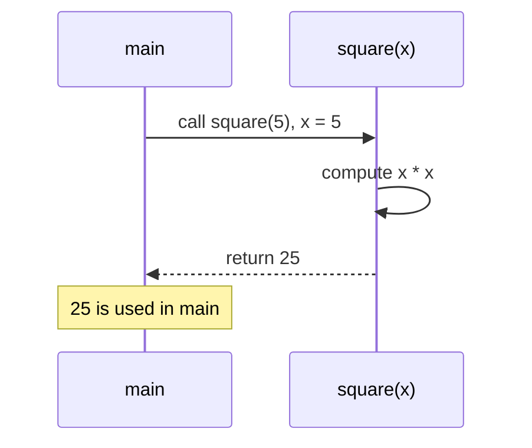

# Methods — Named, Reusable Blocks

You have been writing one method since the first chapter — `main`. A **method** is a named block of code with typed **parameters** (its inputs) and a **return type** (its output); calling it runs that block with the arguments you supply and hands back a result. Methods are how programs avoid repetition and how they are built from small, testable pieces. One rule governs every call and surprises nearly everyone: Java passes arguments **by value** — the method works on *copies* — and that single fact, applied to object references, explains the difference between a method that can change your data and one that cannot.

This pulls together [conditionals](/synapse/programming-languages/java/control-flow/conditionals) and [arrays](/synapse/programming-languages/java/control-flow/arrays) from this tier. Every output below was produced by compiling and running the code.

> **How to read the Intuition boxes.** Each one is built in three moves: (1) the **mechanism** — what the compiler and the JVM are *actually doing*; (2) a **concrete bite** — a specific, runnable failure (often a real compiler error), shown so the trap is visible; (3) the **earned rule** — the decision heuristic, now justified rather than asserted, plus its cost.

---

## Table of contents

1. [Defining and calling a method](#1-defining-and-calling-a-method)
2. [`void` and early `return`](#2-void-and-early-return)
3. [Overloading: one name, several signatures](#3-overloading-one-name-several-signatures)
4. [Pass-by-value: primitives](#4-pass-by-value-primitives)
5. [Pass-by-value: object references](#5-pass-by-value-object-references)
6. [Mental-model summary](#6-mental-model-summary)
7. [Gotcha checklist](#7-gotcha-checklist)

---

## 1. Defining and calling a method

A method declares a return type, a name, and a parenthesized list of typed parameters, then a body. `return` hands a value of the declared type back to the caller. Here `square` takes an `int` and returns an `int`:

```java run
public class Main {
    static int square(int x) {
        return x * x;
    }

    public static void main(String[] args) {
        System.out.println(square(5));
        System.out.println(square(square(2)));
    }
}
```

**Output:**
```
25
16
```



**Analysis.** `square(5)` ran the body with `x` bound to `5`, returned `25`, and `println` showed it. `square(square(2))` evaluated inside-out: `square(2)` returned `4`, which became the argument to the outer call, returning `16`. The `static` keyword (which `main` also has) means the method belongs to the class itself — enough for now; Tutorial 14 gives `static` its full treatment once objects exist.

**Intuition.**
*Mechanism.* A call suspends the caller, binds each argument to the matching parameter, runs the body until a `return`, then resumes the caller with the returned value substituted in. Parameters are ordinary local variables that exist only for that one call.

*Concrete bite.* A method that declares a non-`void` return type must return a value on every path, or it does not compile — the compiler proves you always return:

```java run
public class Main {
    static int sign(int x) {
        if (x > 0) return 1;
        if (x < 0) return -1;
    }

    public static void main(String[] args) {
        System.out.println(sign(5));
    }
}
```

**Compiler error:**
```
Main.java:5: error: missing return statement
    }
    ^
1 error
```

When `x` is `0`, neither `if` returns, so there is a path with no value to hand back — a compile error, not a run-time surprise. Adding a final `return 0;` makes every path return.

*Earned rule.* Give each method one clear job, name it for that job, and make sure every path through a value-returning method ends in a `return`. The cost of the compiler's insistence is that you must handle the cases you'd rather ignore (what *is* the sign of `0`?); the benefit is that "this method forgot to return" cannot reach run time.

---

## 2. `void` and early `return`

A method that does something but produces no value declares the return type `void`. Inside any method, a bare `return;` exits early — useful for handling a special case up front and skipping the rest.

```java run
public class Main {
    static void greet(String name) {
        if (name.length() == 0) {
            System.out.println("(no name)");
            return;
        }
        System.out.println("Hello, " + name);
    }

    public static void main(String[] args) {
        greet("Ada");
        greet("");
    }
}
```

**Output:**
```
Hello, Ada
(no name)
```

**Analysis.** `greet("Ada")` skipped the early-exit branch and printed the greeting. `greet("")` found an empty name, printed `(no name)`, and `return;` ended the method right there — the greeting line never ran. A `void` method returns nothing, so `return;` carries no value; it just stops.

**Intuition.**
*Mechanism.* `void` means "no result," so calling a `void` method is a statement, not an expression — there is nothing to assign. A `return;` in any method ends it immediately; `return value;` ends it *and* supplies the result.

*Concrete bite.* Because a `void` call has no value, trying to use it as one fails to compile: `String s = greet("Ada");` would be rejected — `greet` returns nothing to put in `s`. (You met the same idea with the ternary-vs-`if` distinction in [Tutorial 7](/synapse/programming-languages/java/control-flow/conditionals): a thing that performs an action has no value to capture.)

*Earned rule.* Use `void` for methods that act (print, mutate, send) and a real return type for methods that compute; reach for an early `return` to handle edge cases first and keep the main logic unindented. The cost of early returns is that many scattered ones can obscure a method's flow — a guard or two at the top is clear, but a dozen sprinkled throughout is harder to follow than a single structured path.

---

## 3. Overloading: one name, several signatures

Java lets several methods share a name as long as their **parameter lists** differ — different types, or a different number of parameters. This is **overloading**; the compiler picks the right one from the argument types at the call site.

```java run
public class Main {
    static int triple(int x) { return x * 3; }
    static double triple(double x) { return x * 3; }
    static String triple(String s) { return s + s + s; }

    public static void main(String[] args) {
        System.out.println(triple(5));
        System.out.println(triple(2.5));
        System.out.println(triple("ab"));
    }
}
```

**Output:**
```
15
7.5
ababab
```

**Analysis.** Three methods named `triple`, distinguished by parameter type. `triple(5)` matched the `int` version (`15`), `triple(2.5)` the `double` version (`7.5`), and `triple("ab")` the `String` version (`ababab`). The compiler chose each based on the argument's type — the name alone is not enough to identify a method.

**Intuition.**
*Mechanism.* A method is identified by its **signature** — name plus parameter types — not by its return type. The compiler resolves an overloaded call by matching the argument types to a signature, entirely at compile time.

*Concrete bite.* Because the return type is *not* part of the signature, two methods that differ only by return type are a duplicate definition:

```java run
public class Main {
    static int f() { return 1; }
    static double f() { return 2.0; }

    public static void main(String[] args) {
        System.out.println(f());
    }
}
```

**Compiler error:**
```
Main.java:3: error: method f() is already defined in class Main
    static double f() { return 2.0; }
                  ^
1 error
```

Both are `f()` with no parameters — identical signatures — so the second is "already defined." Changing the return type doesn't make a new method; only a different parameter list does.

*Earned rule.* Overload a name only when the methods do the *same conceptual thing* to different input types (`print(int)`, `print(String)`); distinguish them by parameter list, never by return type alone. The cost of overloading is resolution surprises — with mixed argument types the compiler may pick an overload you didn't expect, or refuse an ambiguous call — so keep overloads few and their parameter types clearly distinct.

---

## 4. Pass-by-value: primitives

When you call a method, each argument is **copied** into the parameter. For a primitive, that means the method gets its own copy of the number, and changing the parameter cannot touch the caller's variable.

```java run
public class Main {
    static void addOne(int n) {
        n = n + 1;
        System.out.println("inside: " + n);
    }

    public static void main(String[] args) {
        int x = 5;
        addOne(x);
        System.out.println("outside: " + x);
    }
}
```

**Output:**
```
inside: 6
outside: 5
```

**Analysis.** `addOne(x)` copied `x`'s value (`5`) into `n`. Incrementing `n` to `6` changed only that copy — `inside: 6` — while the caller's `x` stayed `5`, as `outside: 5` confirms. The method had no way to reach back and change `x`.

**Intuition.**
*Mechanism.* "Pass-by-value" means the argument's *value* is copied into the parameter. The parameter is a separate variable; assignments to it rewrite the copy, never the original. There is no mechanism in Java to pass a primitive variable so the callee can change it.

*Concrete bite.* The output is the proof: `inside: 6`, `outside: 5`. A method cannot "increment your variable in place" — to reflect a change, it must *return* the new value (`x = addOne(x);`), because returning is the only channel back to the caller.

*Earned rule.* Treat primitive parameters as inputs only; to communicate a result, return it. The cost is that a method cannot have a primitive "out-parameter" the way some languages do — but the benefit is that a call can never secretly alter your local numbers, so reading `addOne(x)` you know `x` is unchanged unless you assign the result.

---

## 5. Pass-by-value: object references

Java is pass-by-value *for object references too* — but the value being copied is the **reference** (the handle to the object), not the object itself. Both the caller's variable and the parameter then point at the **same** object, so the method can **mutate** that shared object — yet reassigning the parameter only repoints its own copy.

```java run viz=array:a
public class Main {
    static void mutate(int[] arr) {
        arr[0] = 99;              // changes the shared array — visible to the caller
    }

    static void reassign(int[] arr) {
        arr = new int[]{7, 8, 9}; // repoints this copy of the reference — caller unaffected
    }

    public static void main(String[] args) {
        int[] a = {1, 2, 3};
        mutate(a);
        System.out.println(a[0]);
        reassign(a);
        System.out.println(a[0]);
    }
}
```

**Output:**
```
99
99
```

**Analysis.** `mutate(a)` received a *copy of the reference* that still points at the same array, so `arr[0] = 99` changed the one shared array — the caller sees `a[0]` as `99`. `reassign(a)` also got a copy of the reference, but `arr = new int[]{…}` pointed *that copy* at a brand-new array; the caller's `a` still points at the original, so `a[0]` is **still** `99`, not `7`. Mutation reached through to the shared object; reassignment did not.

**Intuition.**
*Mechanism.* The reference is copied, so caller and method hold two handles to the *same* object. Following a handle to change the object's contents (`arr[0] = …`) affects what both handles see. Overwriting the handle itself (`arr = …`) changes only that local copy — the caller's handle is untouched. Java is *always* pass-by-value; for objects, the value is the reference.

*Concrete bite.* The two `99`s are the whole lesson: the mutation in `mutate` stuck, the reassignment in `reassign` did not. A method that "replaces your array" by assigning to its parameter silently does nothing to the caller — a real and common bug.

*Earned rule.* Remember that a method can change the *contents* of an object you pass, but cannot change *which* object your variable points to — to hand back a different object, `return` it. The cost of this model is the very confusion shown here ("I reassigned it and nothing happened"); the benefit is one consistent rule — everything is passed by value — and the reference/object distinction it forces you to see is the heart of the object model in Tutorial 15.

---

## 6. Mental-model summary

| Principle | Consequence |
|---|---|
| A method has a signature (name + parameter types) and a return type | Calls bind arguments to parameters, run the body, return a value |
| A value-returning method must return on every path | A branch with no `return` is a `missing return statement` compile error |
| `void` methods act but yield no value | A `void` call is a statement; you can't assign its (non-)result |
| Overloads differ by parameter list, not return type | Two methods differing only by return type are "already defined" |
| Arguments are passed by value — a copy | Changing a primitive parameter never changes the caller's variable |
| For objects, the copied value is the reference | A method can mutate the shared object but can't repoint the caller's variable |

## 7. Gotcha checklist

- **`missing return statement` →** some path through a value-returning method doesn't `return`; add a final `return` or cover every branch.
- **A method "changed" a primitive but the caller didn't see it →** primitives pass by value; return the new value and assign it (`x = f(x)`).
- **A method "replaced" an object by assigning its parameter, with no effect →** that repoints only the copy of the reference; `return` the new object instead.
- **A method *did* change an object you passed →** expected: caller and method share the object; pass a copy if you need to protect the original.
- **`method f() is already defined` →** two methods have the same name and parameters (differing only by return type); change the parameter list or the name.

---

*Predict, then check.* Predict the output of a method `static int[] doubled(int[] in)` that loops `in[i] *= 2` and returns `in`, called as `int[] a = {1,2,3}; doubled(a); System.out.println(a[0]);` — does `a[0]` change, and why? Now predict what `addOne` (from §4) prints for `inside`/`outside` if `x` starts at `0`. Finally, write an overloaded `area(int side)` (square) and `area(int w, int h)` (rectangle), and decide why the compiler can tell them apart.

## Your Turn

Before you move on, check your understanding with the coach — explain the idea, apply it, weigh the trade-offs, then defend your reasoning.

<div class="concept-coach"></div>
