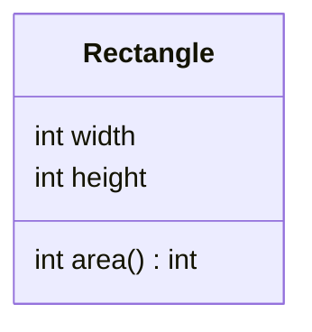

# Classes & Objects — Bundling Data with Behavior

Until now your programs have been free-floating `static` methods passing primitives and arrays around. A **class** changes the unit of organization: it bundles **data** (its *fields*) together with the **operations** on that data (its *methods*) into one named blueprint. From that blueprint, `new` builds **objects** (also called *instances*) — each a self-contained bundle with its own copy of the fields. This is the leap from "code that acts on data" to "data that knows how to act," and it rests on one idea you already met: an object variable holds a *reference*, so two variables can point at the same object.

<div style="border-left:4px solid #195045;background:rgba(25,80,69,0.08);padding:0.6rem 1rem;border-radius:0 0.5rem 0.5rem 0;margin:1.25rem 0">

💡 **The core idea.**

- A **class** bundles **data** (fields) with the **operations** on it (methods) into one blueprint.
- `new` builds **objects** from it, each with its own copy of the fields.
- An object variable holds a **reference**, so two variables can point at the same object.

</div>

This builds directly on [methods](/synapse/programming-languages/java/control-flow/methods) — especially [pass-by-value of references](/synapse/programming-languages/java/control-flow/methods) — and the [arrays](/synapse/programming-languages/java/control-flow/arrays) that were our first objects. Every output below was produced by compiling and running the code.

<div style="border-left:4px solid #15448e;background:rgba(21,68,142,0.08);padding:0.6rem 1rem;border-radius:0 0.5rem 0.5rem 0;margin:1.25rem 0">

📘 **How to read the Intuition boxes.** Each one is built in three moves:

1. **The mechanism** — what the compiler and the JVM are *actually doing*.
2. **A concrete bite** — a specific, runnable failure (often a real compiler error), shown so the trap is visible.
3. **The earned rule** — the decision heuristic, now justified rather than asserted, plus its cost.

</div>

---

## Table of contents

1. [A class bundles fields and methods](#1-a-class-bundles-fields-and-methods)
2. [Constructors: initializing a new object](#2-constructors-initializing-a-new-object)
3. [`this` and per-instance state](#3-this-and-per-instance-state)
4. [Independent instances and aliasing](#4-independent-instances-and-aliasing)
5. [Mental-model summary](#5-mental-model-summary)
6. [Gotcha checklist](#6-gotcha-checklist)

---

## 1. A class bundles fields and methods

A class declares **fields** (the data each object holds) and **methods** (what each object can do). `new ClassName()` builds an object; you reach its fields and methods with a dot.

```java run
class Rectangle {
    int width;
    int height;
    int area() {
        return width * height;
    }
}

public class Main {
    public static void main(String[] args) {
        Rectangle r = new Rectangle();
        r.width = 3;
        r.height = 4;
        System.out.println(r.area());
    }
}
```

**Output:**
```
12
```



**Analysis.** `new Rectangle()` created an object with two `int` fields (each defaulting to `0`). We set `r.width` and `r.height`, then called `r.area()` — and crucially, `area()` read `width` and `height` *without parameters*, because as an **instance method** it operates on the object it was called on. The data and the operation live together. (Fields are public to this file for now; Tutorial 13 adds the access control that usually hides them.)

**Intuition.**
*Mechanism.* An instance method has an implicit, invisible receiver — the object before the dot — and its unqualified field names (`width`, `height`) refer to *that object's* fields. A `static` method (like `main`) has no such receiver; it belongs to the class, not to any object.

*Concrete bite.* So an instance method cannot be called without an object — there is no implicit receiver to supply the fields:

```java run
class Rectangle {
    int width, height;
    int area() { return width * height; }
}

public class Main {
    public static void main(String[] args) {
        System.out.println(Rectangle.area());
    }
}
```

**Compiler error:**
```
Main.java:7: error: non-static method area() cannot be referenced from a static context
        System.out.println(Rectangle.area());
                                    ^
1 error
```

`Rectangle.area()` tries to call `area` on the *class* — but `area` needs an *object*'s `width` and `height`, and there isn't one. Instance methods require an instance; that's the difference between `r.area()` (an object) and `Rectangle.area()` (the class).

<div style="border-left:4px solid #195045;background:rgba(25,80,69,0.08);padding:0.6rem 1rem;border-radius:0 0.5rem 0.5rem 0;margin:1.25rem 0">

💡 **Earned rule.** Group a piece of data with the methods that operate on it into a class, and call instance methods through an object (`r.area()`). The cost of this bundling is the ceremony of creating objects before you can use their behavior; the benefit is that an object carries its own data, so a method never has to be handed the state it works on — it already has it.

</div>

---

## 2. Constructors: initializing a new object

Setting fields one by one after `new` is verbose and easy to forget. A **constructor** — a special method with the class's name and no return type — runs at creation time to initialize the object, so you can build it fully formed in one step.

```java run
class Rectangle {
    int width;
    int height;
    Rectangle(int w, int h) {
        width = w;
        height = h;
    }
    int area() { return width * height; }
}

public class Main {
    public static void main(String[] args) {
        Rectangle r = new Rectangle(3, 4);
        System.out.println(r.area());
    }
}
```

**Output:**
```
12
```

**Analysis.** `new Rectangle(3, 4)` called the constructor with `w = 3` and `h = 4`, which set the fields before the object was handed back — so `r` arrives ready to use. A constructor has no return type (not even `void`); its job is to initialize, and `new` is what returns the object.

**Intuition.**
*Mechanism.* If you write **no** constructor, Java supplies a hidden no-argument one that sets fields to their defaults — that is why `new Rectangle()` worked in §1. The moment you declare *any* constructor, that free no-arg constructor is **no longer provided**.

*Concrete bite.* So adding a constructor that takes arguments removes the ability to call `new Rectangle()`:

```java run
class Rectangle {
    int width, height;
    Rectangle(int w, int h) { width = w; height = h; }
}

public class Main {
    public static void main(String[] args) {
        Rectangle r = new Rectangle();
        System.out.println(r.width);
    }
}
```

**Compiler error:**
```
Main.java:7: error: constructor Rectangle in class Rectangle cannot be applied to given types;
        Rectangle r = new Rectangle();
                      ^
  required: int,int
```

Once `Rectangle(int, int)` exists, the implicit no-arg constructor is gone, so `new Rectangle()` (no arguments) has nothing to match. If you want both, declare both — Java lets you overload constructors exactly like methods.

<div style="border-left:4px solid #195045;background:rgba(25,80,69,0.08);padding:0.6rem 1rem;border-radius:0 0.5rem 0.5rem 0;margin:1.25rem 0">

💡 **Earned rule.** Use a constructor to guarantee every new object starts in a valid state, with its required fields supplied at creation. The cost is that defining one constructor removes the free no-arg one — so if some callers still need `new T()`, you must declare that no-arg constructor yourself; the benefit is that "an object with `width` set but `height` forgotten" becomes impossible to create.

</div>

---

## 3. `this` and per-instance state

Constructor parameters often want the same names as the fields they set (`width`, `height`). When a parameter and a field share a name, the parameter **shadows** the field, and `this.field` is how you say "the field of the current object," not the parameter.

```java run
class Rectangle {
    int width, height;
    Rectangle(int width, int height) {
        this.width = width;     // this.width = the field; width = the parameter
        this.height = height;
    }
    int area() { return width * height; }
}

public class Main {
    public static void main(String[] args) {
        Rectangle r = new Rectangle(3, 4);
        System.out.println(r.area());
    }
}
```

**Output:**
```
12
```

**Analysis.** Inside the constructor, the parameters are also named `width` and `height`, so a bare `width` means the *parameter*. `this.width` reaches past the parameter to the object's field, and `this.width = width` copies parameter into field. `this` is the current object — the one being constructed here, the one a method was called on elsewhere.

**Intuition.**
*Mechanism.* `this` is an implicit reference to the receiver object. When a local variable or parameter shares a field's name, the nearer (local) name wins for an unqualified mention; `this.name` explicitly selects the field.

*Concrete bite.* Forget the `this.` and the assignment quietly does nothing useful — it assigns the parameter to itself, leaving the field at its default:

```java run
class Rectangle {
    int width, height;
    Rectangle(int width, int height) {
        width = width;
        height = height;
    }
    int area() { return width * height; }
}

public class Main {
    public static void main(String[] args) {
        Rectangle r = new Rectangle(3, 4);
        System.out.println(r.area());
    }
}
```

**Output:**
```
0
```

`width = width` reads the parameter and assigns it right back to the parameter — the *field* `width` is never touched, so it keeps its default `0`. With both fields still `0`, `area()` returns `0`, not `12`. The code compiled, ran, and gave a confidently wrong answer.

<div style="border-left:4px solid #195045;background:rgba(25,80,69,0.08);padding:0.6rem 1rem;border-radius:0 0.5rem 0.5rem 0;margin:1.25rem 0">

💡 **Earned rule.** When a parameter shadows a field, qualify the field with `this.` — `this.width = width`. The cost of the shadowing convention (reusing the field's name for the parameter) is exactly this trap, a self-assignment that silently leaves fields at their defaults; many compilers and IDEs warn about it, but the language allows it, so make `this.` a habit in constructors and setters.

</div>

---

## 4. Independent instances and aliasing

Every `new` produces a **separate** object with its own fields. Two objects of the same class share their *class* (the blueprint and its methods) but never their *state*.

```java run
class Counter {
    int count;
    void increment() { count++; }
}

public class Main {
    public static void main(String[] args) {
        Counter a = new Counter();
        Counter b = new Counter();
        a.increment();
        a.increment();
        b.increment();
        System.out.println("a=" + a.count + " b=" + b.count);
    }
}
```

**Output:**
```
a=2 b=1
```

```d2
direction: right

a: "a : Counter\ncount = 2" {
  shape: rectangle
}
b: "b : Counter\ncount = 1" {
  shape: rectangle
}
cls: "class Counter\nfield: count\nmethod: increment()" {
  shape: package
}

a -> cls: "instance of"
b -> cls: "instance of"
```

**Analysis.** `a` and `b` are two distinct `Counter` objects. Incrementing `a` twice and `b` once left `a.count` at `2` and `b.count` at `1` — they never interfered, because each holds its own `count`. The diagram shows the relationship: two separate instance objects, both described by the one `Counter` class.

**Intuition.**
*Mechanism.* `new` allocates a fresh object with its own fields. An object variable holds a **reference** to one such object — and assigning one object variable to another (`b = a`) copies the *reference*, not the object, so both names point at the **same** object.

*Concrete bite.* That is **aliasing**: two variables, one object. Changes through either are visible through both:

```java run
class Counter {
    int count;
    void increment() { count++; }
}

public class Main {
    public static void main(String[] args) {
        Counter a = new Counter();
        Counter c = a;
        a.increment();
        c.increment();
        System.out.println(a.count);
    }
}
```

**Output:**
```
2
```

`Counter c = a` did **not** make a second counter — it made `c` another name for `a`'s object. So `a.increment()` and `c.increment()` both ticked the *same* `count`, ending at `2`. To get a genuinely separate counter you must `new` one; `=` between object variables only copies the handle.

<div style="border-left:4px solid #195045;background:rgba(25,80,69,0.08);padding:0.6rem 1rem;border-radius:0 0.5rem 0.5rem 0;margin:1.25rem 0">

💡 **Earned rule.** Reach for `new` whenever you need a distinct object; remember that assigning object variables aliases them rather than copying the object. The cost of references is exactly this aliasing surprise — "I changed `c` and `a` changed too" — which is the same pass-by-value-of-a-reference effect from the last chapter, and the doorway to the full stack/heap object model in Tutorial 15.

</div>

---

## 5. Mental-model summary

| Principle | Consequence |
|---|---|
| A class bundles fields (data) with methods (behavior) | An instance method operates on its object's own fields, no parameters needed |
| Instance methods need an instance; `static` belongs to the class | `Rectangle.area()` won't compile — `area` needs an object |
| A constructor initializes a new object at `new` time | Declaring any constructor removes the free no-arg one |
| A parameter shadows a same-named field; `this.x` selects the field | `width = width` self-assigns; the field stays `0` — use `this.width = width` |
| `new` makes a distinct object; `=` copies the reference, not the object | Aliased variables (`c = a`) share one object — changes show through both |

## 6. Gotcha checklist

<div style="border-left:4px solid #da5233;background:rgba(218,82,51,0.08);padding:0.6rem 1rem;border-radius:0 0.5rem 0.5rem 0;margin:1.25rem 0">

- **`non-static method … cannot be referenced from a static context` →** you called an instance method on the class; call it on an object (`r.area()`, not `Rectangle.area()`).
- **`constructor … cannot be applied to given types` / `new T()` won't compile →** you defined a constructor with parameters, removing the no-arg one; add a no-arg constructor or pass the arguments.
- **Fields stay `0`/`null` after construction →** a `width = width` self-assignment (missing `this.`); qualify the field with `this.`.
- **Two "different" objects change together →** they're aliased (`b = a` copied the reference); use `new` to make a separate object.
- **An object came back with unset fields →** no constructor enforced initialization; add one that requires the needed fields.

</div>

---

<div style="border-left:4px solid #6d28d9;background:rgba(109,40,217,0.08);padding:0.6rem 1rem;border-radius:0 0.5rem 0.5rem 0;margin:1.25rem 0">

🧪 **Predict, then check.** Add a `String name` field and a constructor `Rectangle(int width, int height, String name)` to the §3 class — predict what `area()` returns if you write `width = width` but `this.name = name`. Next, predict the output of: `Counter x = new Counter(); Counter y = new Counter(); Counter z = x; x.increment(); z.increment(); y.increment();` then printing `x.count`, `y.count`, `z.count`. Finally, explain why `area()` needs no parameters even though it uses `width` and `height`.

</div>

## Your Turn

Before you move on, check your understanding with the coach — explain the idea, apply it, weigh the trade-offs, then defend your reasoning.

<div class="concept-coach"></div>
