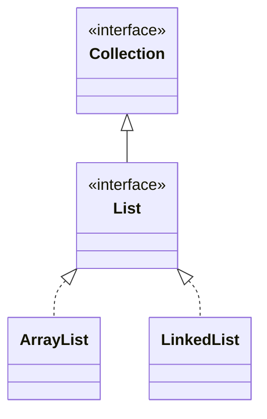

# The Collections Framework — Program to the Interface

[Arrays](/synapse/programming-languages/java/control-flow/arrays) were our first containers, but their fixed size is a real limit. The **Collections Framework** is Java's library of growable, feature-rich containers — and its central design idea is worth more than any single class: you program to an **interface** (`List`) and only *choose* an implementation (`ArrayList`, `LinkedList`) at the moment you create the object. Code written against `List` works with any list, so you can swap implementations for performance without changing a line that uses them. This chapter covers `List` and its two main implementations, the `Iterator` that powers every for-each (and the modification trap it enforces), and how to choose between implementations.

<div style="border-left:4px solid #195045;background:rgba(25,80,69,0.08);padding:0.6rem 1rem;border-radius:0 0.5rem 0.5rem 0;margin:1.25rem 0">

💡 **The core idea.**

- Program to the **interface** (`List`), not the implementation (`ArrayList`/`LinkedList`).
- Declaring the interface lets you **swap implementations** freely.
- The `Iterator` drives for-each and forbids modifying mid-loop.
- Implementation choice is a **performance** trade-off, not a correctness one.

</div>

This is the deep pass of [arrays](/synapse/programming-languages/java/control-flow/arrays); the `<Integer>` notation (a *generic* type — "a `List` of `Integer`") gets its full treatment in Tutorial 20, but read it here as "this list holds `Integer`s." Every output below was produced by compiling and running the code.

<div style="border-left:4px solid #15448e;background:rgba(21,68,142,0.08);padding:0.6rem 1rem;border-radius:0 0.5rem 0.5rem 0;margin:1.25rem 0">

📘 **How to read the Intuition boxes.** Each one is built in three moves:

1. **The mechanism** — what the compiler and the JVM are *actually doing*.
2. **A concrete bite** — a specific, runnable failure (often a real compiler error), shown so the trap is visible.
3. **The earned rule** — the decision heuristic, now justified rather than asserted, plus its cost.

</div>

---

## Table of contents

1. [A `List` grows where an array can't](#1-a-list-grows-where-an-array-cant)
2. [Program to the interface](#2-program-to-the-interface)
3. [Iteration, the `Iterator`, and the modification trap](#3-iteration-the-iterator-and-the-modification-trap)
4. [Choosing an implementation](#4-choosing-an-implementation)
5. [Mental-model summary](#5-mental-model-summary)
6. [Gotcha checklist](#6-gotcha-checklist)

---

## 1. A `List` grows where an array can't

A `List` is an ordered, *resizable* sequence. `add` appends, `get(i)` reads by index, `set(i, v)` replaces, `size()` reports the count — and unlike an array, it grows as you add.

```java run viz=array:scores
import java.util.List;
import java.util.ArrayList;

public class Main {
    public static void main(String[] args) {
        List<Integer> scores = new ArrayList<>();
        scores.add(90);
        scores.add(85);
        scores.add(95);
        System.out.println(scores.size());
        System.out.println(scores.get(1));
        scores.set(1, 100);
        System.out.println(scores);
    }
}
```

**Output:**
```
3
85
[90, 100, 95]
```

**Analysis.** We never declared a size — `add` grew the list to three. `get(1)` returned the element at index 1 (`85`, indices from `0` as with arrays), `set(1, 100)` replaced it, and printing the list shows `[90, 100, 95]` (a `List` has a readable `toString`, unlike a bare array). The `<Integer>` means it holds `Integer`s, and `add(90)` autoboxes the `int` `90` into an `Integer`.

**Intuition.**
*Mechanism.* `ArrayList` wraps an array that it reallocates (typically by ~1.5×) when it fills, copying the elements over — so it presents a growable sequence on top of fixed arrays. `get`/`set` are direct array indexing underneath; `add` is amortized constant time.

*Concrete bite.* The difference from an array is exactly the growth: an array would throw `ArrayIndexOutOfBoundsException` the moment you exceeded its fixed length, while a `List` simply expands. The cost — invisible reallocations — is paid for the convenience of never sizing it yourself.

<div style="border-left:4px solid #195045;background:rgba(25,80,69,0.08);padding:0.6rem 1rem;border-radius:0 0.5rem 0.5rem 0;margin:1.25rem 0">

💡 **Earned rule.** Reach for a `List` whenever the number of elements isn't fixed up front (which is most of the time); keep a bare array only when the size is truly fixed and you need raw speed or primitives without boxing. The cost of a `List` is the boxing of primitives (`List<Integer>`, not `List<int>`) and a little overhead per element; the benefit is growth, a rich API, and a real `toString`.

</div>

---

## 2. Program to the interface

`List` is an *interface* — a contract of operations. `ArrayList` and `LinkedList` are two *implementations* of it. Declare your variables and parameters as `List`, and your code works with **any** implementation; the concrete class appears only at `new`.

```java run
import java.util.List;
import java.util.ArrayList;
import java.util.LinkedList;

public class Main {
    static int sum(List<Integer> nums) {   // accepts ANY List
        int total = 0;
        for (int n : nums) total += n;
        return total;
    }

    public static void main(String[] args) {
        List<Integer> a = new ArrayList<>();
        a.add(1); a.add(2); a.add(3);
        List<Integer> b = new LinkedList<>();
        b.add(10); b.add(20);
        System.out.println(sum(a));
        System.out.println(sum(b));
    }
}
```

**Output:**
```
6
30
```



**Analysis.** `sum` is written against `List`, so it summed both an `ArrayList` and a `LinkedList` with no change — they share the `List` contract. The diagram shows the relationship: `List` extends `Collection` (the root interface), and both concrete classes *implement* `List` (the dotted lines). The variable type (`List`) is the contract; the `new` type is the implementation.

**Intuition.**
*Mechanism.* The compiler type-checks a `List` variable against `List`'s declared methods only — so any object whose class implements `List` is acceptable, and at run time the actual implementation's methods run (the dynamic dispatch of Tutorial 22). Your code depends on the interface, not the class.

*Concrete bite.* The payoff is swap-ability: change `new ArrayList<>()` to `new LinkedList<>()` and nothing else breaks, because every caller spoke to `List`. Declare the variable as `ArrayList` instead and you've welded that choice in — callers can now use `ArrayList`-only methods, and swapping becomes a refactor.

<div style="border-left:4px solid #195045;background:rgba(25,80,69,0.08);padding:0.6rem 1rem;border-radius:0 0.5rem 0.5rem 0;margin:1.25rem 0">

💡 **Earned rule.** Declare variables, parameters, and return types with the **interface** (`List`, `Collection`), and name the implementation only at construction. The cost is forgoing implementation-specific methods (rarely needed); the benefit is that the implementation becomes a decision you can revisit for performance without touching the code that uses it.

</div>

---

## 3. Iteration, the `Iterator`, and the modification trap

Every collection is walked by an **`Iterator`** — an object with `hasNext()` and `next()` — and the enhanced `for` is just sugar over it. That iterator enforces a rule: you may not structurally modify a collection while iterating it with a for-each.

```java run viz=array:nums
import java.util.List;
import java.util.ArrayList;

public class Main {
    public static void main(String[] args) {
        List<Integer> nums = new ArrayList<>();
        nums.add(1); nums.add(2); nums.add(3); nums.add(4);
        for (int n : nums) System.out.print(n + " ");
        System.out.println();
    }
}
```

**Output:**
```
1 2 3 4 
```

**Analysis.** The for-each obtained an `Iterator` from `nums` and called `hasNext()`/`next()` under the hood to visit each element. That's all a for-each is — there's no index; the iterator tracks the position.

**Intuition.**
*Mechanism.* The collection records a modification count; the iterator remembers the count it started with and checks it on each `next()`. If the collection was structurally changed (an `add`/`remove`) by anything *other* than the iterator itself, the counts diverge and `next()` throws — fail-fast, to catch a bug rather than silently skip or repeat elements.

*Concrete bite.* Remove from the list inside a for-each and it throws:

```java run viz=array:nums
import java.util.List;
import java.util.ArrayList;

public class Main {
    public static void main(String[] args) {
        List<Integer> nums = new ArrayList<>();
        nums.add(1); nums.add(2); nums.add(3); nums.add(4);
        for (int n : nums) {
            if (n % 2 == 0) nums.remove(Integer.valueOf(n));
        }
        System.out.println(nums);
    }
}
```

**Output** *(a thrown exception):*
```
Exception in thread "main" java.util.ConcurrentModificationException
```

`nums.remove(...)` changed the list behind the for-each's iterator, so the next `next()` detected the mismatch and threw `ConcurrentModificationException`. The fix is to remove **through the iterator**, whose own `remove()` keeps the counts in sync:

```java run viz=array:nums
import java.util.List;
import java.util.ArrayList;
import java.util.Iterator;

public class Main {
    public static void main(String[] args) {
        List<Integer> nums = new ArrayList<>();
        nums.add(1); nums.add(2); nums.add(3); nums.add(4);
        Iterator<Integer> it = nums.iterator();
        while (it.hasNext()) {
            int n = it.next();
            if (n % 2 == 0) it.remove();
        }
        System.out.println(nums);
    }
}
```

**Output:**
```
[1, 3]
```

<div style="border-left:4px solid #195045;background:rgba(25,80,69,0.08);padding:0.6rem 1rem;border-radius:0 0.5rem 0.5rem 0;margin:1.25rem 0">

💡 **Earned rule.** Never `add`/`remove` on a collection while a for-each is walking it; to delete during a pass, use an explicit `Iterator` and its `remove()` (or, once you have lambdas, `removeIf`). The cost of the fail-fast check is that the convenient for-each can't mutate; the benefit is that a whole class of "modified mid-iteration" bugs throws loudly instead of silently corrupting the traversal.

</div>

---

## 4. Choosing an implementation

`ArrayList` and `LinkedList` implement the same `List` interface but have different performance, because one is backed by an array and the other by a chain of nodes. The choice is about *cost*, not behavior.

| Operation | `ArrayList` | `LinkedList` |
|---|---|---|
| `get(i)` / `set(i)` random access | O(1) | O(n) — walk the chain |
| `add` at the end | O(1) amortized | O(1) |
| `add`/`remove` at the front/middle | O(n) — shift elements | O(1) *at a known node* |
| memory per element | low (one array slot) | higher (node + two links) |

In practice `ArrayList` is the right default — fast indexing and cache-friendly. `LinkedList` wins only for heavy front/queue-style insertion and removal. But both share a sharp API trap:

```java run viz=array:nums
import java.util.List;
import java.util.ArrayList;

public class Main {
    public static void main(String[] args) {
        List<Integer> nums = new ArrayList<>();
        nums.add(10); nums.add(20); nums.add(30);
        nums.remove(1);
        System.out.println(nums);
        nums.remove(Integer.valueOf(10));
        System.out.println(nums);
    }
}
```

**Output:**
```
[10, 30]
[30]
```

**Analysis.** `remove(1)` did **not** remove the value `1` — it removed the element at **index** `1` (the `20`), leaving `[10, 30]`. To remove by *value*, you must pass an `Integer` object: `remove(Integer.valueOf(10))` removed the value `10`. Two overloads — `remove(int index)` and `remove(Object value)` — and a bare `int` literal picks the index one.

**Intuition.**
*Mechanism.* `List` declares both `remove(int)` (by position) and `remove(Object)` (by value). With a primitive `int` argument, overload resolution chooses `remove(int)` — the index version — *not* the value version, because no boxing is preferred over boxing.

*Concrete bite.* `nums.remove(1)` silently removing index 1 rather than the value `1` is a real, common bug with `List<Integer>`. The output proves it: the value `10` survived `remove(1)` and only fell to the explicit `remove(Integer.valueOf(10))`.

<div style="border-left:4px solid #195045;background:rgba(25,80,69,0.08);padding:0.6rem 1rem;border-radius:0 0.5rem 0.5rem 0;margin:1.25rem 0">

💡 **Earned rule.** Default to `ArrayList`; reach for `LinkedList` only for front-heavy or queue workloads where its O(1) ends pay off. And with `List<Integer>`, remove by value with `remove(Integer.valueOf(x))` (or `remove((Integer) x)`), never a bare `remove(x)`, which means *index*. The cost is remembering the overload; the benefit is not silently deleting the wrong element.

</div>

---

## 5. Mental-model summary

| Principle | Consequence |
|---|---|
| A `List` is a growable, ordered sequence | No fixed size; `add` expands it; it has a real `toString` |
| Program to the interface (`List`), choose the implementation at `new` | Code works with any `List`; you can swap implementations freely |
| A for-each runs on an `Iterator` and is fail-fast | Modifying the collection mid-loop throws `ConcurrentModificationException` |
| Delete during iteration via the iterator's own `remove()` | Keeps the modification counts in sync; for-each can't mutate |
| Implementation is a performance choice, same interface | `ArrayList` for indexing (default); `LinkedList` for front/queue work |

## 6. Gotcha checklist

<div style="border-left:4px solid #da5233;background:rgba(218,82,51,0.08);padding:0.6rem 1rem;border-radius:0 0.5rem 0.5rem 0;margin:1.25rem 0">

- **`ConcurrentModificationException` →** you `add`/`remove`d during a for-each; use an explicit `Iterator.remove()` (or `removeIf`).
- **`list.remove(x)` removed the wrong element →** `remove(int)` is by index; remove by value with `remove(Integer.valueOf(x))`.
- **You declared `ArrayList` and now can't swap it →** declare the variable/param as `List`; name the implementation only at `new`.
- **Random access on a `LinkedList` is slow →** `get(i)` walks the chain (O(n)); use `ArrayList` for index-heavy work.
- **`List<int>` won't compile →** generics hold objects; use `List<Integer>` (with autoboxing), or a primitive array for raw `int`s.

</div>

---

<div style="border-left:4px solid #6d28d9;background:rgba(109,40,217,0.08);padding:0.6rem 1rem;border-radius:0 0.5rem 0.5rem 0;margin:1.25rem 0">

🧪 **Predict, then check.** Predict the output of: create a `List<String>`, `add("a")`, `add("b")`, `add("c")`, then `set(0, "z")` and print. Next, predict whether removing every `"b"` from `["a","b","b","c"]` inside a for-each throws, and rewrite it with an `Iterator`. Finally, for `List<Integer> xs = new ArrayList<>(); xs.add(5); xs.add(7);`, predict what `xs.remove(1)` leaves versus what `xs.remove(Integer.valueOf(1))` would do.

</div>

## Your Turn

Before you move on, check your understanding with the coach — explain the idea, apply it, weigh the trade-offs, then defend your reasoning.

<div class="concept-coach"></div>
