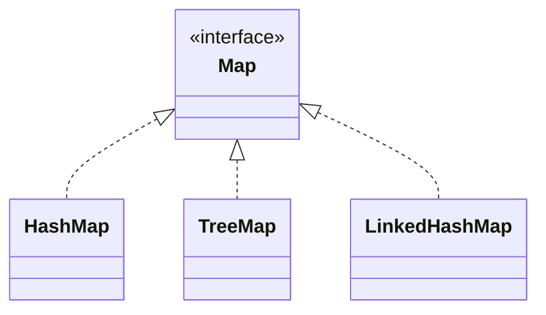

# Sets & Maps — Uniqueness and Lookup

A [`List`](/synapse/programming-languages/java/core-libraries/the-collections-framework) keeps things in order and allows duplicates. Two other shapes cover most of what's left. A **`Set`** stores *unique* elements and answers "is this in here?" in roughly constant time. A **`Map`** stores *key → value* associations and answers "what's the value for this key?" just as fast. Both come in a hash-based form that's fast but unordered (`HashSet`, `HashMap`), a tree-based form that keeps keys sorted (`TreeSet`, `TreeMap`), and a linked form that preserves insertion order (`LinkedHashSet`, `LinkedHashMap`). The speed of the hash versions comes from **hashing** entries into buckets — the same mechanism that makes the next chapter's `hashCode` contract matter.

<div style="border-left:4px solid #195045;background:rgba(25,80,69,0.08);padding:0.6rem 1rem;border-radius:0 0.5rem 0.5rem 0;margin:1.25rem 0">

💡 **The core idea.**

- A **`Set`** stores unique elements; a **`Map`** stores key→value.
- Hash forms give ~constant-time lookup by **hashing into buckets** — trading order for speed.
- `Tree*` keeps keys sorted; `LinkedHash*` keeps insertion order.

</div>

This builds on [the Collections Framework](/synapse/programming-languages/java/core-libraries/the-collections-framework) and the [`null`/unboxing](/synapse/programming-languages/java/classes-and-objects/references-equality-and-the-object-model) hazards. Every output below was produced by compiling and running the code.

<div style="border-left:4px solid #15448e;background:rgba(21,68,142,0.08);padding:0.6rem 1rem;border-radius:0 0.5rem 0.5rem 0;margin:1.25rem 0">

📘 **How to read the Intuition boxes.** Each one is built in three moves:

1. **The mechanism** — what the compiler and the JVM are *actually doing*.
2. **A concrete bite** — a specific, runnable failure (often a real compiler error), shown so the trap is visible.
3. **The earned rule** — the decision heuristic, now justified rather than asserted, plus its cost.

</div>

---

## Table of contents

1. [`Set`: unique elements](#1-set-unique-elements)
2. [Three flavors: hashed, sorted, insertion-ordered](#2-three-flavors-hashed-sorted-insertion-ordered)
3. [`Map`: key → value](#3-map-key--value)
4. [The counting idiom](#4-the-counting-idiom)
5. [Mental-model summary](#5-mental-model-summary)
6. [Gotcha checklist](#6-gotcha-checklist)

---

## 1. `Set`: unique elements

A `Set` holds each element at most once. Adding a duplicate is a no-op, and `contains` answers membership in (amortized) constant time.

```java run viz=hashmap:seen
import java.util.Set;
import java.util.HashSet;

public class Main {
    public static void main(String[] args) {
        Set<String> seen = new HashSet<>();
        seen.add("a");
        seen.add("b");
        seen.add("a");
        System.out.println(seen.size());
        System.out.println(seen.contains("a"));
        System.out.println(seen.contains("z"));
    }
}
```

**Output:**
```
2
true
false
```

```d2
direction: right

key: "element  \"a\"" {
  shape: oval
}
hashfn: "hashCode() % buckets" {
  shape: rectangle
}
buckets: "HashSet buckets" {
  grid-rows: 4
  b0: "0:  (empty)"
  b1: "1:  \"a\""
  b2: "2:  (empty)"
  b3: "3:  \"b\""
}

key -> hashfn
hashfn -> buckets.b1: "lands in bucket 1"
```

**Analysis.** Adding `"a"` twice left the size at `2` — the second `add` found `"a"` already present and did nothing. `contains` returned `true` for a member and `false` for a non-member, each without scanning the whole set. The diagram shows why it's fast: an element's `hashCode` picks a **bucket**, so membership checks one bucket, not every element.

**Intuition.**
*Mechanism.* A `HashSet` keeps an array of buckets. To add or look up an element it computes the element's `hashCode`, maps that to a bucket index, and checks only that bucket — so `add`/`contains` are O(1) on average instead of O(n). Uniqueness falls out: an element that hashes to an occupied bucket is compared (with `.equals`) and dropped if already there.

*Concrete bite.* Because placement is by `hashCode`, a `HashSet` has **no meaningful order** — you cannot ask for "the first element" or expect any particular iteration sequence. That's the trade for O(1): speed in exchange for order. (And it's why a type used in a `HashSet` must implement `hashCode`/`equals` correctly — Tutorial 19.)

<div style="border-left:4px solid #195045;background:rgba(25,80,69,0.08);padding:0.6rem 1rem;border-radius:0 0.5rem 0.5rem 0;margin:1.25rem 0">

💡 **Earned rule.** Use a `Set` when you need uniqueness or fast membership tests ("have I seen this?", "is this allowed?"); reach for a `HashSet` by default for its O(1) operations. The cost is losing order and a small per-element overhead; the benefit is membership in constant time instead of the O(n) scan a `List.contains` does.

</div>

---

## 2. Three flavors: hashed, sorted, insertion-ordered

The same `Set` interface has three implementations that differ only in **iteration order**: `HashSet` (no order), `TreeSet` (sorted), `LinkedHashSet` (insertion order).

```java run
import java.util.*;

public class Main {
    public static void main(String[] args) {
        Set<Integer> hash = new HashSet<>();
        Set<Integer> tree = new TreeSet<>();
        Set<Integer> linked = new LinkedHashSet<>();
        for (int x : new int[]{3, 1, 2, 1}) {
            hash.add(x); tree.add(x); linked.add(x);
        }
        System.out.println("tree:   " + tree);
        System.out.println("linked: " + linked);
        System.out.println("hash:   " + hash);
    }
}
```

**Output:**
```
tree:   [1, 2, 3]
linked: [3, 1, 2]
hash:   [1, 2, 3]
```

**Analysis.** All three dropped the duplicate `1`, so each holds `{1, 2, 3}` — but the *order* differs by implementation. `TreeSet` printed sorted (`[1, 2, 3]`); `LinkedHashSet` printed insertion order (`[3, 1, 2]`). The `HashSet` printed `[1, 2, 3]` **here**, but that is *not guaranteed* — small `Integer`s happen to hash to themselves, so they land in numeric order by accident. Never rely on `HashSet` order.

**Intuition.**
*Mechanism.* `TreeSet` is backed by a balanced search tree, so it keeps elements sorted at O(log n) per operation. `LinkedHashSet` is a `HashSet` plus a linked list threading entries in insertion order, so it's O(1) and ordered. `HashSet` is the plain bucket array — fastest, no order.

*Concrete bite.* The `hash: [1, 2, 3]` line is a trap dressed as order: it looks sorted, so a test might assume `HashSet` is sorted — then break when the elements are strings, larger numbers, or a different JVM. Order from a `HashSet` is coincidence, never contract.

<div style="border-left:4px solid #195045;background:rgba(25,80,69,0.08);padding:0.6rem 1rem;border-radius:0 0.5rem 0.5rem 0;margin:1.25rem 0">

💡 **Earned rule.** Pick the implementation by the order you need: `HashSet` when order doesn't matter (fastest), `TreeSet` when you need sorted iteration (at O(log n)), `LinkedHashSet` when you need stable insertion order (at a little memory). The cost of choosing `Tree`/`Linked` is speed or memory; the cost of assuming `HashSet` is ordered is a bug that hides until the data changes.

</div>

---

## 3. `Map`: key → value

A `Map` associates each unique **key** with a **value**. `put` stores, `get` retrieves, `containsKey` tests, and `getOrDefault` retrieves with a fallback for absent keys. The same hashed/sorted/linked trio applies (`HashMap`/`TreeMap`/`LinkedHashMap`).

```java run viz=hashmap:ages
import java.util.Map;
import java.util.HashMap;

public class Main {
    public static void main(String[] args) {
        Map<String, Integer> ages = new HashMap<>();
        ages.put("Ada", 36);
        ages.put("Linus", 54);
        System.out.println(ages.get("Ada"));
        System.out.println(ages.getOrDefault("Zoe", 0));
        System.out.println(ages.containsKey("Linus"));
        System.out.println(ages.get("Zoe"));
    }
}
```

**Output:**
```
36
0
true
null
```



**Analysis.** `get("Ada")` returned the stored `36`; `getOrDefault("Zoe", 0)` returned the fallback `0` because `"Zoe"` is absent; `containsKey("Linus")` is `true`. The last line is the one to watch: `get("Zoe")` for a **missing key returns `null`**, not a default. A `Map` looks up its value by hashing the key into a bucket, exactly like a `Set` hashes its elements.

**Intuition.**
*Mechanism.* `get` returns the value for the key, or `null` if the key isn't present — there's no way for `get` alone to tell "absent" from "present with value `null`." `getOrDefault` and `containsKey` exist precisely to handle absence explicitly.

*Concrete bite.* Because a missing key gives `null`, assigning `get`'s result straight into a primitive unboxes `null` and throws:

```java run
import java.util.Map;
import java.util.HashMap;

public class Main {
    public static void main(String[] args) {
        Map<String, Integer> m = new HashMap<>();
        int age = m.get("missing");
        System.out.println(age);
    }
}
```

**Output** *(a thrown exception):*
```
Exception in thread "main" java.lang.NullPointerException: Cannot invoke "java.lang.Integer.intValue()" because the return value of "java.util.Map.get(Object)" is null
```

`m.get("missing")` returned `null` (no such key), and assigning it to an `int` tried to unbox `null` — the [null-unboxing NullPointerException](/synapse/programming-languages/java/classes-and-objects/references-equality-and-the-object-model). The map didn't fail; the *implicit unboxing of a null* did.

<div style="border-left:4px solid #195045;background:rgba(25,80,69,0.08);padding:0.6rem 1rem;border-radius:0 0.5rem 0.5rem 0;margin:1.25rem 0">

💡 **Earned rule.** Treat `Map.get` as possibly returning `null`; use `getOrDefault(key, fallback)` or `containsKey` when a key may be absent, and never assign `get`'s result straight into a primitive. The cost is a fallback value or an extra check; the benefit is no surprise `NullPointerException` from a lookup that simply missed.

</div>

---

## 4. The counting idiom

The most common `Map` task — counting occurrences — has a one-line shape with `getOrDefault`: read the current count (defaulting to `0` for a new key), add one, and put it back.

```java run viz=hashmap:counts
import java.util.Map;
import java.util.HashMap;

public class Main {
    public static void main(String[] args) {
        String text = "a b a c b a";
        Map<String, Integer> counts = new HashMap<>();
        for (String word : text.split(" ")) {
            counts.put(word, counts.getOrDefault(word, 0) + 1);
        }
        System.out.println(counts.get("a"));
        System.out.println(counts.get("b"));
        System.out.println(counts.get("c"));
    }
}
```

**Output:**
```
3
2
1
```

**Analysis.** For each word, `getOrDefault(word, 0)` returned the running count (`0` the first time a word appeared), `+ 1` incremented it, and `put` stored it back. The result is a frequency table: `a` three times, `b` twice, `c` once. The `getOrDefault(..., 0)` is what makes a brand-new key start counting from zero instead of `NullPointerException`-ing on a `null`.

**Intuition.**
*Mechanism.* `getOrDefault(k, d)` returns the mapped value or `d` if `k` is absent — so the first occurrence reads `0`, and every later one reads the accumulated count. The idiom folds "initialize on first sight" and "increment on later sights" into one expression.

*Concrete bite.* Drop the default and use `get` — `counts.put(word, counts.get(word) + 1)` — and the *first* occurrence of each word reads `null`, unboxes, and throws the same NPE as §3. The `getOrDefault(..., 0)` is not optional decoration; it's the seed that makes the count work.

<div style="border-left:4px solid #195045;background:rgba(25,80,69,0.08);padding:0.6rem 1rem;border-radius:0 0.5rem 0.5rem 0;margin:1.25rem 0">

💡 **Earned rule.** Count with `map.put(k, map.getOrDefault(k, 0) + 1)`; for fancier accumulation, `merge(k, 1, Integer::sum)` does the same in one call once you have the method references of Tutorial 25. The cost of the `getOrDefault` form is verbosity; the benefit is that it works with only what you know now, and it makes the "default for a new key" explicit and correct.

</div>

---

## 5. Mental-model summary

| Principle | Consequence |
|---|---|
| A `Set` holds unique elements; a `Map` holds key→value | Duplicate `add` is a no-op; each key maps to one value |
| Hashing into buckets gives O(1) membership/lookup | `HashSet`/`HashMap` are fast but **unordered** — never rely on their order |
| `Tree*` keep keys sorted; `LinkedHash*` keep insertion order | Choose the implementation by the order you need (at a speed/memory cost) |
| `Map.get` returns `null` for an absent key | Use `getOrDefault`/`containsKey`; don't assign `get` into a primitive |
| Counting: `put(k, getOrDefault(k, 0) + 1)` | The `0` default seeds a new key; plain `get` would NPE on first sight |

## 6. Gotcha checklist

<div style="border-left:4px solid #da5233;background:rgba(218,82,51,0.08);padding:0.6rem 1rem;border-radius:0 0.5rem 0.5rem 0;margin:1.25rem 0">

- **`NullPointerException` unboxing a `Map.get` →** the key was absent (`get` returned `null`); use `getOrDefault` or `containsKey`, keep the result an `Integer`.
- **A `HashSet`/`HashMap` "lost" its order →** it never had one; use `LinkedHashSet`/`LinkedHashMap` for insertion order or `Tree*` for sorted.
- **A test assumes `HashSet` iterates in sorted order →** that's coincidence for small ints; never depend on hash order.
- **Counting throws on the first occurrence →** you used `get(k) + 1`; seed with `getOrDefault(k, 0) + 1`.
- **Duplicate elements "disappeared" from a `Set` →** sets are unique by design; use a `List` (or a `Map` to counts) if duplicates matter.

</div>

---

<div style="border-left:4px solid #6d28d9;background:rgba(109,40,217,0.08);padding:0.6rem 1rem;border-radius:0 0.5rem 0.5rem 0;margin:1.25rem 0">

🧪 **Predict, then check.** Predict the size of a `Set<String>` after adding `"x"`, `"y"`, `"x"`, `"z"`, `"y"`. Next, predict the three lines printed by adding `5, 3, 5, 1` to a `TreeSet`, a `LinkedHashSet`, and a `HashSet` and printing each. Finally, predict what `Map<String,Integer> m = new HashMap<>();` then `System.out.println(m.get("a"));` prints, and what `int n = m.get("a");` does instead — and fix the counting loop `m.put(w, m.get(w) + 1)` so it doesn't throw.

</div>

## Your Turn

Before you move on, check your understanding with the coach — explain the idea, apply it, weigh the trade-offs, then defend your reasoning.

<div class="concept-coach"></div>
