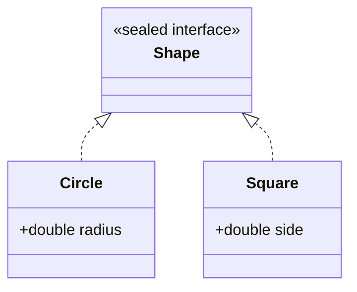

# Enums & Records — Modeling Data Precisely

Three modern features let you model data so precisely that whole categories of bug become impossible to write. An **enum** is a fixed set of named constants — a type whose every value you list up front, so an invalid one can't exist. A **record** (JDK 16) is an immutable data carrier: you declare its *components* and Java generates the constructor, accessors, and a correct [`equals`/`hashCode`](/synapse/programming-languages/java/core-libraries/equals-and-hashcode)/`toString` for free. A **sealed** type (JDK 17) names exactly which classes may implement it, so the set of subtypes is closed and known. Together they replace piles of hand-written boilerplate — and the bugs that hide in it.

Every output below was produced by compiling and running the code.

> **How to read the Intuition boxes.** Each one is built in three moves: (1) the **mechanism** — what the compiler and the JVM are *actually doing*; (2) a **concrete bite** — a specific, runnable failure (often a real compiler error), shown so the trap is visible; (3) the **earned rule** — the decision heuristic, now justified rather than asserted, plus its cost.

---

## Table of contents

1. [Enums: a fixed set of constants](#1-enums-a-fixed-set-of-constants)
2. [Rich enums: fields and methods](#2-rich-enums-fields-and-methods)
3. [Records: immutable data carriers](#3-records-immutable-data-carriers)
4. [Sealed types: a first look](#4-sealed-types-a-first-look)
5. [Mental-model summary](#5-mental-model-summary)
6. [Gotcha checklist](#6-gotcha-checklist)

---

## 1. Enums: a fixed set of constants

An `enum` declares a type whose only values are the named constants you list. Each is a singleton instance of the enum type — type-safe (you can't pass a stray string), and a natural fit for a [`switch`](/synapse/programming-languages/java/control-flow/conditionals).

```java run
enum Day { MON, TUE, WED, THU, FRI, SAT, SUN }

public class Main {
    public static void main(String[] args) {
        Day d = Day.WED;
        System.out.println(d);
        System.out.println(d.ordinal());
        String kind = switch (d) {
            case SAT, SUN -> "weekend";
            default -> "weekday";
        };
        System.out.println(kind);
        System.out.println(Day.values().length);
    }
}
```

**Output:**
```
WED
2
weekday
7
```

**Analysis.** `Day.WED` prints its name; `ordinal()` is its position (`2`, zero-based); the `switch` classified it as a `weekday`; and `Day.values()` returns all seven constants. A `Day` variable can hold *only* one of these seven — there is no eighth day, and no way to assign a typo'd one, because the compiler checks every `Day` value against the declared set.

**Intuition.**
*Mechanism.* The compiler turns each constant into a `public static final` instance of the enum type, created once. A variable of the enum type can reference only those instances, so the set of valid values is closed at compile time.

*Concrete bite.* That closed set lets a `switch` *expression* over an enum be checked for exhaustiveness — cover some constants but not all, with no `default`, and it won't compile:

```java run
enum Day { MON, TUE, WED, THU, FRI, SAT, SUN }

public class Main {
    public static void main(String[] args) {
        Day d = Day.WED;
        String s = switch (d) {
            case MON -> "monday";
            case TUE -> "tuesday";
        };
        System.out.println(s);
    }
}
```

**Compiler error:**
```
Main.java:5: error: the switch expression does not cover all possible input values
        String s = switch (d) {
                   ^
```

The `switch` handles only two of seven days and produces a value, so the compiler demands the rest (or a `default`). With an enum, "I forgot a case" becomes a build error.

*Earned rule.* Use an enum for any value that comes from a fixed, known set — states, directions, days, modes — instead of `int` codes or `String`s. The cost is declaring the type; the benefit is type safety (no invalid value), readable names, and exhaustiveness checking in `switch` that flags a forgotten case at compile time.

---

## 2. Rich enums: fields and methods

Enum constants are real objects, so they can carry **data** and **behavior**. Give the enum a constructor and fields, pass each constant its values in parentheses, and add methods that use them.

```java run
enum Planet {
    EARTH(9.81), MARS(3.71), MOON(1.62);

    private final double gravity;
    Planet(double gravity) { this.gravity = gravity; }
    double weightOf(double mass) { return mass * gravity; }
}

public class Main {
    public static void main(String[] args) {
        for (Planet p : Planet.values()) {
            System.out.printf("%s: %.1f%n", p, p.weightOf(10));
        }
    }
}
```

**Output:**
```
EARTH: 98.1
MARS: 37.1
MOON: 16.2
```

**Analysis.** Each constant supplied a `gravity` to the enum's constructor (`EARTH(9.81)`), stored in a `final` field, and `weightOf` used it. So `Planet` isn't just three names — it's three objects each bundling a value and a method, iterated with `values()`. The `gravity` is `final` because enum constants are effectively immutable singletons.

**Intuition.**
*Mechanism.* `EARTH(9.81)` calls the enum's constructor when the constant is created (once, at class load). The fields and methods make each constant a small, self-describing object — an enum is a class whose instances are fixed and named.

*Concrete bite.* This replaces the fragile "parallel arrays" or `switch`-on-code style: instead of a `double gravityFor(int planetCode)` with a `switch` you must keep in sync, the data lives *on* the constant, so adding a planet adds one line and can't desync. The behavior travels with the value.

*Earned rule.* Put per-constant data and behavior *in* the enum (fields, a constructor, methods) rather than in external `switch`es keyed on the constant. The cost is a slightly richer enum declaration; the benefit is that each constant is self-contained — add or change one and there's a single place to edit, with no lookup table to keep aligned.

---

## 3. Records: immutable data carriers

A **record** is a class whose entire job is to hold data. You declare its **components**, and Java generates a canonical constructor, an accessor per component, and consistent `equals`, `hashCode`, and `toString` — all immutable, all for free.

```java run
record Point(int x, int y) {}

public class Main {
    public static void main(String[] args) {
        Point a = new Point(1, 2);
        Point b = new Point(1, 2);
        System.out.println(a);
        System.out.println(a.x() + "," + a.y());
        System.out.println(a.equals(b));
        System.out.println(a.hashCode() == b.hashCode());
    }
}
```

**Output:**
```
Point[x=1, y=2]
1,2
true
true
```

**Analysis.** One line — `record Point(int x, int y) {}` — gave us a constructor (`new Point(1, 2)`), accessors (`a.x()`, `a.y()` — note the parentheses), a readable `toString` (`Point[x=1, y=2]`), and a **correct** `equals`/`hashCode` pair: `a.equals(b)` is `true` and their hash codes match. Recall from [the last chapter](/synapse/programming-languages/java/core-libraries/equals-and-hashcode) how much hand-written, error-prone code that contract took — a record generates it from the components, consistently, every time.

**Intuition.**
*Mechanism.* A record is a compact, final, immutable class. The compiler derives the members from the component list: `private final` fields, a canonical constructor that assigns them, accessors named after each component, and `equals`/`hashCode`/`toString` computed over all components. You can still add methods or validate in a compact constructor.

*Concrete bite.* The immutability is real — record components are `final`, with no setters, so you can't change one after construction:

```java run
record Point(int x, int y) {}

public class Main {
    public static void main(String[] args) {
        Point p = new Point(1, 2);
        p.x = 5;
        System.out.println(p);
    }
}
```

**Compiler error:**
```
Main.java:5: error: x has private access in Point
        p.x = 5;
         ^
1 error
```

`p.x = 5` is rejected — the component is a `private final` field, readable only through the accessor `p.x()`, never assignable. A record is immutable by construction; to "change" a point you build a new one.

*Earned rule.* Use a record for any immutable group of values — coordinates, a name/email pair, a DTO, a `Map` key — and let it generate the boilerplate and the `equals`/`hashCode` contract. The cost is immutability (a record can't be a mutable bean) and that it can't extend a class; the benefit is a correct, concise value type where a hand-written class would be dozens of lines of bug-prone boilerplate.

---

## 4. Sealed types: a first look

A **sealed** interface or class names exactly which types may implement or extend it, with a `permits` clause. The subtype set is then *closed* — the compiler knows every possible implementation, which is the foundation for the exhaustive pattern matching of Tutorial 26.

```java run
sealed interface Shape permits Circle, Square {}
record Circle(double radius) implements Shape {}
record Square(double side) implements Shape {}

public class Main {
    public static void main(String[] args) {
        Shape s = new Circle(2.0);
        System.out.println(s);
    }
}
```

**Output:**
```
Circle[radius=2.0]
```



**Analysis.** `Shape` permits exactly `Circle` and `Square` (both records here — records and sealed types pair naturally). The diagram shows the closed family: a `Shape` is a `Circle` or a `Square`, and nothing else can claim to be one. That "nothing else" is the guarantee a plain interface can't make — any class anywhere could implement an ordinary interface.

**Intuition.**
*Mechanism.* `sealed … permits A, B` records the allowed subtypes in the type itself; the compiler enforces that only those types extend/implement it (each must be `final`, `sealed`, or `non-sealed`). The subtype set is fixed and visible at compile time.

*Concrete bite.* A type not in the `permits` clause cannot join the family:

```java run
sealed interface Shape permits Circle {}
record Circle(double radius) implements Shape {}
record Triangle(double base) implements Shape {}

public class Main {
    public static void main(String[] args) { }
}
```

**Compiler error:**
```
Main.java:3: error: class is not allowed to extend sealed class: Shape (as it is not listed in its 'permits' clause)
```

`Triangle` tried to implement `Shape` but isn't permitted, so it's rejected. The family stays exactly `{Circle}` — the seal holds.

*Earned rule.* Seal an interface or class when the set of subtypes is meant to be *closed and known* — a fixed algebra of cases like shapes, AST nodes, or result variants — and pair it with records for the cases. The cost is listing the permitted types (and updating the list to add one); the benefit is a closed family the compiler can reason about, enabling the exhaustive `switch` pattern matching of Tutorial 26 with no `default` needed.

---

## 5. Mental-model summary

| Principle | Consequence |
|---|---|
| An enum is a fixed, type-safe set of named constant instances | No invalid value; exhaustive `switch` flags a forgotten case |
| Enum constants can carry fields and methods | Per-constant data/behavior lives on the constant, not in external switches |
| A record generates constructor, accessors, `equals`/`hashCode`/`toString` | An immutable value type in one line, with the contract correct for free |
| Record components are `final`, read via `x()` accessors | You can't assign them; "change" means build a new record |
| A `sealed` type's `permits` clause closes its subtype set | Only listed types may implement it; the compiler knows the whole family |

## 6. Gotcha checklist

- **`the switch expression does not cover all possible input values` on an enum →** add the missing constants or a `default`; the closed set is exhaustiveness-checked.
- **`x has private access` assigning a record component →** records are immutable; read via `x()`, build a new record to "change" it.
- **Two equal records aren't equal / break a `HashMap` →** they won't — a record generates a correct `equals`/`hashCode`; that's a reason to use one.
- **`class is not allowed to extend sealed class` →** add the type to the `permits` clause, or it can't join the sealed family.
- **Reached for `int`/`String` codes for a fixed set of values →** use an enum for type safety, names, and switch exhaustiveness.

---

*Predict, then check.* Give `Day` a `boolean isWeekend()` method and predict what `Day.SAT.isWeekend()` and `Day.MON.isWeekend()` return. Next, for `record Money(int cents, String currency) {}`, predict the output of printing `new Money(100, "USD")` and comparing two equal `Money` values with `.equals`. Finally, predict whether a `record Rectangle(double w, double h) implements Shape {}` compiles given `sealed interface Shape permits Circle, Square {}` — and what one change makes it compile.

## Your Turn

Before you move on, check your understanding with the coach — explain the idea, apply it, weigh the trade-offs, then defend your reasoning.

<div class="concept-coach"></div>
