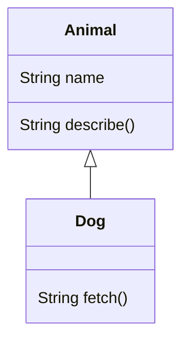

# Inheritance & Polymorphism — One Reference, Many Behaviors

[Classes](/synapse/programming-languages/java/classes-and-objects/classes-and-objects) let you model one kind of thing. **Inheritance** lets one class build on another: a subclass `extends` a superclass, inheriting its fields and methods and adding or **overriding** as needed. The real prize isn't code reuse — it's **polymorphism**: when you call an overridden method through a *superclass* reference, Java runs the version belonging to the object's *actual* runtime type. A `List<Animal>` of `Dog`s and `Cat`s, looped once, makes each speak in its own voice. That single mechanism — **dynamic dispatch** — is what lets code written against a general type drive specialized behavior it's never seen. This chapter also draws the line it stops at (fields don't dispatch), how `final` shuts it off, and the methods *every* object inherits from the universal superclass, `Object`.

This is the deep pass of [classes & objects](/synapse/programming-languages/java/classes-and-objects/classes-and-objects). Every output below was produced by compiling and running the code.

> **How to read the Intuition boxes.** Each one is built in three moves: (1) the **mechanism** — what the compiler and the JVM are *actually doing*; (2) a **concrete bite** — a specific, runnable failure (often a real compiler error), shown so the trap is visible; (3) the **earned rule** — the decision heuristic, now justified rather than asserted, plus its cost.

---

## Table of contents

1. [`extends`: inheriting and adding](#1-extends-inheriting-and-adding)
2. [Overriding and `super`](#2-overriding-and-super)
3. [Dynamic dispatch: polymorphism](#3-dynamic-dispatch-polymorphism)
4. [`final` and the `Object` methods](#4-final-and-the-object-methods)
5. [Mental-model summary](#5-mental-model-summary)
6. [Gotcha checklist](#6-gotcha-checklist)

---

## 1. `extends`: inheriting and adding

A subclass declares `extends Superclass` and automatically has the superclass's fields and methods. Its constructor calls the superclass constructor with `super(...)`, then it can add members of its own.

```java run
class Animal {
    String name;
    Animal(String name) { this.name = name; }
    String describe() { return name + " is an animal"; }
}

class Dog extends Animal {
    Dog(String name) { super(name); }
    String fetch() { return name + " fetches the ball"; }
}

public class Main {
    public static void main(String[] args) {
        Dog d = new Dog("Rex");
        System.out.println(d.describe());
        System.out.println(d.fetch());
    }
}
```

**Output:**
```
Rex is an animal
Rex fetches the ball
```



**Analysis.** `Dog` inherited `name` and `describe()` from `Animal` — `d.describe()` worked without `Dog` defining it — and added its own `fetch()`. `Dog`'s constructor called `super(name)` to run `Animal`'s constructor (which sets `name`); this must be the first statement, because the superclass part of the object is built before the subclass part. The arrow in the diagram (`<|--`) reads "Dog *is an* Animal."

**Intuition.**
*Mechanism.* A subclass object contains a full superclass object inside it. Construction runs top-down: `super(...)` initializes the inherited part first, then the subclass constructor finishes. Inherited members are simply present on the subclass; you only restate what you change or add.

*Concrete bite.* The "is-a" relationship is the test for whether to inherit: a `Dog` genuinely *is an* `Animal`, so inheritance fits. Inheriting just to reuse a method ("a `Stack` *is an* `ArrayList`?" — no, it *has* one) couples the subclass to the superclass's entire interface, including methods that don't make sense for it.

*Earned rule.* Use `extends` only for a true "is-a" specialization, and call `super(...)` to initialize the inherited state. The cost of inheritance is tight coupling — the subclass depends on the superclass's internals and inherits its whole API; the benefit is genuine specialization and the polymorphism that follows, so prefer it for "is-a" and favor composition ("has-a") otherwise.

---

## 2. Overriding and `super`

A subclass **overrides** an inherited method by redeclaring it with the same signature — its version replaces the superclass's for objects of that subclass. `super.method()` still reaches the superclass's version when you need both.

```java run
class Animal {
    String speak() { return "..."; }
}

class Dog extends Animal {
    @Override
    String speak() { return "Woof"; }
    String both() { return super.speak() + " / " + speak(); }
}

public class Main {
    public static void main(String[] args) {
        Dog d = new Dog();
        System.out.println(d.speak());
        System.out.println(d.both());
    }
}
```

**Output:**
```
Woof
... / Woof
```

**Analysis.** `Dog.speak()` overrode `Animal.speak()`, so `d.speak()` is `"Woof"`. Inside `both()`, `super.speak()` explicitly called `Animal`'s version (`"..."`) while a plain `speak()` called `Dog`'s (`"Woof"`) — giving `"... / Woof"`. `super` is the escape hatch to the parent's behavior, often used to *extend* it ("do what the parent does, plus this").

**Intuition.**
*Mechanism.* An override must match the inherited method's signature exactly. The `@Override` annotation asks the compiler to verify that — if the method doesn't actually override anything, it's an error, catching typos and signature mismatches.

*Concrete bite.* Misspell the method (or get the parameters wrong) and you've written a *new* method, not an override — `@Override` turns that silent mistake into a compile error:

```java run
class Animal { String speak() { return "..."; } }

class Dog extends Animal {
    @Override
    String speakk() { return "Woof"; }
}

public class Main {
    public static void main(String[] args) { }
}
```

**Compiler error:**
```
Main.java:3: error: method does not override or implement a method from a supertype
    @Override
    ^
```

`speakk` (typo) overrides nothing, so `@Override` flags it. Without the annotation this would compile as a brand-new, never-called method, and `speak()` would silently keep the parent's behavior.

*Earned rule.* Always annotate overrides with `@Override`, and use `super.method()` when you need to build on the parent's behavior. The cost is one annotation; the benefit is that a misspelled or mis-signed "override" — which would otherwise silently do nothing — becomes a compile error you fix immediately.

---

## 3. Dynamic dispatch: polymorphism

Here is the payoff. A variable's *declared* type can be a superclass while the object it points to is a subclass (**upcasting**). When you call an overridden method, Java runs the version for the object's **actual runtime type** — not the declared type. This is **dynamic dispatch**.

```java run viz=array:animals
class Animal {
    String name;
    Animal(String name) { this.name = name; }
    String speak() { return "..."; }
}
class Dog extends Animal {
    Dog(String name) { super(name); }
    @Override String speak() { return "Woof"; }
}
class Cat extends Animal {
    Cat(String name) { super(name); }
    @Override String speak() { return "Meow"; }
}

public class Main {
    public static void main(String[] args) {
        Animal[] animals = { new Dog("Rex"), new Cat("Felix"), new Animal("Thing") };
        for (Animal a : animals) {
            System.out.println(a.name + ": " + a.speak());
        }
    }
}
```

**Output:**
```
Rex: Woof
Felix: Meow
Thing: ...
```

**Analysis.** Every element is declared `Animal`, yet each `a.speak()` ran the *object's* version — `Dog`'s `Woof`, `Cat`'s `Meow`, `Animal`'s `...`. The loop is written against `Animal` and knows nothing about `Dog` or `Cat`, but it drives their specialized behavior. This is polymorphism: one interface (`speak()` on `Animal`), many implementations, selected at run time by the actual type.

**Intuition.**
*Mechanism.* For an overridable (instance) method, the JVM looks up the method on the object's *actual class* at call time, not the variable's declared type. This is why the loop's `Animal` reference can invoke `Dog.speak()`.

*Concrete bite.* The dynamic rule applies to **methods**, not **fields** — a field access is resolved by the *declared* type at compile time:

```java run
class Animal { String kind = "animal"; String speak() { return "generic"; } }
class Dog extends Animal { String kind = "dog"; @Override String speak() { return "Woof"; } }

public class Main {
    public static void main(String[] args) {
        Animal a = new Dog();
        System.out.println(a.speak());
        System.out.println(a.kind);
    }
}
```

**Output:**
```
Woof
animal
```

`a.speak()` dispatched dynamically to `Dog` (`"Woof"`), but `a.kind` read `Animal`'s field (`"animal"`) — because fields are *not* polymorphic; they bind to the declared type. (Shadowing a field like this is a code smell precisely because of this confusion; override *methods*, don't shadow fields.)

*Earned rule.* Program against the general (super)type and let overridden *methods* dispatch to the right behavior — that's how polymorphic code stays open to new subclasses without changing. The cost is the field/method asymmetry (fields bind statically, so never rely on "overriding" a field); the benefit is code that works for subclasses written long after it, as long as they override the methods it calls.

---

## 4. `final` and the `Object` methods

`final` on a method forbids overriding it — a subclass cannot change that behavior. And every class implicitly extends `Object`, so every object already has methods like `toString`, `equals`, and `hashCode`, which you override to give them meaning.

```java run
class Animal {
    String name;
    Animal(String name) { this.name = name; }
    @Override
    public String toString() { return "Animal(" + name + ")"; }
    final String species() { return "unknown"; }
}

public class Main {
    public static void main(String[] args) {
        Animal a = new Animal("Rex");
        System.out.println(a);
        System.out.println(a.species());
    }
}
```

**Output:**
```
Animal(Rex)
unknown
```

**Analysis.** `System.out.println(a)` called the overridden `toString()` (`Object`'s default would print something like `Animal@1b6d3586`), giving `Animal(Rex)`. `species()` is `final` — usable, but locked against overriding. Overriding `toString`/`equals`/`hashCode` is how your types get readable printing and correct [value equality](/synapse/programming-languages/java/core-libraries/equals-and-hashcode); they're inherited from `Object` whether you ask or not.

**Intuition.**
*Mechanism.* `Object` is the root of every class hierarchy, so its methods are always available to override. `final` on a method removes it from the dispatch table for subclasses — the compiler rejects any attempt to override it, guaranteeing that behavior is fixed.

*Concrete bite.* Try to override a `final` method and it won't compile:

```java run
class Animal { final String species() { return "unknown"; } }
class Dog extends Animal { @Override String species() { return "dog"; } }

public class Main {
    public static void main(String[] args) { }
}
```

**Compiler error:**
```
Main.java:2: error: species() in Dog cannot override species() in Animal
class Dog extends Animal { @Override String species() { return "dog"; } }
                                            ^
```

`Animal.species()` is `final`, so `Dog` cannot override it — the seal holds. `final` is how a class guarantees a method's behavior can't be changed by any subclass.

*Earned rule.* Override `Object`'s `toString` (and `equals`/`hashCode` for value types) to give your objects meaning; mark a method `final` when subclasses must not change its behavior (a security or invariant guarantee). The cost of `final` is lost flexibility — no subclass can specialize that method; the benefit is a behavior you can rely on across the whole hierarchy.

---

## 5. Mental-model summary

| Principle | Consequence |
|---|---|
| A subclass `extends` a superclass and `super(...)`-initializes it | It inherits fields/methods; use inheritance only for a true "is-a" |
| Overriding redeclares an inherited method; `super.m()` reaches the parent | Annotate with `@Override` so a typo'd "override" is a compile error |
| Methods dispatch on the object's runtime type (dynamic dispatch) | A superclass reference runs the subclass's overridden method |
| Fields bind to the *declared* type, not the runtime type | `a.kind` uses the declared type's field — fields aren't polymorphic |
| `final` forbids overriding; every class extends `Object` | A `final` method can't be overridden; override `toString`/`equals` for meaning |

## 6. Gotcha checklist

- **An "override" is ignored / the parent method still runs →** a signature mismatch or typo made it a new method; add `@Override` to catch it.
- **A field "override" returns the wrong value →** fields aren't polymorphic; they bind to the declared type. Override methods; don't shadow fields.
- **`cannot override … overridden method is final` →** the superclass method is `final`; you can't change it (by design).
- **`println(obj)` prints `ClassName@hash` →** the default `Object.toString`; override `toString()`.
- **You inherited a whole API you didn't want →** "is-a" wasn't really true; prefer composition (a field) over inheritance.

---

*Predict, then check.* Add a `Bird extends Animal` overriding `speak()` to return `"Tweet"`, put a `Dog`, `Cat`, and `Bird` in an `Animal[]`, and predict the three lines printed by calling `speak()` on each. Next, predict what `a.speak()` and `a.kind` print for `Animal a = new Dog();` given the §3 shadowed field. Finally, predict the compiler's reaction to a subclass overriding a `final` method, and explain why fields and methods resolve differently.

## Your Turn

Before you move on, check your understanding with the coach — explain the idea, apply it, weigh the trade-offs, then defend your reasoning.

<div class="concept-coach"></div>
