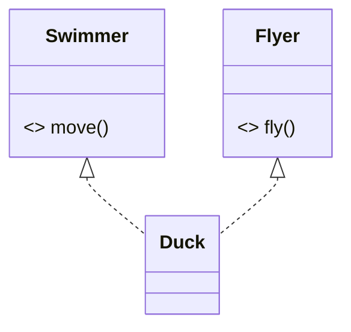

# Abstract Classes & Interfaces — Contracts and Partial Types

[Inheritance](/synapse/programming-languages/java/robust-oop/inheritance-and-polymorphism) let a subclass specialize a concrete superclass. Two more tools let you specify behavior a type *must* provide without saying how. An **abstract class** is a partial implementation — it can declare **abstract methods** (signatures with no body) and cannot itself be instantiated, so every concrete subclass is forced to supply the missing pieces. An **interface** goes further: a pure **contract** of methods that any class can `implement`, with no shared state. The crucial asymmetry is that a class `extends` exactly **one** class but `implements` **many** interfaces — so interfaces give Java multiple inheritance of *type* (a class can be many things) while sidestepping the "diamond problem" of multiple inheritance of *state*. This is the machinery behind "[program to the interface](/synapse/programming-languages/java/core-libraries/the-collections-framework)."

<div style="border-left:4px solid #195045;background:rgba(25,80,69,0.08);padding:0.6rem 1rem;border-radius:0 0.5rem 0.5rem 0;margin:1.25rem 0">

💡 **The core idea.**

- An **abstract class** is a partial type with body-less methods — it can't be instantiated.
- An **interface** is a pure contract a class `implements`, with no shared state.
- A class `extends` **one** class but `implements` **many** interfaces.
- So interfaces give multiple inheritance of *type* without the diamond problem.

</div>

Every output below was produced by compiling and running the code.

<div style="border-left:4px solid #15448e;background:rgba(21,68,142,0.08);padding:0.6rem 1rem;border-radius:0 0.5rem 0.5rem 0;margin:1.25rem 0">

📘 **How to read the Intuition boxes.** Each one is built in three moves:

1. **The mechanism** — what the compiler and the JVM are *actually doing*.
2. **A concrete bite** — a specific, runnable failure (often a real compiler error), shown so the trap is visible.
3. **The earned rule** — the decision heuristic, now justified rather than asserted, plus its cost.

</div>

---

## Table of contents

1. [Abstract classes](#1-abstract-classes)
2. [Interfaces](#2-interfaces)
3. [`default` methods](#3-default-methods)
4. [One class, many interfaces](#4-one-class-many-interfaces)
5. [Mental-model summary](#5-mental-model-summary)
6. [Gotcha checklist](#6-gotcha-checklist)

---

## 1. Abstract classes

An `abstract` class can declare `abstract` methods — a signature with no body — that say "every subclass must provide this." Because it has unfinished methods, an abstract class cannot be instantiated; only its concrete subclasses can.

```java run viz=array:shapes
abstract class Shape {
    abstract double area();
}

class Circle extends Shape {
    double radius;
    Circle(double radius) { this.radius = radius; }
    @Override double area() { return Math.PI * radius * radius; }
}

class Square extends Shape {
    double side;
    Square(double side) { this.side = side; }
    @Override double area() { return side * side; }
}

public class Main {
    public static void main(String[] args) {
        Shape[] shapes = { new Circle(2.0), new Square(3.0) };
        for (Shape s : shapes) {
            System.out.printf("%.2f%n", s.area());
        }
    }
}
```

**Output:**
```
12.57
9.00
```

**Analysis.** `Shape` declares `area()` with no body — it knows every shape *has* an area but not how to compute it. `Circle` and `Square` each supply their own, and the polymorphic loop calls the right one (`12.57`, `9.00`). `Shape` provides the common type and contract; the subclasses provide the specifics.

**Intuition.**
*Mechanism.* An abstract method has no implementation, so an object of the abstract class would have a "hole" — a method with nothing to run. The compiler forbids creating one, and requires every concrete subclass to override all inherited abstract methods.

*Concrete bite.* Try to instantiate the abstract class directly and it won't compile:

```java run
abstract class Shape { abstract double area(); }

public class Main {
    public static void main(String[] args) {
        Shape s = new Shape();
    }
}
```

**Compiler error:**
```
Main.java:4: error: Shape is abstract; cannot be instantiated
        Shape s = new Shape();
                  ^
```

`new Shape()` is rejected — `Shape.area()` has no body, so there's no complete object to make. You can hold a `Shape` reference (to a `Circle` or `Square`), but you can't create a bare `Shape`.

<div style="border-left:4px solid #195045;background:rgba(25,80,69,0.08);padding:0.6rem 1rem;border-radius:0 0.5rem 0.5rem 0;margin:1.25rem 0">

💡 **Earned rule.** Use an abstract class when subtypes share both a common type *and* some implementation or state, but a key operation must differ per subtype (`area()`). The cost is that a class can extend only one abstract class (single inheritance); the benefit is shared code plus an enforced contract — the compiler guarantees no subclass forgets to implement the abstract methods.

</div>

---

## 2. Interfaces

An **interface** is a pure contract: a set of method signatures with no state to inherit. A class `implements` an interface by providing all its methods. Code can then be written against the interface, working with any implementer.

```java run
interface Drawable {
    void draw();
}

class Circle implements Drawable {
    @Override public void draw() { System.out.println("drawing a circle"); }
}

public class Main {
    public static void main(String[] args) {
        Drawable d = new Circle();
        d.draw();
    }
}
```

**Output:**
```
drawing a circle
```

**Analysis.** `Drawable` declares `draw()` with no body; `Circle implements Drawable` and supplies it. A `Drawable` reference can point at any implementer and call the contracted method — the same "program to the interface" you used with `List`. Interface methods are implicitly `public abstract`, and an implementing class's overrides must be `public`.

**Intuition.**
*Mechanism.* An interface defines a type and a method contract but no fields (beyond constants) and no constructor — there's nothing to instantiate, only to implement. A class declaring `implements` promises to provide every method; the compiler verifies it.

*Concrete bite.* Leave a contracted method unimplemented and the class won't compile:

```java run
interface Drawable { void draw(); }

class Circle implements Drawable { }

public class Main {
    public static void main(String[] args) { }
}
```

**Compiler error:**
```
Main.java:2: error: Circle is not abstract and does not override abstract method draw() in Drawable
class Circle implements Drawable { }
^
```

`Circle` claims to be `Drawable` but never provides `draw()`, so it's incomplete — either implement the method or declare `Circle` itself `abstract`. The contract is enforced at compile time.

<div style="border-left:4px solid #195045;background:rgba(25,80,69,0.08);padding:0.6rem 1rem;border-radius:0 0.5rem 0.5rem 0;margin:1.25rem 0">

💡 **Earned rule.** Define an interface to specify *what* a type can do without dictating *how* or sharing state, and program against it so any implementer fits. The cost is that a plain interface carries no implementation (until `default` methods, next); the benefit is a contract decoupled from any class — the foundation for swappable implementations and, in Tutorial 25, lambdas.

</div>

---

## 3. `default` methods

Since JDK 8, an interface method can have a body, marked `default`. Implementers inherit it for free and may override it. This lets an interface ship behavior, not just signatures — useful for adding methods to an interface without breaking every existing implementer.

```java run
interface Greeter {
    String name();
    default String greet() { return "Hello, " + name(); }
}

class Person implements Greeter {
    String n;
    Person(String n) { this.n = n; }
    @Override public String name() { return n; }
}

public class Main {
    public static void main(String[] args) {
        Greeter g = new Person("Ada");
        System.out.println(g.greet());
    }
}
```

**Output:**
```
Hello, Ada
```

**Analysis.** `Person` implemented only `name()`; it inherited `greet()` from the interface's `default` body, which called `name()` polymorphically (`"Hello, Ada"`). A `default` method is concrete behavior built on the interface's abstract methods — the interface provides the *how* in terms of the implementer's *what*.

**Intuition.**
*Mechanism.* A `default` method has an implementation that lives in the interface; implementers inherit it unless they override. It can call the interface's abstract methods (like `name()`), which dispatch to the implementing class — so the default's behavior specializes per implementer.

*Concrete bite.* Defaults are what let interfaces evolve. Before JDK 8, adding a method to a widely-implemented interface broke every implementer (they suddenly lacked it); a `default` method adds the capability with a fallback, so old implementers keep compiling. The cost surfaces only with *multiple* inherited defaults of the same signature — then the class must override to resolve the conflict (a controlled, compile-time error, not the silent C++ diamond).

<div style="border-left:4px solid #195045;background:rgba(25,80,69,0.08);padding:0.6rem 1rem;border-radius:0 0.5rem 0.5rem 0;margin:1.25rem 0">

💡 **Earned rule.** Use a `default` method to provide optional or derivable behavior on an interface (especially to extend an existing one compatibly), keeping the interface's core as abstract signatures. The cost is that an interface with many defaults drifts toward an abstract class (but still without state); the benefit is interfaces that carry useful behavior and can grow without breaking implementers.

</div>

---

## 4. One class, many interfaces

The defining difference: a class `extends` **one** class but `implements` **many** interfaces. So a type can *be* several things at once — an interface gives multiple inheritance of type, which a single superclass can't.

```java run
interface Swimmer { default String move() { return "swimming"; } }
interface Flyer { default String fly() { return "flying"; } }

class Duck implements Swimmer, Flyer {
    String describe() { return move() + " and " + fly(); }
}

public class Main {
    public static void main(String[] args) {
        Duck d = new Duck();
        System.out.println(d.describe());
    }
}
```

**Output:**
```
swimming and flying
```



**Analysis.** `Duck` implements *both* `Swimmer` and `Flyer`, inheriting `move()` and `fly()` — it is simultaneously a `Swimmer` and a `Flyer`, so a method taking either type accepts a `Duck`. The diagram shows the two `implements` arrows (`<|..`). No single superclass could give `Duck` both identities; interfaces can.

**Intuition.**
*Mechanism.* Interfaces carry no instance state, so combining several has no ambiguity about *fields* — the "diamond problem" of multiple state inheritance can't arise. Java therefore allows many interfaces but only one superclass, which contributes state and a single implementation lineage.

*Concrete bite.* Try to extend two classes and it's a syntax error — single inheritance of implementation is a hard rule:

```java run
class A {}
class B {}
class C extends A, B {}

public class Main {
    public static void main(String[] args) { }
}
```

**Compiler error:**
```
Main.java:3: error: '{' expected
class C extends A, B {}
                 ^
```

`extends A, B` isn't even valid syntax — a class has at most one superclass. To be "both," `A` and `B` would need to be interfaces and `C` would `implement` them.

<div style="border-left:4px solid #195045;background:rgba(25,80,69,0.08);padding:0.6rem 1rem;border-radius:0 0.5rem 0.5rem 0;margin:1.25rem 0">

💡 **Earned rule.** Reach for an interface (or several) when a type needs to play multiple roles or you want maximum decoupling; reach for an abstract class when subtypes share state and implementation. The cost of interfaces is they can't hold instance state; the benefit is that a class can implement many, modeling "is-a-kind-of-capability" freely — which is why most Java APIs are built on interfaces, with abstract classes as an implementation convenience.

</div>

---

## 5. Mental-model summary

| Principle | Consequence |
|---|---|
| An abstract class has abstract methods and can't be instantiated | Subclasses must implement them; `new AbstractType()` won't compile |
| An interface is a pure contract a class `implements` | An unimplemented method makes the class not compile (or be `abstract`) |
| A `default` method gives an interface a method body | Implementers inherit it; interfaces can evolve without breaking them |
| A class `extends` one class but `implements` many interfaces | Multiple inheritance of *type*, not state — no diamond problem |
| Interfaces carry no instance state | Combine many freely; abstract classes are for shared state/implementation |

## 6. Gotcha checklist

<div style="border-left:4px solid #da5233;background:rgba(218,82,51,0.08);padding:0.6rem 1rem;border-radius:0 0.5rem 0.5rem 0;margin:1.25rem 0">

- **`X is abstract; cannot be instantiated` →** you did `new` on an abstract type; instantiate a concrete subclass instead.
- **`is not abstract and does not override abstract method …` →** an implementer is missing a contracted method; implement it (and make overrides `public`).
- **`extends A, B` won't compile →** a class has one superclass; make `A`/`B` interfaces and `implement` them.
- **Two inherited `default` methods clash →** override the method in your class to resolve which behavior wins.
- **You can't decide interface vs abstract class →** need shared state/implementation → abstract class; need a pure contract or multiple roles → interface(s).

</div>

---

<div style="border-left:4px solid #6d28d9;background:rgba(109,40,217,0.08);padding:0.6rem 1rem;border-radius:0 0.5rem 0.5rem 0;margin:1.25rem 0">

🧪 **Predict, then check.** Add a `Triangle extends Shape` with `area()` returning `0.5 * base * height`, and predict the three areas printed for a `Circle(1)`, `Square(2)`, `Triangle(3, 4)`. Next, give `Greeter` a second `default` method `loudGreet()` returning `greet().toUpperCase()`, and predict `new Person("Ada").loudGreet()`. Finally, predict whether `class Robot implements Swimmer, Flyer {}` compiles, and what it would print from `describe()`-style calls — explaining why two interfaces are fine but two classes are not.

</div>

## Your Turn

Before you move on, check your understanding with the coach — explain the idea, apply it, weigh the trade-offs, then defend your reasoning.

<div class="concept-coach"></div>
