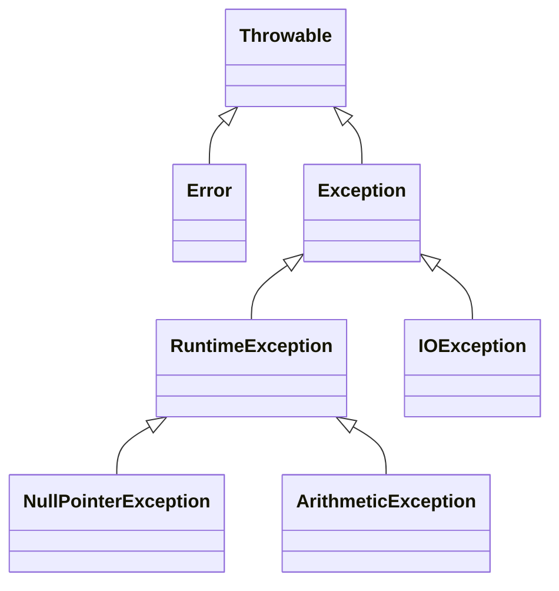

# Exceptions — Handling What Goes Wrong

You've already seen programs crash — a [NullPointerException](/synapse/programming-languages/java/classes-and-objects/references-equality-and-the-object-model), an [ArithmeticException](/synapse/programming-languages/java/first-steps/numbers-and-arithmetic), a bad [parse](/synapse/programming-languages/java/first-steps/input-and-output). An **exception** is Java's mechanism for signaling "something went wrong" and *transferring control* to code that can deal with it, instead of returning error codes that callers forget to check. The defining design choice is the split between **checked** exceptions — recoverable conditions the *compiler forces* you to handle or declare — and **unchecked** ones (`RuntimeException`), which signal programming bugs and carry no such requirement. Around that split sit `try`/`catch` to recover, `throw`/`throws` to raise and declare, `finally` to always clean up, and `try`-with-resources to close things automatically.

<div style="border-left:4px solid #195045;background:rgba(25,80,69,0.08);padding:0.6rem 1rem;border-radius:0 0.5rem 0.5rem 0;margin:1.25rem 0">

💡 **The core idea.**

- An **exception** signals "something went wrong" and **transfers control** to code that can handle it.
- The defining split: **checked** (compiler forces you to handle or declare) vs **unchecked** (`RuntimeException`, bugs).
- Around it sit `try`/`catch`, `throw`/`throws`, `finally`, and `try`-with-resources.

</div>

Every output below was produced by compiling and running the code.

<div style="border-left:4px solid #15448e;background:rgba(21,68,142,0.08);padding:0.6rem 1rem;border-radius:0 0.5rem 0.5rem 0;margin:1.25rem 0">

📘 **How to read the Intuition boxes.** Each one is built in three moves:

1. **The mechanism** — what the compiler and the JVM are *actually doing*.
2. **A concrete bite** — a specific, runnable failure (often a real compiler error), shown so the trap is visible.
3. **The earned rule** — the decision heuristic, now justified rather than asserted, plus its cost.

</div>

---

## Table of contents

1. [`try`/`catch`: recover instead of crash](#1-trycatch-recover-instead-of-crash)
2. [The hierarchy: checked vs unchecked](#2-the-hierarchy-checked-vs-unchecked)
3. [`throw`, `throws`, and custom exceptions](#3-throw-throws-and-custom-exceptions)
4. [`finally`: cleanup that always runs](#4-finally-cleanup-that-always-runs)
5. [`try`-with-resources](#5-try-with-resources)
6. [Mental-model summary](#6-mental-model-summary)
7. [Gotcha checklist](#7-gotcha-checklist)

---

## 1. `try`/`catch`: recover instead of crash

Wrap risky code in a `try`; if it throws, control jumps to a matching `catch`, which handles the problem so the program continues instead of dying.

```java run viz=array:inputs
public class Main {
    public static void main(String[] args) {
        String[] inputs = { "42", "oops", "7" };
        for (String in : inputs) {
            try {
                int n = Integer.parseInt(in);
                System.out.println("parsed: " + n);
            } catch (NumberFormatException e) {
                System.out.println("bad input: " + in);
            }
        }
        System.out.println("done");
    }
}
```

**Output:**
```
parsed: 42
bad input: oops
parsed: 7
done
```

**Analysis.** `parseInt("oops")` threw a `NumberFormatException`; instead of crashing the program (as it did back in Tutorial 5), the `catch` handled it — printed `bad input: oops` — and the loop carried on to `"7"`. The exception transferred control from the failing `parseInt` straight to the `catch`, skipping the `println("parsed: ...")` for that iteration. One bad input no longer sinks the whole program.

**Intuition.**
*Mechanism.* When code in a `try` throws, the JVM abandons the rest of the `try` block and looks for a `catch` whose type matches the exception (here `NumberFormatException`). If one matches, its body runs and execution continues after the whole `try`/`catch`. The thrown object (`e`) carries details — a message, a stack trace.

*Concrete bite.* The win is targeted recovery: only the operations that can fail are guarded, and the handler decides what "recover" means (skip, retry, default). Catch too broadly (`catch (Exception e)`) and you may swallow bugs you'd rather see; catch the *specific* type and unexpected exceptions still propagate.

<div style="border-left:4px solid #195045;background:rgba(25,80,69,0.08);padding:0.6rem 1rem;border-radius:0 0.5rem 0.5rem 0;margin:1.25rem 0">

💡 **Earned rule.** Wrap exactly the operation that can fail in a `try`, and `catch` the *specific* exception you can actually handle. The cost is structure (and the temptation to over-catch); the benefit is that anticipated failures become recoverable events instead of crashes — and the `catch`'s scope documents precisely which line was expected to fail.

</div>

---

## 2. The hierarchy: checked vs unchecked

Every exception is a `Throwable`. The tree splits into `Error` (serious JVM problems you don't catch) and `Exception`. Within `Exception`, the subclass `RuntimeException` and its descendants are **unchecked**; everything else under `Exception` is **checked**. The difference is a compiler rule: checked exceptions *must* be caught or declared.



An **unchecked** exception (a `RuntimeException` like `ArithmeticException`) needs no declaration — code compiles and only fails at run time if it actually throws:

```java run
public class Main {
    static int divide(int a, int b) {
        return a / b;
    }
    public static void main(String[] args) {
        System.out.println(divide(10, 2));
        System.out.println(divide(10, 0));
    }
}
```

**Output** *(prints `5`, then crashes):*
```
5
Exception in thread "main" java.lang.ArithmeticException: / by zero
```

**Analysis.** `divide` can throw `ArithmeticException`, but as an *unchecked* exception it required no `throws` and no `try` — the code compiled freely, ran `divide(10, 2)` fine (`5`), then threw on `divide(10, 0)`. Unchecked exceptions represent bugs (a zero divisor, a null dereference, a bad index) the compiler doesn't force you to anticipate everywhere.

**Intuition.**
*Mechanism.* The compiler tracks *checked* exceptions (subclasses of `Exception` but not `RuntimeException`): any code that can throw one must either `catch` it or declare it with `throws`. `RuntimeException`s and `Error`s are exempt — they could occur almost anywhere, so requiring declarations would be unbearable.

*Concrete bite.* Call something that throws a *checked* exception without handling it and the compiler refuses:

```java run
import java.io.IOException;

public class Main {
    static void risky() throws IOException {
        throw new IOException("disk error");
    }
    public static void main(String[] args) {
        risky();
    }
}
```

**Compiler error:**
```
Main.java:7: error: unreported exception IOException; must be caught or declared to be thrown
        risky();
             ^
```

`IOException` is checked, so calling `risky()` without a `try`/`catch` (or a `throws` on `main`) won't compile — "unreported exception … must be caught or declared." Wrapping the call fixes it: `try { risky(); } catch (IOException e) { … }`.

<div style="border-left:4px solid #195045;background:rgba(25,80,69,0.08);padding:0.6rem 1rem;border-radius:0 0.5rem 0.5rem 0;margin:1.25rem 0">

💡 **Earned rule.** Use checked exceptions for recoverable, expected conditions a caller should consciously handle (a missing file, a network timeout), and unchecked (`RuntimeException`) for programming errors (null, bad argument, bad index) that signal a bug to fix, not a case to handle. The cost is the famous friction of checked exceptions — they propagate up through every signature; the benefit is the compiler guaranteeing that anticipated failures are not silently ignored.

</div>

---

## 3. `throw`, `throws`, and custom exceptions

You raise an exception with `throw`, declare that a method may raise a checked one with `throws`, and define your own exception by extending `Exception` (checked) or `RuntimeException` (unchecked). A custom type names the failure and carries its data.

```java run
class InsufficientFundsException extends Exception {
    InsufficientFundsException(String msg) { super(msg); }
}

class Account {
    int balance = 100;
    void withdraw(int amount) throws InsufficientFundsException {
        if (amount > balance) {
            throw new InsufficientFundsException("need " + amount + ", have " + balance);
        }
        balance -= amount;
    }
}

public class Main {
    public static void main(String[] args) {
        Account acct = new Account();
        try {
            acct.withdraw(50);
            System.out.println("balance: " + acct.balance);
            acct.withdraw(100);
        } catch (InsufficientFundsException e) {
            System.out.println("denied: " + e.getMessage());
        }
    }
}
```

**Output:**
```
balance: 50
denied: need 100, have 50
```

**Analysis.** `withdraw(50)` succeeded (balance `50`); `withdraw(100)` saw `amount > balance` and `throw`-ed an `InsufficientFundsException`, which unwound out of `withdraw` to the `catch`, printing the message it carried. `InsufficientFundsException extends Exception`, so it's *checked* — that's why `withdraw` declares `throws InsufficientFundsException` and the caller must handle it. The custom type makes the failure a named, catchable thing with its own data.

**Intuition.**
*Mechanism.* `throw` creates a control transfer: it stops the current method and propagates the exception up the call stack until a matching `catch` is found (or the program ends). `throws` declares that propagation in the signature. Extending `Exception` vs `RuntimeException` chooses checked vs unchecked for your type.

*Concrete bite.* A custom exception beats a generic one (`throw new Exception("...")`): callers can `catch (InsufficientFundsException e)` specifically, distinguish it from other failures, and the type itself documents the condition. The message (`super(msg)`) and any extra fields travel with it to the handler.

<div style="border-left:4px solid #195045;background:rgba(25,80,69,0.08);padding:0.6rem 1rem;border-radius:0 0.5rem 0.5rem 0;margin:1.25rem 0">

💡 **Earned rule.** `throw` a *specific* exception type (custom when no standard one fits) and declare checked ones with `throws`; extend `Exception` for conditions callers should handle, `RuntimeException` for misuse/bugs. The cost is a class per condition and `throws` plumbing; the benefit is failures that are named, catchable by type, and self-documenting — far better than error codes or a bare boolean return.

</div>

---

## 4. `finally`: cleanup that always runs

A `finally` block attached to a `try` runs **no matter how the `try` exits** — normal completion, a caught exception, or even a `return`. It's where cleanup that must always happen goes.

```java run
public class Main {
    static String process() {
        try {
            return "from try";
        } finally {
            System.out.println("finally ran");
        }
    }
    public static void main(String[] args) {
        System.out.println(process());
    }
}
```

**Output:**
```
finally ran
from try
```

**Analysis.** Read the order: `process()` hit `return "from try"`, but the `finally` ran *before* the method actually returned — so `finally ran` printed first, then the returned value. `finally` intercepts every exit path, including a `return` in the middle of the `try`. That's exactly what makes it reliable for cleanup.

**Intuition.**
*Mechanism.* The JVM guarantees `finally` executes on the way out of the `try`, whatever caused the exit — completion, exception, or `return` (the return value is computed, then `finally` runs, then control leaves). Only a JVM halt (`System.exit`) or power loss skips it.

*Concrete bite.* The `finally ran`-before-`from try` order is the surprise: people expect a `return` to leave immediately. It doesn't — `finally` always gets its turn first, which is the whole point (release the lock, close the file, even if you bailed early). The trap to avoid is *returning* from `finally`, which silently discards the `try`'s exception or value.

<div style="border-left:4px solid #195045;background:rgba(25,80,69,0.08);padding:0.6rem 1rem;border-radius:0 0.5rem 0.5rem 0;margin:1.25rem 0">

💡 **Earned rule.** Put must-always-run cleanup in `finally`, and never `return` (or `throw`) from inside it. The cost is remembering that `finally` runs on every path (so it can mask the `try`'s outcome if you misuse it); the benefit is cleanup that's guaranteed regardless of how the block exits — though for *resources*, the next section's tool is cleaner still.

</div>

---

## 5. `try`-with-resources

Closing resources by hand in `finally` is verbose and easy to get wrong. **`try`-with-resources** declares a resource in parentheses after `try`; any object implementing `AutoCloseable` is **closed automatically** when the block exits, in reverse order of opening.

```java run
class Resource implements AutoCloseable {
    String name;
    Resource(String name) { this.name = name; System.out.println("open " + name); }
    void use() { System.out.println("use " + name); }
    @Override public void close() { System.out.println("close " + name); }
}

public class Main {
    public static void main(String[] args) {
        try (Resource r = new Resource("file")) {
            r.use();
        }
        System.out.println("after");
    }
}
```

**Output:**
```
open file
use file
close file
after
```

**Analysis.** The resource opened, was used, and then `close()` ran *automatically* as the `try` block exited — before `after` printed — with no explicit `finally`. Had `use()` thrown, `close()` would still have run. `try`-with-resources is `finally`-based cleanup specialized for anything `AutoCloseable` (files, streams, connections, locks), generated correctly for you.

**Intuition.**
*Mechanism.* The compiler expands `try (R r = ...)` into a `try`/`finally` that calls `r.close()` on exit, handling the edge cases (closing even if the body throws, suppressing secondary exceptions from `close`). Any `AutoCloseable` qualifies, so the same syntax works for every resource type.

*Concrete bite.* The alternative — a manual `finally { r.close(); }` — is where leaks hide: forget it, get the ordering wrong, or let `close()` itself throw and mask the real error, and a file handle or connection leaks. `try`-with-resources removes that whole class of bug by construction; the close is not optional and not yours to forget.

<div style="border-left:4px solid #195045;background:rgba(25,80,69,0.08);padding:0.6rem 1rem;border-radius:0 0.5rem 0.5rem 0;margin:1.25rem 0">

💡 **Earned rule.** Use `try`-with-resources for anything you must close — files, streams, sockets, connections, locks — and reserve a bare `finally` for cleanup that isn't an `AutoCloseable`. The cost is that your resource type must implement `AutoCloseable`; the benefit is guaranteed, correctly-ordered, exception-safe cleanup with none of the manual `finally` boilerplate that leaks resources when forgotten. (Tutorial 33 uses it for real file I/O.)

</div>

---

## 6. Mental-model summary

| Principle | Consequence |
|---|---|
| `try`/`catch` transfers control to a handler on a throw | An anticipated failure becomes recoverable, not a crash |
| Checked exceptions must be caught or declared; unchecked need not | A checked call without handling won't compile; a `RuntimeException` only fails at run time |
| `throw` raises, `throws` declares, custom types name the failure | Callers can `catch` a specific type and read its data |
| `finally` runs on every exit path, even a `return` | Reliable cleanup — but never `return`/`throw` from inside it |
| `try`-with-resources auto-closes any `AutoCloseable` | Guaranteed, ordered, exception-safe close — no manual `finally` leak |

## 7. Gotcha checklist

<div style="border-left:4px solid #da5233;background:rgba(218,82,51,0.08);padding:0.6rem 1rem;border-radius:0 0.5rem 0.5rem 0;margin:1.25rem 0">

- **`unreported exception …; must be caught or declared` →** a checked exception isn't handled; wrap it in `try`/`catch` or add `throws` to the method.
- **An exception crashes despite a `catch` →** the `catch` type doesn't match (too specific, or the throw is unchecked and uncaught elsewhere); catch the actual type.
- **Cleanup didn't run on an early `return` →** put it in `finally` (or use `try`-with-resources), which runs on every exit path.
- **An exception "disappeared" →** you `return`ed (or threw) from `finally`, discarding the original; never exit from `finally`.
- **A file/stream/connection leaked →** you closed it manually (or forgot); use `try`-with-resources so `close()` is guaranteed.

</div>

---

<div style="border-left:4px solid #6d28d9;background:rgba(109,40,217,0.08);padding:0.6rem 1rem;border-radius:0 0.5rem 0.5rem 0;margin:1.25rem 0">

🧪 **Predict, then check.** Predict the output of a loop that `parseInt`s `{"1", "x", "3"}` inside a `try`/`catch`, summing the valid ones and printing the total. Next, predict whether a method `void read() throws IOException` can be called from `main` without a `try` — and what error you get if not. Finally, predict the exact line order printed by a `try`-with-resources opening two resources `A` then `B` (each printing on open and close), and explain why `B` closes before `A`.

</div>

## Your Turn

Before you move on, check your understanding with the coach — explain the idea, apply it, weigh the trade-offs, then defend your reasoning.

<div class="concept-coach"></div>
