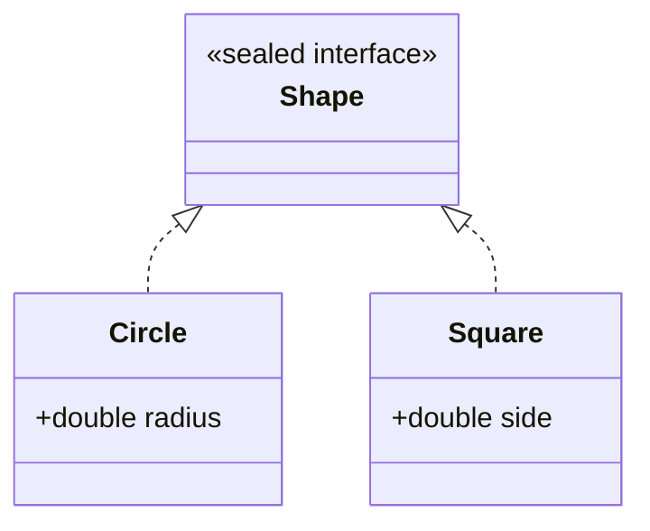

# Sealed Classes & Pattern Matching — A Closed Set of Cases

[Tutorial 21](/synapse/programming-languages/java/core-libraries/enums-and-records) introduced `sealed` (a closed set of subtypes) and `record` (immutable data). This chapter makes them pay off. **Pattern matching** tests a value's type *and* binds it to a variable in one move — `o instanceof Circle c` replaces the old test-then-cast you wrote for [`equals`](/synapse/programming-languages/java/core-libraries/equals-and-hashcode). **Switch pattern matching** (JDK 21) extends the [`switch`](/synapse/programming-languages/java/control-flow/conditionals) to dispatch on type, with **record patterns** that deconstruct a record's components inline. The keystone: over a **sealed** hierarchy the compiler knows every possible subtype, so a `switch` covering them all needs **no `default`** — and if you add a subtype the `switch` doesn't handle, it's a compile error, not a silent fall-through. That combination — `sealed` + `record` + pattern `switch` — is Java's answer to data-oriented programming.

<div style="border-left:4px solid #195045;background:rgba(25,80,69,0.08);padding:0.6rem 1rem;border-radius:0 0.5rem 0.5rem 0;margin:1.25rem 0">

💡 **The core idea.**

- **Pattern matching** tests a type and binds it in one move — `o instanceof Circle c`.
- **Switch pattern matching** dispatches on type; **record patterns** deconstruct components inline.
- Over a **sealed** hierarchy the `switch` is **exhaustive with no `default`** — a forgotten case is a compile error.
- Together `sealed` + `record` + pattern `switch` is Java's data-oriented design.

</div>

Every output below was produced by compiling and running the code.

<div style="border-left:4px solid #15448e;background:rgba(21,68,142,0.08);padding:0.6rem 1rem;border-radius:0 0.5rem 0.5rem 0;margin:1.25rem 0">

📘 **How to read the Intuition boxes.** Each one is built in three moves:

1. **The mechanism** — what the compiler and the JVM are *actually doing*.
2. **A concrete bite** — a specific, runnable failure (often a real compiler error), shown so the trap is visible.
3. **The earned rule** — the decision heuristic, now justified rather than asserted, plus its cost.

</div>

---

## Table of contents

1. [Pattern matching for `instanceof`](#1-pattern-matching-for-instanceof)
2. [Switch pattern matching](#2-switch-pattern-matching)
3. [Exhaustiveness over a sealed hierarchy](#3-exhaustiveness-over-a-sealed-hierarchy)
4. [Record patterns](#4-record-patterns)
5. [Mental-model summary](#5-mental-model-summary)
6. [Gotcha checklist](#6-gotcha-checklist)

---

## 1. Pattern matching for `instanceof`

A **type pattern** — `o instanceof Type var` — tests whether `o` is a `Type` and, if so, binds it to `var` already cast. The binding is in scope wherever the test is known to be true, so the test-and-cast becomes one step.

```java run
public class Main {
    static String describe(Object o) {
        if (o instanceof String s) {
            return "string of length " + s.length();
        } else if (o instanceof Integer i) {
            return "int doubled = " + (i * 2);
        }
        return "unknown";
    }
    public static void main(String[] args) {
        System.out.println(describe("hello"));
        System.out.println(describe(21));
        System.out.println(describe(3.14));
    }
}
```

**Output:**
```
string of length 5
int doubled = 42
unknown
```

**Analysis.** `o instanceof String s` did three things at once: checked the type, cast it, and bound `s` — so the branch could call `s.length()` with no explicit `(String) o`. Likewise `i` was a ready-to-use `Integer`. Compare the old style from [`equals`](/synapse/programming-languages/java/core-libraries/equals-and-hashcode): `if (!(o instanceof Point)) return false; Point p = (Point) o;` — the pattern collapses the redundant cast away.

**Intuition.**
*Mechanism.* The compiler introduces the binding variable only where the pattern is provably true (after a successful `instanceof`, within the `if`'s then-branch). The cast is implicit and guaranteed safe, so a `ClassCastException` from a mismatched manual cast can't happen.

*Concrete bite.* The redundancy it removes is real: the classic `instanceof` + cast names the type twice and risks them drifting apart. The pattern names it once and binds the result, so there's no second cast to get wrong.

<div style="border-left:4px solid #195045;background:rgba(25,80,69,0.08);padding:0.6rem 1rem;border-radius:0 0.5rem 0.5rem 0;margin:1.25rem 0">

💡 **Earned rule.** Use `o instanceof Type var` instead of a separate test and cast wherever you check a type and then use it. The cost is essentially none (it's strictly less code); the benefit is no redundant cast, no chance of a mismatched one, and a binding scoped exactly to where it's valid — and it's the building block for the switch patterns next.

</div>

---

## 2. Switch pattern matching

A `switch` can match on **type patterns** (JDK 21): each `case Type var ->` handles values of that type, binding the variable. This turns a chain of `instanceof`/`else if` into a clean multi-way dispatch.

```java run
public class Main {
    static String describe(Object o) {
        return switch (o) {
            case String s -> "string: " + s;
            case Integer i -> "int: " + i;
            default -> "other";
        };
    }
    public static void main(String[] args) {
        System.out.println(describe("hi"));
        System.out.println(describe(42));
        System.out.println(describe(3.14));
    }
}
```

**Output:**
```
string: hi
int: 42
other
```

**Analysis.** The `switch` matched each value against type patterns: a `String` took the first case (binding `s`), an `Integer` the second, and the `Double` fell to `default`. This is the [arrow `switch` expression](/synapse/programming-languages/java/control-flow/conditionals) generalized from constants to *types* — each case both tests the type and binds a usable variable, producing a value.

**Intuition.**
*Mechanism.* The `switch` evaluates the selector once and tries each `case` pattern top to bottom, running the first that matches and binding its variable. Because it's an *expression*, every path must produce a value — so it needs a `default` here, since `Object` has unboundedly many types.

*Concrete bite.* This replaces the verbose `if (o instanceof A a) … else if (o instanceof B b) …` ladder with a flat, value-producing form. The `default` is required *only* because the selector type (`Object`) is open — close the type set with `sealed`, and the next section removes even that.

<div style="border-left:4px solid #195045;background:rgba(25,80,69,0.08);padding:0.6rem 1rem;border-radius:0 0.5rem 0.5rem 0;margin:1.25rem 0">

💡 **Earned rule.** Use a pattern `switch` to dispatch on a value's type when you'd otherwise write an `instanceof` chain — it's flatter, binds each case, and yields a value. The cost is a `default` for open types (and ordering care: put specific cases before general ones); the benefit is readable type-based dispatch, which becomes exhaustive and `default`-free over a sealed hierarchy.

</div>

---

## 3. Exhaustiveness over a sealed hierarchy

When the selector is a [`sealed`](/synapse/programming-languages/java/core-libraries/enums-and-records) type, the compiler knows *every* permitted subtype. A `switch` that covers them all is **exhaustive with no `default`** — and if it misses one, that's a compile error.

```java run
sealed interface Shape permits Circle, Square {}
record Circle(double radius) implements Shape {}
record Square(double side) implements Shape {}

public class Main {
    static double area(Shape s) {
        return switch (s) {
            case Circle c -> Math.PI * c.radius() * c.radius();
            case Square sq -> sq.side() * sq.side();
        };
    }
    public static void main(String[] args) {
        System.out.printf("%.2f%n", area(new Circle(2.0)));
        System.out.printf("%.2f%n", area(new Square(3.0)));
    }
}
```

**Output:**
```
12.57
9.00
```



**Analysis.** `Shape` permits exactly `Circle` and `Square`, so the `switch` handling both is *complete* — no `default` needed, and the compiler accepted it. Each case bound the matched shape and computed its area. This is the design's payoff: the type system guarantees the `switch` covers every case.

**Intuition.**
*Mechanism.* Because `sealed` closes the subtype set, the compiler can verify a `switch` handles all of them. Exhaustiveness is checked at compile time — completeness is *proven*, not assumed.

*Concrete bite.* Omit a permitted case and it won't compile:

```java run
sealed interface Shape permits Circle, Square {}
record Circle(double radius) implements Shape {}
record Square(double side) implements Shape {}

public class Main {
    static double area(Shape s) {
        return switch (s) {
            case Circle c -> Math.PI * c.radius() * c.radius();
        };
    }
    public static void main(String[] args) { }
}
```

**Compiler error:**
```
Main.java:6: error: the switch expression does not cover all possible input values
        return switch (s) {
```

`Square` is missing, so the `switch` isn't exhaustive over `Shape` — a compile error. And here's the real win: add a *third* permitted shape later, and *every* such `switch` across the codebase stops compiling until you handle it. The compiler becomes a checklist of "places to update when the data model grows."

<div style="border-left:4px solid #195045;background:rgba(25,80,69,0.08);padding:0.6rem 1rem;border-radius:0 0.5rem 0.5rem 0;margin:1.25rem 0">

💡 **Earned rule.** Model a closed set of cases as a `sealed` hierarchy and dispatch with a `default`-free `switch`, letting exhaustiveness be checked. The cost is keeping the `permits` list and the switches in step (which the compiler enforces); the benefit is that adding a case can't silently slip through — unlike a `default`, which would quietly swallow the new type at run time.

</div>

---

## 4. Record patterns

When the cases are [records](/synapse/programming-languages/java/core-libraries/enums-and-records), a **record pattern** deconstructs them: `case Circle(double r) ->` matches a `Circle` *and* binds its component `r` directly, skipping the accessor call.

```java run
sealed interface Shape permits Circle, Rect {}
record Circle(double radius) implements Shape {}
record Rect(double w, double h) implements Shape {}

public class Main {
    static double area(Shape s) {
        return switch (s) {
            case Circle(double r) -> Math.PI * r * r;
            case Rect(double w, double h) -> w * h;
        };
    }
    public static void main(String[] args) {
        System.out.printf("%.2f%n", area(new Circle(2.0)));
        System.out.printf("%.2f%n", area(new Rect(3.0, 4.0)));
    }
}
```

**Output:**
```
12.57
12.00
```

**Analysis.** `case Circle(double r)` matched a `Circle` and bound its `radius` component to `r` in one step — no `c.radius()` accessor call. `Rect(double w, double h)` bound both components at once. The pattern mirrors the record's *shape*: you read its data by destructuring it, exactly the inverse of constructing it.

**Intuition.**
*Mechanism.* A record pattern matches the record type and binds each component by invoking its accessors under the hood, in declaration order. Record patterns nest (`case Line(Point(var x1, var y1), Point p2))`), so you can match and destructure deeply nested data in a single case.

*Concrete bite.* This is the heart of data-oriented programming: `sealed` defines the set of shapes data can take, `record`s define each shape's fields, and a pattern `switch` consumes them by destructuring — exhaustively. The behavior lives *outside* the data (in the `switch`), the opposite of the polymorphism in [inheritance](/synapse/programming-languages/java/robust-oop/inheritance-and-polymorphism), and a better fit when the operations vary more than the data.

<div style="border-left:4px solid #195045;background:rgba(25,80,69,0.08);padding:0.6rem 1rem;border-radius:0 0.5rem 0.5rem 0;margin:1.25rem 0">

💡 **Earned rule.** Combine `sealed` + `record` + record-pattern `switch` to model and process closed sets of structured data — results, expressions, events, shapes. The cost is choosing this style over class polymorphism (use polymorphism when *behavior* travels with each type and subtypes are open; use sealed/patterns when the type set is *closed* and operations are added externally); the benefit is concise, exhaustive, destructuring code the compiler keeps complete.

</div>

---

## 5. Mental-model summary

| Principle | Consequence |
|---|---|
| `o instanceof Type var` tests and binds in one step | Replaces test-then-cast; the binding is scoped to where it's true |
| A pattern `switch` dispatches on type, binding each case | Flattens an `instanceof`/`else if` chain into a value-producing form |
| Over a `sealed` type, a covering `switch` needs no `default` | The compiler proves exhaustiveness; a missing case won't compile |
| Adding a permitted subtype breaks every non-exhaustive `switch` | The compiler lists exactly what to update — no silent `default` swallow |
| Record patterns deconstruct components inline | `case Circle(double r)` binds `radius` directly; patterns nest |

## 6. Gotcha checklist

<div style="border-left:4px solid #da5233;background:rgba(218,82,51,0.08);padding:0.6rem 1rem;border-radius:0 0.5rem 0.5rem 0;margin:1.25rem 0">

- **Still writing `(Type) o` after an `instanceof` →** use `o instanceof Type var` to bind the cast result once.
- **A pattern `switch` demands a `default` you don't want →** the selector type is open; make it `sealed` so the compiler can prove exhaustiveness.
- **`the switch expression does not cover all possible input values` over a sealed type →** a permitted subtype is unhandled; add its case (don't reach for `default`).
- **Adding a subtype silently does the wrong thing →** you used a `default` that swallows it; drop the `default` over a sealed type so the compiler flags every switch.
- **Calling accessors in every case →** use a record pattern (`case Rect(double w, double h)`) to bind components directly.

</div>

---

<div style="border-left:4px solid #6d28d9;background:rgba(109,40,217,0.08);padding:0.6rem 1rem;border-radius:0 0.5rem 0.5rem 0;margin:1.25rem 0">

🧪 **Predict, then check.** Rewrite the §1 `describe` as a pattern `switch` and predict its three outputs. Next, for `sealed interface Json permits JNull, JNum, JStr {}` with records `JNull()`, `JNum(double v)`, `JStr(String s)`, predict whether a `switch` handling only `JNum` and `JStr` compiles, and the error if not. Finally, predict the area printed by `area(new Rect(2, 5))` using the §4 record pattern, and explain why no `default` is needed.

</div>

## Your Turn

Before you move on, check your understanding with the coach — explain the idea, apply it, weigh the trade-offs, then defend your reasoning.

<div class="concept-coach"></div>
