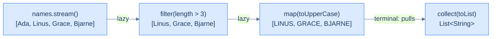

# Functional Java & the Streams API — Pipelines Over Data

[Lambdas](/synapse/programming-languages/java/robust-oop/nested-and-anonymous-classes-and-lambdas) made behavior a value; the **Streams API** uses that to transform sequences declaratively. A **stream** is a *pipeline* of operations over a source — `filter`, `map`, `reduce` chained together — that describes **what** to compute, leaving **how** to iterate to the library. Two ideas make it powerful: pipelines are **lazy** (nothing runs until a *terminal* operation pulls the data through, so work is fused and can short-circuit), and they compose. Alongside streams, **`Optional`** turns "maybe absent" from a [`null` waiting to crash](/synapse/programming-languages/java/classes-and-objects/references-equality-and-the-object-model) into a type you must handle. And **parallel** streams split the work across cores — fast when the operations are stateless, dangerous when they share mutable state.

<div style="border-left:4px solid #195045;background:rgba(25,80,69,0.08);padding:0.6rem 1rem;border-radius:0 0.5rem 0.5rem 0;margin:1.25rem 0">

💡 **The core idea.**

- A **stream** is a pipeline (`filter`/`map`/`reduce`) describing **what** to compute, not how to iterate.
- Pipelines are **lazy** — nothing runs until a terminal operation pulls the data — and they compose.
- **`Optional`** turns "maybe absent" into a type you must handle.
- **Parallel** streams split work across cores — fast when stateless, dangerous when sharing mutable state.

</div>

This builds on [generics](/synapse/programming-languages/java/core-libraries/generics) and [lambdas](/synapse/programming-languages/java/robust-oop/nested-and-anonymous-classes-and-lambdas). Every output below was produced by compiling and running the code.

<div style="border-left:4px solid #15448e;background:rgba(21,68,142,0.08);padding:0.6rem 1rem;border-radius:0 0.5rem 0.5rem 0;margin:1.25rem 0">

📘 **How to read the Intuition boxes.** Each one is built in three moves:

1. **The mechanism** — what the compiler and the JVM are *actually doing*.
2. **A concrete bite** — a specific, runnable failure (often a real compiler error), shown so the trap is visible.
3. **The earned rule** — the decision heuristic, now justified rather than asserted, plus its cost.

</div>

---

## Table of contents

1. [A stream pipeline](#1-a-stream-pipeline)
2. [`reduce` and collectors](#2-reduce-and-collectors)
3. [Lazy evaluation](#3-lazy-evaluation)
4. [`Optional`](#4-optional)
5. [Parallel streams and their hazards](#5-parallel-streams-and-their-hazards)
6. [Mental-model summary](#6-mental-model-summary)
7. [Gotcha checklist](#7-gotcha-checklist)

---

## 1. A stream pipeline

`collection.stream()` starts a pipeline. **Intermediate** operations (`filter`, `map`) each return a new stream, so they chain; a **terminal** operation (`collect`) ends it and produces a result.

```java run viz=array:result
import java.util.List;
import java.util.stream.Collectors;

public class Main {
    public static void main(String[] args) {
        List<String> names = List.of("Ada", "Linus", "Grace", "Bjarne");
        List<String> result = names.stream()
            .filter(n -> n.length() > 3)
            .map(String::toUpperCase)
            .collect(Collectors.toList());
        System.out.println(result);
    }
}
```

**Output:**
```
[LINUS, GRACE, BJARNE]
```



**Analysis.** `filter` kept names longer than 3 characters (dropping `"Ada"`), `map` upper-cased each, and `collect(toList())` gathered them into a `List`. The chain reads as a description of the transformation — *keep the long names, upper-case them, collect* — with no loop, no index, no intermediate variables. Each `lambda`/method reference is the behavior for one step.

**Intuition.**
*Mechanism.* `stream()` produces a stream object; each intermediate op wraps it in another stream that records the operation but does nothing yet. Only the terminal `collect` drives elements through the whole chain. The pipeline expresses *what*; the library owns the *how* (the iteration).

*Concrete bite.* A stream is single-use and not a collection: after a terminal op it's consumed, and re-using it throws `IllegalStateException: stream has already been operated upon or closed`. A stream is a *view of a computation*, not data you can revisit — call `stream()` again for a fresh pipeline.

<div style="border-left:4px solid #195045;background:rgba(25,80,69,0.08);padding:0.6rem 1rem;border-radius:0 0.5rem 0.5rem 0;margin:1.25rem 0">

💡 **Earned rule.** Use a stream pipeline when you're transforming or querying a sequence (`filter`/`map`/`collect`); keep an explicit loop for side-effecting iteration or when a plain `for` is clearer. The cost is a new mental model (and that streams are one-shot); the benefit is declarative, composable data processing that reads as intent and that the library can optimize.

</div>

---

## 2. `reduce` and collectors

Terminal operations turn a stream into a result. `reduce` folds elements into a single value with a combining function; **collectors** gather them into structures — a `List`, a joined `String`, a grouping `Map`.

```java run viz=hashmap:byParity
import java.util.List;
import java.util.Map;
import java.util.stream.Collectors;

public class Main {
    public static void main(String[] args) {
        List<Integer> nums = List.of(1, 2, 3, 4, 5);
        int sum = nums.stream().reduce(0, Integer::sum);
        String joined = nums.stream().map(String::valueOf).collect(Collectors.joining(", "));
        Map<String, List<Integer>> byParity =
            nums.stream().collect(Collectors.groupingBy(n -> n % 2 == 0 ? "even" : "odd"));
        System.out.println(sum);
        System.out.println(joined);
        System.out.println("odd=" + byParity.get("odd"));
        System.out.println("even=" + byParity.get("even"));
    }
}
```

**Output:**
```
15
1, 2, 3, 4, 5
odd=[1, 3, 5]
even=[2, 4]
```

**Analysis.** `reduce(0, Integer::sum)` folded `1..5` into `15` — starting at `0`, combining each element with `sum`. `Collectors.joining(", ")` produced `"1, 2, 3, 4, 5"`. `Collectors.groupingBy(...)` built a `Map` from each element's group key (`"odd"`/`"even"`) to the list of elements in that group — the stream equivalent of [the counting/grouping idioms](/synapse/programming-languages/java/core-libraries/sets-and-maps), in one expression.

**Intuition.**
*Mechanism.* `reduce(identity, combiner)` repeatedly applies the combiner, starting from the identity — so the identity must be neutral (`0` for sum, `""` for concatenation). A `Collector` is a recipe for accumulating elements into a container; `groupingBy`, `toList`, `joining`, `counting`, `partitioningBy` cover most needs.

*Concrete bite.* The identity must truly be neutral: `reduce(1, Integer::sum)` would give `16`, not `15`, because `1` is the identity for *multiplication*, not addition. The seed is part of the computation, the same lesson as the [accumulator-seed trap](/synapse/programming-languages/java/control-flow/loop-control-and-patterns).

<div style="border-left:4px solid #195045;background:rgba(25,80,69,0.08);padding:0.6rem 1rem;border-radius:0 0.5rem 0.5rem 0;margin:1.25rem 0">

💡 **Earned rule.** Use `reduce` for a single folded value with a neutral identity, and `Collectors` for structured results (`toList`, `joining`, `groupingBy`). The cost is learning the collector vocabulary; the benefit is that aggregation, grouping, and joining — loops you'd otherwise write by hand — become one declarative, correct line.

</div>

---

## 3. Lazy evaluation

Intermediate operations are **lazy**: they don't process anything until a terminal operation runs, and then elements flow through one at a time. This lets the pipeline **short-circuit** — stop as soon as the answer is known.

```java run
import java.util.List;

public class Main {
    public static void main(String[] args) {
        List<Integer> nums = List.of(1, 2, 3, 4, 5);
        var first = nums.stream()
            .peek(n -> System.out.println("peek " + n))
            .filter(n -> n % 2 == 0)
            .findFirst();
        System.out.println("found: " + first.get());
    }
}
```

**Output:**
```
peek 1
peek 2
found: 2
```

**Analysis.** `peek` prints each element as it flows by, and the output stops at `peek 2` — the pipeline never looked at `3`, `4`, or `5`. `findFirst` needed only the first even number, so once `filter` let `2` through, the whole pipeline stopped: laziness plus short-circuiting meant elements `3..5` were never processed. Had this been a loop with a separate filtered list, all five would have been visited.

**Intuition.**
*Mechanism.* Elements are pulled through the pipeline by the terminal operation, one at a time, top to bottom — `peek(1)`, `filter` rejects; `peek(2)`, `filter` accepts, `findFirst` is satisfied and halts. Nothing is materialized between stages, and a short-circuiting terminal (`findFirst`, `anyMatch`, `limit`) stops early.

*Concrete bite.* The `peek` output is the proof: only `1` and `2` were processed. This is why streams handle huge or even infinite sources efficiently — `Stream.iterate(...).filter(...).findFirst()` examines just enough elements, where an eager loop over a materialized list would do all the work first.

<div style="border-left:4px solid #195045;background:rgba(25,80,69,0.08);padding:0.6rem 1rem;border-radius:0 0.5rem 0.5rem 0;margin:1.25rem 0">

💡 **Earned rule.** Lean on laziness for efficiency — put cheap, selective `filter`s early and use short-circuiting terminals (`findFirst`, `anyMatch`, `limit`) to stop as soon as possible. The cost is that lazy pipelines with side effects (like `peek`) run in a non-obvious order and only as far as needed (so `peek` is for debugging, not logic); the benefit is that only the necessary work runs, fused into a single pass.

</div>

---

## 4. `Optional`

A stream query that might find nothing returns an **`Optional<T>`** — a container that holds a value or is empty. It makes "absent" a *type*, forcing you to handle the missing case instead of risking a [`NullPointerException`](/synapse/programming-languages/java/classes-and-objects/references-equality-and-the-object-model).

```java run
import java.util.Optional;
import java.util.List;

public class Main {
    public static void main(String[] args) {
        List<String> names = List.of("Ada", "Linus");
        Optional<String> found = names.stream().filter(n -> n.startsWith("L")).findFirst();
        System.out.println(found.isPresent());
        System.out.println(found.orElse("none"));
        Optional<String> missing = names.stream().filter(n -> n.startsWith("Z")).findFirst();
        System.out.println(missing.orElse("none"));
    }
}
```

**Output:**
```
true
Linus
none
```

**Analysis.** The first query found `"Linus"`, so `found` was present and `orElse` returned the value. The second matched nothing, so `missing` was empty and `orElse("none")` supplied the fallback. The *type* `Optional<String>` made the possibility of absence visible in the signature — you can't accidentally use a missing value as if it were there, the way you can with `null`.

**Intuition.**
*Mechanism.* `Optional` wraps "value or nothing." `orElse`/`orElseGet` supply a default, `map`/`filter` transform the value only if present, `ifPresent` runs an action only if present — all without ever exposing a raw `null`.

*Concrete bite.* Calling `get()` on an empty `Optional` defeats the purpose and throws:

```java run
import java.util.Optional;

public class Main {
    public static void main(String[] args) {
        Optional<String> empty = Optional.empty();
        System.out.println(empty.get());
    }
}
```

**Output** *(a thrown exception):*
```
Exception in thread "main" java.util.NoSuchElementException: No value present
```

`empty.get()` is the `Optional` equivalent of dereferencing `null` — it asserts a value is present when it isn't. Use `orElse`, `orElseThrow(...)` with a meaningful exception, or `ifPresent` instead of a bare `get()`.

<div style="border-left:4px solid #195045;background:rgba(25,80,69,0.08);padding:0.6rem 1rem;border-radius:0 0.5rem 0.5rem 0;margin:1.25rem 0">

💡 **Earned rule.** Return `Optional<T>` from methods that may find nothing, and consume it with `orElse`/`map`/`ifPresent` — never a naked `get()`. The cost is wrapping/unwrapping and that `Optional` is for *return values*, not fields or parameters; the benefit is that "this might be absent" is checked by the compiler at the boundary, turning a class of runtime `NullPointerException`s into handled cases.

</div>

---

## 5. Parallel streams and their hazards

`parallelStream()` (or `.parallel()`) splits the work across CPU cores. It's a near-free speedup for **stateless** operations — but a trap if the pipeline touches **shared mutable state**, because the threads race.

```java run
import java.util.stream.LongStream;

public class Main {
    public static void main(String[] args) {
        long sum = LongStream.rangeClosed(1, 1_000_000).parallel().sum();
        System.out.println(sum);
    }
}
```

**Output:**
```
500000500000
```

**Analysis.** The parallel `sum` over one million numbers gave the correct `500000500000`, deterministically — because `sum` is a proper reduction: each core sums a chunk, and the chunks combine associatively with no shared state. This is the safe, idiomatic way to parallelize: a stateless pipeline ending in a reduction or collector.

**Intuition.**
*Mechanism.* A parallel stream splits the source into chunks, processes them on a thread pool, and combines the partial results. This is correct only when the operations are stateless and the combination is associative — `sum`, `map`, `filter`, `collect` into a concurrent collector all qualify.

*Concrete bite.* Touch shared mutable state and the threads corrupt it — a **data race** with no error, just wrong answers:

```java run
import java.util.stream.IntStream;

public class Main {
    public static void main(String[] args) {
        int[] counter = {0};
        IntStream.range(0, 1_000_000).parallel().forEach(n -> counter[0]++);
        System.out.println(counter[0]);
    }
}
```

**Output** *(illustrative — the value changes every run and is essentially never `1000000`; three real runs printed `119992`, `313565`, `154427`):*
```
119992
```

Many threads ran `counter[0]++` — read, increment, write — at once, so updates overwrote each other and most were lost. The "count" is wildly wrong and *different every run*. There's no exception; just silent corruption. (The fix is a proper reduction or an atomic — the subject of the concurrency chapters next.)

<div style="border-left:4px solid #195045;background:rgba(25,80,69,0.08);padding:0.6rem 1rem;border-radius:0 0.5rem 0.5rem 0;margin:1.25rem 0">

💡 **Earned rule.** Parallelize only stateless pipelines that end in a reduction/collector, and on large enough data to outweigh the splitting overhead; never let a parallel stream write to shared mutable state. The cost is that parallelism is correct only under those conditions (and can be *slower* on small or order-sensitive data); the benefit, when they hold, is multi-core speedup from changing one word — `stream()` to `parallelStream()`.

</div>

---

## 6. Mental-model summary

| Principle | Consequence |
|---|---|
| A stream is a lazy pipeline: intermediate ops chain, a terminal op runs it | Describe *what* to compute; the library owns the iteration; streams are one-shot |
| `reduce` folds to a value; `Collectors` build structures | The `reduce` identity must be neutral; `groupingBy`/`joining`/`toList` cover most needs |
| Laziness + short-circuiting process only what's needed | `findFirst`/`limit`/`anyMatch` stop early; handles huge/infinite sources |
| `Optional<T>` makes "absent" a type | Consume with `orElse`/`map`/`ifPresent`; a bare `get()` on empty throws |
| Parallel streams need stateless ops and a reduction | Shared mutable state races silently — wrong, nondeterministic results |

## 7. Gotcha checklist

<div style="border-left:4px solid #da5233;background:rgba(218,82,51,0.08);padding:0.6rem 1rem;border-radius:0 0.5rem 0.5rem 0;margin:1.25rem 0">

- **`IllegalStateException: stream has already been operated upon` →** a stream is single-use; call `stream()` again for a fresh pipeline.
- **`reduce` gives a wrong total →** the identity isn't neutral (`0` for sum, not `1`); fix the seed.
- **A `peek` printed in a surprising order / not at all →** streams are lazy and short-circuit; use `peek` only for debugging, not logic.
- **`NoSuchElementException: No value present` →** `get()` on an empty `Optional`; use `orElse`/`orElseThrow`/`ifPresent`.
- **A parallel stream gives wrong, varying results →** it writes shared mutable state (a data race); use a reduction/collector, or don't parallelize.

</div>

---

<div style="border-left:4px solid #6d28d9;background:rgba(109,40,217,0.08);padding:0.6rem 1rem;border-radius:0 0.5rem 0.5rem 0;margin:1.25rem 0">

🧪 **Predict, then check.** Predict the output of `Stream.of(1,2,3,4).filter(n -> n % 2 == 0).map(n -> n * n).collect(Collectors.toList())`. Next, predict the `peek` lines printed by `Stream.of(10,20,30).peek(System.out::println).map(n -> n + 1).findFirst()`. Finally, predict whether `List.of("a","bb","ccc").stream().filter(s -> s.length() > 5).findFirst()` is present, and what `.orElse("none")` returns — explaining why `Optional` is safer here than returning `null`.

</div>

## Your Turn

Before you move on, check your understanding with the coach — explain the idea, apply it, weigh the trade-offs, then defend your reasoning.

<div class="concept-coach"></div>
