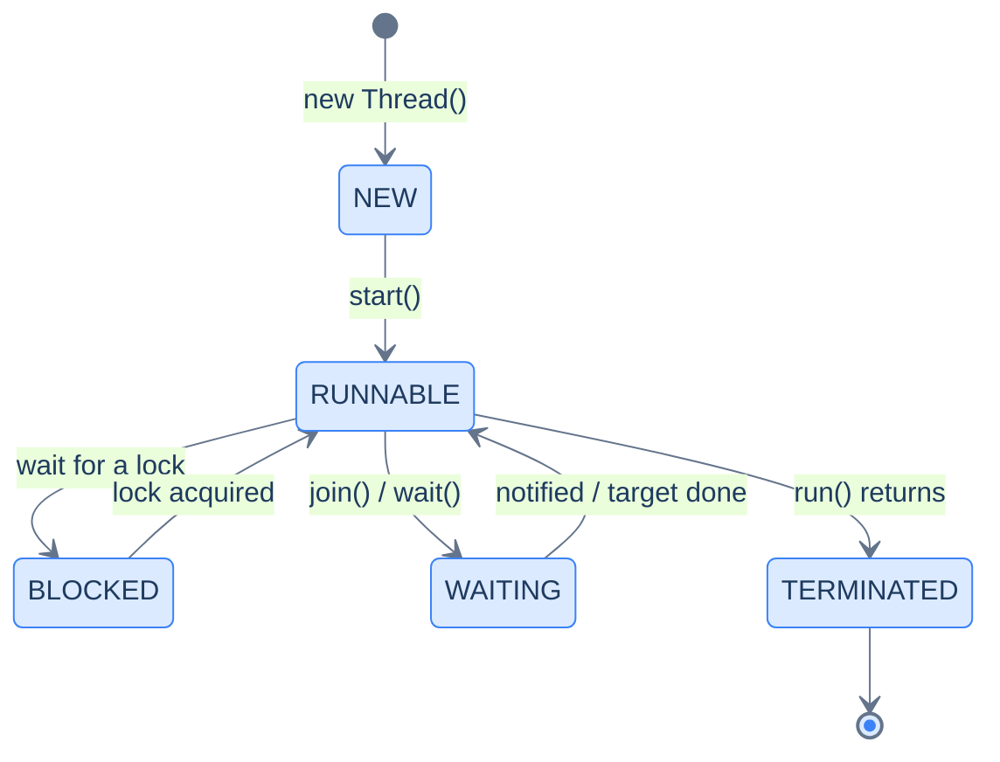
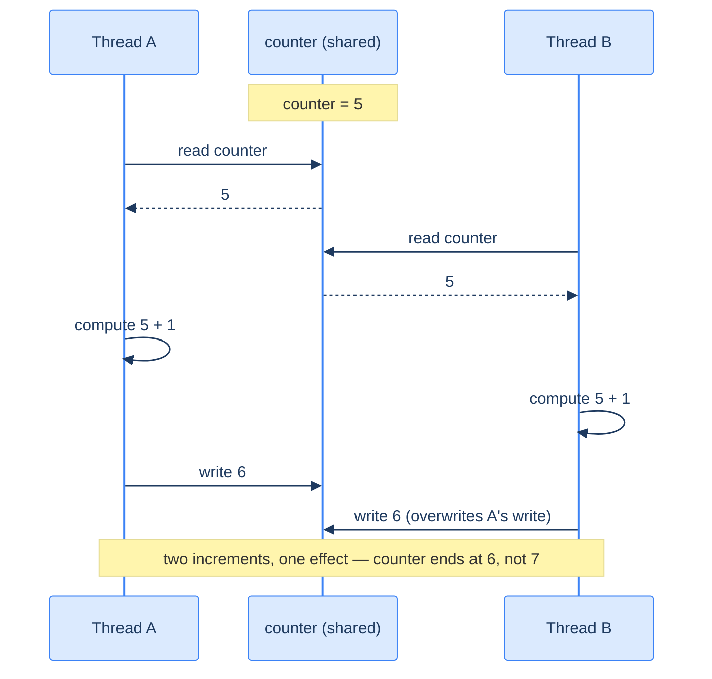
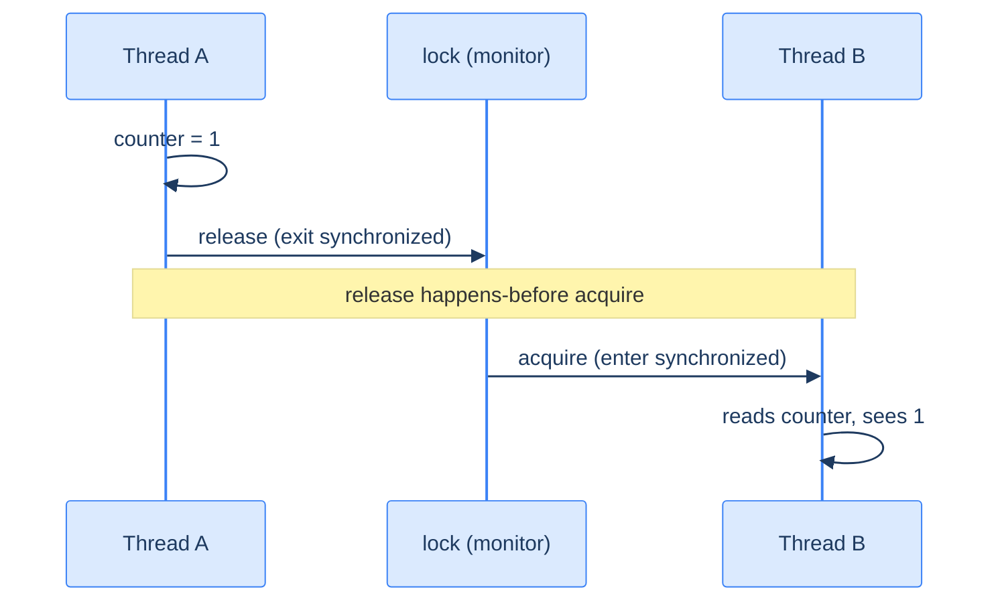

# Concurrency: the Basics — Threads and Shared State

A **thread** is an independent path of execution; with several, your program does things *at the same time* — on multiple cores, truly in parallel. That's power and peril. The moment two threads touch the same mutable data without coordination, you get a **race condition**: operations interleave, updates clobber each other, and one thread may not even *see* another's writes. These bugs are the worst kind — silent, nondeterministic, often invisible in testing and catastrophic in production. The fix is coordination: **`synchronized`** enforces that only one thread at a time runs a critical section (mutual exclusion) *and* — through the **Java Memory Model's** happens-before rule — guarantees that one thread's writes become visible to the next. This chapter is the foundation; [coordination between threads](/synapse/programming-languages/java/advanced/concurrency-coordination) — waiting, multiple locks, and the synchronizers — comes next, then the higher-level tools and the memory model in depth.

This connects [shared references](/synapse/programming-languages/java/classes-and-objects/references-equality-and-the-object-model), [lambdas as `Runnable`s](/synapse/programming-languages/java/robust-oop/nested-and-anonymous-classes-and-lambdas), and the [parallel-stream race](/synapse/programming-languages/java/advanced/functional-java-and-streams) you just saw. Because thread scheduling is nondeterministic, some outputs below vary per run and are **labeled illustrative** — each shows one real captured run.

> **How to read the Intuition boxes.** Each one is built in three moves: (1) the **mechanism** — what the compiler and the JVM are *actually doing*; (2) a **concrete bite** — a specific, runnable failure (often a real compiler error), shown so the trap is visible; (3) the **earned rule** — the decision heuristic, now justified rather than asserted, plus its cost.

---

## Table of contents

1. [Threads and `Runnable`](#1-threads-and-runnable)
2. [Race conditions](#2-race-conditions)
3. [`synchronized`](#3-synchronized)
4. [The Java Memory Model and happens-before](#4-the-java-memory-model-and-happens-before)
5. [Mental-model summary](#5-mental-model-summary)
6. [Gotcha checklist](#6-gotcha-checklist)

---

## 1. Threads and `Runnable`

Before the API, the thing itself. Your program runs inside a **process** — the operating system gives it a private address space (its heap, its loaded classes) and at least one **thread**. A thread is the unit the OS actually *schedules*: a call stack (about 1 MB by default in the JVM) plus a saved instruction position, which the OS can pause and resume at any moment — **preemptively**, without asking. A Java `Thread` object is a thin handle on one of these real OS threads. That's why two Java threads on two cores are *genuinely* running at the same instant, and why everything in this chapter follows from one fact: **all threads in a process share the same heap**. Separate stacks, shared objects.

You can watch the layering directly — one process id, several thread ids:

```java run
public class Main {
    public static void main(String[] args) throws InterruptedException {
        System.out.println("main   -> pid=" + ProcessHandle.current().pid()
                + " threadId=" + Thread.currentThread().threadId());
        Thread t = new Thread(() -> System.out.println("worker -> pid=" + ProcessHandle.current().pid()
                + " threadId=" + Thread.currentThread().threadId()), "worker-1");
        t.start();
        t.join();
    }
}
```

**Output** *(illustrative — the pid and thread ids vary per run; this is one real run):*
```
main   -> pid=82858 threadId=1
worker -> pid=82858 threadId=20
```

**Analysis.** Same `pid`, different `threadId`s: both threads live inside one process, so they see the same heap — the same objects, the same `static` fields. The worker isn't a copy of your program; it's a second path of execution *through the same memory*. That shared heap is the whole story of this chapter: it's what makes passing data between threads free, and what makes *mutating* data between threads dangerous.

Now the API. A `Thread` runs a `Runnable` (a functional interface — so a lambda) on its own path of execution. `start()` launches it concurrently with the caller; `join()` waits for it to finish.

```java run
public class Main {
    public static void main(String[] args) throws InterruptedException {
        Runnable task = () -> System.out.println("worker thread: " + Thread.currentThread().getName());
        Thread t = new Thread(task, "worker-1");
        t.start();
        t.join();
        System.out.println("main thread: " + Thread.currentThread().getName());
    }
}
```

**Output:**
```
worker thread: worker-1
main thread: main
```



**Analysis.** `t.start()` ran `task` on a new thread named `worker-1`; `t.join()` made `main` wait until it finished, so the two lines printed in a fixed order. (Without `join`, `main` could print first, or interleave.) The diagram is a thread's lifecycle: `NEW` until `start()`, then cycling through `RUNNABLE` (and `BLOCKED`/`WAITING` when contending for a lock or waiting on `join`/`wait`) until `run()` returns and it's `TERMINATED`. Note `start()` (runs concurrently) vs calling `task.run()` directly (which would run on the *current* thread — no concurrency).

**Intuition.**
*Mechanism.* `start()` asks the OS/JVM to schedule a new thread that executes the `Runnable`'s `run()`. The scheduler decides when each runnable thread actually runs, interleaving them however it likes — so *order between threads is not guaranteed* unless you coordinate (e.g., `join`).

*Concrete bite.* `start()` and `run()` are different: `t.run()` just calls the method on the current thread (no new thread, no concurrency); only `t.start()` creates one. Calling `run()` thinking you've gone parallel is a classic beginner mistake — the code works, sequentially, hiding the bug until concurrency was the point.

*Earned rule.* Create threads with a `Runnable` and `start()` them; use `join()` to wait for results. The cost is that you now own coordination — without it, inter-thread order and visibility are undefined; the benefit is genuine parallelism. (In practice you'll rarely manage raw `Thread`s — the next chapter's executors do it better — but the model here underlies all of it.)

---

## 2. Race conditions

When multiple threads update the same shared variable without coordination, their operations interleave and updates are lost. Here four threads each increment a shared `counter` 100,000 times — the "correct" total is 400,000.

```java run
public class Main {
    static int counter = 0;
    public static void main(String[] args) throws InterruptedException {
        Thread[] threads = new Thread[4];
        for (int i = 0; i < 4; i++) {
            threads[i] = new Thread(() -> {
                for (int j = 0; j < 100000; j++) counter++;
            });
            threads[i].start();
        }
        for (Thread t : threads) t.join();
        System.out.println(counter);
    }
}
```

**Output** *(illustrative — the value is wrong and **changes every run**; four real runs printed `117273`, `112409`, `109596`, `120745`):*
```
117273
```

Here is one lost update, frame by frame — the collision the timing above produces hundreds of thousands of times:



**Analysis.** The result is nowhere near 400,000, and it differs each run. The culprit is that `counter++` is *not atomic* — it's three steps: read `counter`, add one, write it back. The diagram traces one collision: both threads read `5` before either writes, both compute `6`, and B's write lands on top of A's — two increments collapse into one. The scheduler can preempt a thread *between any two of those steps* (that's what preemptive scheduling from §1 means), so across millions of interleavings, hundreds of thousands of updates are lost. Nothing threw; the program ran "successfully" and produced a silently wrong number.

**Intuition.**
*Mechanism.* `counter++` compiles to read-modify-write. With no coordination, the scheduler can interleave those steps across threads arbitrarily, so one thread's write is overwritten by another that read the stale value — a **lost update**. The same lack of coordination also allows **stale reads** (a thread not seeing another's recent write at all).

*Concrete bite.* The varying, sub-400,000 outputs are the race made visible. This is exactly the [parallel-stream data race](/synapse/programming-languages/java/advanced/functional-java-and-streams) from the last chapter, now in raw threads — and it's why "it passed in testing" means little for concurrent code: a race may manifest one run in a thousand, then constantly under production load.

*Earned rule.* Treat *any* unsynchronized access to shared mutable state from multiple threads as a bug, even if it seems to work. The cost of recognizing this is pessimism about shared state; the benefit is avoiding the hardest category of bug — nondeterministic, test-evading corruption — by coordinating access, which the next section does.

---

## 3. `synchronized`

`synchronized` makes a method (or block) a **critical section**: only one thread can hold the object's lock and execute it at a time. Wrapping the increment in a `synchronized` method serializes the updates, and the race disappears.

```java run
public class Main {
    static int counter = 0;
    static synchronized void increment() { counter++; }

    public static void main(String[] args) throws InterruptedException {
        Thread[] threads = new Thread[4];
        for (int i = 0; i < 4; i++) {
            threads[i] = new Thread(() -> {
                for (int j = 0; j < 100000; j++) increment();
            });
            threads[i].start();
        }
        for (Thread t : threads) t.join();
        System.out.println(counter);
    }
}
```

**Output:**
```
400000
```

**Analysis.** Now the total is **always** exactly 400,000, run after run. `synchronized` ensures only one thread executes `increment()` at a time, so the read-modify-write completes atomically — no two threads interleave inside it, no updates are lost. The same code that gave random wrong answers is now correct and deterministic, with the one keyword the difference.

**Intuition.**
*Mechanism.* Every object has an intrinsic **lock** (monitor). A `synchronized` method acquires the lock on entry and releases it on exit; a second thread trying to enter must wait (`BLOCKED`) until the lock is free. This serializes the critical section — at most one thread inside at a time — making the compound `counter++` effectively atomic.

*Concrete bite.* The boundary: `synchronized` only protects threads locking on the *same* monitor. Two methods synchronized on *different* objects don't exclude each other, and an unsynchronized access to the same field still races. Locking is a discipline every accessor must follow — one unguarded write reopens the race.

*Earned rule.* Guard every read and write of shared mutable state with synchronization on a *consistent* lock (a `synchronized` method/block, or the higher-level tools next chapter). The cost is contention and reduced parallelism (threads queue at the lock) plus deadlock risk if you hold multiple locks carelessly; the benefit is correctness — atomic critical sections instead of silent corruption.

---

## 4. The Java Memory Model and happens-before

`synchronized` did two jobs: mutual exclusion *and* **visibility**. The **Java Memory Model** (JMM) defines when one thread's writes are guaranteed visible to another — via the **happens-before** relation. Without such a relationship, a thread may read stale, cached values; with one, it's guaranteed to see the other's writes.



**Analysis.** The diagram is the rule that makes §3 correct beyond mere mutual exclusion: when Thread A *releases* a lock and Thread B later *acquires the same lock*, A's release **happens-before** B's acquire — so every write A made before releasing is guaranteed visible to B after acquiring. That's why each `increment()` sees the running total: the lock both serializes the updates *and* publishes them. Without a happens-before edge (the §2 race), B could read a value still sitting in A's CPU cache, never flushed to main memory.

**Intuition.**
*Mechanism.* The JMM lets compilers and CPUs reorder and cache memory operations for speed — so a write by one thread isn't automatically visible to another. **Happens-before** edges (a lock release→acquire on the same monitor, a `volatile` write→read, `Thread.start`, `Thread.join`) are the *only* guarantees that one thread's writes are seen by another. No edge, no guarantee.

*Concrete bite.* This is why a shared flag without `volatile` or a lock can spin forever: one thread sets `stop = true`, but the reader, with no happens-before edge, keeps reading a cached `false`. The bug isn't atomicity (a boolean write is atomic) — it's *visibility*, and only a happens-before relationship fixes it (the `volatile` and atomics of the next-but-one chapter).

*Earned rule.* Establish a happens-before relationship — `synchronized`, `volatile`, or the `java.util.concurrent` tools — for *every* piece of state shared between threads, not just to prevent lost updates but to guarantee visibility. The cost is that you must think in terms of happens-before edges rather than "the variable just has a value"; the benefit is that your reads are guaranteed to see the writes you depend on, instead of stale cached data.

---

## 5. Mental-model summary

| Principle | Consequence |
|---|---|
| A Java thread wraps a real OS thread: own stack, shared heap, preempted at any moment | Data passes between threads for free — and mutations collide unless coordinated |
| `start()` runs a `Runnable` concurrently; `join()` waits for it | Inter-thread order is undefined without coordination; `run()` ≠ `start()` |
| Shared mutable state without coordination races | `counter++` (read-modify-write) loses updates — silent, nondeterministic |
| `synchronized` serializes a critical section on an object's lock | One thread at a time; the compound update becomes atomic and correct |
| The JMM's happens-before defines cross-thread visibility | Lock release→acquire (and `volatile`, `start`/`join`) publish writes |
| No happens-before edge → a thread may read stale, cached values | A shared flag without `volatile`/lock can spin forever |

## 6. Gotcha checklist

- **A concurrent counter/total is wrong and varies per run →** a race on shared state; guard updates with `synchronized` (or an atomic).
- **`run()` didn't run in parallel →** you called `run()` (same thread); use `start()` to create a new thread.
- **`synchronized` "didn't help" →** the threads lock on *different* monitors, or some access is unsynchronized; use a consistent lock for every access.
- **A thread doesn't see another's update (spins forever) →** a visibility bug with no happens-before edge; make the field `volatile` or access it under a lock.
- **It works in tests, fails under load →** races are nondeterministic; reason about correctness (happens-before), don't rely on testing alone.
- **You asserted on thread ids or output order →** ids and interleavings vary per run (only `pid` is shared); never assert cross-thread order without a coordination point like `join`.

---

*Predict, then check.* Predict whether two threads each doing `counter += 1` a million times, unsynchronized, can ever print exactly `2000000` — and why it usually won't. Next, predict the difference between `t.start()` and `t.run()` for a task that prints the current thread's name. Finally, explain in terms of happens-before why a `boolean running` flag set by one thread and polled by another should be `volatile`, even though a boolean write is atomic.

## Your Turn

Before you move on, check your understanding with the coach — explain the idea, apply it, weigh the trade-offs, then defend your reasoning.

<div class="concept-coach"></div>
