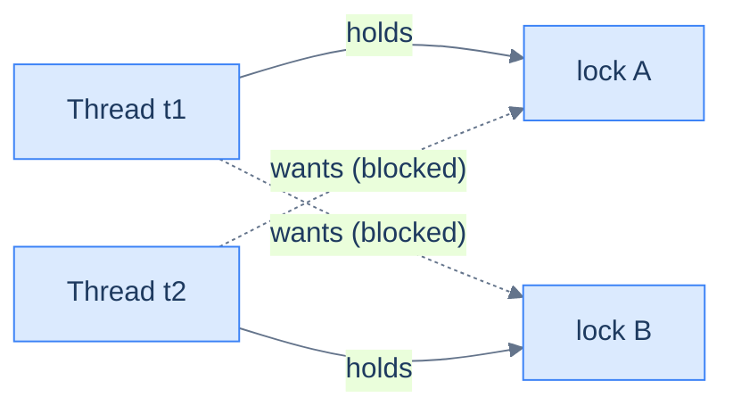

# Concurrency: Coordination — Waiting, Multiple Locks & Synchronizers

The last chapter solved *exclusion*: `synchronized` keeps two threads from corrupting shared state by being in the same critical section at once. But most real concurrent programs need something more: threads that **wait for each other**. A consumer must wait until a producer has made something; a coordinator must wait until all workers finish; a pool must make requests wait until a connection is free. The thesis: **coordination is "wait until some condition on shared state becomes true," and everything in this chapter — `wait`/`notify`, `Condition`, latches, semaphores, blocking queues — is that one idea at increasing levels of packaging.** Learn the raw form first and the library forms stop being magic; learn the failure mode of holding *two* locks — deadlock — and you'll understand why the library forms exist.

This builds directly on [threads, races, and `synchronized`](/synapse/programming-languages/java/advanced/concurrency-the-basics) and sets up the [executors and virtual threads](/synapse/programming-languages/java/advanced/concurrency-high-level-and-virtual-threads) of the next chapter, which are built from these primitives. Thread scheduling is nondeterministic, so several outputs below vary per run and are **labeled illustrative** — each shows one real captured run; the deadlock in §2 is shown statically because a deadlocked program never finishes (the capture explains how we proved it).

> **How to read the Intuition boxes.** Each one is built in three moves: (1) the **mechanism** — what the compiler and the JVM are *actually doing*; (2) a **concrete bite** — a specific, runnable failure (often a real compiler error), shown so the trap is visible; (3) the **earned rule** — the decision heuristic, now justified rather than asserted, plus its cost.

---

## Table of contents

1. [Waiting for a condition: `wait`, `notify`, and guarded blocks](#1-waiting-for-a-condition-wait-notify-and-guarded-blocks)
2. [Deadlock: the price of multiple locks](#2-deadlock-the-price-of-multiple-locks)
3. [`ReentrantLock`: a lock as an object](#3-reentrantlock-a-lock-as-an-object)
4. [Synchronizers: `CountDownLatch`, `Semaphore`, `CyclicBarrier`](#4-synchronizers-countdownlatch-semaphore-cyclicbarrier)
5. [`BlockingQueue`: coordination you don't have to write](#5-blockingqueue-coordination-you-dont-have-to-write)
6. [Mental-model summary](#6-mental-model-summary)
7. [Gotcha checklist](#7-gotcha-checklist)

---

## 1. Waiting for a condition: `wait`, `notify`, and guarded blocks

Suppose a producer thread puts items into a bounded buffer and a consumer takes them out. The producer must wait *while the buffer is full*; the consumer must wait *while it's empty*. You can't do this with `synchronized` alone — a thread stuck inside a critical section waiting for the buffer to change would hold the lock forever, and no other thread could get in to change it. The monitor from last chapter has a built-in answer: **`wait()` releases the lock and puts the thread to sleep on that monitor; `notifyAll()` wakes every thread sleeping there so they can re-check.** The canonical shape — check the condition in a `while` loop, `wait()` when it's false — is called a **guarded block**.

```java run
public class Main {
    static class BoundedBuffer {
        private final java.util.ArrayDeque<Integer> items = new java.util.ArrayDeque<>();
        private final int capacity;
        BoundedBuffer(int capacity) { this.capacity = capacity; }

        synchronized void put(int item) throws InterruptedException {
            while (items.size() == capacity) {
                System.out.println("    producer waits (buffer full: " + items + ")");
                wait();                       // releases THIS buffer's lock, sleeps
            }
            items.addLast(item);
            System.out.println("put " + item + "   buffer=" + items);
            notifyAll();                      // wake anyone waiting for an item
        }

        synchronized int take() throws InterruptedException {
            while (items.isEmpty()) {
                System.out.println("    consumer waits (buffer empty)");
                wait();
            }
            int item = items.removeFirst();
            System.out.println("        take " + item + "  buffer=" + items);
            notifyAll();                      // wake anyone waiting for space
            return item;
        }
    }

    public static void main(String[] args) throws InterruptedException {
        BoundedBuffer buf = new BoundedBuffer(2);
        Thread producer = new Thread(() -> {
            try { for (int i = 1; i <= 5; i++) buf.put(i); }
            catch (InterruptedException e) { Thread.currentThread().interrupt(); }
        });
        Thread consumer = new Thread(() -> {
            try { for (int i = 1; i <= 5; i++) { Thread.sleep(50); buf.take(); } }
            catch (InterruptedException e) { Thread.currentThread().interrupt(); }
        });
        producer.start(); consumer.start();
        producer.join(); consumer.join();
    }
}
```

**Output** *(illustrative — the interleaving varies per run; this is one real run):*
```
put 1   buffer=[1]
put 2   buffer=[1, 2]
    producer waits (buffer full: [1, 2])
        take 1  buffer=[2]
put 3   buffer=[2, 3]
    producer waits (buffer full: [2, 3])
        take 2  buffer=[3]
put 4   buffer=[3, 4]
    producer waits (buffer full: [3, 4])
        take 3  buffer=[4]
put 5   buffer=[4, 5]
        take 4  buffer=[5]
        take 5  buffer=[]
```

**Analysis.** The fast producer fills the two-slot buffer, prints "producer waits," and goes to sleep *inside* `put` — yet the consumer still gets into `take`, because `wait()` released the buffer's lock on the way down. Each `take` calls `notifyAll()`, the producer wakes up, re-checks `items.size() == capacity` (now false), and continues. The buffer never exceeds its capacity and no thread spins burning CPU: waiting threads are parked by the JVM until notified. Note both methods synchronize on the *same* object (the buffer), so its lock is both the mutual-exclusion guard *and* the place where waiters sleep.

**Intuition.**
*Mechanism.* Every monitor has two rooms: the **entry queue** (threads blocked trying to acquire the lock) and the **wait set** (threads that held the lock and called `wait()`). `wait()` atomically releases the lock and moves the thread to the wait set; `notifyAll()` moves everyone in the wait set back to the entry queue, where they re-acquire the lock one at a time and — because of the `while` loop — re-check the condition before proceeding.

*Concrete bite.* Two classic mistakes. First, calling `wait()` without holding the monitor fails immediately — this two-line program throws:

```java
Object lock = new Object();
lock.wait();   // not inside synchronized (lock) — we don't own the monitor
```

**Output:**
```
Exception in thread "main" java.lang.IllegalMonitorStateException: current thread is not owner
```

Second, and far worse because it *usually* works: guarding with `if` instead of `while`. A woken thread re-acquires the lock *later*, after other threads may have run — another consumer may have emptied the buffer again. The JVM is even allowed **spurious wakeups** (waking with no notify at all). Only re-checking in a loop makes the guard airtight.

*Earned rule.* The guarded-block idiom is fixed: `synchronized` + `while (!condition) wait();` + `notifyAll()` after every state change that could make someone's condition true. The cost: it's verbose, easy to get subtly wrong (`if` vs `while`, `notify` vs `notifyAll`), and every waiter wakes to re-check even when the change doesn't concern it — which is exactly why the rest of this chapter exists.

---

## 2. Deadlock: the price of multiple locks

One lock serializes; two locks *held at the same time* can **deadlock**: thread 1 holds lock A and wants B, thread 2 holds B and wants A. Neither can proceed, neither will ever release, and the program hangs forever — no exception, no error, just silence. This program deadlocks almost every run (shown statically: a deadlocked program never finishes, so the sandbox would only time out):

```java
public class Main {
    static final Object lockA = new Object();
    static final Object lockB = new Object();

    public static void main(String[] args) {
        new Thread(() -> {
            synchronized (lockA) {
                System.out.println("t1: holds A, wants B");
                pause();
                synchronized (lockB) { System.out.println("t1: got both"); }
            }
        }, "t1").start();

        new Thread(() -> {
            synchronized (lockB) {                      // opposite order!
                System.out.println("t2: holds B, wants A");
                pause();
                synchronized (lockA) { System.out.println("t2: got both"); }
            }
        }, "t2").start();
    }

    static void pause() { try { Thread.sleep(100); } catch (InterruptedException e) {} }
}
```

**Output** *(real captured run — the program printed two lines and then hung; we killed it after 10 seconds. Neither "got both" line will ever print):*
```
t1: holds A, wants B
t2: holds B, wants A
```

While it hung, we pointed the JDK's `jstack` tool at the process. It sees the cycle instantly:

```
Found one Java-level deadlock:
=============================
"t1":
  waiting to lock monitor 0x000000073f048c40 (object 0x0000000bf6c149b8, a java.lang.Object),
  which is held by "t2"

"t2":
  waiting to lock monitor 0x000000073f048e00 (object 0x0000000bf6c149a8, a java.lang.Object),
  which is held by "t1"
```



**Analysis.** The diagram is the whole disease: the "holds" and "wants" edges form a **cycle**, and a cycle of threads each waiting for a lock the next one holds can never make progress. Four conditions must all hold for deadlock — mutual exclusion, hold-and-wait (grab one lock, keep it while waiting for another), no preemption (locks can't be forcibly taken away), and the circular wait — and breaking *any one* of them prevents it. The two practical breaks: **order** (both threads acquire A before B — no cycle can form) and **timeout** (give up waiting and release what you hold — §3 shows it). Note what the output *doesn't* show: no exception, no stack trace, nothing. A deadlocked server just stops answering.

**Intuition.**
*Mechanism.* Each `synchronized (x)` blocks until `x`'s monitor is free, while *keeping* every monitor already held. The scheduler has no insight into your intent: it parks t1 on B's entry queue and t2 on A's, and since a parked thread releases nothing, the cycle is permanent. The JVM can *detect* the cycle after the fact (that's `jstack`) but will not break it.

*Concrete bite.* The window is tiny and timing-dependent — remove the `pause()` and the program *usually* completes, because one thread grabs both locks before the other starts. That's what makes deadlock the cruelest concurrency bug: it passes tests for months, then freezes production the day load reshuffles the timing. The last chapter's earned rule warned "deadlock risk if you hold multiple locks carelessly"; this is that risk, made visible.

*Earned rule.* Establish a global **lock ordering** — some fixed rank for every lock, acquired in rank order by all threads, everywhere — or don't hold two locks at once at all. The cost: ordering is an invisible, compiler-unenforceable convention you must document and defend in review; the discipline is why experienced designs minimize the number of locks a thread can hold to one.

---

## 3. `ReentrantLock`: a lock as an object

`synchronized` is a statement — you can't ask it "try to lock, but give up after 50 ms." **`java.util.concurrent.locks.ReentrantLock`** is the same mutual-exclusion idea *reified as an object*, with a richer API: `lock()`, `unlock()`, `tryLock()` (with optional timeout), fairness options, and `newCondition()`. The price of the power: *you* must release it, always, in `finally`. Here is §2's deadlock defused — same locks, same opposite order, same 100 ms overlap — using timed `tryLock` to break hold-and-wait:

```java run
import java.util.concurrent.TimeUnit;
import java.util.concurrent.locks.ReentrantLock;

public class Main {
    static final ReentrantLock lockA = new ReentrantLock();
    static final ReentrantLock lockB = new ReentrantLock();

    static void acquireBoth(String name, ReentrantLock first, ReentrantLock second)
            throws InterruptedException {
        while (true) {
            first.lock();
            try {
                Thread.sleep(100);                       // same timing that deadlocked §2
                if (second.tryLock(50, TimeUnit.MILLISECONDS)) {
                    try { System.out.println(name + ": got both locks, working"); return; }
                    finally { second.unlock(); }
                }
                System.out.println(name + ": couldn't get the second lock, backing off");
            } finally { first.unlock(); }
            Thread.sleep((long) (Math.random() * 50));   // jittered retry
        }
    }

    public static void main(String[] args) throws InterruptedException {
        Thread t1 = new Thread(() -> { try { acquireBoth("t1", lockA, lockB); } catch (InterruptedException e) {} });
        Thread t2 = new Thread(() -> { try { acquireBoth("t2", lockB, lockA); } catch (InterruptedException e) {} });
        t1.start(); t2.start(); t1.join(); t2.join();
        System.out.println("both finished — no deadlock");
    }
}
```

**Output** *(illustrative — the number of back-offs varies per run; this is one real run):*
```
t1: couldn't get the second lock, backing off
t2: couldn't get the second lock, backing off
t1: couldn't get the second lock, backing off
t2: got both locks, working
t1: got both locks, working
both finished — no deadlock
```

**Analysis.** Both threads hit exactly the §2 collision — each holding its first lock, wanting the other's. But `tryLock(50 ms)` *fails instead of parking forever*, each thread releases what it holds ("backing off" — breaking hold-and-wait), sleeps a random beat so they don't collide identically again, and retries. Within a few rounds one thread gets both, finishes, and the other sails through. The `try`/`finally` shape is not optional style: if an exception escaped between `lock()` and `unlock()`, the lock would be held forever — `synchronized` releases automatically on *any* exit, `ReentrantLock` does not.

**Intuition.**
*Mechanism.* `ReentrantLock` is built on the same parking machinery as monitors ("reentrant" = the holding thread may re-acquire it, just like nested `synchronized` on one object). `tryLock(timeout)` parks the thread with a deadline; on expiry it returns `false` instead of waiting on. Its `newCondition()` gives you `await`/`signal`/`signalAll` — §1's wait set as a named object, and several *separate* wait sets per lock if you want (one for "not full", one for "not empty"), so you wake only the threads whose condition changed.

*Concrete bite.* The back-off loop above is *livelock-prone* without the jittered sleep: two perfectly synchronized threads could acquire-fail-release in lockstep forever, busy but never progressing. The random retry delay is load-bearing, not decoration — delete it and the program still usually works, which is exactly the kind of "usually" §2 taught you to distrust.

*Earned rule.* Reach for `ReentrantLock` when you need what `synchronized` can't do: timed or interruptible acquisition, fairness, multiple conditions per lock. Otherwise prefer `synchronized` — it's shorter, can't leak an unreleased lock, and the JVM optimizes it heavily. The cost of the explicit lock is the discipline: every `lock()` needs a `finally { unlock(); }`, forever.

---

## 4. Synchronizers: `CountDownLatch`, `Semaphore`, `CyclicBarrier`

Most coordination needs aren't bespoke — they're a handful of recurring shapes, and `java.util.concurrent` ships them pre-built and pre-debugged. A **`CountDownLatch`** is a one-shot gate: threads `await()` until the count reaches zero. Two of them give you the classic "start together, wait for all to finish" harness:

```java run
import java.util.concurrent.CountDownLatch;

public class Main {
    public static void main(String[] args) throws InterruptedException {
        int workers = 3;
        CountDownLatch start = new CountDownLatch(1);
        CountDownLatch done  = new CountDownLatch(workers);

        for (int i = 1; i <= workers; i++) {
            int id = i;
            new Thread(() -> {
                try {
                    start.await();                      // block until the starting gun
                    System.out.println("worker " + id + " running");
                    done.countDown();
                } catch (InterruptedException e) { Thread.currentThread().interrupt(); }
            }).start();
        }
        System.out.println("main: workers created, none has started");
        start.countDown();                              // fire the gun — all three go
        done.await();                                   // wait for all of them
        System.out.println("main: all workers done");
    }
}
```

**Output** *(illustrative — worker order varies per run; the first and last lines are guaranteed):*
```
main: workers created, none has started
worker 3 running
worker 2 running
worker 1 running
main: all workers done
```

A **`Semaphore`** bounds *how many* threads may be inside a region at once — it's a stack of N permits, `acquire()` takes one (blocking if none are left), `release()` returns it. Six threads, three permits — and the program can *prove* no more than three were ever inside:

```java run
import java.util.concurrent.Semaphore;
import java.util.concurrent.atomic.AtomicInteger;

public class Main {
    public static void main(String[] args) throws InterruptedException {
        Semaphore permits = new Semaphore(3);           // e.g. 3 database connections
        AtomicInteger inside = new AtomicInteger();
        AtomicInteger maxSeen = new AtomicInteger();

        Thread[] threads = new Thread[6];
        for (int i = 0; i < 6; i++) {
            threads[i] = new Thread(() -> {
                try {
                    permits.acquire();                  // blocks if all 3 are taken
                    int now = inside.incrementAndGet();
                    maxSeen.accumulateAndGet(now, Math::max);
                    Thread.sleep(100);                  // hold the "connection"
                    inside.decrementAndGet();
                    permits.release();
                } catch (InterruptedException e) { Thread.currentThread().interrupt(); }
            });
            threads[i].start();
        }
        for (Thread t : threads) t.join();
        System.out.println("6 threads ran; max inside at once: " + maxSeen.get());
    }
}
```

**Output:**
```
6 threads ran; max inside at once: 3
```

**Analysis.** The latch demo splits coordination from work: all three workers were *created* and immediately parked on `start.await()` — nothing ran until main fired the gun, and `done.await()` held main until every worker checked out. In the semaphore demo, six threads raced for three permits; the high-water mark `maxSeen` came out exactly 3, every run — the bound is enforced, not probabilistic. The third synchronizer, **`CyclicBarrier`**, is a reusable rendezvous for a *fixed team*: each of N threads calls `await()` at the end of a phase and all N are released together into the next phase, with the barrier automatically resetting — the tool for iterative simulations where round k+1 may only start when every thread has finished round k.

**Intuition.**
*Mechanism.* All three are §1's pattern — state + lock + wait-until-condition — packaged with the loops and notifications written for you (on more scalable machinery than monitors). A latch's condition is `count == 0` and it never resets; a semaphore's is `permits > 0`, restored by `release()`; a barrier's is "all N have arrived," after which it resets.

*Concrete bite.* Pick by lifecycle, not surface similarity. A latch is *one-shot*: once it hits zero, `await()` returns instantly forever — reuse it for round two and round two doesn't wait at all. Needing the gate to work again is the signal you wanted a barrier. And a `Semaphore` has no notion of an owner: any thread can `release()`, which is flexibility *and* a hole — call `release()` on an exception path where you never acquired, and you've silently minted a permit; the bound is now 4, not 3.

*Earned rule.* Before writing a guarded block, check the shelf: waiting for N completions is a latch; bounding concurrent access is a semaphore; a fixed team meeting between phases is a barrier. The cost is a vocabulary to learn and lifecycle rules to respect (one-shot vs reusable, ownerless permits) — far cheaper than debugging a hand-rolled `wait`/`notify` under load.

---

## 5. `BlockingQueue`: coordination you don't have to write

Look back at §1: forty lines of careful monitor discipline for a bounded producer/consumer buffer. That pattern is so central to concurrent design that the library ships it whole: **`BlockingQueue`** — a thread-safe queue where `put()` blocks while full and `take()` blocks while empty. §1, done right, by professionals:

```java run
import java.util.concurrent.ArrayBlockingQueue;
import java.util.concurrent.BlockingQueue;

public class Main {
    static final int POISON = -1;

    public static void main(String[] args) throws InterruptedException {
        BlockingQueue<Integer> queue = new ArrayBlockingQueue<>(2);

        Thread producer = new Thread(() -> {
            try {
                for (int i = 1; i <= 5; i++) {
                    queue.put(i);                       // blocks while the queue is full
                    System.out.println("produced " + i);
                }
                queue.put(POISON);                      // "no more items"
            } catch (InterruptedException e) { Thread.currentThread().interrupt(); }
        });

        Thread consumer = new Thread(() -> {
            try {
                while (true) {
                    int item = queue.take();            // blocks while the queue is empty
                    if (item == POISON) break;
                    Thread.sleep(50);                   // consume slower than we produce
                    System.out.println("        consumed " + item);
                }
                System.out.println("consumer: poison pill — shutting down");
            } catch (InterruptedException e) { Thread.currentThread().interrupt(); }
        });

        producer.start(); consumer.start();
        producer.join(); consumer.join();
    }
}
```

**Output** *(illustrative — the interleaving varies per run; this is one real run):*
```
produced 1
produced 2
produced 3
        consumed 1
produced 4
        consumed 2
produced 5
        consumed 3
        consumed 4
        consumed 5
consumer: poison pill — shutting down
```

```d2
direction: right

p1: "producer 1" {
  shape: oval
}
p2: "producer 2" {
  shape: oval
}
queue: "ArrayBlockingQueue\n(bounded: capacity 2)" {
  shape: rectangle
}
c1: "consumer 1" {
  shape: oval
}
c2: "consumer 2" {
  shape: oval
}

p1 -> queue: "put() — blocks when full"
p2 -> queue
queue -> c1: "take() — blocks when empty"
queue -> c2

```

**Analysis.** All of §1's machinery — the `while`/`wait` guards, the `notifyAll` calls, the capacity checks — is inside `put` and `take`. The slow consumer applies **backpressure** through the bounded capacity: the producer gets at most two items ahead, then blocks; memory can't balloon no matter how fast production is. The **poison pill** — a sentinel value enqueued after the last real item — rides the same channel as the data, so the consumer drains everything already produced *then* stops, with no separate "please stop" flag to synchronize (one pill per consumer, since each pill stops one `take()` loop). The diagram is the shape to remember: the queue is the *only* shared state, and it's owned by the library.

**Intuition.**
*Mechanism.* `ArrayBlockingQueue` is a fixed ring buffer guarded by a `ReentrantLock` with two `Condition`s — `notFull` (producers await it) and `notEmpty` (consumers await it) — §3's tools arranged exactly as §1's design, but waking only the side whose condition changed. `LinkedBlockingQueue` (optionally bounded, separate head/tail locks for throughput) and `SynchronousQueue` (capacity zero — every `put` waits for its `take`, a direct hand-off) are the same contract with different trade-offs.

*Concrete bite.* The tempting shortcut is a plain `ArrayDeque` "protected" by synchronized wrappers — but then *empty* and *full* become your problem again: poll returns `null` and you're back to busy-polling in a sleep loop, burning CPU and adding latency, or straight back to hand-written `wait`/`notify`. The blocking in `BlockingQueue` isn't a convenience feature; it *is* the coordination.

*Earned rule.* Design concurrent programs as **stages connected by blocking queues** — each thread owns its data, and ownership *transfers* through the queue — rather than as threads sharing structures under locks. Reach for raw `wait`/`notify` only when no shelf tool fits. The cost: a queue per stage adds hand-off latency and a capacity to tune (too small throttles, too large hides problems and hoards memory), and shutdown needs a protocol (pills, or the interruption the next chapter's executors give you).

---

## 6. Mental-model summary

| Principle | Consequence |
|---|---|
| Coordination = "wait until a condition on shared state is true" | One idea under `wait`/`notify`, `Condition`, latches, semaphores, queues |
| `wait()` releases the monitor and sleeps; `notifyAll()` wakes the wait set to re-check | Guarded block: `synchronized` + `while (!cond) wait();` — always `while`, never `if` |
| Two locks + opposite acquisition order = cycle = deadlock | No exception, just silence; prevent with global lock ordering (or don't hold two) |
| `ReentrantLock` reifies the lock: `tryLock(timeout)`, interruptible, multiple `Condition`s | Timed acquisition breaks hold-and-wait; the price is manual `finally { unlock(); }` |
| Latch = one-shot countdown gate; semaphore = N permits; barrier = reusable team rendezvous | Check the shelf before writing a guarded block; respect each one's lifecycle |
| `BlockingQueue` packages the §1 pattern: `put` blocks when full, `take` when empty | Stages + queues + transferred ownership beat shared structures + locks |

## 7. Gotcha checklist

- **`IllegalMonitorStateException` from `wait`/`notify` →** you don't hold the monitor you're waiting on; both calls must be inside `synchronized` on that same object.
- **A waiting thread woke up but its condition was false (or crashes later) →** you guarded with `if`; use `while` — wakeups are batched, out of date, and occasionally spurious.
- **Used `notify()` and a thread waits forever →** the single notified thread wasn't the one whose condition changed; use `notifyAll()` unless every waiter is interchangeable.
- **Program just stops, no exception, no output →** suspect deadlock; capture the wait-for cycle with `jstack <pid>` and fix the lock ordering.
- **A `ReentrantLock` is never released →** a return or exception skipped `unlock()`; the `try`/`finally` shape is mandatory, not stylistic.
- **A latch "stopped working" the second time →** latches are one-shot; a reusable phase-gate is a `CyclicBarrier`.
- **With multiple consumers, some never shut down →** one poison pill stops one consumer; enqueue one per consumer (or switch to executor shutdown, next chapter).

---

*Predict, then check.* Predict what §1's buffer does if both `wait()` calls used `if` instead of `while` and there were *two* consumer threads — which line can now throw, and under what wakeup order? Next, predict whether §2's program can complete normally on a lucky run, and which of the four deadlock conditions the luck removes. Finally, predict `maxSeen` in the semaphore demo if one thread's code path called `release()` twice — and whether the `Semaphore` would object.

## Your Turn

Before you move on, check your understanding with the coach — explain the idea, apply it, weigh the trade-offs, then defend your reasoning.

<div class="concept-coach"></div>
