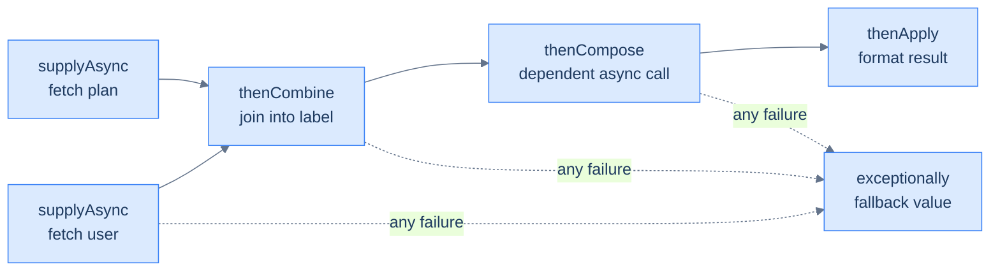

# Concurrency: High-Level & Virtual Threads

The last two chapters showed the raw material: [threads, races, and `synchronized`](/synapse/programming-languages/java/advanced/concurrency-the-basics), then [waiting, multiple locks, and the synchronizers](/synapse/programming-languages/java/advanced/concurrency-coordination) — correct, but low-level and error-prone (manual lifecycle, manual locking, a real deadlock). The `java.util.concurrent` library packages those primitives so you mostly stop writing them: an **`ExecutorService`** manages a pool of threads you *submit* tasks to, handing back a **`Future`** for each result; **atomics** like `AtomicInteger` fix the counter race lock-free; **`CompletableFuture`** composes asynchronous steps into pipelines; and **concurrent collections** are safe to share. The headline JDK 21 feature, **virtual threads** (Project Loom), changes the economics entirely: a virtual thread is so cheap that blocking one costs almost nothing, so you can have *millions* — write simple blocking code and get massive scalability.

This is the deep pass of [concurrency basics](/synapse/programming-languages/java/advanced/concurrency-the-basics), using [lambdas](/synapse/programming-languages/java/robust-oop/nested-and-anonymous-classes-and-lambdas) as tasks. Every output below was produced by compiling and running the code (timings are illustrative and vary per machine).

> **How to read the Intuition boxes.** Each one is built in three moves: (1) the **mechanism** — what the compiler and the JVM are *actually doing*; (2) a **concrete bite** — a specific, runnable failure (often a real compiler error), shown so the trap is visible; (3) the **earned rule** — the decision heuristic, now justified rather than asserted, plus its cost.

---

## Table of contents

1. [`ExecutorService` and `Future`](#1-executorservice-and-future)
2. [Atomics and concurrent collections](#2-atomics-and-concurrent-collections)
3. [`CompletableFuture`](#3-completablefuture)
4. [Virtual threads](#4-virtual-threads)
5. [Mental-model summary](#5-mental-model-summary)
6. [Gotcha checklist](#6-gotcha-checklist)

---

## 1. `ExecutorService` and `Future`

Instead of creating `Thread`s by hand, you **submit** tasks to an `ExecutorService` (a managed thread pool). Each `submit` returns a `Future` — a handle to a result that may not exist yet; `get()` blocks until it does.

```java run
import java.util.concurrent.*;

public class Main {
    public static void main(String[] args) throws Exception {
        ExecutorService pool = Executors.newFixedThreadPool(2);
        Future<Integer> f1 = pool.submit(() -> 6 * 7);
        Future<Integer> f2 = pool.submit(() -> 100 + 1);
        System.out.println(f1.get());
        System.out.println(f2.get());
        pool.shutdown();
    }
}
```

**Output:**
```
42
101
```

```d2
direction: right

submit: "submit(task)" {
  shape: oval
}
queue: "task queue" {
  shape: rectangle
}
pool: "thread pool" {
  w1: "worker 1" { shape: rectangle }
  w2: "worker 2" { shape: rectangle }
}
result: "Future.get()\nreturns the result" {
  shape: rectangle
}

submit -> queue: "enqueue"
queue -> pool.w1: "dequeue + run"
queue -> pool.w2: "dequeue + run"
pool.w1 -> result: "completes"
```

**Analysis.** Two tasks (lambdas returning a value) were submitted to a pool of two threads; each `Future.get()` returned its task's result (`42`, `101`). We never created or started a `Thread` — the pool owns the threads and reuses them across tasks. The diagram shows the model: tasks queue up, idle workers pull and run them, and the `Future` is how you retrieve each result. `shutdown()` lets the pool finish and stop (without it, its non-daemon threads keep the JVM alive).

**Intuition.**
*Mechanism.* An `ExecutorService` holds a queue and a fixed set of worker threads that loop forever pulling tasks. `submit` enqueues a task and returns a `Future`; a worker runs it and stores the result in the `Future`, which `get()` blocks to retrieve. Thread *creation* (expensive) is decoupled from task *submission* (cheap).

*Concrete bite.* A task's exception isn't lost — it's captured and re-thrown by `get()`, wrapped in an `ExecutionException`:

```java run
import java.util.concurrent.*;

public class Main {
    public static void main(String[] args) throws Exception {
        ExecutorService pool = Executors.newFixedThreadPool(1);
        Future<Integer> f = pool.submit(() -> 10 / 0);
        System.out.println(f.get());
        pool.shutdown();
    }
}
```

**Output** *(a thrown exception):*
```
Exception in thread "main" java.util.concurrent.ExecutionException: java.lang.ArithmeticException: / by zero
```

The task threw `ArithmeticException` on its worker thread; the `Future` stored it, and `get()` re-threw it wrapped in `ExecutionException` (call `getCause()` for the original). Unlike a raw `Thread`, where an uncaught exception just vanishes onto the console, a pool surfaces it to whoever awaits the result.

Shutdown itself has three distinct verbs, and production code uses all three. `shutdown()` stops *intake* but lets queued tasks finish; `shutdownNow()` additionally interrupts running tasks and returns the never-started ones; `awaitTermination(timeout)` is how the caller *waits* for the wind-down — none of them blocks by itself:

```java run
import java.util.concurrent.*;

public class Main {
    public static void main(String[] args) throws InterruptedException {
        ExecutorService pool = Executors.newFixedThreadPool(2);
        for (int i = 1; i <= 4; i++) {
            int id = i;
            pool.submit(() -> {
                try { Thread.sleep(200); } catch (InterruptedException e) { return; }
                System.out.println("task " + id + " done");
            });
        }
        pool.shutdown();                     // stop accepting; queued tasks still run
        System.out.println("shutdown called: isShutdown=" + pool.isShutdown()
                + " isTerminated=" + pool.isTerminated());
        boolean finished = pool.awaitTermination(2, TimeUnit.SECONDS);
        System.out.println("awaitTermination returned " + finished
                + ": isTerminated=" + pool.isTerminated());
    }
}
```

**Output** *(illustrative — task completion order varies; this is one real run):*
```
shutdown called: isShutdown=true isTerminated=false
task 1 done
task 2 done
task 4 done
task 3 done
awaitTermination returned true: isTerminated=true
```

`isShutdown` flipped immediately (intake closed), but `isTerminated` stayed `false` while the four queued tasks drained through two workers; only after `awaitTermination` observed the last task finish did it become `true`. The graceful-shutdown idiom is exactly this sequence — `shutdown()`, `awaitTermination(deadline)`, and only if the deadline passes, `shutdownNow()`.

*Earned rule.* Use an `ExecutorService` instead of raw `Thread`s — submit tasks, collect results via `Future`, and shut down deliberately: `shutdown()` → `awaitTermination` → `shutdownNow()` as the escalation path (or `try`-with-resources, since it's `AutoCloseable`, which does close-and-wait for you). Size fixed pools to roughly the core count for CPU-bound work; for workloads that mostly *block*, don't tune a bigger pool — use §4's virtual threads. The cost is owning the lifecycle and unwrapping `ExecutionException`; the benefit is pooled, reusable threads, queued tasks, and exceptions that propagate to the caller instead of disappearing.

---

## 2. Atomics and concurrent collections

The [counter race](/synapse/programming-languages/java/advanced/concurrency-the-basics) has a lock-free fix: `AtomicInteger`. Its `incrementAndGet()` performs read-modify-write as one indivisible hardware operation, so four threads incrementing it land on the correct total — no `synchronized` needed.

```java run
import java.util.concurrent.atomic.AtomicInteger;

public class Main {
    static AtomicInteger counter = new AtomicInteger(0);
    public static void main(String[] args) throws InterruptedException {
        Thread[] threads = new Thread[4];
        for (int i = 0; i < 4; i++) {
            threads[i] = new Thread(() -> {
                for (int j = 0; j < 100000; j++) counter.incrementAndGet();
            });
            threads[i].start();
        }
        for (Thread t : threads) t.join();
        System.out.println(counter.get());
    }
}
```

**Output:**
```
400000
```

**Analysis.** Always exactly 400,000, deterministically — the same workload that gave random sub-400,000 totals with a plain `int++` in the last chapter. `incrementAndGet()` is atomic: no two threads can interleave inside it, so no updates are lost, and it's faster than a lock because there's no blocking — the CPU does it with a single compare-and-swap instruction.

**Intuition.**
*Mechanism.* `AtomicInteger` wraps a value updated via hardware atomic instructions (compare-and-swap). Each operation is all-or-nothing and establishes happens-before, so it's both atomic *and* visible — without a lock, so threads don't block each other.

*Concrete bite.* Atomicity is per *operation*: `incrementAndGet()` is atomic, but combining two calls — `counter.set(counter.get() + 1)` — is *not* (another thread can change it between the `get` and the `set`), reintroducing the race. For a compound check-then-act, use `compareAndSet` or a lock. The same applies to collections: a `HashMap` shared across threads can corrupt; **`ConcurrentHashMap`** is the safe replacement (with atomic compound ops like `merge` and `computeIfAbsent`).

*Earned rule.* Use atomics (`AtomicInteger`/`AtomicLong`/`AtomicReference`) for single shared values and concurrent collections (`ConcurrentHashMap`) for shared maps, reserving `synchronized` for multi-step critical sections. The cost is that atomics only make *individual* operations atomic — compound logic still needs `compareAndSet` or a lock; the benefit is lock-free, non-blocking correctness for the common case of a single shared counter or reference.

---

## 3. `CompletableFuture`

A plain `Future` only lets you *block* for a result. **`CompletableFuture`** lets you *compose* asynchronous work: describe a pipeline of steps (`supplyAsync` → `thenApply` → …) that run as each predecessor completes, without blocking until the end.

```java run
import java.util.concurrent.CompletableFuture;

public class Main {
    public static void main(String[] args) throws Exception {
        CompletableFuture<Integer> future = CompletableFuture
            .supplyAsync(() -> 21)
            .thenApply(n -> n * 2);
        System.out.println(future.get());
    }
}
```

**Output:**
```
42
```

**Analysis.** `supplyAsync(() -> 21)` ran a task on a pool and produced `21`; `thenApply(n -> n * 2)` scheduled a *follow-up* that runs when the first completes, yielding `42`. The pipeline reads like a [stream](/synapse/programming-languages/java/advanced/functional-java-and-streams) but over *asynchronous* values — each stage is a callback wired to its predecessor's completion, so nothing blocks until the final `get()`.

The real power appears when the pipeline branches and rejoins. `thenCombine` **joins two independent** async results; `thenCompose` **chains a dependent** async call (the next call needs the previous result — and returns a `CompletableFuture` itself, which `thenCompose` flattens instead of nesting); `exceptionally` catches a failure anywhere upstream and substitutes a fallback. Here is a full composition, running:

```java run
import java.util.concurrent.CompletableFuture;

public class Main {
    static CompletableFuture<String> fetchUser(int id) {
        return CompletableFuture.supplyAsync(() -> "user-" + id);
    }
    static CompletableFuture<Integer> fetchScore(String label) {
        return CompletableFuture.supplyAsync(() -> label.length() * 10);
    }

    public static void main(String[] args) throws Exception {
        CompletableFuture<String> name = fetchUser(7);
        CompletableFuture<String> plan = CompletableFuture.supplyAsync(() -> "premium");

        CompletableFuture<String> pipeline = name
            .thenCombine(plan, (n, p) -> n + " (" + p + ")")      // join two independent results
            .thenCompose(label -> fetchScore(label)               // chain a dependent async call
                .thenApply(score -> label + " -> score " + score))
            .exceptionally(e -> "fallback: " + e.getCause().getMessage());

        System.out.println(pipeline.get());
    }
}
```

**Output:**
```
user-7 (premium) -> score 160
```



**Analysis.** The two `supplyAsync` calls started *concurrently* — neither waited for the other; `thenCombine` fired only when both were ready, and `thenCompose` then launched the score lookup that *needed* the combined label (`"user-7 (premium)"`, 16 characters, → 160). The diagram is the dependency graph the executor drives: work advances edge by edge as results arrive, and no thread ever sits blocked between stages. And when a stage fails, the error takes the dotted path instead:

```java run
import java.util.concurrent.CompletableFuture;

public class Main {
    public static void main(String[] args) throws Exception {
        CompletableFuture<String> pipeline = CompletableFuture
            .<String>supplyAsync(() -> { throw new IllegalStateException("service down"); })
            .thenApply(s -> s + "!")            // skipped — there is no value to transform
            .exceptionally(e -> "fallback: " + e.getCause().getMessage());

        System.out.println(pipeline.get());
    }
}
```

**Output:**
```
fallback: service down
```

The `thenApply` stage never ran — a failed stage completes the future *exceptionally*, downstream value-stages are skipped, and the exception propagates along the chain until `exceptionally` converts it back into a value. Without that handler, the exception would surface at `get()` wrapped in `ExecutionException`, exactly like §1's `Future`.

**Intuition.**
*Mechanism.* A `CompletableFuture` represents a value that will be ready later, plus a graph of continuations. `thenApply`/`thenCompose`/`thenCombine` register callbacks that fire on completion; you build a dependency graph that the executor drives, rather than blocking thread-by-thread. Failures travel the same graph as values — every stage completes either *normally* or *exceptionally*, and each kind of edge skips the stages meant for the other.

*Concrete bite.* The classic type error: using `thenApply` where you meant `thenCompose`. `thenApply(label -> fetchScore(label))` yields a `CompletableFuture<CompletableFuture<Integer>>` — a future *of a future* — and the compiler will let you, leaving you to unwrap the nesting at `get()`. If the function you're applying itself returns a `CompletableFuture`, you want `thenCompose` (the same map-vs-flatMap distinction as [streams](/synapse/programming-languages/java/advanced/functional-java-and-streams) and `Optional`).

*Earned rule.* Use `CompletableFuture` to compose multiple asynchronous operations (call services, combine results) without blocking between them; a plain `Future.get()` is fine for a single result you immediately need. The cost is a richer API and careful exception handling (`exceptionally`/`handle`); the benefit is non-blocking pipelines that scale far better than a thread blocked at each step.

---

## 4. Virtual threads

A platform thread maps to an OS thread — heavyweight (~1 MB stack), so you can have only thousands. A **virtual thread** (JDK 21) is scheduled by the JVM onto a small pool of OS threads, and *unmounts* when it blocks — so blocking is nearly free and you can run **millions**. Here 10,000 virtual threads each sleep 10 ms:

```java run
import java.util.concurrent.*;
import java.util.concurrent.atomic.AtomicInteger;

public class Main {
    public static void main(String[] args) throws InterruptedException {
        AtomicInteger done = new AtomicInteger(0);
        try (var executor = Executors.newVirtualThreadPerTaskExecutor()) {
            for (int i = 0; i < 10000; i++) {
                executor.submit(() -> {
                    try { Thread.sleep(10); } catch (InterruptedException e) {}
                    done.incrementAndGet();
                });
            }
        }
        System.out.println("completed: " + done.get());
    }
}
```

**Output** *(completed near-instantly — one real run finished in ~0.12 s total):*
```
completed: 10000
```

**Analysis.** Ten thousand threads, each blocking for 10 ms, all finished — and the whole program took a fraction of a second. With *platform* threads this would need 10,000 OS threads (likely failing) or a pool that serializes them into many seconds. Virtual threads make the blocking `Thread.sleep` cheap: each unmounts from its carrier OS thread while sleeping, so a handful of OS threads serve all 10,000. The `newVirtualThreadPerTaskExecutor()` gives each task its own virtual thread, and the `try`-with-resources `close()` waits for them all.

The unmounting has one important exception on Java 21: **pinning**. A virtual thread that blocks *while inside a `synchronized` block or method* cannot unmount — it pins its carrier OS thread for the whole wait, quietly costing you the scalability you came for. The JVM will tell you where, if you ask (shown statically — this run needs the `-Djdk.tracePinnedThreads=full` JVM flag, which the sandbox can't pass):

```java
public class Main {
    static final Object lock = new Object();

    public static void main(String[] args) throws InterruptedException {
        Thread vt = Thread.ofVirtual().name("vt-1").start(() -> {
            synchronized (lock) {               // holding a monitor...
                try { Thread.sleep(100); }      // ...while blocking: pins the carrier
                catch (InterruptedException e) {}
            }
        });
        vt.join();
        System.out.println("done");
    }
}
```

**Output** *(real captured run on Java 21 with `-Djdk.tracePinnedThreads=full`; trace trimmed):*
```
VirtualThread[#20,vt-1]/runnable@ForkJoinPool-1-worker-1 reason:MONITOR
    java.base/java.lang.Thread.sleep(Thread.java:507)
    Main.lambda$main$0(Main.java:7) <== monitors:1
    java.base/java.lang.VirtualThread.run(VirtualThread.java:329)
done
```

The `reason:MONITOR` line is the JVM reporting the pin, and `<== monitors:1` points at the exact frame holding one. The fixes: keep blocking calls out of `synchronized` sections, or guard them with a `ReentrantLock` from the [coordination chapter](/synapse/programming-languages/java/advanced/concurrency-coordination), which virtual threads *can* unmount under. (This is a "Java 21 as deployed today" cost: JDK 24 — JEP 491 — reimplements monitors so `synchronized` no longer pins in most cases. Until you run there, treat monitor-plus-blocking as a pin.)

**Intuition.**
*Mechanism.* A virtual thread runs on a carrier OS thread only while executing; the moment it blocks (I/O, `sleep`, a lock), the JVM *unmounts* it and frees the carrier for another virtual thread. Blocking parks a cheap object, not an expensive OS thread — so the thread count is limited by memory, not by the OS. Unmounting works by copying the virtual thread's stack aside — which is why holding a native frame or (on Java 21) a monitor prevents it.

*Concrete bite.* Virtual threads speed up **I/O-bound** and blocking workloads (each thread spends most of its time waiting), not **CPU-bound** ones — a million threads doing pure computation still share the same few cores and won't go faster. And the pinning trace above is the second bite: a legacy library that blocks inside `synchronized` can silently turn your million-thread design back into a "handful of carriers, all pinned" design. They're a scalability tool for "many concurrent blocking operations," not a speed-up for raw computation.

*Earned rule.* Use virtual threads (one per task, via `newVirtualThreadPerTaskExecutor`) for high-concurrency *blocking* workloads — servers handling thousands of requests, fan-out I/O — and write simple blocking code instead of callback chains. The cost is that they don't help CPU-bound work and, on Java 21, monitor-guarded blocking pins the carrier (check with `-Djdk.tracePinnedThreads`); the benefit is enormous: "thread-per-request" blocking code that scales to millions of concurrent tasks on a handful of cores.

One outlook, because you'll meet it in code review before long: **structured concurrency** (`StructuredTaskScope`, a *preview* API in Java 21 — it needs `--enable-preview`, so no Run button here) makes a scope own its forked subtasks the way a `try` block owns a resource:

```java
try (var scope = new StructuredTaskScope.ShutdownOnFailure()) {
    var user  = scope.fork(() -> fetchUser());     // both run concurrently,
    var score = scope.fork(() -> fetchScore());    // on virtual threads
    scope.join().throwIfFailed();                  // wait; propagate any failure
    System.out.println(user.get() + ": " + score.get());
}
```

If either subtask fails, the scope cancels the other and the error surfaces at `join()` — concurrent work that starts together, ends together, and can't leak a runaway thread. It's the same idea Python ships as `asyncio.TaskGroup`; the shape is worth recognizing even before the API finalizes.

---

## 5. Mental-model summary

| Principle | Consequence |
|---|---|
| An `ExecutorService` pools threads; `submit` returns a `Future` | Reuse threads, queue tasks, retrieve results; `get()` re-throws task exceptions wrapped |
| `AtomicInteger` makes a single update atomic, lock-free | Fixes the counter race without `synchronized`; compound ops still need care |
| `CompletableFuture` composes async steps without blocking | A pipeline of continuations beats a chain of blocking `get()`s |
| Executor shutdown is three verbs: `shutdown` / `awaitTermination` / `shutdownNow` | Close intake, wait with a deadline, then escalate — none blocks by itself |
| A virtual thread unmounts when it blocks | Blocking is cheap — run millions; ideal for I/O-bound concurrency |
| On Java 21, blocking inside `synchronized` pins the carrier | Use `ReentrantLock` around blocking calls; trace pins with `-Djdk.tracePinnedThreads` |
| Virtual threads don't speed CPU-bound work | They scale *waiting*, not computation; cores still bound throughput |

## 6. Gotcha checklist

- **The program won't exit after submitting tasks →** you didn't `shutdown()` the executor; its non-daemon threads keep the JVM alive (use `try`-with-resources).
- **A submitted task's exception "disappeared" →** it's stored in the `Future`; `get()` throws `ExecutionException` — unwrap with `getCause()`.
- **An atomic counter is still wrong →** you combined two atomic calls (`set(get()+1)`); use `incrementAndGet`/`compareAndSet`, or a lock for multi-step logic.
- **A shared `HashMap` corrupted under threads →** use `ConcurrentHashMap` (with `merge`/`computeIfAbsent` for atomic compound updates).
- **Virtual threads didn't speed up CPU-bound work →** they scale blocking, not computation; for CPU work, size a pool to the cores.
- **`thenApply` gave you a `CompletableFuture<CompletableFuture<…>>` →** the function itself returns a future; use `thenCompose` to flatten the chain.
- **Virtual threads scaled worse than promised →** something blocks inside `synchronized` and pins its carrier (Java 21); find it with `-Djdk.tracePinnedThreads=full`, fix with `ReentrantLock` or by moving the blocking call out.

---

*Predict, then check.* Predict the two lines printed by submitting `() -> "a".repeat(3)` and `() -> 2 + 2` to a pool and printing each `Future.get()`. Next, predict whether `AtomicInteger` incremented 100,000 times by 5 threads prints exactly `500000`, and why. Finally, explain why 100,000 virtual threads each doing `Thread.sleep(100)` finish in roughly 100 ms, while 100,000 platform threads could not — in terms of mounting and unmounting.

## Your Turn

Before you move on, check your understanding with the coach — explain the idea, apply it, weigh the trade-offs, then defend your reasoning.

<div class="concept-coach"></div>
