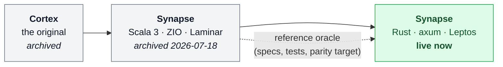

# Why a rebuild

> **You'll be able to:** explain what a "reference oracle" rebuild is and when it beats an
> incremental refactor; judge a rewrite by what it measurably bought rather than by how it felt;
> and recognise the specific conditions that made this one survivable.

## Three implementations, one platform

The platform you are reading has been built three times.



Each rebuild kept the product and replaced the implementation. That is an expensive habit, and it
deserves more scepticism than it usually gets — so this chapter makes the case for it and then
makes the case against it.

## The method: a reference oracle

The word **oracle** appears throughout this codebase and it does not mean the database company. It
is borrowed from testing, where an *oracle* is the authority that tells you whether an output is
correct. During the rebuild, the previous implementation played that role: its behaviour was the
specification, its test suites were the acceptance criteria, and the live deployment was the parity
target.

<div style="border-left:4px solid #da5233;background:rgba(218,82,51,0.08);padding:0.6rem 1rem;border-radius:0 0.5rem 0.5rem 0;margin:1.25rem 0">

⚠️ **A naming collision worth knowing about.** The file `api/openapi.oracle.yaml` in the repository
is a frozen copy of the *Scala implementation's* API contract, kept so the Rust build can diff
against it. It has nothing to do with Oracle Cloud — which this project also uses, for unrelated
virtual machines. The [glossary](/synapse/synapse-app-from-scratch/appendices/glossary) opens with
this term for exactly that reason.

</div>

Working against an oracle changes the character of a rewrite. There is no requirements-gathering
phase and no ambiguity about correctness: the answer already exists and runs. That turns a design
problem into a *re-derivation* problem — and re-derivation is where the learning is, because you
must understand why each decision was made before you can restate it in a different language.

The rule adopted here was: **cherry-pick from the oracle, never copy a decision you do not
understand.** Where the oracle's choice was sound it was ported deliberately. Where it was a
shortcut, the rebuild fixed it — and the chapters say which was which.

## The four motives

The decision record ([ADR-RS001](https://github.com/ani2fun/synapse/blob/main/docs/adr/rs001-the-rust-rebuild.md))
lists four:

1. **Ownership and understanding.** A system you have built twice you understand differently from
   one you have maintained.
2. **Footprint.** The homelab is four small machines. A JVM's floor is a real cost when the node
   also runs a database and a code sandbox.
3. **Depth in Rust.** An explicit career motive, stated rather than rationalised as engineering.
4. **Toolchain consolidation.** `sbt` plus `npm` became `cargo` plus `npm`.

Only the second is measurable, so it is the one the book can hold to account.

## What it bought, measured

The Scala deployment requested **256 MiB** of memory and was capped at **1 GiB** — sized for a JVM
heap. The Rust process that replaced it, doing the same work on the same node, idles at:

```
NAME                       CPU(cores)   MEMORY(bytes)
synapse-78948bcbf4-7brqm   1m           6Mi
```

Six mebibytes against a 256 MiB floor — roughly a **40× reduction** in resident memory, on a
cluster where memory is the scarce resource. That is not a micro-optimisation; it is the difference
between the database node having headroom and not.

Two secondary effects fell out of it. Startup went from a JVM-plus-migration budget of 150 seconds
to a probe budget of 60 — and most of that 60 is tolerance for a slow database, not for the
process. And the container image carries no runtime: a single static-ish binary plus the compiled
web assets, rather than a JVM.

<div style="border-left:4px solid #195045;background:rgba(25,80,69,0.08);padding:0.6rem 1rem;border-radius:0 0.5rem 0.5rem 0;margin:1.25rem 0">

💡 **The comparison is honest but narrow.** It measures *idle* memory for a personal-scale
workload. A JVM's memory floor buys things this system does not need at four users — a mature GC,
a JIT that improves under sustained load, and an enormous library ecosystem. At a hundred thousand
users the comparison would need re-running, and might come out differently.

</div>

## What it cost

The rebuild took **forty steps** across four days of concentrated work, each step a chapter and a
tagged commit. That figure is only impressive-sounding until you notice what made it possible: a
working oracle to copy behaviour from, test suites that already encoded the edge cases, and content
that did not need migrating because it lives in a separate repository.

It also cost the things a rewrite always costs, and this one is not exempt:

- **Bugs the original had already found.** The clearest example: sign-in worked in every test and
  failed in production because the HTTP client had no TLS backend compiled in. In development every
  outbound call is plain HTTP, so the only HTTPS caller in the whole system is the production
  identity fetch — a gap that existed precisely where no test looked. The Scala implementation had
  no such class of bug because the JVM ships trust roots by default.
- **A second corpus of documentation** that immediately began to drift from the first.
- **Dual-stack knowledge** for as long as both existed, mitigated only by archiving the old one.

## When this is a bad idea

The conditions that made this survivable are specific, and worth stating plainly because they are
usually absent:

- **The product was frozen.** No feature work competed with the rebuild.
- **There was exactly one user.** A production incident cost embarrassment, not revenue.
- **The oracle was complete and running**, so parity was checkable at every step rather than
  guessed at the end.
- **Content and code were already separate**, so no data migration was needed for the part that
  matters most — the writing.

Remove any one of those and the calculus changes. With paying users and a live roadmap, the honest
advice is the boring one: profile the JVM, tune the heap, and spend the four days on something a
user would notice.

## Check yourself

```quiz
{"prompt": "What does \"reference oracle\" mean in this project?", "options": ["Oracle Cloud, where the platform's virtual machines run", "The Oracle database used to store submissions", "The previous implementation, whose behaviour and tests served as the specification for the rebuild", "An automated test generator that produces expected outputs"], "answer": "The previous implementation, whose behaviour and tests served as the specification for the rebuild"}
```

```quiz
{"prompt": "The rebuild cut resident memory from a 256 MiB request to about 6 MiB. Why does the book call this comparison narrow?", "options": ["Because memory is not a real constraint on any modern server", "Because it measures idle memory at personal scale, and a JVM's floor buys things — mature GC, a JIT that improves under load — that this workload never exercises", "Because the two versions were measured on different hardware", "Because 6 MiB is within the margin of error of the measurement"], "answer": "Because it measures idle memory at personal scale, and a JVM's floor buys things — mature GC, a JIT that improves under load — that this workload never exercises"}
```

<details>
<summary>The TLS bug passed every test and still broke production. What does that failure have in common with the argument for rebuilding against an oracle?</summary>

Both are about **where the truth lives**. An oracle rebuild works because correctness is defined by
something that actually runs, not by a document describing what should run.

The TLS bug is the same principle failing in the other direction. The tests defined correctness,
and they all passed — but they exercised a development environment where every outbound call is
plain HTTP. The single HTTPS call in the system existed only in production, so the test suite's
notion of "correct" was quietly narrower than reality.

The lesson is not "write more tests". It is that a test suite is itself a model, and models have
edges. The way this bug was eventually caught — and the way the whole rebuild was validated — was
by comparing against something real: the running system, in the place it actually runs.

</details>
