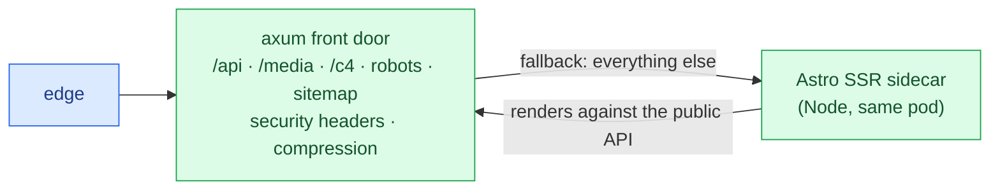

# Architecture

> **You'll be able to:** classify a workload into traffic classes and let that classification drive
> the shape; explain why this system is a modular monolith rather than services; and name the one
> context that is designed to be extracted first, and the trigger that would justify it.

## Start with the traffic, not the components

Almost every interesting decision here follows from one observation: **this platform serves three
kinds of request that have nothing in common.**

| Class | Share | Character | What it needs |
|---|---|---|---|
| **Reads** — lessons, diagrams, search | ~99% | identical for every reader, changes only when an author pushes | to never reach the origin |
| **Runs** — execute this code | ~1% | CPU-bound, interactive, *hostile* | isolation, and a bounded blast radius |
| **Writes** — submit a solution | ≪1% | durable, judged, slow | correctness, not speed |

Designing for the average of those three produces something bad at all of them. Designing for each
separately is most of the architecture:

- Reads are **derived data**, reconstructable from a git repository, and therefore cacheable — the
  origin should be almost idle at any scale.
- Runs are the only place untrusted input becomes *execution*, so they are a security tier that
  happens to also be a feature.
- Writes are rare enough that a single Postgres will not be the bottleneck for years, so they should
  optimise for being obviously correct.

## The containers

Click any element for its design notes — the model is live, not a screenshot.

<iframe
  src="/c4/view/saf_container"
  width="100%"
  height="620"
  style="border: 1px solid var(--border, #2b2b2b); border-radius: 8px;"
  loading="lazy"
  title="Synapse — container view"
></iframe>

The shape worth noticing is that **nothing writes to the content the platform serves.** An author
pushes to a git repository; a sidecar polls it and flips a symlink; the application re-reads the
commit hash on the next request. There is no content database and no migration to run when a lesson
changes.

That single decision is what makes the read path cacheable. Because a lesson response is derived from
a known commit, a cached copy is *a correct answer for that version* rather than a guess about
freshness. Caching stops being a risk to manage and becomes a property of the data.

The platform did later grow an editing surface — a reader can propose a change to a lesson from
inside the app — and it is worth being precise about why that does not break the property above. The
editor does not write to the served tree. It opens a **pull request against the repository**, and the
change reaches readers by the same sidecar-and-symlink path as everything else, after a human merges
it. The write path gained a front end; it did not gain a second source of truth. That story is
[its own chapter](/synapse/synapse-app-from-scratch/running-it/content-contribution).

## Two processes behind one front door

One box on that diagram deserves a note, because it is the part most likely to be read as a
microservice and is not. Pages are server-rendered by an Astro sidecar; the API forwards to it as the
router's **fallback**, after every route it owns itself.



Two things fall out of that ordering. A registered route can never be shadowed by a page path, so
adding a lesson called `api` cannot break the API. And the sidecar renders by calling the same public
content API a browser would — a real loopback hop, which is a genuine cost, paid for the property
that there is exactly one content contract rather than one for pages and one for clients.

They ship as one container running two processes, and either process dying takes the container down.
Half-alive is the worst state: one half gone means every page is a 502 forever, while an orchestrator
only restarts a container that actually *exits*.

## Ten contexts in one process

Inside the origin, the code is organised as ten bounded contexts, each with its own domain types,
its own error type, and ports it declares but does not implement.

<iframe
  src="/c4/view/saf_component"
  width="100%"
  height="620"
  style="border: 1px solid var(--border, #2b2b2b); border-radius: 8px;"
  loading="lazy"
  title="Origin API — component view"
></iframe>

Three of those ten arrived after the first version of this chapter was written, and how they arrived
is more interesting than that they exist. `insights` came from noticing the platform could serve
hundreds of lessons and answer nothing about which were opened. `progress` came from ✓ ticks living
in `localStorage`, which made them a property of a browser rather than of an account. `authoring`
came from the closing question of [the content pipeline](/synapse/synapse-app-from-scratch/running-it/the-content-pipeline)
chapter — what breaks first is non-technical contributors — turning out to be the thing that broke.

They are also visibly different sizes. `authoring` and `catalog` have four layers and thousands of
lines; `progress` and `insights` are three files each with no `domain/` at all. That is the
proportionality rule doing its job: a context earns structure by having something to protect, not by
being a context.

They ship as **one binary**. That is a real choice and it deserves defending, because the diagram
would look identical if each box were a service.

<div style="border-left:4px solid #195045;background:rgba(25,80,69,0.08);padding:0.6rem 1rem;border-radius:0 0.5rem 0.5rem 0;margin:1.25rem 0">

💡 **The deployment unit and the design unit are different things.** Splitting a codebase into
bounded contexts buys clean seams, independent reasoning, and the *option* to extract. Splitting the
deployment buys independent scaling and independent failure — at the cost of a network between every
call, distributed transactions, and seven things to deploy. Take the first without paying for the
second until something forces it.

</div>

What would force it? The traffic table already says: **the run path**. It is the only context that is
CPU-bound, the only one that executes hostile input, and the only one whose resource needs differ by
an order of magnitude from the rest. It is designed for extraction — its port is already a trait, its
adapter already speaks HTTP to a separate process, and it already runs on its own node. Extracting it
is a wiring change, not a rewrite.

The others have no such pressure. `blog` looks almost identical to `catalog`; splitting either would
buy nothing but a network hop.

## Ports and adapters, enforced

Each context is layered as domain → application → infrastructure → http, and the layering is not
honour-system. A CI gate greps for framework imports inside domain directories and fails the build if
it finds any:

```
→ server domain purity (no axum/tower/hyper/tokio/sqlx/reqwest/utoipa under domain/)
  ok
→ viz engine purity (no leptos/web-sys/wasm-bindgen/js-sys/gloo under viz-wasm/src/engine/)
  ok
→ file-size caps (server/shared ≤ 500 · viz-wasm/web ≤ 800 · *.gen.ts exempt)
  ok
```

Two greps and a line count, running before the compiler does. It catches the drift that architecture
documents never do, because a document describing a rule is not the same thing as a rule.

The second line is a survivor worth pointing at. It used to read *client* logic purity, over a Rust
client that no longer exists — and when that client was deleted, the gate did not silently pass over
nothing: it was re-pointed at the one Rust surface that remained, the visualisation engine. A gate
whose subject disappears and whose text stays green is worse than no gate, so a rule's scope is part
of what has to be maintained.

That gate is also why the interesting logic is testable without a database, a browser, or a network:
if the domain cannot import the web framework, it cannot depend on one.

## Where the diagrams come from

The model above lives in the same repository as this prose, and is compiled into the diagram
application by the same push that publishes the text. The chapter and its architecture cannot drift,
because they are the same commit.

That is also the honest reason this book can promise its diagrams match the code: they are checked by
a build that fails on an invalid model — though not, it turns out, by an exit code. While writing this
chapter the model built "successfully" while emitting four errors, and only a log grep revealed that
four relationships had been silently dropped.

<details>
<summary>The architecture would look the same on a diagram whether these were seven services or one binary. So what is the diagram actually telling you?</summary>

It tells you about **coupling**, not about deployment — and conflating those two is one of the most
expensive mistakes in system design.

A boundary on a C4 diagram means: this thing has its own vocabulary, its own invariants, and talks to
its neighbours through a declared contract. All of that is true whether the call is a function call or
an HTTP request. What the diagram deliberately does not tell you is the *topology*, because topology
is a deployment decision driven by scaling and failure requirements — not by how the code is organised.

The useful discipline is to draw the boundaries first and choose the topology second, from evidence.
Here the evidence says one process is right for six contexts and increasingly wrong for the seventh,
and the architecture is arranged so that acting on it is a wiring change rather than a rewrite.

</details>
