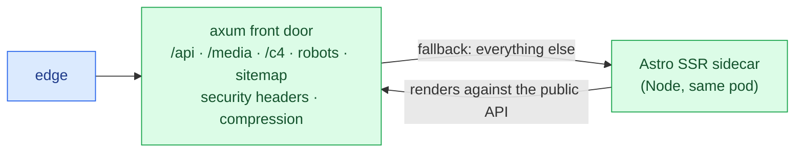

# Architecture

> **You'll be able to:** classify a workload into traffic classes and let that classification drive
> the shape; explain why this system is a modular monolith rather than services; and name the one
> context that is designed to be extracted first, and the trigger that would justify it.

## Start with the traffic, not the components

Almost every interesting decision here follows from one observation: **this platform serves three
kinds of request that have nothing in common.**

| Class | Share | Character | What it needs |
|---|---|---|---|
| **Reads** — lessons, diagrams, search | ~99% | identical for every reader, changes only when an author pushes | to never reach the origin |
| **Runs** — execute this code | ~1% | CPU-bound, interactive, *hostile* | isolation, and a bounded blast radius |
| **Writes** — submit a solution | ≪1% | durable, judged, slow | correctness, not speed |

Designing for the average of those three produces something bad at all of them. Designing for each
separately is most of the architecture:

- Reads are **derived data**, reconstructable from a git repository, and therefore cacheable — the
  origin should be almost idle at any scale.
- Runs are the only place untrusted input becomes *execution*, so they are a security tier that
  happens to also be a feature.
- Writes are rare enough that a single Postgres will not be the bottleneck for years, so they should
  optimise for being obviously correct.

## The containers

The platform as a **walkthrough** — the system in context, the containers inside it, and the ten
bounded contexts inside the origin. Any box carrying a link badge drills down a level; the
◀ ▶ ⌂ controls and the board menu walk back out.

```d2 boards name="c4-synapse" root="System Context"
direction: right

classes: {
  client: { style: { fill: "#f3f4f6"; stroke: "#6b7280"; font-color: "#111827" } }
  data:   { style: { fill: "#ffedd5"; stroke: "#ea580c"; font-color: "#7c2d12" } }
  edge:   { style: { fill: "#dbeafe"; stroke: "#2563eb"; font-color: "#1e3a8a" } }
  external: { style: { fill: "#f8fafc"; stroke: "#94a3b8"; font-color: "#475569"; stroke-dash: 3 } }
  svc:    { style: { fill: "#dcfce7"; stroke: "#16a34a"; font-color: "#14532d" } }
}

reader: "Reader\n[Person]" {
  class: client
  shape: person
}

author: "Author\n[Person]" {
  class: client
  shape: person
}

content_repo: "synapse-content\n[git (GitHub)]" {
  class: external
  shape: cylinder
}

sys: "Synapse\n[Software System]" {
  class: svc
  link: layers.container
}

author -> content_repo: "git push"

layers: {
  container: {
    direction: right

    reader: "Reader\n[Person]" {
      class: client
      shape: person
    }

    author: "Author\n[Person]" {
      class: client
      shape: person
    }

    content_repo: "synapse-content\n[git (GitHub)]" {
      class: external
      shape: cylinder
    }

    edge: "Edge\n[Cloudflare]" {
      class: edge
    }

    spa: "Web tier\n[Astro 5 SSR · TypeScript islands · Preact]" {
      class: client
    }

    api: "Origin API\n[Rust · axum · tokio]" {
      class: svc
      link: _.layers.component
    }

    sync: "Content sidecar\n[git-sync]" {
      class: svc
    }

    sandbox: "Code sandbox\n[go-judge]" {
      class: svc
    }

    db: "Application store\n[PostgreSQL 17]" {
      class: data
      shape: cylinder
    }

    idp: "Identity provider\n[Keycloak]" {
      class: external
    }

    reader -> edge: "reads lessons"
    edge -> api: "HTML + JSON; hashed assets immutable, pages 60s + swr"
    api -> spa: "forwards page requests (router fallback)"
    spa -> api: "renders against the public content API — a real hop back"
    author -> content_repo: "git push"
    content_repo -> sync: "polled for new commits"
    spa -> idp: "authorization code + PKCE"
  }

  component: {
    direction: down

    api: "Origin API\n[Rust · axum · tokio]" {
      class: svc

      catalog: "catalog\n[Component]" {
        class: svc
      }
      execution: "execution\n[Component]" {
        class: svc
      }
      submission: "submission\n[Component]" {
        class: svc
      }
      identity: "identity\n[Component]" {
        class: svc
      }
      blog: "blog\n[Component]" {
        class: svc
      }
      authoring: "authoring\n[Component]" {
        class: svc
      }
      progress: "progress\n[Component]" {
        class: svc
      }
      insights: "insights\n[Component]" {
        class: svc
      }
      tutoring: "tutoring\n[Component]" {
        class: svc
      }
      platform: "platform\n[Component]" {
        class: svc
      }
    }

    db: "Application store\n[PostgreSQL 17]" {
      class: data
      shape: cylinder
    }

    sandbox: "Code sandbox\n[go-judge]" {
      class: svc
    }

    idp: "Identity provider\n[Keycloak]" {
      class: external
    }

    sync: "Content sidecar\n[git-sync]" {
      class: svc
    }

    content_repo: "synapse-content\n[git (GitHub)]" {
      class: external
      shape: cylinder
    }

    api.catalog -> sync: "reads the checked-out tree"
    content_repo -> sync: "polled for new commits"
    api.authoring -> content_repo: "commits the file and opens a pull request"
    api.execution -> sandbox: "execute, capped and isolated"
    api.submission -> api.execution: "judge each case in authored order"
    api.submission -> api.progress: "an accepted verdict marks the lesson done"
    api.identity -> idp: "fetches signing keys (cached 5 min)"
  }
}
```

The shape worth noticing is that **nothing writes to the content the platform serves.** An author
pushes to a git repository; a sidecar polls it and flips a symlink; the application re-reads the
commit hash on the next request. There is no content database and no migration to run when a lesson
changes.

That single decision is what makes the read path cacheable. Because a lesson response is derived from
a known commit, a cached copy is *a correct answer for that version* rather than a guess about
freshness. Caching stops being a risk to manage and becomes a property of the data.

The platform did later grow an editing surface — a reader can propose a change to a lesson from
inside the app — and it is worth being precise about why that does not break the property above. The
editor does not write to the served tree. It opens a **pull request against the repository**, and the
change reaches readers by the same sidecar-and-symlink path as everything else, after a human merges
it. The write path gained a front end; it did not gain a second source of truth. That story is
[its own chapter](/synapse/synapse-app-from-scratch/running-it/content-contribution).

## Two processes behind one front door

One box on that diagram deserves a note, because it is the part most likely to be read as a
microservice and is not. Pages are server-rendered by an Astro sidecar; the API forwards to it as the
router's **fallback**, after every route it owns itself.


```mermaid
flowchart LR
    E[edge] --> A["axum front door<br/>/api · /media · /c4 · robots · sitemap<br/>security headers · compression"]
    A -->|"fallback: everything else"| N["Astro SSR sidecar<br/>(Node, same pod)"]
    N -->|"renders against the public API"| A
    class E edge
    class A svc
    class N svc

    classDef edge fill:#dbeafe,stroke:#2563eb,color:#1e3a8a;
    classDef svc  fill:#dcfce7,stroke:#16a34a,color:#14532d;
```

Two things fall out of that ordering. A registered route can never be shadowed by a page path, so
adding a lesson called `api` cannot break the API. And the sidecar renders by calling the same public
content API a browser would — a real loopback hop, which is a genuine cost, paid for the property
that there is exactly one content contract rather than one for pages and one for clients.

They ship as one container running two processes, and either process dying takes the container down.
Half-alive is the worst state: one half gone means every page is a 502 forever, while an orchestrator
only restarts a container that actually *exits*.

## Ten contexts in one process

Inside the origin, the code is organised as ten bounded contexts, each with its own domain types,
its own error type, and ports it declares but does not implement. Click the **Origin API** box in
the walkthrough above to open the board that draws them.

Three of those ten arrived after the first version of this chapter was written, and how they arrived
is more interesting than that they exist. `insights` came from noticing the platform could serve
hundreds of lessons and answer nothing about which were opened. `progress` came from ✓ ticks living
in `localStorage`, which made them a property of a browser rather than of an account. `authoring`
came from the closing question of [the content pipeline](/synapse/synapse-app-from-scratch/running-it/the-content-pipeline)
chapter — what breaks first is non-technical contributors — turning out to be the thing that broke.

They are also visibly different sizes. `authoring` and `catalog` have four layers and thousands of
lines; `progress` and `insights` are three files each with no `domain/` at all. That is the
proportionality rule doing its job: a context earns structure by having something to protect, not by
being a context.

They ship as **one binary**. That is a real choice and it deserves defending, because the diagram
would look identical if each box were a service.

<div style="border-left:4px solid #195045;background:rgba(25,80,69,0.08);padding:0.6rem 1rem;border-radius:0 0.5rem 0.5rem 0;margin:1.25rem 0">

💡 **The deployment unit and the design unit are different things.** Splitting a codebase into
bounded contexts buys clean seams, independent reasoning, and the *option* to extract. Splitting the
deployment buys independent scaling and independent failure — at the cost of a network between every
call, distributed transactions, and seven things to deploy. Take the first without paying for the
second until something forces it.

</div>

What would force it? The traffic table already says: **the run path**. It is the only context that is
CPU-bound, the only one that executes hostile input, and the only one whose resource needs differ by
an order of magnitude from the rest. It is designed for extraction — its port is already a trait, its
adapter already speaks HTTP to a separate process, and it already runs on its own node. Extracting it
is a wiring change, not a rewrite.

The others have no such pressure. `blog` looks almost identical to `catalog`; splitting either would
buy nothing but a network hop.

## Ports and adapters, enforced

Each context is layered as domain → application → infrastructure → http, and the layering is not
honour-system. A CI gate greps for framework imports inside domain directories and fails the build if
it finds any:

```
→ server domain purity (no axum/tower/hyper/tokio/sqlx/reqwest/utoipa under domain/)
  ok
→ viz engine purity (no leptos/web-sys/wasm-bindgen/js-sys/gloo under viz-wasm/src/engine/)
  ok
→ file-size caps (server/shared ≤ 500 · viz-wasm/web ≤ 800 · *.gen.ts exempt)
  ok
```

Two greps and a line count, running before the compiler does. It catches the drift that architecture
documents never do, because a document describing a rule is not the same thing as a rule.

The second line is a survivor worth pointing at. It used to read *client* logic purity, over a Rust
client that no longer exists — and when that client was deleted, the gate did not silently pass over
nothing: it was re-pointed at the one Rust surface that remained, the visualisation engine. A gate
whose subject disappears and whose text stays green is worse than no gate, so a rule's scope is part
of what has to be maintained.

That gate is also why the interesting logic is testable without a database, a browser, or a network:
if the domain cannot import the web framework, it cannot depend on one.

## 🧱 Component reference

<details>
<summary>21 components — what each one owns, the invariant it protects, and where it breaks</summary>

### Reader
`Actor`

Reads anonymously. Identity is required only to edit code in place and to submit a solution for
judging — never to read, and never to run.

That split is deliberate and shapes the whole architecture: the read path can be cached globally and
served without ever consulting a database or an identity provider, which is why it is fast from
anywhere and survives the failure of almost everything behind it.

### Author
`Actor`

Publishes by pushing Markdown. There is no editor UI, no upload form, and no admin content screen —
`git push` is the deployment.

New prose appears within about a minute with no restart and no redeploy, and a diagram is prose —
a fenced source in the lesson, on the same path at the same speed. The route is traced in
[The content pipeline](/synapse/synapse-app-from-scratch/running-it/the-content-pipeline).

### synapse-content
`Source repository` · `git (GitHub)`

The authoring plane. Books as Markdown, diagrams as fenced sources inside them, hidden judge suites
as JSON sidecars — all in one public repository with exactly one writer and arbitrarily many
readers.

Using git as the content store means version history, review, rollback and branching arrive for free,
and it removes the write path that a CMS would otherwise need. It also means the content has a
**commit hash**, which the platform reuses as a cache key — the single decision that makes lesson
responses safely cacheable at the edge.

### Synapse
`Software system` · `Rust · Astro · PostgreSQL`

An interactive learning platform: prose you read, code you run, algorithms you watch execute
step by step, and solutions a judge accepts or rejects.

Everything inside this boundary is one thing I own end to end. Everything outside it — the
identity provider, the git host, the CDN — is a system I depend on but do not operate.

#### What the boundary is doing

The interesting property is how little lives inside. The platform's largest asset is its
content, and content is **outside** this box: it lives in a git repository and arrives on disk
through a sidecar. There is no CMS, no content database, no upload path. That is why the
boundary looks thin for a system with this much surface area.

What is genuinely inside: a single Rust binary serving ten bounded contexts, a server-rendering
web tier beside it in the same pod, a sandbox that runs untrusted code, and one Postgres holding
the only state that cannot be rebuilt from a repository.

#### The three traffic classes

| Class | Share | Where it is answered |
|---|---|---|
| Reads — lessons, diagrams, search | ~99% | the edge, ideally never reaching this boundary |
| Runs — execute this code | ~1% | the sandbox, isolated and resource-capped |
| Writes — submit a solution | ≪1% | Postgres, judged asynchronously |

Almost every design decision inside this boundary follows from those three lines having nothing
in common. Designing for their average would produce something mediocre at all three.

#### One process, on purpose

The ten contexts ship as one binary with `replicas: 1`. The single replica is not a resource
compromise — it is a correctness requirement, because the rate limiter holds per-process state
and N replicas would mean N× the intended limit. Scaling out therefore requires moving that
state, which is a deliberate, documented trigger rather than an accident waiting to happen.

The execution context is the one designed to leave first: it is CPU-bound, it runs hostile
input, and its resource profile differs from the rest by an order of magnitude. Its port is
already a trait and its adapter already speaks HTTP to a separate process, so extracting it is a
wiring change.

### Edge
`CDN` · `Cloudflare`

The read path's actual capacity. Pages and lesson JSON are served with
`max-age=60, stale-while-revalidate=600`, hashed assets with `immutable` for a year, and media with
one shared hour — media is path-addressed rather than content-hashed, because authors replace files
in place.

#### Measured, from Paris

| Path | Time to first byte |
|---|---|
| In-cluster, no CDN | ~14 ms |
| Edge cache hit | ~48 ms (median of 12) |
| Origin through the CDN | ~208 ms (median of 12) |

So a cache hit is roughly **4× faster** than reaching the origin, and that gap widens with distance
— the origin is a single machine in one house, while the edge is wherever the reader is.

The sixty-second lifetime is not arbitrary: it matches the interval at which the content sidecar
polls for new prose. Caching longer than the content can change buys nothing but staleness.

#### The rule that keeps it safe

Only two path prefixes are cacheable, and both serve identical bytes to every reader. Anything
user-specific — identity, submissions, admin — is explicitly outside the rule. A shared cache in
front of a per-user response is one of the most damaging mistakes available in web architecture, and
the narrowness of the rule is the defence.

### Web tier
`Web application` · `Astro 5 SSR · TypeScript islands · Preact`

Every page is **server-rendered**: the prose a reader came for is HTML in the first response, not
something a client framework produces after it boots. The tier runs as a Node sidecar inside the
same pod as the API, which forwards page requests to it as the router's fallback.

This replaced a Leptos client compiled to WebAssembly — 641 KiB gzipped that had to download,
instantiate and mount before any text appeared. The architecture of the read path had to answer to
that number, and a bundle is the wrong place to keep a document.

#### Islands, and what makes them lazy

Interactivity hydrates per feature, not per page. Vanilla TypeScript is the default; Preact is used
only where there is real component state — the workbench, the problem page, the editorial pane, the
account and admin panels.

Everything expensive is a **dynamic import behind a loader**: the code editor, the OIDC client, the
two diagram engines, the language tracers, and the visualisation bundle. A reader who never opens an
editor never downloads one. Because those are dynamic imports they cannot appear in the page's HTML,
so they stay out of the eager budget by construction rather than by a glob someone maintains.

#### Islands cannot share signals

Separate islands are separate mounts with no common reactive graph, so every seam between them is an
explicit, named `CustomEvent` or a window-scoped provider — and all of them are declared once, in a
single contracts module. An event name spelled in two files is a typo waiting to disagree.

That is a real cost compared with one application owning one signal graph. What it buys is that no
island can accidentally depend on another's internals, and any island can be deleted without hunting
for reads of its state.

#### The budget is per page

There is no single bundle to measure, because Astro ships each page only its own assets. So the gate
measures **per page kind**: fetch the page, sum the gzipped weight of everything its HTML makes the
browser download before content is readable, and fail the build over a limit. Four page kinds are
gated — landing, prose lesson, problem page, blog index.

### Origin API
`Service` · `Rust · axum · tokio`

Stateless by construction. Every request carries everything needed to serve it, so the process holds
no session state and can be replaced at any moment — which is what makes a rolling deploy safe and a
crash survivable.

Internally it is a **modular monolith**: ten bounded contexts in one binary, each with its own
domain types, its own error enum, and ports it declares but does not implement. The deployment unit
is one process; the *design* unit is the context. That choice buys the clean seams of services
without the operational cost of ten of them — and the run path is the one context explicitly
earmarked for extraction if load ever demands it.

#### It is also the front door

The API is what the edge talks to. It owns `/api`, `/media`, the `/c4` proxy, `robots.txt` and the
sitemap, and it stamps security headers and compression over everything — including responses it did
not generate. Page requests reach the Astro web tier only as the router's **fallback**, which is the
ordering that matters: a registered route can never be shadowed by a page path, and the sidecar's
404 becomes the site's 404.

#### One replica, deliberately

`replicas: 1` is a correctness requirement here, not a compromise. The rate limiter keeps its
counters in process memory, so N replicas would mean N × the configured limit. Scaling out requires
moving that state first — the constraint is written down rather than left to be discovered.

#### What it refuses to do

- **It does not degrade on the database.** No Postgres, no boot: the system of record is not
  optional.
- **It does degrade on everything else.** Identity provider unreachable returns 503, never 401 —
  "I cannot check" and "you are not allowed" are different answers and conflating them would lock
  out legitimate users during an outage.
- **A disabled feature is not mounted.** The coach and the in-app editor are absent routes when
  switched off, not gated ones — a structural 404 cannot be defeated by a flag misread at request
  time.

### `catalog`
`Component` · `Rust`

The reference hexagon walk, and the context every other one was modelled on. It walks the content tree into a catalog, resolves lesson paths, and serves lesson bodies. Its cache is version-gated on the content commit, so a new push invalidates it without any explicit purge. The filesystem work happens off the async runtime's threads, because a directory walk is blocking and pretending otherwise stalls unrelated requests.

### `execution`
`Component` · `Rust`

Owns the language vocabulary — eleven languages, their aliases, and the recipe for compiling and running each — plus the port through which code reaches the sandbox. Note the relationship with `submission`: that context *consumes* this one rather than duplicating a runner. Customer and supplier, with the dependency pointing one way only.

### `submission`
`Component` · `Rust`

The aggregate with the most interesting lifecycle in the system: accept in 202, judge in a detached task, poll for the verdict. Its two hard-won properties are that authorisation runs before anything is stored, so a rejected submission never creates a row, and that anything a dying process left unfinished is reconciled at the next boot — because a detached task cannot outlive its process.

### `identity`
`Component` · `Rust`

Verifies bearer tokens against cached signing keys and canonicalises usernames exactly once. It also owns account deletion, which authenticates as a scoped service account limited to managing users in one realm — so a leak of the application's credentials cannot take over the identity provider.

### `blog`
`Component` · `Rust`

A near-twin of `catalog` over the same filesystem seam, kept as a separate context rather than a flag on the first. The duplication is deliberate: lessons and posts have different lifecycles and different URL shapes, and merging them would have coupled two things that only look alike.

### `authoring`
`Component` · `Rust`

In-app prose editing. An allow-listed reader edits a lesson's Markdown inside Synapse, previews it,
and submits; this context opens — or reuses — a pull request against the content repository on their
behalf. The repository stays the single source of truth and every word still passes a human review.

Four ports, all use-case shaped rather than technology shaped: `LessonSource` (the file as it is on
disk this instant, frontmatter fence included), `ContentEditors` (a **separate** allowlist from the
submit one), `EditRequestRepository` (branch, attempt, pull-request state) and `ContentForge`
("commit this file, open a pull request" — not "PUT /contents, POST /pulls").

That last shape is what makes a credential-free dry-run adapter a first-class citizen rather than a
mock: dev, CI and the end-to-end suite run the entire flow — gate, drift guard, validation, branch
derivation, stored history — and skip only the forge call.

There is no `git` binary and no working copy. Every forge operation is a stateless HTTP call whose
failure leaves nothing to clean up, which is the property a pod that can be evicted mid-request
needs.

### `progress`
`Component` · `Rust`

Per-account completion: one row per lesson a reader has finished, keyed by the opaque OIDC subject.
The sidebar's ✓ ticks used to live in `localStorage`, which made them per-browser, unsynced, and
blind to who was signed in.

Two writers, one table. The reader syncs its ticks here, and an accepted judged submission records
into it through a small adapter — so solving a problem marks it done without the client having to
remember to say so.

Deliberately thin: no `domain/`, no aggregate, three files. This is convenience state the account
owns, and `DELETE /api/progress` clears these rows and **nothing else** — a reset never touches the
submissions history. Giving it four layers would be filing, not design.

### `insights`
`Component` · `Rust`

Readership. The platform could serve several hundred lessons and answer nothing about which of them
anyone opened, so every prioritisation decision was a guess. This is the smallest thing that ends
that: the catalog records an append-only row when a lesson is served, and an admin-only endpoint
reads the top paths.

**Content popularity, not user tracking.** There is deliberately no user id, no session, no IP and
no referrer in the table. One boolean distinguishes a signed-in reader from an anonymous one, and
that is the whole of the attribution — so the only questions it can answer are "which lessons get
opened" and "which never do".

That constraint is in the schema rather than in a policy document, which is the difference between a
privacy property and a privacy intention.

### `tutoring`
`Component` · `Rust`

A Socratic coach over an OpenAI-compatible endpoint, deliberately domain-free — its only real logic is the steering prompt. Disabled by default, and disabled means *structurally* absent: the route is never mounted, so there is no code path to reach rather than a flag to check.

### `platform`
`Component` · `Rust`

The cross-cutting layer: security headers on every response including errors, cache-control stamped only on public content GETs, rate limiting, health and readiness probes, static and media serving, and the diagram proxy. Deliberately flat — it has no domain to model, and inventing layers for it would have been ceremony.

### Content sidecar
`Worker` · `git-sync`

The mechanism that makes `git push` a deployment.

It clones the content repository beside the application, polls every sixty seconds, and — when the
remote has moved — checks the new commit out and flips a symlink atomically. The application reads
through that symlink and re-reads the commit SHA on every request, so new prose appears without a
restart, a redeploy, or a cache purge.

#### Why the SHA matters

The commit hash is used as the content **version**, which turns lesson responses into
version-addressed derived data. That is what makes them safe to cache: a cached response is a correct
answer *for the version it was derived from*, so a stale copy is a slightly old truth rather than a
wrong one.

You can observe the whole mechanism from outside. The repository's `main` and the symlink inside the
running pod point at the same commit — the pipeline is verifiable end to end without logging into
anything.

### Code sandbox
`Service` · `go-judge`

Runs code written by strangers. Every design decision here follows from that sentence.

Isolation is layered: a separate process with its own resource caps, a network policy denying **all**
egress, execution pinned to one node, and a concurrency limit so a burst cannot starve the rest of
the cluster. Wall-clock and memory ceilings are enforced per run, and the judge stops at the first
failing case rather than running a suite to completion.

#### The honest limitation

This is process-level isolation, not virtualisation. It is appropriate for a personal deployment
with a handful of trusted-ish users and would not be appropriate at public scale, where the next
step is a hardened runtime that gives each execution its own kernel boundary. The
[scaling chapter](/synapse/synapse-app-from-scratch/running-it/scaling-and-maintainability) treats
that as a gated stage rather than a someday-maybe.

It currently shares a physical machine with the database, which is the arrangement the
[case study](/synapse/synapse-app-from-scratch/running-it/the-homelab-case-study) argues should
change first.

### Application store
`Relational database` · `PostgreSQL 17`

The system of record — and the only thing that grows. Six small tables in three pairs: attempts and
who may make them, what a reader has finished and what gets read, and who may propose a content
change plus what they proposed.

Everything else the platform serves is **derived data** reconstructable from a git repository, which
is why the schema is this small. Books are Markdown on disk, not rows — and in-app editing did not
change that, because its two tables hold a branch name, never a lesson.

The full schema, the check constraint that makes an illegal row unrepresentable, and the story of
adopting a schema created by a different migration tool are all in
[Data design and the schema](/synapse/synapse-app-from-scratch/low-level-design/data-design) —
where the data view lets you click straight into each table's DDL.

### Identity provider
`Identity provider` · `Keycloak`

Authorization-code flow with PKCE, and GitHub as an upstream provider — so the platform never sees a
password.

#### It is not on the hot path

Per-request verification is **local cryptography**. Signing keys are fetched once, cached for five
minutes, and refreshed exactly once on an unknown key id to absorb rotation. Verifying a bearer token
is a signature check against a cached key, not a network call, which is why authentication adds no
meaningful latency and why an identity outage does not stop people reading.

#### Two deliberate details

- **Usernames are canonicalised to lowercase once**, at the verifier. Every downstream comparison —
  the admin check, the allowlist lookup — is therefore case-consistent by construction rather than by
  each caller remembering.
- **Unreachable returns 503, not 401.** A failure to verify is not a failed verification.

</details>

## Where the diagrams come from

The model above is not a picture of this prose — it *is* this prose. The walkthrough is a fenced D2
source a few screens up in the same file, drawn on demand by a renderer beside the application. The
chapter and its architecture cannot drift, because there is only one artifact and one commit.

That is the honest reason this book can promise its diagrams match the code: editing the model is
editing the chapter. Nothing is generated ahead of time and nothing is committed alongside — a
figure is drawn from the source in front of you or it is not drawn at all.

<details>
<summary>The architecture would look the same on a diagram whether these were seven services or one binary. So what is the diagram actually telling you?</summary>

It tells you about **coupling**, not about deployment — and conflating those two is one of the most
expensive mistakes in system design.

A boundary on a C4 diagram means: this thing has its own vocabulary, its own invariants, and talks to
its neighbours through a declared contract. All of that is true whether the call is a function call or
an HTTP request. What the diagram deliberately does not tell you is the *topology*, because topology
is a deployment decision driven by scaling and failure requirements — not by how the code is organised.

The useful discipline is to draw the boundaries first and choose the topology second, from evidence.
Here the evidence says one process is right for six contexts and increasingly wrong for the seventh,
and the architecture is arranged so that acting on it is a wiring change rather than a rewrite.

</details>
