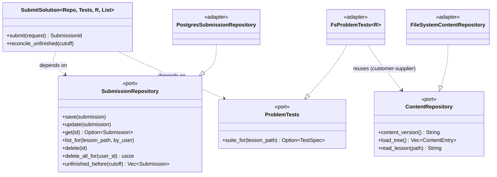

# The server hexagon

> **You'll be able to:** read a bounded context's four layers and predict what each may import;
> explain why a port is generic instead of `dyn` and name the cost of that choice; and spot the one
> place in this codebase where a cross-context dependency is legitimate.

## Four layers, sized to the work

Every bounded context is laid out the same way:

```
server/src/<context>/
  domain/          pure types and rules — no framework, ever
  application/     use cases; declares output PORTS; owns the error enum
  infrastructure/  adapters that implement the ports
  http/            inbound adapter: routes → use cases; DTO ↔ domain mapping
```

The layering is **proportional to the work**, not applied uniformly. `submission` earns all four —
it has an aggregate, a state machine, four ports and a background task. `platform` stays flat: it is
health checks, security headers and two proxies, and giving it a `domain/` would be ceremony. The
rule is that structure is justified by complexity, not by symmetry.

## The ports

Ten traits, each the narrowest capability its use case needs. This is Interface Segregation applied
literally — `TokenVerifier` and `KeycloakAdmin` are separate ports because verifying a token and
deleting a user are different jobs with different failure modes, even though both are "Keycloak".

| Port | Context | Adapter | Backed by |
|---|---|---|---|
| `ContentRepository` | catalog | `FileSystemContentRepository` | disk (git-sync checkout) |
| `CodeRunner` | execution | `GoJudgeRunner` | go-judge over HTTP |
| `SubmissionRepository` | submission | `PostgresSubmissionRepository` | Postgres via sqlx |
| `SubmissionAllowlist` | submission | Postgres adapter | Postgres |
| `ProblemTests` | submission | `FsProblemTests<R>` | the *catalog's* port |
| `TokenVerifier` | identity | `JwksTokenVerifier` | cached JWKS, local crypto |
| `KeycloakAdmin` | identity | `KeycloakAdminClient` | Keycloak admin REST |
| `BlogRepository` | blog | `FileSystemBlogRepository` | disk |
| `TutorClient` | tutoring | `OllamaTutorClient` | Ollama |
| `ReadinessProbe` | platform | `PgReadiness` | a Postgres ping |



Read the direction carefully: the application depends on the trait, the adapter implements it, and
nothing in `application/` names a concrete adapter. Wiring happens once, in `main`.

## Generic, not dynamic

Here is the shape that surprises people arriving from a JVM background. The use case is generic over
its ports:

```rust
pub struct SubmitSolution<Repo, Tests, R: CodeRunner, List> {
    repo: Arc<Repo>,
    tests: Arc<Tests>,
    runner: Arc<RunCodeService<R>>,
    allowlist: Arc<List>,
    allowlist_enforced: bool,
}
```

Not `Arc<dyn SubmissionRepository>`. The ports use **native async functions in traits**, and the
services are monomorphised at compile time — static dispatch, no vtable, no `#[async_trait]` macro
anywhere in the codebase.

The reasoning is that `dyn` buys runtime substitutability, and *nothing here varies at runtime*.
There is exactly one `SubmissionRepository` in a running process; the second implementation is a test
fake, and tests pick their implementation at compile time just as well. Paying a vtable indirection —
and, with `async_trait`, a boxed future allocation per call — to buy flexibility nobody uses is a cost
without a benefit.

<div style="border-left:4px solid #195045;background:rgba(25,80,69,0.08);padding:0.6rem 1rem;border-radius:0 0.5rem 0.5rem 0;margin:1.25rem 0">

💡 **The honest cost.** Generics propagate. `SubmitSolution<Repo, Tests, R, List>` means every type
that holds one carries four parameters, and the router state types get long. That is a real
readability tax, paid at every layer boundary the type crosses. It is worth it here because the
parameter list is stable — but "use generics everywhere" is not the lesson. The lesson is: choose
dispatch by whether anything actually varies.

</div>

## The one exception, and why it earns it

`ReadinessProbe` is the only port stored as a trait object:

```rust
pub readiness: Arc<dyn platform::health::ReadinessProbe>,
```

It is also the only port that does **not** use async-fn-in-trait. It cannot — a trait with an
`async fn` is not object-safe. To be `dyn`, it returns a boxed future by hand:

```rust
fn ping(&self) -> Pin<Box<dyn Future<Output = Result<(), String>> + Send + '_>>;
```

That is the trade made explicit: the boxed future *is* the price of dynamic dispatch, normally hidden
inside `#[async_trait]`. It is worth paying exactly here, because readiness is held in shared
application state used by a route that must not be generic over the whole world, and it is called
once per probe — roughly every ten seconds, not once per request.

One `dyn` in ten ports, with a written reason. That is what "no `dyn` where a generic suffices" means
in practice: not a ban, but a decision that has to be justified.

## The purity rule is a grep

Layering that lives only in a document decays. This one is checked:

```
→ server domain purity (no axum/tower/hyper/tokio/sqlx/reqwest/utoipa under domain/)
  ok
→ client logic purity (no leptos/web-sys/wasm-bindgen/js-sys/gloo under logic/)
  ok
→ file-size caps (server/shared ≤ 500 · client ≤ 800)
  ok
```

It runs first in CI, before compilation. It is three greps and a line count, and it is the reason the
domain is testable without a database, a browser or a network: code that cannot import the web
framework cannot depend on one.

The file-size cap in the same script is doing quieter work. A 500-line file is usually two
responsibilities that have not been separated yet, so the cap turns a design smell into a build
failure. It has fired for real — one client file reached 889 lines and was split into `logic`,
`state` and `view`, which is what it should have been.

## Errors are per-context, and they are enums

Six application-layer error enums, one per context, each a `thiserror` enum. No `Box<dyn Error>` in
any signature, and `anyhow` only in `main.rs` where the caller is a human reading a log.

The value shows up at the HTTP boundary, where mapping an error to a status is an **exhaustive
match**. Adding a variant does not silently fall into a catch-all — it fails the build until someone
decides what status it deserves:

| `SubmissionError` variant | Status | Why |
|---|---|---|
| `SubmitRequiresSignIn` | 401 | anonymous caller |
| `NotAllowlisted` | 403 | authenticated, not permitted |
| `NotYours` | 403 | authenticated, not the owner |
| `NotAProblem` | 404 | the lesson has no hidden suite |
| `UnknownSubmission` | 404 | no such id |
| `InvalidSuite` | 500 | the *author* wrote a bad suite — my bug, not the caller's |

`InvalidSuite` → 500 is deliberate and worth pausing on. A malformed test suite is not a client
error; the request was perfectly valid. Returning 400 would blame the reader for a mistake the author
made, and would hide it from the error-rate metrics that should be screaming.

<details>
<summary>Two of those variants are handled <em>before</em> the match. Why, and what does that cost?</summary>

`SubmitRequiresSignIn` and `NotAllowlisted` return early, because their responses carry a `detail`
and a `hint` that the generic tail cannot produce — the allowlist rejection interpolates the
username and suggests self-hosting. Good errors are specific, and specificity does not fit a
`(status, message)` tuple.

The cost is a subtle fragility: both variants **also** appear in the match, mapped to 500, to keep it
exhaustive. Those arms are unreachable today. But delete an early return and the compiler stays
silent while a 401 quietly becomes a 500 — the exhaustiveness check cannot help, because the arm
still exists.

The sturdier construction is to make the match total and return the rich bodies from inside the arms,
so there is exactly one place a variant's status is decided. This is a small, real design debt, and
it is in the book because a chapter that only shows the parts that came out clean is not much of a
design document.

</details>

## A dependency that looks wrong and is not

`FsProblemTests` is generic over the **catalog's** port:

```rust
impl<R: ContentRepository> ProblemTests for FsProblemTests<R>
```

A submission adapter depending on another context's port looks like a boundary violation. It is
actually the honest modelling of a real relationship: hidden test suites are *content*, they live in
the content tree, and the catalog already owns reading that tree safely — including the traversal
guard that stops a crafted path escaping the content root.

The alternative is worse. Giving `submission` its own filesystem access would duplicate the resolver
and the traversal guard, and duplicated security code drifts. So `submission` is a **customer** of
`catalog`'s supplier relationship, and it depends on the *port*, not the adapter — it names an
interface, and cannot see the filesystem itself.

The discipline that keeps this from becoming a mess: the dependency points at an interface, it is one
direction only, and it is written down.

## Check yourself

```quiz
{"prompt": "Why are the ports generic (`SubmitSolution<Repo, Tests, R, List>`) rather than `Arc<dyn Port>`?", "options": ["Because trait objects cannot be used with async code at all", "Because nothing varies at runtime — there is one real adapter per port, so a vtable would cost indirection to buy flexibility nobody uses", "Because generics compile faster", "Because sqlx requires it"], "answer": "Because nothing varies at runtime — there is one real adapter per port, so a vtable would cost indirection to buy flexibility nobody uses"}
```

```quiz
{"prompt": "`ReadinessProbe` returns `Pin<Box<dyn Future<...>>>` by hand instead of using an async fn. What forced that?", "options": ["Postgres drivers require boxed futures", "It is stored as a trait object, and a trait with an async fn is not object-safe — so the future must be boxed manually", "It was written before async fns in traits were stable and has not been updated", "Boxing makes the probe faster"], "answer": "It is stored as a trait object, and a trait with an async fn is not object-safe — so the future must be boxed manually"}
```

```quiz
{"prompt": "An authored test suite is malformed and the submission fails. Why does that map to 500 rather than 400?", "options": ["Because 400 is reserved for parse errors", "Because the request was valid — the fault is the author's, and blaming the caller would also hide the bug from error-rate metrics", "Because the client cannot handle 400 responses", "Because the suite is loaded server-side"], "answer": "Because the request was valid — the fault is the author's, and blaming the caller would also hide the bug from error-rate metrics"}
```

<details>
<summary>If ports exist to allow swapping implementations, and nothing here is ever swapped, what are the ports actually buying?</summary>

Testability and **direction of dependency** — which turn out to matter more than substitutability.

The swap almost never happens in production. What happens constantly is testing: every use case is
exercised against a fake adapter, in-process, with no container, no network and no fixture database.
The suite runs in seconds because the ports exist.

The deeper benefit is that the dependency arrow points inward. Without a port, `submission` would
import sqlx, and the aggregate's rules would be tangled with a specific database's types — so
changing databases would mean changing business logic. With a port, the database is a detail the
domain never learns about.

And the option is genuinely real, even if unused. The execution context is the extraction candidate
precisely because its port is already a trait whose adapter already speaks HTTP to another process.
The port is what makes that a wiring change rather than a rewrite. Optionality has value even when
the option is never exercised — the mistake is paying *unbounded* cost for it, which is why the
layering here is proportional rather than uniform.

</details>
