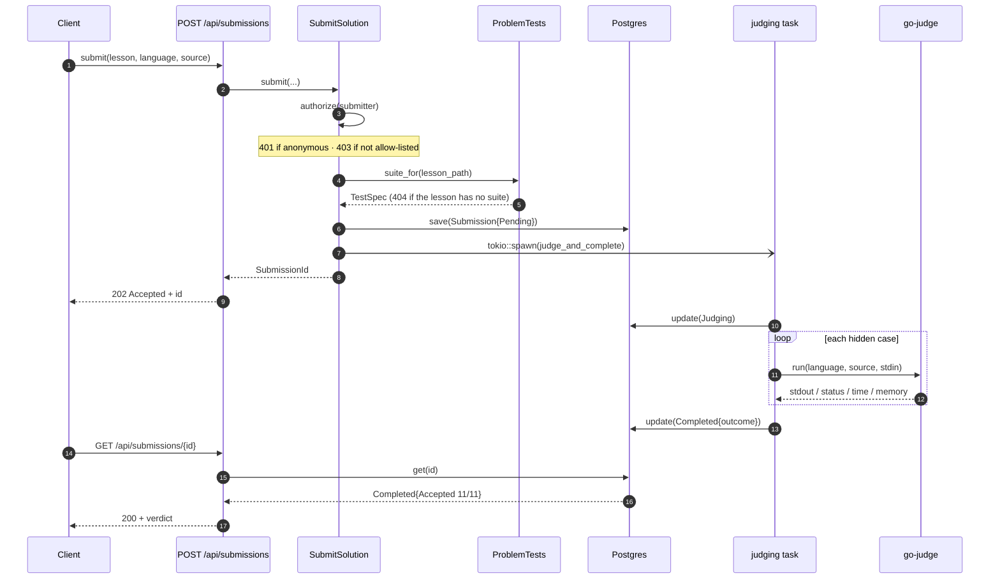
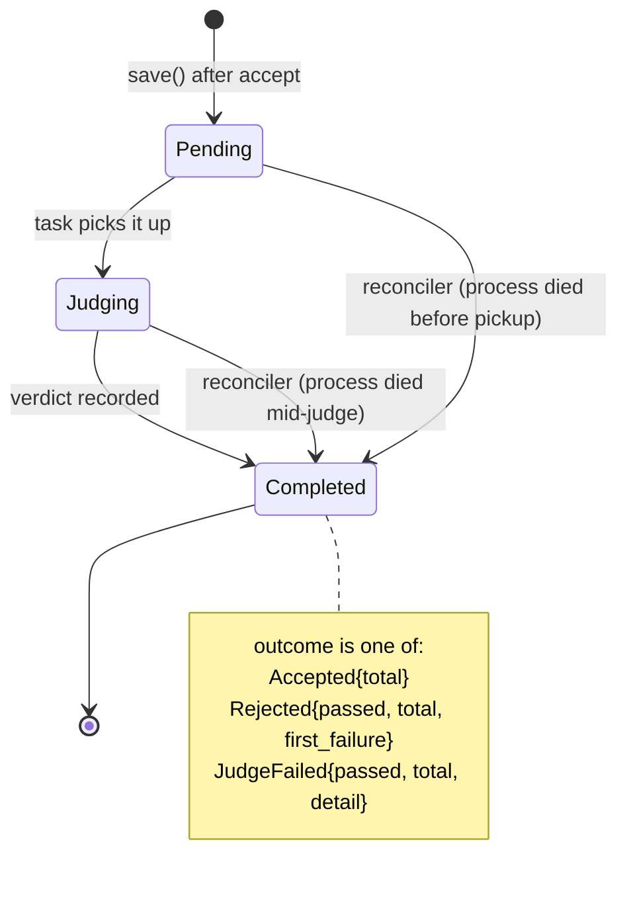

# The submission lifecycle

> **You'll be able to:** explain why an accept-then-judge design needs a reconciler; distinguish a
> verdict about *code* from a verdict about *machinery* and say why conflating them is a bug; and use
> the type system to make "forgot to persist a state transition" a compile-time warning.

## The problem with judging synchronously

Judging a submission means running the reader's code against every hidden case. That is seconds of
CPU on a sandbox, and it is the one operation in this system whose duration is set by *someone else's
program* — including programs that loop forever until a timeout kills them.

Doing that inside the request would mean an HTTP connection held open for the duration, a client
timeout that loses the result while the work continues, and a slow submission occupying a connection
that reads need. So submission is **accepted**, not answered:



Two orderings in that diagram are load-bearing:

**The suite is fetched before the row is written.** A lesson with no hidden suite is not a problem,
and that is a 404 — so it must be discovered *before* anything is persisted. Reversing these would
litter the table with rows for submissions that were never valid.

**The task is spawned after the save.** The judging task updates a row by id; if it started first, it
could race the insert. Save-then-spawn means the row provably exists before anything tries to
advance it.

## Ownership across the request boundary

`tokio::spawn` returns a task that outlives the request handler, so it cannot borrow from it. The use
case is therefore `Clone`, and cloning shares the same adapters:

```rust
let this = self.clone();
tokio::spawn(async move { this.judge_and_complete(submission, spec).await });
```

Each port is an `Arc`, so the clone is a handful of refcount bumps, not a duplicated connection pool.
This is the Rust-shaped answer to "the background job needs the same dependencies as the request":
share ownership explicitly, and let the type system prove the task cannot outlive what it uses.

## Three states, and transitions you cannot forget



The transitions are functions returning a **new** value, and they are `#[must_use]`:

```rust
#[must_use]
pub fn judging(&self) -> Self { ... }

#[must_use]
pub fn completed(&self, outcome: SuiteOutcome, at: DateTime<Utc>) -> Self { ... }
```

That combination is doing real work. Because a transition produces a value instead of mutating in
place, "advance the state" and "persist the state" cannot drift apart — and because the result is
`#[must_use]`, calling `submission.judging();` and discarding it is a compiler warning rather than a
submission that silently never moves.

The usual version of this bug — mutate the object, forget the `save`, wonder why the status is stale
— is not available here. That is the difference between a rule you remember and a rule the compiler
remembers for you.

## `Rejected` and `JudgeFailed` are not the same failure

`SuiteOutcome` separates them deliberately:

| Outcome | Means | Whose fault |
|---|---|---|
| `Accepted { total }` | every case passed | — |
| `Rejected { passed, total, first_failure }` | the code is wrong | the reader's |
| `JudgeFailed { passed, total, detail }` | the machinery broke | mine |

Collapsing `JudgeFailed` into `Rejected` would be an outright lie: it would tell someone their
correct solution is wrong because a sandbox was briefly unreachable. It also destroys the operational
signal — rejections are the product working, judge failures are an incident, and a single "failed"
status makes the second invisible inside the first.

`Rejected` carries `first_failure` rather than every failure, which is a teaching decision: the first
case that broke is the one worth debugging, and a wall of failures is noise.

## What happens when the process dies

Here is the cost of the design, stated plainly. The judging task lives **inside the process that
spawned it**. When a pod is killed mid-judge — a deploy, an OOM, a node reboot — the task dies with
it, and the in-task failure handler dies too. The row stays `Judging` forever.

Nothing in the request path can fix this, because there is no request left. So the fix runs at
startup, before the server accepts traffic:

```rust
const JUDGE_GRACE: chrono::Duration = chrono::Duration::minutes(15);
...
if let Err(error) = submit.reconcile_unfinished(JUDGE_GRACE).await { ... }
```

The sweep finds rows still `Pending` or `Judging` and older than the grace window, and completes each
with an honest verdict:

> judging stopped when the server restarted — submit again

The grace window is the whole subtlety. **Without it, a restarting replica would reconcile
submissions another replica is actively judging** — and the reconciler would overwrite a real verdict
with a failure. Fifteen minutes is comfortably longer than any legitimate judging run, so anything
older is genuinely abandoned rather than merely in flight.

One more detail worth the read. The sweep looks up each submission's suite only to report a
believable `0/11` instead of a bare `0/0`, and it deliberately ignores a lookup failure:

```rust
.ok().flatten().map_or(0, |spec| spec.cases.len())
```

That is presentation, not correctness, and presentation must never abort a repair. Likewise a failed
update logs a warning and the loop continues — one unrecoverable row must not block the rest.

<div style="border-left:4px solid #195045;background:rgba(25,80,69,0.08);padding:0.6rem 1rem;border-radius:0 0.5rem 0.5rem 0;margin:1.25rem 0">

💡 **Every asynchronous accept needs a sweeper.** The moment you return 202, you have promised to
finish work that no client is waiting on, using a process that can die. Idempotent retry and a
grace-windowed reconciler are not extras — they are the other half of the pattern. A 202 without a
sweeper is a promise with no mechanism behind it.

</div>

## The layered failure handling

Read `judge_and_complete` as three tiers of "what if this fails":

```rust
let outcome = match self.repo.update(&submission.judging()).await {
    Ok(()) => self.judge(&spec, &submission.language, &submission.source).await,
    Err(error) => SuiteOutcome::JudgeFailed { passed: 0, total, detail: error.to_string() },
};
if let Err(error) = self.repo.update(&submission.completed(outcome, Utc::now())).await {
    tracing::warn!(id = %submission.id, %error, "could not record the outcome");
}
```

1. **The mark-as-judging write fails** → do not run the judge at all. Burning sandbox CPU on a
   verdict there is nowhere to put is waste; fail fast with `JudgeFailed`.
2. **The judge itself fails** → that is `JudgeFailed` too, produced inside `judge`.
3. **The final write fails** → warn and give up *here*. There is no client to tell and no useful
   retry in-process, so the row stays unfinished — and the startup reconciler is precisely the thing
   that will eventually close it.

Tier 3 is the interesting one: it is a deliberate hand-off from the request-time mechanism to the
startup-time one, which is only safe because the sweeper exists.

## Check yourself

```quiz
{"prompt": "Why does `reconcile_unfinished` use a 15-minute grace window instead of sweeping every unfinished row at startup?", "options": ["To reduce database load at boot", "Because Postgres needs time to become consistent", "Because a restarting instance would otherwise overwrite the verdicts of submissions another process is legitimately judging right now", "Because submissions expire after 15 minutes"], "answer": "Because a restarting instance would otherwise overwrite the verdicts of submissions another process is legitimately judging right now"}
```

```quiz
{"prompt": "What do `#[must_use]` plus value-returning transitions (`judging()`, `completed()`) prevent?", "options": ["Two threads mutating the same submission", "Advancing a submission's state in memory and forgetting to persist it — discarding the result is a compiler warning", "Storing an invalid status string in the database", "Submissions being judged twice"], "answer": "Advancing a submission's state in memory and forgetting to persist it — discarding the result is a compiler warning"}
```

```quiz
{"prompt": "Why are `Rejected` and `JudgeFailed` separate outcomes rather than one 'failed' status?", "options": ["To make the database schema simpler", "Because they have different causes and audiences: one says the reader's code is wrong, the other says my infrastructure broke — merging them would lie to the reader and hide incidents", "Because Rejected is temporary and JudgeFailed is permanent", "Because go-judge returns two different error codes"], "answer": "Because they have different causes and audiences: one says the reader's code is wrong, the other says my infrastructure broke — merging them would lie to the reader and hide incidents"}
```

<details>
<summary>The reconciler is a startup sweep. What does that choice cost, and when would it stop being enough?</summary>

It costs **latency to repair**. A row abandoned by a crash stays unfinished until the next process
start — which, on a stable deployment, could be days. The reader sees a submission stuck on "judging"
with no explanation for far longer than the fifteen-minute grace window suggests.

That is acceptable here for a specific, checkable reason: with one replica, a crash *is* a restart,
so the sweep runs within seconds of the event that caused the damage. The design leans on
`replicas: 1` — the same constraint the rate limiter imposes.

It stops being enough the moment there are two replicas. Then a crash of instance A is not a restart
of anything; instance B keeps serving, and A's abandoned rows sit unfinished until A happens to boot.
The fix is to make the sweep **periodic** rather than boot-time — a background interval task on every
instance, still grace-windowed so instances do not steal each other's live work.

Which is a nice illustration of a general point: the grace window is what makes the sweep safe to run
concurrently, so the design already contains what a multi-replica version needs. Moving from
boot-time to periodic is a scheduling change, not a redesign — and that is the difference between a
constraint you chose and one you backed into.

</details>
