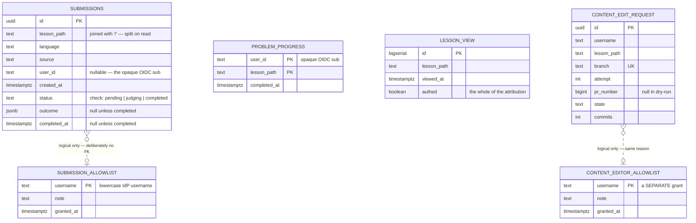

# Data design and the schema

> **You'll be able to:** flatten a sum type into relational columns without losing its guarantees;
> write a constraint that enforces a biconditional rather than a null check; decide when *not* to
> add a foreign key; and read a schema as a record of what a system refused to store.

## The whole schema

Six tables, in three pairs. Click any of them in the diagram to read its DDL, constraints and access
patterns.

<iframe
  src="/c4/view/saf_data"
  width="100%"
  height="560"
  style="border: 1px solid var(--border, #2b2b2b); border-radius: 8px;"
  loading="lazy"
  title="Synapse — data view"
></iframe>



| Pair | Tables | What it is |
|---|---|---|
| System of record | `submissions`, `submission_allowlist` | what a reader attempted and what the judge decided |
| Account conveniences | `problem_progress`, `lesson_view` | what has been finished, and what gets read |
| Contribution | `content_editor_allowlist`, `content_edit_request` | who may propose a change, and what they proposed |

A platform this size having six small tables is the point, and it is worth being explicit about why:
**content is not in the database.** Books are Markdown in a git repository, pulled onto disk by a
sidecar and re-indexed when the commit changes. That single decision deletes an entire schema —
no `books`, `chapters`, `lessons`, `revisions`, `authors` — and replaces the authoring write path
with `git push`.

The third pair is the interesting test of that claim, because in-app editing is exactly the feature
that usually drags content into a database. It did not. Those two tables are about *proposals* — an
allowlist and a branch name — and the lesson text still only ever exists in git. A row records where
a change went, never what it said.

What is left is exactly the state that *cannot* be rebuilt from a repository.

## Read the schema for what is missing

The most informative thing about these tables is what they decline to hold.

`lesson_view` has no user id, no session, no IP and no referrer — one boolean says whether the reader
was signed in, and that is the entire attribution. It can answer *"which lessons get opened"* and is
structurally incapable of answering *"what did this person read"*.

`problem_progress` has no surrogate key and no `completed` flag: the row's existence is the fact, so
re-syncing is an upsert rather than a chance to disagree with yourself.

`content_edit_request` holds a branch name and a pull-request number, not a diff — the forge owns the
content, and asking it for the live state before reusing a branch is cheaper than trying to stay in
sync with it.

<div style="border-left:4px solid #195045;background:rgba(25,80,69,0.08);padding:0.6rem 1rem;border-radius:0 0.5rem 0.5rem 0;margin:1.25rem 0">

💡 **A column you never add cannot leak, drift, or need a migration.** Privacy and simplicity are the
same property viewed from two directions, and both are enforced far more reliably by an absent column
than by a policy about a present one.

</div>

## Flattening a sum type into columns

The domain models state as an ADT — `Pending`, `Judging`, or `Completed { outcome, at }`. Postgres
has no sum types, so the ADT flattens into three columns, in exactly one place:

```rust
fn flatten(state: &SubmissionState) -> (&'static str, Option<Value>, Option<DateTime<Utc>>) {
    match state {
        SubmissionState::Pending => ("pending", None, None),
        SubmissionState::Judging => ("judging", None, None),
        SubmissionState::Completed { outcome, at } =>
            ("completed", serde_json::to_value(OutcomeJson::from(outcome)).ok(), Some(*at)),
    }
}
```

| Domain state | `status` | `outcome` | `completed_at` |
|---|---|---|---|
| `Pending` | `'pending'` | `null` | `null` |
| `Judging` | `'judging'` | `null` | `null` |
| `Completed { outcome, at }` | `'completed'` | the verdict as JSONB | `at` |

Flattening is lossy in one direction: the columns permit combinations the ADT does not. A row could
claim `status = 'completed'` with a null outcome, or carry a verdict while still `'pending'` — states
that are simply unrepresentable in Rust. That gap is where corrupt data lives.

## The constraint that closes the gap

```sql
constraint completed_shape check
    ((status = 'completed') = (outcome is not null and completed_at is not null))
```

Read the `=` as **if and only if**. This is not a null check; it is a biconditional, and it forbids
*both* directions of nonsense in one line:

| Row | Left | Right | Allowed |
|---|---|---|---|
| `'completed'` + verdict + timestamp | true | true | ✅ |
| `'pending'`, both null | false | false | ✅ |
| `'completed'`, outcome null | true | false | ❌ |
| `'judging'` + a verdict | false | true | ❌ |

The naive version — `check (status <> 'completed' or outcome is not null)` — catches only the first
error and cheerfully accepts a pending row carrying a verdict.

<div style="border-left:4px solid #195045;background:rgba(25,80,69,0.08);padding:0.6rem 1rem;border-radius:0 0.5rem 0.5rem 0;margin:1.25rem 0">

💡 **Make illegal states unrepresentable — at every layer that can.** The type system guarantees it
in memory. The moment data crosses into a store with a weaker model, that guarantee evaporates unless
you restate it in that store's own language. The check constraint is the ADT, re-expressed in SQL.

</div>

The inverse mapping is equally deliberate. Reading a row matches on the status string, and an
unrecognised value is an error, not a default:

```rust
other => return Err(SubmissionError::StoreFailed(format!("unknown status '{other}'"))),
```

Defaulting to `Pending` would silently resurrect finished submissions. The rule: **when decoding
narrows a type, fail loudly** — the alternative is a plausible answer that is wrong.

## Three representations of one verdict

A verdict exists in three forms, on purpose:

| Form | Type | Shape | Owned by |
|---|---|---|---|
| Domain | `SuiteOutcome` | Rust enum with variant data | `domain/` |
| Storage | `OutcomeJson` | externally tagged JSON, camelCase | the Postgres adapter |
| Wire | `SubmissionDto` | flat fields for the client | `http/` |

The instinct is to collapse these into one serde type and be done. It is worth resisting, because
the three have **different reasons to change**. The wire shape changes when the UI needs a new field.
The storage shape must not change at all without a migration, since old rows already exist. Fusing
them means a UI tweak silently rewrites how data is persisted.

Here that separation was load-bearing rather than theoretical. `OutcomeJson` is deliberately
byte-compatible with what a *previous implementation in a different language* wrote — same external
tagging, same camelCase, same status-as-case-name — so rows written years earlier still decode:

```json
{"Rejected": {"passed": 3, "total": 11, "firstFailure": {"case": "…", "expected": "…", "actual": "…"}}}
```

That compatibility was not assumed. It was proven on a byte-for-byte copy of the production database
before any cutover, which is the only way to know a codec matches a format you did not write.

## The foreign key that is deliberately missing

The obvious relational move is `submissions.user_id REFERENCES submission_allowlist(username)`. It
would be wrong, because the two columns hold **different identifiers on purpose**:

| Column | Holds | Chosen for |
|---|---|---|
| `submissions.user_id` | the opaque OIDC `sub` | stable forever; survives a rename; never re-issued |
| `submission_allowlist.username` | the lowercase IdP username | a human has to type it into a form |

A `sub` is an opaque identifier no operator wants to paste by hand. Granting access by UUID would be
miserable and error-prone, so grants are keyed by the name a person actually knows. The cost is real:
the association is **logical, not referential**, and the database will not enforce it.

What keeps that safe is canonicalisation at exactly one point — the token verifier lowercases the
username once, so every comparison downstream is apples-to-apples. Case-normalising at each
comparison site instead would work until someone added a site and forgot.

Two identifiers for two jobs, with the join made by policy rather than by constraint, is a defensible
trade *at this scale*: the allowlist is small and hand-curated. It would not be defensible if grants
were self-service and high-volume.

## One index per query, and no others

```sql
create index submissions_lesson_recency    on submissions           (lesson_path, created_at desc);
create index lesson_view_path_recency      on lesson_view           (lesson_path, viewed_at desc);
create index problem_progress_user         on problem_progress      (user_id);
create index content_edit_request_owner_page on content_edit_request (username, lesson_path);
```

Four indexes for four queries, and the shape of each is dictated by its query rather than chosen:

| Query | Index shape |
|---|---|
| recent attempts on this lesson, newest first | equality then `desc` — the sort is read from the index |
| top lesson paths, recent first | the same shape, same reason |
| every lesson this account has finished | equality on the leading column of the composite key |
| is there an open request from this person on this page | equality on both |

Two of them are literally the same pattern, which is worth noticing rather than deduplicating: when a
second feature's access pattern matches the first's, that is evidence the first index was shaped by
the *question* and not by the table.

Every other access is by primary key. Adding speculative indexes would slow every write to serve
queries nobody makes; the honest default is to index the access patterns that exist and add more when
a slow query proves the need.

## Adopting a schema you did not create

The first two migrations did not create the production schema. It was created by the previous
implementation's migration tool, and then **adopted**: the new tool's bookkeeping table was
hand-baselined so both counted as already applied, and boot no-ops instead of trying to create live
tables. Everything from the third migration onwards is an ordinary forward migration that ran for
real — which is the point of doing the adoption properly once: after it, the schema has no special
cases left in it.

The order was the risky part. Deployment is GitOps with auto-sync, so pushing the manifest *is* the
deploy — there is no window between "committed" and "running". The baseline therefore had to be
written to the production database **before** the commit was pushed, not after.

The whole procedure was rehearsed on a scratch copy of the production data first. That rehearsal is
what proved the codec compatibility above, and it is the only reason the real cutover was boring.

<details>
<summary>The outcome is JSONB inside an otherwise strict relational schema. Isn't that the schemaless mistake the check constraint was avoiding?</summary>

It is the same tension, resolved differently — and the difference is whether the database needs to
*reason* about the value.

The columns Postgres reasons about are strictly typed and constrained: `status` drives a check
constraint, `created_at` drives the index, `id` is the key. The outcome is different in kind. Nothing
queries inside it, nothing joins on it, no constraint depends on its contents. It is an opaque
payload the application reads back whole.

Modelling it relationally would mean an `outcome` table plus a `failed_case` table, two joins and a
nullable-heavy shape, to represent something with **no independent existence** — an outcome without
its submission is meaningless, and it is always read as a unit. That is a value object, not an entity,
and JSONB is a reasonable column type for a value object.

The real safeguard is that the shape is enforced *somewhere*: `OutcomeJson` is a typed Rust enum, and
decoding a row that does not match it fails loudly. So the schema is not absent — it lives in the
adapter and is exercised on every read.

Where this would become the schemaless mistake: the day someone wants "all rejections whose first
failure was case 3". Then the query needs to see inside the blob, and the honest response is to
promote that field to a real column with an index — not to reach for JSON operators and pretend the
structure was there all along.

</details>
