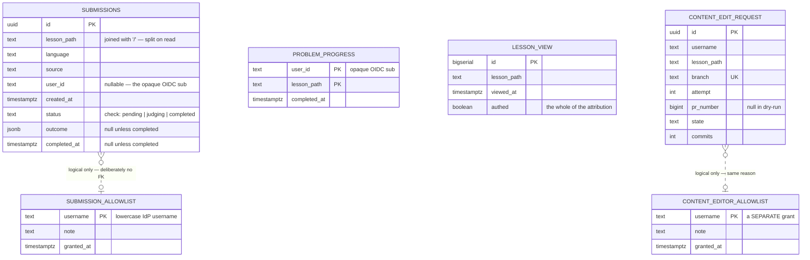
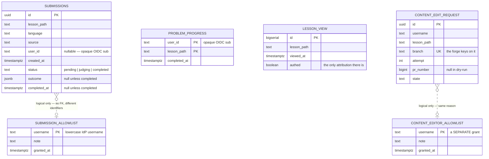

# Data design and the schema

> **You'll be able to:** flatten a sum type into relational columns without losing its guarantees;
> write a constraint that enforces a biconditional rather than a null check; decide when *not* to
> add a foreign key; and read a schema as a record of what a system refused to store.

## The whole schema

Six tables, in three pairs. Each one's DDL, constraints and access patterns are written up under
[the table reference](#-table-reference) at the end of the chapter.


```mermaid
erDiagram
    SUBMISSIONS {
        uuid id PK
        text lesson_path "joined with '/' — split on read"
        text language
        text source
        text user_id "nullable — the opaque OIDC sub"
        timestamptz created_at
        text status "check: pending | judging | completed"
        jsonb outcome "null unless completed"
        timestamptz completed_at "null unless completed"
    }
    SUBMISSION_ALLOWLIST {
        text username PK "lowercase IdP username"
        text note
        timestamptz granted_at
    }
    PROBLEM_PROGRESS {
        text user_id PK "opaque OIDC sub"
        text lesson_path PK
        timestamptz completed_at
    }
    LESSON_VIEW {
        bigserial id PK
        text lesson_path
        timestamptz viewed_at
        boolean authed "the whole of the attribution"
    }
    CONTENT_EDITOR_ALLOWLIST {
        text username PK "a SEPARATE grant"
        text note
        timestamptz granted_at
    }
    CONTENT_EDIT_REQUEST {
        uuid id PK
        text username
        text lesson_path
        text branch UK
        int attempt
        bigint pr_number "null in dry-run"
        text state
        int commits
    }
    SUBMISSIONS }o..o| SUBMISSION_ALLOWLIST : "logical only — deliberately no FK"
    CONTENT_EDIT_REQUEST }o..o| CONTENT_EDITOR_ALLOWLIST : "logical only — same reason"
```

| Pair | Tables | What it is |
|---|---|---|
| System of record | `submissions`, `submission_allowlist` | what a reader attempted and what the judge decided |
| Account conveniences | `problem_progress`, `lesson_view` | what has been finished, and what gets read |
| Contribution | `content_editor_allowlist`, `content_edit_request` | who may propose a change, and what they proposed |

A platform this size having six small tables is the point, and it is worth being explicit about why:
**content is not in the database.** Books are Markdown in a git repository, pulled onto disk by a
sidecar and re-indexed when the commit changes. That single decision deletes an entire schema —
no `books`, `chapters`, `lessons`, `revisions`, `authors` — and replaces the authoring write path
with `git push`.

The third pair is the interesting test of that claim, because in-app editing is exactly the feature
that usually drags content into a database. It did not. Those two tables are about *proposals* — an
allowlist and a branch name — and the lesson text still only ever exists in git. A row records where
a change went, never what it said.

What is left is exactly the state that *cannot* be rebuilt from a repository.

## Read the schema for what is missing

The most informative thing about these tables is what they decline to hold.

`lesson_view` has no user id, no session, no IP and no referrer — one boolean says whether the reader
was signed in, and that is the entire attribution. It can answer *"which lessons get opened"* and is
structurally incapable of answering *"what did this person read"*.

`problem_progress` has no surrogate key and no `completed` flag: the row's existence is the fact, so
re-syncing is an upsert rather than a chance to disagree with yourself.

`content_edit_request` holds a branch name and a pull-request number, not a diff — the forge owns the
content, and asking it for the live state before reusing a branch is cheaper than trying to stay in
sync with it.

<div style="border-left:4px solid #195045;background:rgba(25,80,69,0.08);padding:0.6rem 1rem;border-radius:0 0.5rem 0.5rem 0;margin:1.25rem 0">

💡 **A column you never add cannot leak, drift, or need a migration.** Privacy and simplicity are the
same property viewed from two directions, and both are enforced far more reliably by an absent column
than by a policy about a present one.

</div>

## Flattening a sum type into columns

The domain models state as an ADT — `Pending`, `Judging`, or `Completed { outcome, at }`. Postgres
has no sum types, so the ADT flattens into three columns, in exactly one place:

```rust
fn flatten(state: &SubmissionState) -> (&'static str, Option<Value>, Option<DateTime<Utc>>) {
    match state {
        SubmissionState::Pending => ("pending", None, None),
        SubmissionState::Judging => ("judging", None, None),
        SubmissionState::Completed { outcome, at } =>
            ("completed", serde_json::to_value(OutcomeJson::from(outcome)).ok(), Some(*at)),
    }
}
```

| Domain state | `status` | `outcome` | `completed_at` |
|---|---|---|---|
| `Pending` | `'pending'` | `null` | `null` |
| `Judging` | `'judging'` | `null` | `null` |
| `Completed { outcome, at }` | `'completed'` | the verdict as JSONB | `at` |

Flattening is lossy in one direction: the columns permit combinations the ADT does not. A row could
claim `status = 'completed'` with a null outcome, or carry a verdict while still `'pending'` — states
that are simply unrepresentable in Rust. That gap is where corrupt data lives.

## The constraint that closes the gap

```sql
constraint completed_shape check
    ((status = 'completed') = (outcome is not null and completed_at is not null))
```

Read the `=` as **if and only if**. This is not a null check; it is a biconditional, and it forbids
*both* directions of nonsense in one line:

| Row | Left | Right | Allowed |
|---|---|---|---|
| `'completed'` + verdict + timestamp | true | true | ✅ |
| `'pending'`, both null | false | false | ✅ |
| `'completed'`, outcome null | true | false | ❌ |
| `'judging'` + a verdict | false | true | ❌ |

The naive version — `check (status <> 'completed' or outcome is not null)` — catches only the first
error and cheerfully accepts a pending row carrying a verdict.

<div style="border-left:4px solid #195045;background:rgba(25,80,69,0.08);padding:0.6rem 1rem;border-radius:0 0.5rem 0.5rem 0;margin:1.25rem 0">

💡 **Make illegal states unrepresentable — at every layer that can.** The type system guarantees it
in memory. The moment data crosses into a store with a weaker model, that guarantee evaporates unless
you restate it in that store's own language. The check constraint is the ADT, re-expressed in SQL.

</div>

The inverse mapping is equally deliberate. Reading a row matches on the status string, and an
unrecognised value is an error, not a default:

```rust
other => return Err(SubmissionError::StoreFailed(format!("unknown status '{other}'"))),
```

Defaulting to `Pending` would silently resurrect finished submissions. The rule: **when decoding
narrows a type, fail loudly** — the alternative is a plausible answer that is wrong.

## Three representations of one verdict

A verdict exists in three forms, on purpose:

| Form | Type | Shape | Owned by |
|---|---|---|---|
| Domain | `SuiteOutcome` | Rust enum with variant data | `domain/` |
| Storage | `OutcomeJson` | externally tagged JSON, camelCase | the Postgres adapter |
| Wire | `SubmissionDto` | flat fields for the client | `http/` |

The instinct is to collapse these into one serde type and be done. It is worth resisting, because
the three have **different reasons to change**. The wire shape changes when the UI needs a new field.
The storage shape must not change at all without a migration, since old rows already exist. Fusing
them means a UI tweak silently rewrites how data is persisted.

Here that separation was load-bearing rather than theoretical. `OutcomeJson` is deliberately
byte-compatible with what a *previous implementation in a different language* wrote — same external
tagging, same camelCase, same status-as-case-name — so rows written years earlier still decode:

```json
{"Rejected": {"passed": 3, "total": 11, "firstFailure": {"case": "…", "expected": "…", "actual": "…"}}}
```

That compatibility was not assumed. It was proven on a byte-for-byte copy of the production database
before any cutover, which is the only way to know a codec matches a format you did not write.

## The foreign key that is deliberately missing

The obvious relational move is `submissions.user_id REFERENCES submission_allowlist(username)`. It
would be wrong, because the two columns hold **different identifiers on purpose**:

| Column | Holds | Chosen for |
|---|---|---|
| `submissions.user_id` | the opaque OIDC `sub` | stable forever; survives a rename; never re-issued |
| `submission_allowlist.username` | the lowercase IdP username | a human has to type it into a form |

A `sub` is an opaque identifier no operator wants to paste by hand. Granting access by UUID would be
miserable and error-prone, so grants are keyed by the name a person actually knows. The cost is real:
the association is **logical, not referential**, and the database will not enforce it.

What keeps that safe is canonicalisation at exactly one point — the token verifier lowercases the
username once, so every comparison downstream is apples-to-apples. Case-normalising at each
comparison site instead would work until someone added a site and forgot.

Two identifiers for two jobs, with the join made by policy rather than by constraint, is a defensible
trade *at this scale*: the allowlist is small and hand-curated. It would not be defensible if grants
were self-service and high-volume.

## One index per query, and no others

```sql
create index submissions_lesson_recency    on submissions           (lesson_path, created_at desc);
create index lesson_view_path_recency      on lesson_view           (lesson_path, viewed_at desc);
create index problem_progress_user         on problem_progress      (user_id);
create index content_edit_request_owner_page on content_edit_request (username, lesson_path);
```

Four indexes for four queries, and the shape of each is dictated by its query rather than chosen:

| Query | Index shape |
|---|---|
| recent attempts on this lesson, newest first | equality then `desc` — the sort is read from the index |
| top lesson paths, recent first | the same shape, same reason |
| every lesson this account has finished | equality on the leading column of the composite key |
| is there an open request from this person on this page | equality on both |

Two of them are literally the same pattern, which is worth noticing rather than deduplicating: when a
second feature's access pattern matches the first's, that is evidence the first index was shaped by
the *question* and not by the table.

Every other access is by primary key. Adding speculative indexes would slow every write to serve
queries nobody makes; the honest default is to index the access patterns that exist and add more when
a slow query proves the need.

## Adopting a schema you did not create

The first two migrations did not create the production schema. It was created by the previous
implementation's migration tool, and then **adopted**: the new tool's bookkeeping table was
hand-baselined so both counted as already applied, and boot no-ops instead of trying to create live
tables. Everything from the third migration onwards is an ordinary forward migration that ran for
real — which is the point of doing the adoption properly once: after it, the schema has no special
cases left in it.

The order was the risky part. Deployment is GitOps with auto-sync, so pushing the manifest *is* the
deploy — there is no window between "committed" and "running". The baseline therefore had to be
written to the production database **before** the commit was pushed, not after.

The whole procedure was rehearsed on a scratch copy of the production data first. That rehearsal is
what proved the codec compatibility above, and it is the only reason the real cutover was boring.

<details>
<summary>The outcome is JSONB inside an otherwise strict relational schema. Isn't that the schemaless mistake the check constraint was avoiding?</summary>

It is the same tension, resolved differently — and the difference is whether the database needs to
*reason* about the value.

The columns Postgres reasons about are strictly typed and constrained: `status` drives a check
constraint, `created_at` drives the index, `id` is the key. The outcome is different in kind. Nothing
queries inside it, nothing joins on it, no constraint depends on its contents. It is an opaque
payload the application reads back whole.

Modelling it relationally would mean an `outcome` table plus a `failed_case` table, two joins and a
nullable-heavy shape, to represent something with **no independent existence** — an outcome without
its submission is meaningless, and it is always read as a unit. That is a value object, not an entity,
and JSONB is a reasonable column type for a value object.

The real safeguard is that the shape is enforced *somewhere*: `OutcomeJson` is a typed Rust enum, and
decoding a row that does not match it fails loudly. So the schema is not absent — it lives in the
adapter and is exercised on every read.

Where this would become the schemaless mistake: the day someone wants "all rejections whose first
failure was case 3". Then the query needs to see inside the blob, and the honest response is to
promote that field to a real column with an index — not to reach for JSON operators and pretend the
structure was there all along.

</details>

## 🧱 Table reference

<details>
<summary>7 tables — the DDL, the constraints that hold each one together, and the queries it is shaped for</summary>

### Application store
`Relational database` · `PostgreSQL 17`

The system of record, and the only thing in the platform that grows without bound. Everything else
— lessons, diagrams, test suites — is derived data reconstructable from a git repository.


```mermaid
erDiagram
    SUBMISSIONS {
        uuid id PK
        text lesson_path
        text language
        text source
        text user_id "nullable — opaque OIDC sub"
        timestamptz created_at
        text status "pending | judging | completed"
        jsonb outcome "null unless completed"
        timestamptz completed_at "null unless completed"
    }
    SUBMISSION_ALLOWLIST {
        text username PK "lowercase IdP username"
        text note
        timestamptz granted_at
    }
    PROBLEM_PROGRESS {
        text user_id PK "opaque OIDC sub"
        text lesson_path PK
        timestamptz completed_at
    }
    LESSON_VIEW {
        bigserial id PK
        text lesson_path
        timestamptz viewed_at
        boolean authed "the only attribution there is"
    }
    CONTENT_EDITOR_ALLOWLIST {
        text username PK "a SEPARATE grant"
        text note
        timestamptz granted_at
    }
    CONTENT_EDIT_REQUEST {
        uuid id PK
        text username
        text lesson_path
        text branch UK "the forge keys on it"
        int attempt
        bigint pr_number "null in dry-run"
        text state
    }
    SUBMISSIONS }o..o| SUBMISSION_ALLOWLIST : "logical only — no FK, different identifiers"
    CONTENT_EDIT_REQUEST }o..o| CONTENT_EDITOR_ALLOWLIST : "logical only — same reason"
```

Six tables, in three pairs. Submissions and their allowlist are the original system of record.
Progress and readership are account-owned conveniences added later. The last pair is content
contribution: who may propose a change, and what they proposed.

#### Why it is this small

The platform's largest asset by far is its content, and content is **not** in the database. Books
live as Markdown in a git repository, are pulled onto disk by a sidecar, and are re-indexed from the
filesystem whenever the commit changes. That single decision removes an entire class of schema — no
`books`, `chapters`, `lessons`, `revisions`, or `authors` tables — and replaces the write path for
authoring with `git push`.

Note that in-app editing did **not** change that. It adds two tables about *proposals*, not about
content: the lesson text still only ever lives in git, and the row records which branch a proposal
went to.

What remains in Postgres is exactly the state that cannot be derived from a repository: what a
reader attempted, what the judge decided, what they have finished, what was read, and what has been
proposed.

#### Capacity, honestly

At the current scale this database holds single-digit-to-low-hundreds of rows and a `pg_dump` is
kilobytes. Even at a million monthly readers the arithmetic stays undramatic — submissions arrive at
well under one per second, and a submission is a few kilobytes of source plus a small JSON verdict.
`lesson_view` is the one table that grows with *traffic* rather than with engagement, and it is the
first candidate for time-partitioning or roll-up if that ever matters.

The scarce resource is not capacity but **availability**: the database currently runs on
node-local storage on a single machine, which makes that machine a single point of failure for the
whole platform. That is discussed honestly in the
[homelab case study](/synapse/synapse-app-from-scratch/running-it/the-homelab-case-study).

#### Migrations and adoption

Schema changes are embedded SQL migrations applied at boot, and the application **fails fast** if
the database is unreachable — the system of record does not degrade, unlike the identity provider,
which does.

The first two migrations did not create the production schema. It was created by the previous
implementation's migration tool and then *adopted*: the migration bookkeeping table was
hand-baselined so the new tool considered both already applied, and boot no-ops instead of trying to
re-create live tables. That procedure was rehearsed on a byte-for-byte copy of production first —
which is what proved a verdict written by the old implementation still decodes correctly through the
new one. Migrations three onwards are ordinary forward migrations that ran for real.

### `submissions`
`Table` · `PostgreSQL`

One row per attempt. This is where the domain's state ADT flattens into columns — and, deliberately,
the only place it does.

```sql
create table submissions (
    id           uuid primary key,
    lesson_path  text        not null,
    language     text        not null,
    source       text        not null,
    user_id      text,
    created_at   timestamptz not null,
    status       text        not null check (status in ('pending', 'judging', 'completed')),
    outcome      jsonb,
    completed_at timestamptz,
    constraint completed_shape check
        ((status = 'completed') = (outcome is not null and completed_at is not null))
);

create index submissions_lesson_recency on submissions (lesson_path, created_at desc);
```

#### The constraint is the design

`completed_shape` is a **biconditional**, not a null check. Read it as *"completed if and only if a
verdict and a completion time are present"*. That single line rules out two bad rows at once:

- a `pending` row that somehow carries a verdict, and
- a `completed` row with no verdict.

In the domain those states are unrepresentable because `Completed` is an enum variant that *owns*
its `outcome` and `at`. The constraint is that same invariant restated where the type system cannot
reach — anything writing to this table, including a hand-typed `UPDATE`, is held to it.

#### How the ADT maps

| Domain state | `status` | `outcome` | `completed_at` |
|---|---|---|---|
| `Pending` | `'pending'` | `NULL` | `NULL` |
| `Judging` | `'judging'` | `NULL` | `NULL` |
| `Completed { outcome, at }` | `'completed'` | JSONB | set |

The inverse read fails loudly on an unrecognised `status` rather than defaulting — a value outside
the three means the database disagrees with the code, and guessing would hide that.

#### Notes on the columns

- **`lesson_path`** is the joined path (`dsa/basics/two-sum`), not an array. The only query that
  matters is "recent attempts at this lesson", which the one index serves.
- **`user_id`** is nullable and stores the **opaque OIDC subject** — not a username. It is null for
  the anonymous submissions the deployment permitted before the allowlist gate was enforced.
- **`source`** stores the submitted code verbatim. There is no size column and no blob store; at
  this scale the text column is the simpler correct answer.
- **`outcome`** is JSONB in an **adapter-owned** shape that is deliberately *not* the wire DTO. It
  is externally tagged (`{"Rejected": {...}}`) for compatibility with the previous implementation's
  serialiser, so this schema could be adopted without rewriting a single stored row.

### `submission_allowlist`
`Table` · `PostgreSQL`

Who is permitted to submit-and-save. Reading and running code need no entry here; only the act of
storing an attempt against the shared judge does.

```sql
create table submission_allowlist (
    username   text        primary key,
    note       text,
    granted_at timestamptz not null default now()
);
```

Three columns, and the interesting one is the primary key.

#### Why there is no foreign key

The obvious relational move — `submissions.user_id REFERENCES submission_allowlist(username)` — is
wrong here, because the two columns hold **different identifiers on purpose**:

| Column | Holds | Chosen because |
|---|---|---|
| `submissions.user_id` | the opaque OIDC `sub` | stable forever; survives a username change; never re-issued |
| `submission_allowlist.username` | the lowercase IdP username | a human has to be able to type it into an admin form |

A `sub` looks like `f7c1…-9b2e`. Granting access by pasting a UUID would be miserable and
error-prone, so grants are keyed by the name a person actually knows. The cost is that the
association is **logical, not referential** — the database will not enforce it, and the application
resolves it by canonicalising the username to lowercase exactly once, at the token verifier, so
both sides of the comparison are always in the same case.

This is a genuine trade: referential integrity given up in exchange for an admin surface a human can
operate. It is defensible at this scale precisely because the allowlist is small and hand-curated.

#### Lifecycle

Grants are **live** — an insert takes effect on the next request, with no restart and no deploy. That
is a deliberate asymmetry with *admin* rights, which are configuration and can only change through a
commit and a rollout. A compromised admin session can therefore widen who may submit, but cannot
mint another admin.

#### A wrinkle worth knowing

The migration seeds two development usernames so a fresh local database works out of the box. On a
production database created from these migrations they are inert — no such users exist in the real
identity realm — but they do appear in the admin panel and should be revoked. On the actual
production database the point is moot: the schema predates these migrations and was adopted by
baselining, so the seeds never ran.

### `problem_progress`
`Component` · `table`

```sql
create table problem_progress (
    user_id      text        not null,
    lesson_path  text        not null,
    completed_at timestamptz not null default now(),
    primary key (user_id, lesson_path)
);

create index problem_progress_user on problem_progress (user_id);
```

One row per (account, lesson) finished — a prose lesson read to the end, or a problem with an
accepted judged submission. `user_id` is the opaque OIDC subject, the same value `submissions`
stores.

#### The composite key is the design

There is no surrogate id and no "completed" boolean, because the row's *existence* is the fact.
Marking a lesson done twice is an upsert on the primary key rather than a duplicate, so the client
can re-sync freely and the table cannot drift into two disagreeing rows for one lesson.

#### Why it exists at all

The ticks used to live in `localStorage`. That made them per-device and invisible to the account —
a reader who finished a chapter on a laptop saw an empty sidebar on a phone, and clearing site data
erased the record of months of reading. Storage that survives a browser is the entire feature.

#### It is convenience state, and it says so

`DELETE /api/progress` clears these rows and **nothing else**. Keeping the reset scoped is what lets
it be offered on the account page without a confirmation dialog full of warnings: a reader who
resets progress has not lost their submission history, because that history is a different table
with a different owner and a different meaning.

### `lesson_view`
`Component` · `table`

```sql
create table lesson_view (
    id          bigserial   primary key,
    lesson_path text        not null,
    viewed_at   timestamptz not null default now(),
    authed      boolean     not null
);

create index lesson_view_path_recency on lesson_view (lesson_path, viewed_at desc);
```

Append-only. The catalog writes one row when it serves a lesson; an admin-only endpoint reads the
top paths, most recent first — which is exactly what the index is shaped for.

#### What is deliberately absent

No user id. No session id. No IP address. No referrer. `authed` is one bit distinguishing a
signed-in reader from an anonymous one, and that is the entire attribution.

The questions this table can answer are therefore *"which lessons get opened"* and *"which never
do"* — and it is structurally incapable of answering "what did this person read". That is a stronger
guarantee than a privacy policy, because it does not depend on anyone honouring it.

#### The cost of append-only

It is the one table that grows with **traffic** rather than with engagement, so it is also the first
one that will need attention: a time-partition, or a nightly roll-up into counts with the raw rows
aged out. Neither is worth building before the row count justifies it, and the shape above does not
make either harder later.

### `content_editor_allowlist`
`Component` · `table`

```sql
create table content_editor_allowlist (
    username   text        primary key,
    note       text,
    granted_at timestamptz not null default now()
);
```

Who may propose a content change. Keyed by the lowercase IdP username, exactly like its sibling,
because the token verifier canonicalises once and every comparison downstream is apples-to-apples.

#### Why this is not the submit allowlist

The two tables are byte-identical in shape and deliberately separate, which looks like duplication
until you read what each grant *means*:

| Grant | Permits | Blast radius |
|---|---|---|
| `submission_allowlist` | spend shared compute and storage saving judged attempts | this deployment |
| `content_editor_allowlist` | open pull requests against a **public repository** under the deployment's own token | a public repo, under my name |

Those are different decisions. Merging them would mean that granting someone the ability to save
their homework silently granted them the ability to push branches to a repository the world can see
— and, worse, that revoking one quietly revoked the other.

Keeping them apart makes the trust decision explicit at grant time rather than inherited from an
unrelated one. Two small tables is a cheap price for that.

### `content_edit_request`
`Component` · `table`

```sql
create table content_edit_request (
    id          uuid        primary key,
    username    text        not null,
    lesson_path text        not null,
    file_path   text        not null,
    branch      text        not null unique,
    attempt     int         not null,
    pr_number   bigint,
    pr_url      text,
    state       text        not null,
    commits     int         not null default 1,
    created_at  timestamptz not null default now(),
    updated_at  timestamptz not null default now()
);

create index content_edit_request_owner_page on content_edit_request (username, lesson_path);
```

One row per (contributor, page, attempt): the branch the server commits to and the pull request it
opened. Both reads are owner-scoped — *"is there an open request from this person on this page"* (the
reuse probe, on every submit) and *"every request of mine"* (the account page) — which is what the
index serves.

#### The reuse rule lives on this table

A second edit to the same page by the same person, while their pull request is still open, becomes
another **commit on the same branch** rather than a second pull request. Once that request is merged
or closed the row stops being reusable and the next edit allocates `attempt + 1` — which is what puts
the `-2`, `-3` suffix on the branch name.

`branch` is `unique` because it is the value the forge keys on. Two rows claiming one ref would mean
two pull requests silently sharing commits, which is the kind of bug that is invisible until someone
merges the wrong one.

#### The stored state is a cache, not the truth

`state`, `pr_number` and `commits` record what the forge said last time. The forge is asked for the
live state before anything is reused, because a maintainer can merge or close a pull request without
this database hearing about it. Treating the row as authoritative would mean committing to a branch
whose request closed yesterday.

Reconciliation is therefore lazy — on the contributor's next submit for that page, or their next
account-page load. A webhook is the obvious upgrade; the row is shaped so adding one changes when it
is refreshed, not what it stores.

#### Nullable pull-request columns are load-bearing

`pr_number` and `pr_url` stay nullable so a **dry-run** deployment records the branch it *would* have
pushed and opens nothing. That is what lets development, CI and the end-to-end suite exercise the
whole flow — gate, drift guard, validation, branch derivation, stored history — without a credential
anywhere near them.

</details>

