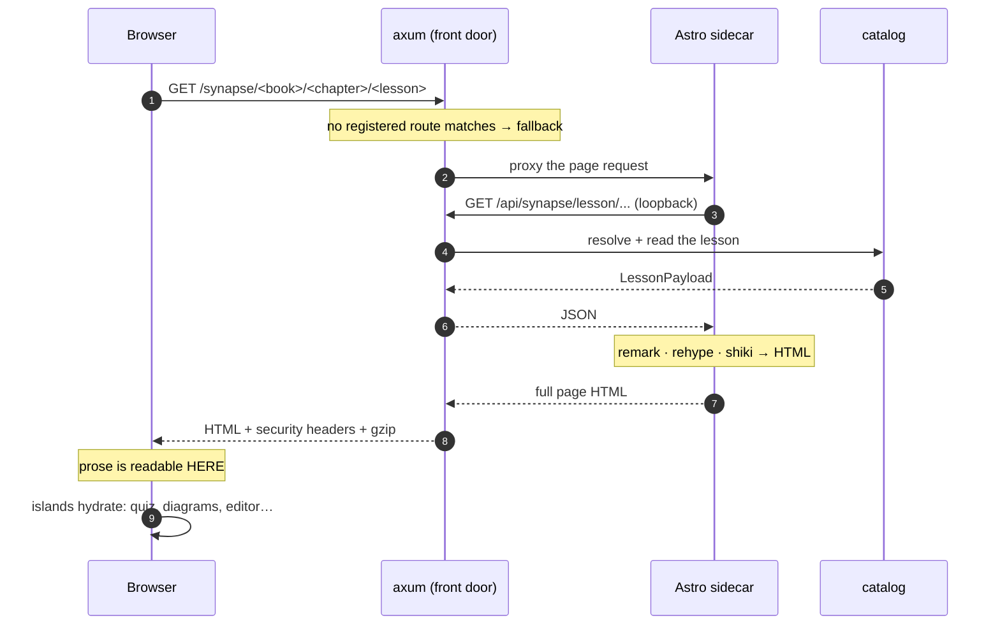
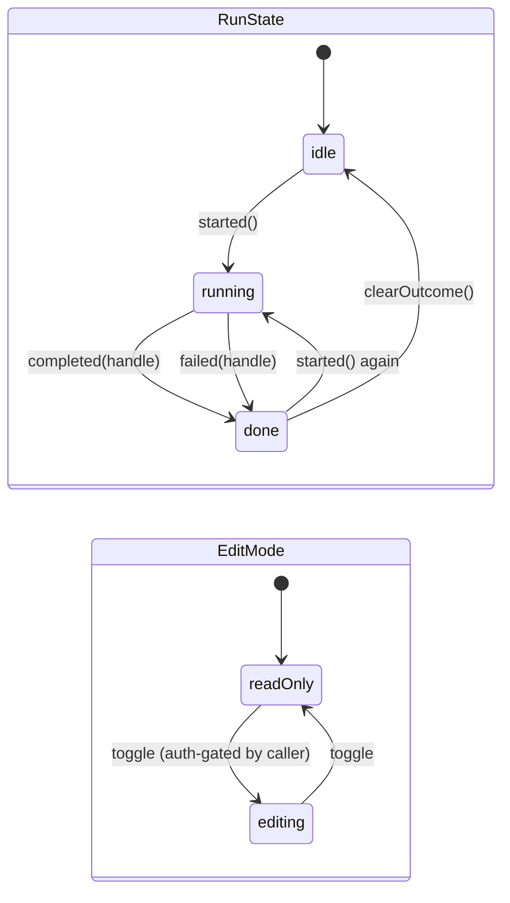

# The web tier: server-rendered pages and lazy islands

> **You'll be able to:** decide between shipping an application and shipping a document; design
> seams between independently-mounted units that cannot share state; model two independent concerns
> as orthogonal state rather than a combinatorial enum; and use a token type to make stale async
> results impossible to apply.

## The measurement that ended the previous design

The reader first shipped as a single-page application compiled to WebAssembly: around twenty
thousand lines of Rust, **641 KiB gzipped**, which had to download, instantiate and mount before any
text appeared on screen. Measured against production, content became readable at **1.25 s** on
broadband and **7.2 s on a mid-range phone over Fast-3G** — for lessons whose actual content is about
two kilobytes gzipped.

Put those two numbers next to each other and the architecture argues with itself. This platform's
traffic is [~99% reads of public, cacheable prose](/synapse/synapse-app-from-scratch/the-system/architecture).
Spending most of a second — or seven of them — booting an application in order to display a document
is not a tuning problem. It is the wrong shape.

<div style="border-left:4px solid #195045;background:rgba(25,80,69,0.08);padding:0.6rem 1rem;border-radius:0 0.5rem 0.5rem 0;margin:1.25rem 0">

💡 **A performance number is only actionable once you know which term it belongs to.** 641 KiB was
not slow code; it was code arriving *before* the content it was there to display. No amount of
optimising the client would have fixed the ordering, which is why the fix was structural: render the
prose on the server and let the interactivity arrive afterwards, per feature, or not at all.

</div>

## Server-render the prose, hydrate the rest

Pages are Astro, `output: "server"`, rendered per request against the same public content API a
browser would call. The Markdown pipeline — remark, rehype, shiki — runs on the server, so the
lesson's HTML is in the first response.



Everything after step 10 is optional. A reader who only reads has already got what they came for, and
the page's remaining JavaScript is whatever that particular page actually needs.

The pipeline emits **placeholders** rather than finished widgets: a diagram fence becomes a `div`
carrying its source, a quiz becomes a `div` carrying its JSON, a runnable fence becomes a static
highlighted block with a bar of buttons. An island claims each on mount. That is what makes the same
markdown renderer usable in three places — the lesson page, the editorial pane and the C4 click-docs —
without any of them needing to know which widgets a document contains.

## Islands cannot share state, so the seams are named

This is the part that genuinely changes how you write the code. A single-page application has one
reactive graph: any component can read any signal. Islands do not. Each is an independent mount, and
two of them share nothing but the DOM and the `window`.

So every seam is an explicit, named event or a window-scoped provider — and all of them are declared
in **one contracts module**, because an event name spelled in two files is a typo waiting to
disagree:

| Seam | Direction | What it carries |
|---|---|---|
| `synapse:load-code` | editorial → workbench | a language and a buffer ("copy to editor") |
| `synapse:use-case` | submissions → workbench | a failing input, to reproduce it |
| `synapse:submitted` | workbench → submissions | a submit landed; refetch |
| `synapse:code-changed` | workbench → coach | the current buffer, snapshotted at send time |
| `synapse:auth-changed` | auth store → every gate | the signed-in state flipped |
| `synapse:open-contents` | problem nav → reader | open the book's contents drawer |
| `synapse:relayout` | any pane → editor | you were unhidden; re-measure |
| `synapse:viz-ready` | viz loader → workbenches | the visualiser exists now; show its button |

Plus three window providers — `__synapseAuth`, `__synapseViz`, `__synapseVizToken` — for the cases
where a *value* is needed rather than an event, and the two sides can load in either order.

The cost is real: this is more ceremony than `useContext`, and a missed listener fails silently
rather than at compile time. What it buys is that no island can reach into another's internals, and
any island can be deleted by removing its mount — the seams it used are documented in one file, not
discovered by grepping for reads of a shared store.

<div style="border-left:4px solid #da5233;background:rgba(218,82,51,0.08);padding:0.6rem 1rem;border-radius:0 0.5rem 0.5rem 0;margin:1.25rem 0">

⚠️ **The failure mode to design against is the invisible one.** Two islands agreeing on
`"synapse:submitted"` in two files works until someone renames one. Nothing throws; the Submissions
tab simply stops refreshing, and it looks like a caching bug for an afternoon. Declaring the constant
once turns a silent divergence into an import error.

</div>

## The budget is per page, not per bundle

There is no single bundle to measure any more, which quietly invalidates the usual gate. Each page
ships only its own assets, so "the bundle size" is not a number the architecture has.

The gate therefore measures **per page kind**: fetch the page from a production-shaped serve, collect
everything its HTML makes the browser download before content is readable — module scripts and
stylesheets — and gzip-sum them.

| Page kind | Measured (gz) |
|---|---|
| Landing | 42 KiB |
| Prose lesson | 47 KiB |
| Problem page | 48 KiB |
| Blog index | 11 KiB |
| **Budget** | **250 KiB** |

Against 641 KiB of wasm that every page paid before rendering anything.

The budget's headroom is deliberate — roughly five times the heaviest page. It is not sized to be
tight; it is sized so that **approaching it means something structural regressed**, and the answer is
to find the island that went eager rather than to raise the number.

The lazy work is the interesting half of that table, because it is absent by construction rather than
by a maintained exclusion list. Monaco, the OIDC client, mermaid, d2, the language tracers and the
visualisation bundle are all dynamic imports behind loaders — so they cannot appear in a page's HTML,
and no glob has to remember to skip them. A reader who never opens an editor never downloads one.

## Pure logic still lives apart

The previous implementation split each feature into `logic` / `state` / `view`, with a CI grep
forbidding framework imports under `logic/`. The web tier keeps the *principle* and changes the
mechanism: pure logic lives in `lib/`, islands live in `islands/`, and `lib/` is where every unit
test points.

| `lib/` module | What is pure in it |
|---|---|
| `catalog/tree`, `catalog/path` | tree walking, path resolution, breadcrumbs |
| `catalog/progress`, `catalog/prefs` | completion ticks, reading preferences |
| `execution/executor` | the runnable-block state machine |
| `execution/judge`, `execution/practice` | verdict shaping, practice-card grouping |
| `markdown/render`, `markdown/frontmatter` | the whole pipeline |
| `search`, `routes`, `seo` | ranking, URL shapes, page metadata |

Those modules were ported to vitest **test for test** from the Rust originals — which is the cheapest
possible safety net for a rewrite, and the same "specification that already runs" argument the server
rebuild used. The browser-driven Playwright suite is a separate thing with a separate job: it is the
view-parity harness, and it runs against the production-shaped serve rather than a dev server.

## Two independent concerns, modelled independently

A runnable block tracks whether code is **executing** and whether the editor is **editable**. These
are genuinely orthogonal — you can edit while a run is in flight — so they are two types, not one
enum.

Run this. The last two lines are the whole argument:

```typescript run
// Two orthogonal concerns. A runnable block tracks whether code is EXECUTING and
// whether the editor is EDITABLE — independently, since you can edit mid-run.
// Modelled separately they compose; fused into one enum they multiply.

type RunState = "idle" | "running" | "done";

// Orthogonal to RunState. Whether the reader MAY edit is the caller's policy, not
// the machine's business — which is why authentication does not appear here.
type EditMode = "readOnly" | "editing";

interface Block {
  run: RunState;
  edit: EditMode;
}

const runs: RunState[] = ["idle", "running", "done"];
const edits: EditMode[] = ["readOnly", "editing"];

console.log("every reachable combination:");
let n = 0;
for (const r of runs) {
  for (const e of edits) {
    const block: Block = { run: r, edit: e };
    console.log(`  { run: "${block.run}", edit: "${block.edit}" }`);
    n += 1;
  }
}

console.log();
console.log(`composed: ${runs.length} + ${edits.length} variants across two types`);
console.log(`fused:    ${n} variants in one union, every one hand-written and matched`);
console.log();
console.log("Add a third concern with 2 values:");
console.log(`  composed -> ${runs.length + edits.length} + 2 = ${runs.length + edits.length + 2}`);
console.log(`  fused    -> ${n} x 2 = ${n * 2}`);
console.log("\nOne grows by addition. The other grows by multiplication.");
```



The two regions are independent, which is exactly what the program counts: the fused alternative —
`idleReadOnly`, `idleEditing`, `runningReadOnly`, … — needs every combination written out and
matched, and a third concern doubles that list rather than adding to it.

The comment on `EditMode` is doing deliberate design work too. The machine does **not** know about
authentication. Whether a reader may edit is a policy decision belonging to the caller; baking it in
would give the state machine a dependency on identity and make it untestable in isolation. The
machine tracks *what mode the editor is in*, not *who is allowed to change it*.

## Making stale results unrepresentable

Every run is asynchronous, and there is no real HTTP cancel — so a reply can arrive after the reader
has already started a new run. Applying it would show the previous run's output as if it were
current.

The guard is a token: a monotonic `RunHandle`. Starting a run mints a new one; completion carries the
handle it belongs to; the transition compares them and a mismatch is a **no-op**, not an error.
Cancelling bumps the handle too, which is how "cancel" is implemented at all when the request itself
cannot be recalled.

Press ▶, then try breaking it: delete the `if (handle !== state.runId)` guard and watch run 1's
output overwrite run 2's.

```typescript run
// The runnable-block state machine, cut down to the part that matters: a run in
// flight, a restart, and a reply from the run that no longer matters.

type RunState = "idle" | "running" | "done";

// Branded, monotonic. A plain `number` cannot be assigned where a handle is
// expected, so a handle you hold came from `started()` — see the note below on
// what this guarantee is and is not.
declare const runHandleBrand: unique symbol;
type RunHandle = number & { readonly [runHandleBrand]: never };

const INITIAL = 0 as RunHandle;
const next = (h: RunHandle): RunHandle => ((h as number) + 1) as RunHandle;

interface ExecutorState {
  runState: RunState;
  runId: RunHandle;
  output: string | null;
}

const initial = (): ExecutorState => ({ runState: "idle", runId: INITIAL, output: null });

/** A run begins: clear the previous outcome, mint the handle the result must show. */
function started(state: ExecutorState): ExecutorState {
  return { runState: "running", runId: next(state.runId), output: null };
}

/** Apply a reply ONLY if it belongs to the run currently in flight. */
function completed(state: ExecutorState, handle: RunHandle, out: string): ExecutorState {
  if (handle !== state.runId) {
    return state; // stale — a no-op, not an error
  }
  return { runState: "done", runId: state.runId, output: out };
}

const first = started(initial());
const staleTicket = first.runId;
console.log(`run 1 started   -> ${first.runState}`);

const second = started(first); // the reader hits Run again
console.log(`run 2 started   -> ${second.runState}  (run 1's ticket is now stale)`);

const afterStale = completed(second, staleTicket, "output of run 1");
console.log(`run 1 replies   -> changed anything? ${afterStale !== second}`);
console.log(`                   output = ${JSON.stringify(afterStale.output)}`);

const done = completed(second, second.runId, "output of run 2");
console.log(`run 2 replies   -> output = ${JSON.stringify(done.output)}`);
```

Two details make this sturdier than a boolean flag. The transitions are pure functions on state, so
the guard is verified by a unit test in milliseconds rather than by racing a real browser — which is
why the program above demonstrates an async bug with no async machinery in it.

And the handle is **branded**, which is where the port lost something and the book should say so. In
the Rust original `RunHandle(u64)` had a private field: fabricating one outside its module was
impossible, enforced by the compiler with no escape. A TypeScript brand is a compile-time fiction —
`42 as RunHandle` compiles, and at runtime the handle is just a number. Genuine opacity would need a
`WeakMap` or a closure, which is real machinery for an identifier that only ever needs `===`.

So the guarantee weakened from "cannot be forged" to "cannot be *confused*", deliberately and with a
comment in the source saying which. That is the honest shape of this kind of port: most of the design
survives, one or two guarantees get thinner, and the ones that do should be named rather than quietly
downgraded.

<div style="border-left:4px solid #195045;background:rgba(25,80,69,0.08);padding:0.6rem 1rem;border-radius:0 0.5rem 0.5rem 0;margin:1.25rem 0">

💡 **A stale async reply is a correctness bug, not a UI glitch.** Any interface that can start an
operation twice needs an identity on each attempt and a rule for what to do with the loser. Silently
discarding is usually right; silently *applying* is the bug that shows a stale verdict next to fresh
code.

</div>

## The one Rust surface that stayed

The visualisation engine did not move. It is still Rust, compiled to WebAssembly, shipped as a
standalone **lazy 288 KiB gzipped bundle** loaded only when a page actually has a widget or a
viz-hinted workbench — and capped in CI at 350 KiB.

Keeping it was not sentiment. The engine is thousands of lines of pure logic with 93 unit tests and
16 recorded goldens inherited from the implementation before it, and its hot path is genuinely
compute:

```rust run
// The graph family's layout, reduced to its hot loop: 320 ticks of O(n²) many-body
// repulsion over flat f64 arrays. This is the shape of the work the visualisation
// engine does in your browser every time a graph is drawn.

use std::time::Instant;

const TICKS: u32 = 320;
const MANY_BODY: f64 = -520.0;
const VELOCITY_DECAY: f64 = 0.6;

fn layout(n: usize) -> (Vec<f64>, Vec<f64>) {
    // Start on a circle so the run is deterministic.
    let mut x: Vec<f64> = (0..n).map(|i| 10.0 * (i as f64).cos()).collect();
    let mut y: Vec<f64> = (0..n).map(|i| 10.0 * (i as f64).sin()).collect();
    let mut vx = vec![0.0_f64; n];
    let mut vy = vec![0.0_f64; n];

    for _tick in 0..TICKS {
        for i in 0..n {
            for j in 0..n {
                if i == j {
                    continue;
                }
                let dx = x[j] - x[i];
                let dy = y[j] - y[i];
                let mut l = dx * dx + dy * dy;
                if l == 0.0 {
                    l = 1e-6; // the real engine jiggles instead
                }
                let w = MANY_BODY / l;
                vx[i] += dx * w;
                vy[i] += dy * w;
            }
        }
        for i in 0..n {
            vx[i] *= VELOCITY_DECAY;
            vy[i] *= VELOCITY_DECAY;
            x[i] += vx[i];
            y[i] += vy[i];
        }
    }
    (x, y)
}

fn main() {
    println!("{:>5} {:>14} {:>12}", "nodes", "inner steps", "time");
    for n in [10_usize, 20, 40, 80] {
        let start = Instant::now();
        let (x, _y) = layout(n);
        println!(
            "{:>5} {:>14} {:>12?}   (x[0] = {:.3})",
            n,
            TICKS as usize * n * n,
            start.elapsed(),
            x[0]
        );
    }
    println!("\nDouble the nodes, quadruple the work — that is the O(n²) in the inner loop.");
}
```

Doubling the node count quadruples the inner steps and, near enough, the time — the quadratic term is
visible in the output rather than merely claimed. Ignore the first row: it absorbs process warm-up,
and on some runs `n = 10` reports *slower* than `n = 20`. That is a microbenchmark telling you the
truth about itself, and the reason the interesting comparison is between the last two rows.

That kernel is WebAssembly's home ground: no boxing, no GC pressure, arrays that *are* linear memory,
and codegen that does not depend on a JIT deciding to specialise. It is also the exact opposite of
the workload that made the old client wrong — this is compute a reader opted into, not a document
they were waiting for.

The engine's purity is still a CI grep, now pointed at `viz-wasm/src/engine/`:

```
→ viz engine purity (no leptos/web-sys/wasm-bindgen/js-sys/gloo under viz-wasm/src/engine/)
  ok
```

Its bindgen glue still imports the editor and tracer islands by the same module specifiers the old
client used, which is why those two islands are single-sourced rather than duplicated. The seam
outlived the thing on the other side of it.

## Rendering that puts prose first

One pipeline decision predates the rewrite and survived it, because it turned out to be the same
lesson at a smaller scale. Diagrams were originally rendered *while parsing* the markdown, so the
entire page waited for every diagram's layout before any prose appeared. A lesson with five diagrams
stayed blank, then arrived at once.

The fix was to change *when*, not *how fast*: the parse emits a placeholder carrying the diagram
source, and rendering happens at mount, near the viewport.

```html
<div class="mermaid-block" data-source="classDiagram%0A%20%20class%20SubmitSolution…">
```

Prose paints immediately; each diagram renders independently and concurrently; a diagram far below
the fold does not render until the reader approaches it; the heavy engines load only if a page has
diagrams of that kind at all.

Notice that this is the *same fix* the whole tier later received, one level up. Do not make the
common case wait for the expensive case — first for diagrams inside a page, then for the entire
document inside an application boot. Finding the same shape twice at different scales is usually a
sign it is a principle rather than a trick, and it is the same one as the
[202 in the submission path](/synapse/synapse-app-from-scratch/low-level-design/the-submission-lifecycle).

<details>
<summary>Shared wire types between client and server were the main argument for a Rust client. TypeScript threw that away — so what replaced it?</summary>

Code generation, and it is genuinely weaker in one specific way that is worth naming rather than
glossing.

The server's OpenAPI document is code-first: the handlers and DTOs *are* the specification, rendered
by utoipa. The web tier generates its TypeScript types from that document, and CI fails if the
checked-in generated file is not what the current server produces. So a renamed field still breaks
the build — the client cannot drift from the server unnoticed.

What is lost is that this is a **two-step** guarantee rather than a one-step one. With a shared crate,
client and server were checked against the same definition by the same compiler in the same build;
there was no artifact in between that could be stale. Now there is, and its freshness is enforced by
a CI job. A CI job is a good mechanism, but it is a mechanism — the previous property needed none.

The compensating gain is that the generated types are the *published contract*, not an internal one.
Anything can consume that document; the old arrangement's guarantee only extended to clients written
in Rust. Since the contract is now also diffed against a committed reference copy on every build, the
API has something the shared crate never gave it: a record of what it promised, separate from what it
currently compiles to.

Which is the honest summary — a compile-time guarantee traded for a build-time one, plus a real
contract. Worth it here because the thing that pushed the decision was not type safety at all; it was
seven seconds on a phone.

</details>
