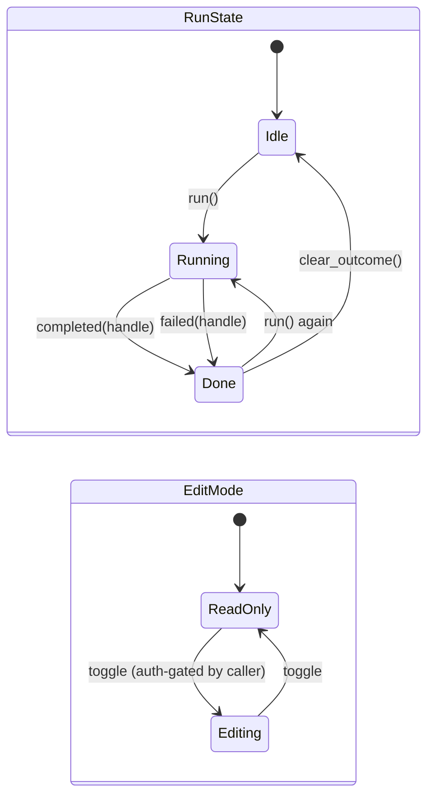

# The client: three layers, signals, and the island boundary

> **You'll be able to:** split UI code so its logic is testable without a browser; model two
> independent concerns as orthogonal state rather than a combinatorial enum; and use an opaque
> token type to make stale async results impossible to apply.

## Three layers, where they are earned

Each client feature can have three layers:

```
client/src/<feature>/
  logic/     pure functions and state machines — no leptos, no web-sys, no DOM
  state/     signals; the reactive graph
  view/      components that render state
```

The honest picture of who actually has them:

| Split | Features |
|---|---|
| Full `logic` + `state` + `view` | `catalog`, `execution`, `search` |
| `state` + `view` only | `blog`, `identity` |
| Flat | `api`, `islands`, `quiz`, `router`, `shell`, `tutoring`, `viz` |

Three of twelve. That is not backlog — it is the same proportionality rule the server uses. A
`logic/` layer earns its place when there is something to test without a browser: catalog has path
resolution and tree walking, execution has a state machine, search has ranking. `quiz` renders a
question and compares an answer to a string; giving it three directories would be filing, not design.

What makes the boundary real rather than aspirational is that it is CI-enforced, the same way the
server's domain purity is:

```
→ client logic purity (no leptos/web-sys/wasm-bindgen/js-sys/gloo under logic/)
  ok
```

The payoff is concrete: everything under `logic/` compiles and tests **natively**. No browser, no
WASM toolchain, no headless driver — `cargo test` runs the state machine in milliseconds. Testing UI
logic is usually painful because it is entangled with the DOM; here that entanglement is a build
failure.

## Signals, not a virtual DOM

The framework is fine-grained reactive. There is no VDOM and no re-render pass: a signal knows
exactly which DOM nodes depend on it, and updating it touches only those.

| Primitive | Role |
|---|---|
| `RwSignal<T>` | mutable reactive state |
| `Memo<T>` | derived value, recomputed only when inputs change |
| `Effect` | runs on change — the escape hatch to imperative APIs |
| `StoredValue<T>` | non-reactive storage that survives across reactive scopes |
| `NodeRef` | a handle to a real DOM element, for handing to an island |

The practical consequence is that "what updates when" is a property of the data flow rather than of a
diffing heuristic. The cost is that reactivity is **ownership-scoped**: every signal belongs to a
reactive owner, and when that owner is disposed the signal goes inert — it still exists, updates
silently do nothing, and nothing warns you.

That failure mode is not hypothetical. An application-wide store created under a *page's* owner keeps
working until the reader navigates away, at which point the page is disposed and the store silently
stops updating. The fix is structural: application-level stores are created under the application's
owner and passed down through context, never conjured wherever they are first used. Lifetime is part
of the design, not an implementation detail.

## Two independent concerns, modelled independently

The runnable code block tracks whether code is executing **and** whether the editor is editable.
These are genuinely orthogonal — you can edit while a run is in flight — so they are two types:

```rust
pub enum RunState { Idle, Running, Done }

/// Orthogonal to `RunState`; the auth gate is enforced by the CALLER, not by the FSM.
pub enum EditMode { ReadOnly, Editing }
```



The alternative — one enum with `IdleReadOnly`, `IdleEditing`, `RunningReadOnly`, … — multiplies to
six variants that must each be handled, and grows multiplicatively with every new concern. Two small
types compose; one big type explodes.

The comment on `EditMode` is doing deliberate design work too. The FSM does **not** know about
authentication. Whether a reader may edit is a policy decision belonging to the caller; baking it in
would give the state machine a dependency on identity and make it untestable in isolation. The
machine tracks *what mode the editor is in*, not *who is allowed to change it*.

## Making stale results unrepresentable

Every run is asynchronous, so a reply can arrive after the reader has already started a new run.
Applying it would show the previous run's output as if it were current.

The guard is a token type:

```rust
/// Opaque, monotonic — cannot be fabricated outside this module, so a stored handle can only
/// have come from `started`.
pub struct RunHandle(u64);
```

Starting a run mints a new handle. Completion carries the handle it belongs to, and the transition
compares it to the current one — a mismatch is a **no-op**, not an error:

```rust
let stale_handle = first.run_id;
let second = first.started();                             // restart: first handle is now stale
let after = second.completed(stale_handle, result("stale"));
assert_eq!(after, second, "a stale result must change nothing");
```

Two details make this sturdier than a boolean flag. The field is **private**, so no other module can
construct a `RunHandle` — a handle in hand provably came from `started()`. And the transitions are
pure functions on state, so the guard is verified by a native unit test rather than by racing a real
browser.

<div style="border-left:4px solid #195045;background:rgba(25,80,69,0.08);padding:0.6rem 1rem;border-radius:0 0.5rem 0.5rem 0;margin:1.25rem 0">

💡 **A stale async reply is a correctness bug, not a UI glitch.** Any interface that can start an
operation twice needs an identity on each attempt and a rule for what to do with the loser. Silently
discarding is usually right; silently *applying* is the bug that shows a stale verdict next to fresh
code.

</div>

## The island boundary

Some work has excellent JavaScript implementations and no reason to be rewritten: a code editor, a
markdown pipeline, diagram layout engines, language tracers. These stay TypeScript, behind five
declared seams:

```rust
#[wasm_bindgen(module = "@markdown/loader")]  // markdown → HTML, syntax highlighting
#[wasm_bindgen(module = "@editor/loader")]    // the code editor
#[wasm_bindgen(module = "@diagram/loader")]   // mermaid + d2 rendering
#[wasm_bindgen(module = "@tracer/loader")]    // language tracers
#[wasm_bindgen(module = "@auth/loader")]      // OIDC/PKCE
```

Five modules, each a **loader** rather than the library itself. That indirection is what makes the
heavy dependencies lazy: the editor is hundreds of kilobytes and a diagram engine is multiple
megabytes of WebAssembly, and a reader who never opens either should download neither. The loader
dynamically imports on first use, so cost is paid on demand.

The rule for what crosses the boundary: **strings and handles, not object graphs.** Send markdown,
receive HTML. Send diagram source, receive SVG. Every value crossing pays a serialisation cost, so a
chatty interface would be slower than either side alone.

### Lifetimes across a foreign boundary

The hardest part is not calling TypeScript — it is cleaning up after it. A mounted editor holds
JavaScript closures that keep Rust values alive; drop the Rust side carelessly and you get a leak, or
a callback firing into a disposed owner.

The answer is to make the editor handle own its closures and dispose them on `Drop`. Rust's
destructor timing is deterministic, so when the component goes away the handle drops, the closures
are released, and the editor is torn down — in that order, without a manual cleanup call anyone can
forget. This is one place where Rust's ownership model is a genuine advantage at an FFI boundary
rather than a tax.

## The WebAssembly boundary, precisely

There is a second boundary, and unlike the island seam it was not designed — it is imposed by the
platform. **WebAssembly cannot touch the DOM.** It has linear memory, a flat byte array, and no
access to JS objects. Every DOM operation therefore crosses into JavaScript glue.

This is where the comparison with the previous implementation gets interesting, because Scala.js
compiles *to JavaScript*. `document.createElement("div")` in Laminar emitted literally that: native
JS strings, DOM nodes held directly, zero marginal cost per operation. Rust cannot do this, so it is
worth knowing exactly what it pays instead — and the answer has changed recently enough that most
descriptions of it are out of date.

Reading the generated glue in this repository (wasm-bindgen 0.2.126), the module declares **251
import shims**. A representative one:

```js
__wbg_closest_d889c758da4bb13b: function (arg0, arg1, arg2) {
    const ret = arg0.closest(getStringFromWasm0(arg1, arg2));
    return isLikeNone(ret) ? 0 : addToExternrefTable0(ret);
}
```

Three things are visible there, and they are not equally expensive.

**Object references are cheap now.** `arg0` is the DOM element itself — a real reference, passed
straight through. Older wasm-bindgen kept a JavaScript array as a handle table and passed integer
indices into it; this build uses **reference types**, so the element is an `externref` the WASM module
holds directly. Returned objects go into a WASM-side table:

```js
function addToExternrefTable0(obj) {
    const idx = wasm.__externref_table_alloc();
    wasm.__wbindgen_externrefs.set(idx, obj);
    return idx;
}
```

That is a table allocation, not a JS-array scan, and it participates in the host GC. The "every DOM
reference costs a lookup in a side table" objection is largely a description of the old model.

**Strings are still marshalled, and this is the real cost.** `getStringFromWasm0(arg1, arg2)` takes a
pointer and a length into linear memory and runs a UTF-8 → UTF-16 decode:

```js
cachedTextDecoder.decode(getUint8ArrayMemory0().subarray(ptr, ptr + len))
```

**56 of the 251 shims decode a string that way.** And strings are pervasive in DOM work — tag names,
class names, attribute names and values, event names. Scala.js pays none of this, because its strings
are already JS strings.

**The call itself** is an import crossing. Modern engines inline much of it; it is the smallest of
the three terms.

### Put it next to what a DOM operation costs

A boundary crossing with a short string decode is measured in nanoseconds. Appending an element and
letting the browser recalculate style and layout is measured in **microseconds**. So the overhead
lands as a small fraction of an operation that was already the expensive part.

Two properties of this application shrink it further. Fine-grained reactivity means an update touches
only the nodes that actually changed — there is no VDOM diff issuing speculative writes. And the
genuinely DOM-heavy work (the editor, the diagram engines) lives in **TypeScript islands**, which
manipulate the DOM natively and never cross the boundary at all.

## Where WebAssembly wins instead

The boundary is a cost on DOM work. The compensation is that WASM is genuinely faster at *compute* —
and this client has real compute in it, which is easy to miss in a reader app.

The visualisation engine is **3,300 lines of pure logic that runs in the browser**, and the graph
family's layout is a force simulation:

```rust
const TICKS: u32 = 320;
for _tick in 0..TICKS {
    for i in 0..n {
        for j in 0..n {          // naive O(n²) many-body repulsion
```

320 iterations of an O(n²) float loop over flat `Vec<f64>` arrays, per graph rendered. That is
WebAssembly's home ground: no boxing, no GC pressure, arrays that *are* linear memory, and codegen
that does not depend on a JIT deciding to specialise. Scala.js optimises numeric code well, but a
tight `f64` kernel is exactly the workload where the gap favours WASM.

So the client's workload is mixed, and the two halves point in opposite directions:

| Work | Favours | Why |
|---|---|---|
| DOM manipulation | Scala.js | no boundary; strings are already JS strings |
| Layout, adapt pipeline, diffing | WASM | flat float arrays, no GC, predictable codegen |
| Heavy DOM (editor, diagrams) | neither | it is TypeScript in both implementations |
| Playback while stepping | WASM | no GC pauses mid-animation |

<div style="border-left:4px solid #da5233;background:rgba(218,82,51,0.08);padding:0.6rem 1rem;border-radius:0 0.5rem 0.5rem 0;margin:1.25rem 0">

⚠️ **All of the above is mechanism, not measurement.** The shape of the glue is checkable in this
repository, and the force loop is in the source — but I have not benchmarked Laminar against Leptos
on the same workload, and the Scala client is archived. Every claim here about which is *faster*
should be read as "the mechanism points this way", not "I measured it". Treating a plausible
mechanism as a result is the mistake this book is trying not to make.

</div>

## Rendering that puts prose first

One pipeline decision is worth surfacing because it changed how the page feels. Diagrams were
originally rendered while parsing the markdown — so the *entire page* waited for every diagram's
layout to finish before any prose appeared. A lesson with five diagrams stayed blank, then arrived at
once.

Now the parse emits a placeholder carrying the diagram source, and rendering happens at mount, near
the viewport:

```html
<div class="mermaid-block" data-source="classDiagram%0A%20%20class%20SubmitSolution…">
```

Prose paints immediately; each diagram renders independently and concurrently; a diagram far below
the fold does not render until the reader approaches it. The heavy engines load only if a page
actually has diagrams of that kind.

The trade is a brief empty card before a diagram fills in, which a reserved min-height keeps from
shifting the layout. Paying a small visible delay on one element to remove a total blocking delay on
everything is a good trade — and it is the same principle as the 202 in the submission path:
**do not make the common case wait for the expensive case.**

<details>
<summary>If TypeScript islands work well enough to keep, why compile the client to WebAssembly at all?</summary>

The honest answer is that the islands are where JavaScript is genuinely the right tool, and the
application shell is where it is not — and those are different kinds of code.

The islands are **mature, self-contained libraries** with stable interfaces: a markdown renderer, an
editor, a layout engine. Rewriting them would be months of work to reproduce behaviour that already
works, and the result would be worse for years. There is no principled argument for rewriting a
diagram layout engine, so they stayed.

The shell is the opposite: bespoke application logic — routing, catalog state, the executor machine,
the visualisation contract — that shares types with the server. Compiling it to WebAssembly means the
wire types are defined **once** in a shared crate and both ends are checked against the same
definition at compile time. A field rename that breaks the client is a build failure rather than a
runtime surprise. That, plus exhaustive matching on shared enums, is the actual prize.

The expected cost is download size, and this is where the honest answer diverges from the usual one.
Measured against the Scala.js implementation it replaced — same script, gzipped, critical path — the
WebAssembly client is **636 KiB against 624 KiB**: a 2% difference. The dominant term is the
application, not the language it compiles to. The 700 KiB budget is enforced in CI regardless,
because that number only moves in one direction if nobody watches it.

The costs that *are* structural are the DOM boundary and the string marshalling described above —
paid on UI work, where Scala.js paid nothing. Against them sits a real gain on compute: the
visualisation engine's force layout and adapt pipeline are the workload WebAssembly is good at.
Mixed bag, honestly, and unmeasured either way.

And the framing of the benefit deserves care: shared wire types were **not** a gain over the previous
implementation. Scala.js compiled from the same source tree as the JVM server and already had them.
What compiling this shell to WebAssembly buys is *keeping* that property once the server became Rust
— a Rust server and a Scala.js client cannot share a type between them.

So this is less "WebAssembly beat JavaScript" than "the client followed the server". Had the server
stayed on the JVM, the case for moving the client would have rested on the viz engine's compute
alone — a real argument, but not one that justifies rewriting a working client.

The reason to state it that way rather than claiming a clean win: **an argument you would not have
found persuasive beforehand should not become persuasive afterwards.** The compute advantage is
genuine and was not why the client moved. Both halves of that sentence matter.

</details>
