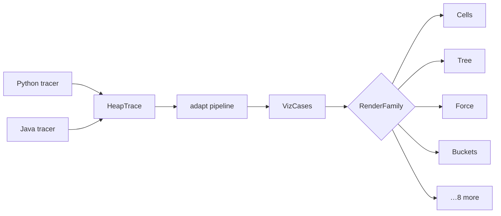

# The visualisation engine

> **You'll be able to:** design a contract that keeps N producers and M renderers from becoming N×M
> adapters; separate *what a thing is* from *how it is drawn*, and see why that mapping is
> many-to-one; and explain why this engine is pure code with no server behind it.

## The problem

Below is a real program. Run it, then step through it — the array, the pointers, and the swaps are
drawn from the actual execution, not from a hand-drawn animation.

```python run viz=array:arr
arr = [5, 2, 8, 1, 9, 3]
left, right = 0, len(arr) - 1
while left < right:
    arr[left], arr[right] = arr[right], arr[left]
    left += 1
    right -= 1
```

To make that work, something has to turn "a Python process ran and its memory changed over time" into
"a row of boxes where two labelled carets march inward and cells ring when touched". That is the
engine, and the difficulty is that neither end is fixed: multiple languages produce traces, and many
structures need drawing.

Wired directly, that is a multiplication — every language against every structure. The whole design
exists to turn that product into a sum.

## One contract in the middle



Two narrow waists. **`HeapTrace`** is what every tracer must produce: a language-neutral sequence of
heap snapshots. **`VizCases`** is what every renderer consumes: positioned nodes, edges, cursors and
annotations, per step.

A new language means writing one tracer to a documented shape — no renderer changes. A new structure
means one renderer — no tracer changes. Adding both stays additive instead of multiplicative, which
is the entire return on having a contract.

The tracers are deliberately the *thinnest* possible component. They walk a heap and emit
identity-stamped snapshots; they know nothing about arrays or trees or layout. Everything
interpretive happens after the waist, in shared code, once — rather than being re-implemented,
slightly differently, in every language.

## The adapt pipeline

Between the waists sits the interesting part: raw heap snapshots do not resemble a data structure.
They are objects and references. Turning them into "an array with two pointers" is a projection, and
it happens in stages:

| Stage | Job |
|---|---|
| `cleanup` | drop interpreter noise that is not the program's data |
| `segmentation` | split one trace into the *cases* worth showing separately |
| `rooting` | decide which object the picture is *about* |
| `projection` | map that object graph onto the chosen structure's shape |
| `cursors` | promote integer locals (`i`, `left`, `right`) into pointer carets |
| `flow` | order the steps into a narrative sequence |
| `diff` | mark what changed between consecutive steps |
| `narration` | generate the human sentence under each step |
| `callstack` | the asymmetric route — recursion is about *frames*, not heap objects |
| `cards` | group multiple visualised values into panels |

Two of those carry most of the insight.

**`rooting`** answers a question the trace cannot: a heap has many objects, but the picture is about
*one* of them. That is why the fence names it — `viz=array:arr` says "draw the array, and it is the
variable `arr`". Guessing would be unreliable in exactly the cases that matter.

**`cursors`** is why the visualisation teaches anything. Without it you would see values changing in
boxes. With it, `left` and `right` become carets that *move*, and the algorithm's idea — two pointers
walking inward — becomes visible. A plain integer local is promoted to a spatial relationship, which
is the difference between a data dump and an explanation.

**`callstack`** is called out in the table as asymmetric because it is a genuine exception. Recursion
is not usefully drawn as a heap projection; what matters is the stack of frames. So it takes a
different route through the pipeline. The honest note is that a pipeline with one special case is
better than a uniform pipeline that draws recursion badly — but it is a seam, and seams need a stated
reason.

## Seventeen structures, twelve ways of drawing

The vocabulary has 17 structures. The renderers have 12 families. That mismatch is the design:

```rust
pub fn of(structure: VizStructure) -> Self {
    match structure {
        VizStructure::Array | VizStructure::Bitset | VizStructure::Fenwick => Self::Cells,
        VizStructure::Queue | VizStructure::Deque => Self::Queue,
        VizStructure::Stack | VizStructure::Callstack => Self::Stack,
        VizStructure::Tree  | VizStructure::SegmentTree => Self::Tree,
        VizStructure::Heap => Self::HeapDual,
        VizStructure::List => Self::LinkedList,
        VizStructure::Skiplist => Self::Chain,
        VizStructure::Graph => Self::Force,
        VizStructure::Hashmap => Self::Buckets,
        VizStructure::UnionFind => Self::Forest,
        VizStructure::Trie => Self::Trie,
        VizStructure::Grid => Self::Grid,
    }
}
```

A structure is **what a thing means**. A family is **how it is drawn**. Those are different
questions, and collapsing them would be a mistake in both directions.

An array, a bitset and a Fenwick tree are conceptually unrelated — but all three are a row of indexed
cells, so they share a renderer and differ only in labelling. Meanwhile a binary heap is *also* an
array underneath, yet it gets `HeapDual`, because the thing worth seeing is the array **and** the
tree it implies, side by side. Rendering it as plain cells would be technically accurate and
pedagogically useless.

<div style="border-left:4px solid #195045;background:rgba(25,80,69,0.08);padding:0.6rem 1rem;border-radius:0 0.5rem 0.5rem 0;margin:1.25rem 0">

💡 **Semantic identity and visual identity are separate axes.** Merging them either forces near-clones
of one renderer, or forces one renderer into conditionals for structures that merely happen to share
a shape. Keeping them separate makes the relationship a small, total, testable function.

</div>

The mapping is a `match` with no wildcard arm, so adding an eighteenth structure does not compile
until someone decides how it is drawn. And the tests assert the *partition* rather than individual
pairs — "the Cells family covers exactly array, bitset and fenwick" — so an accidental
recategorisation fails a test that states the intent.

## Pure code, no server

The engine is pure Rust in the shared crate: heap projection, layout geometry, diffing, narration.
It runs on the client, and there is **no server hexagon behind it** — no viz endpoint, no viz
database, no viz service.

That is worth defending, because "add a service" is the reflex. The engine has no I/O, no shared
mutable state, and no privileged data: it is a deterministic function from a trace to a drawing. A
service around a pure function buys a network hop, a scaling concern and a failure mode, in exchange
for nothing — the client already has the trace.

Being in the shared crate does real work, though. It compiles both natively and to WebAssembly, so
the entire engine is unit-tested **natively** — fast, headless — while shipping to the browser as the
same code. Layout geometry is a nightmare to test through a DOM and pleasant to test as a function
returning coordinates.

The layout also runs **once** per step rather than per frame, which is what makes stepping smooth: the
renderer receives positions, not a layout problem to solve while animating.

## Verified against a previous implementation

This engine is a re-derivation of one that existed before, in another language. The specification was
its **golden outputs**: a fixture set of traces with their expected rendered structures, run as
native tests.

That is a stronger contract than a written spec. A prose description of a layout algorithm leaves a
dozen ambiguities per paragraph; a golden file is unambiguous about all of them at once. It also
converts a vague goal — "the rebuild should behave the same" — into a red or green test.

Golden tests have a well-known failure mode worth naming: they can encode bugs as expectations, and
they resist intentional change by making every deliberate improvement look like a regression. They
are the right tool for a *port*, where fidelity is the goal, and the wrong tool for greenfield work,
where the behaviour is not yet known to be correct.

<details>
<summary>The pipeline has one component that does not fit the pattern — the callstack route. When is a special case better than a uniform abstraction?</summary>

When forcing uniformity would make the *output* worse, rather than just the code less tidy.

The pipeline projects heap objects onto a shape. Recursion genuinely does not fit: what matters is
the stack of invocations — each frame's arguments, which is executing, how deep it goes. That
information is not in the heap at all; it is in the call stack. Projecting it as a heap graph would
produce something accurate and unreadable.

The alternative — generalising the pipeline to handle both heap projection and frame stacks —
sounds cleaner and is usually worse. Abstractions built to cover two genuinely different cases tend
to become configuration: a pipeline with flags for which stages apply, where every future reader must
work out which path a given input takes. That is a uniform *shape* concealing non-uniform behaviour.

The test for whether a special case is acceptable: is it **named, bounded, and justified**? Here it is
one route, for one structure, with a written reason, and the shared contract on both sides of it is
unchanged — a callstack visualisation is still `VizCases`, so every renderer, player and control
works on it unmodified.

The version to fear is the unnamed special case: an `if` buried three stages deep that quietly
handles "the recursion case" without saying so. Same behaviour, none of the honesty — and nobody can
find it when it breaks.

</details>
