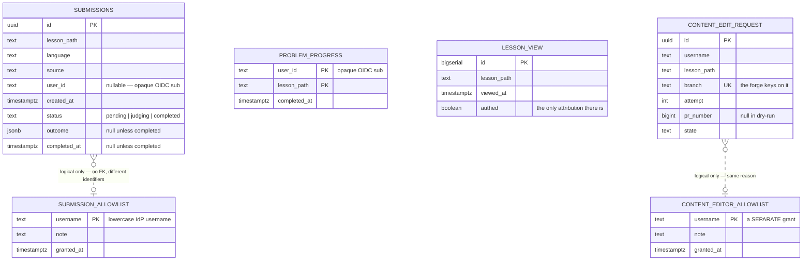

## Application store

The system of record, and the only thing in the platform that grows without bound. Everything else
— lessons, diagrams, test suites — is derived data reconstructable from a git repository.

Six tables, in three pairs. Submissions and their allowlist are the original system of record.
Progress and readership are account-owned conveniences added later. The last pair is content
contribution: who may propose a change, and what they proposed.

### Why it is this small

The platform's largest asset by far is its content, and content is **not** in the database. Books
live as Markdown in a git repository, are pulled onto disk by a sidecar, and are re-indexed from the
filesystem whenever the commit changes. That single decision removes an entire class of schema — no
`books`, `chapters`, `lessons`, `revisions`, or `authors` tables — and replaces the write path for
authoring with `git push`.

Note that in-app editing did **not** change that. It adds two tables about *proposals*, not about
content: the lesson text still only ever lives in git, and the row records which branch a proposal
went to.

What remains in Postgres is exactly the state that cannot be derived from a repository: what a
reader attempted, what the judge decided, what they have finished, what was read, and what has been
proposed.

### Capacity, honestly

At the current scale this database holds single-digit-to-low-hundreds of rows and a `pg_dump` is
kilobytes. Even at a million monthly readers the arithmetic stays undramatic — submissions arrive at
well under one per second, and a submission is a few kilobytes of source plus a small JSON verdict.
`lesson_view` is the one table that grows with *traffic* rather than with engagement, and it is the
first candidate for time-partitioning or roll-up if that ever matters.

The scarce resource is not capacity but **availability**: the database currently runs on
node-local storage on a single machine, which makes that machine a single point of failure for the
whole platform. That is discussed honestly in the
[homelab case study](/synapse/synapse-app-from-scratch/running-it/the-homelab-case-study).

### Migrations and adoption

Schema changes are embedded SQL migrations applied at boot, and the application **fails fast** if
the database is unreachable — the system of record does not degrade, unlike the identity provider,
which does.

The first two migrations did not create the production schema. It was created by the previous
implementation's migration tool and then *adopted*: the migration bookkeeping table was
hand-baselined so the new tool considered both already applied, and boot no-ops instead of trying to
re-create live tables. That procedure was rehearsed on a byte-for-byte copy of production first —
which is what proved a verdict written by the old implementation still decodes correctly through the
new one. Migrations three onwards are ordinary forward migrations that ran for real.
