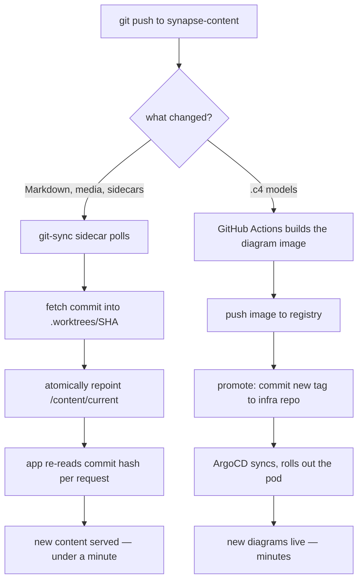

# The content pipeline

> **You'll be able to:** design a publish path with no authoring backend; explain why a symlink swap
> is the atomic primitive that makes it safe; and reason about the real staleness window between a
> push and what a reader sees.

## There is no content backend

The platform has no CMS and no content database. Publishing is:

```bash
git commit -m "new lesson" && git push
```

That is the whole authoring interface. Everything that would normally sit between an author and a
published page — draft state, permissions, revisions, preview, rollback — is delegated to git, which
already does all of it better.

The consequence worth stating: **nothing the application serves can write to the content it serves
from.** A lesson becomes live by being a commit on `main`, and by no other route.

<div style="border-left:4px solid #15448e;background:rgba(21,68,142,0.08);padding:0.6rem 1rem;border-radius:0 0.5rem 0.5rem 0;margin:1.25rem 0">

**One qualification, added later.** There is now an endpoint that lets a reader propose an edit from
inside the app — but it opens a *pull request*, and the change still becomes live only by the path
described in this chapter. The sentence that had to be retired is "there is no authoring endpoint";
the one that matters, above, still holds. See
[Content contribution, without git](/synapse/synapse-app-from-scratch/running-it/content-contribution).

</div>

## How the repository is organised

```
synapse-content/
  <book-slug>/
    book.json                     title, description, tags, order, slug, minutes
    01-<part-slug>/
      01-<lesson-slug>.md         the lesson
      01-<lesson-slug>.editorial.md   worked solutions (revealed separately)
      01-<lesson-slug>.tests.json     the suite — only its samples reach the browser
      _c4-docs/<elementId>.md     click-docs for diagram elements
      <name>.c4                   architecture models
  _media/<book-slug>/<lesson-slug>/…    images and video, served at /media/…
  local-only/                     never published
```

Four conventions carry most of the weight:

- **Numeric prefixes order things; slugs identify them.** `01-the-system/` sorts first and appears in
  the URL as `the-system`. Reordering is a rename, not a database update — and the URL only changes
  if the *slug* changes.
- **Underscore-prefixed directories are structural, not content.** The content walker skips anything
  beginning with `_` or `.`, which is what lets `_c4-docs/` sit inside a chapter without becoming a
  phantom lesson. Every other `.md` under a book *is* a lesson, including one you forgot about.
- **Media lives at the repository root**, not beside the lesson — one `_media/` tree, addressed by
  book and lesson slug. It is served path-addressed with a shared cache hour rather than
  content-hashed, because authors replace files in place.
- **Sidecars sit beside their lesson.** Editorial content and test suites share the lesson's stem and
  are unlocked by `kind: problem` in the frontmatter. Only the suite's *sample* cases are ever
  serialised into a response; the rest stays server-side with the judge.

`local-only/` is excluded from what ships. Drafts stay local until they are a commit on `main`.

## Two paths, two speeds

Not everything in the repository reaches production the same way, and conflating them is the main
source of "why hasn't my change appeared?".



**Prose is fast** because nothing is built: a sidecar fetches the commit and repoints a symlink.

**Diagrams are slow** because the architecture model is *compiled* into a diagram application — a
container image, built in CI, promoted by a commit to the infrastructure repository, rolled out by
the deployment controller.

So a lesson edit appears in well under a minute; a change to a `.c4` model takes several minutes and a
pod rollout. Knowing which path a change is on tells you whether to wait or to investigate.

## The symlink is the atomic bit

The sidecar does not update files in place. It fetches each commit into its own directory and then
repoints a symlink:

```
/content/current -> .worktrees/ddbf2ae4a3922558c724176254466181c4aef228
```

That matters because content is read **per request**. Updating in place would mean requests landing
mid-write see a half-updated tree — one lesson from the new commit, another from the old. A symlink
swap is a single atomic operation: every request sees exactly one commit, either the old one or the
new one, never a blend.

It also makes rollback trivial. The previous worktree is still on disk, so reverting is repointing
the symlink, and it is why a bad content push is not an incident.

## The version is the commit hash

The application derives its content version from the checkout's git hash, re-read per request. That
single decision does several jobs at once:

- The **cache** gets a correct key. A lesson response is derived from a known commit, so a cached copy
  is *the right answer for that version* rather than a guess about freshness.
- **Invalidation is implicit.** New commit, new version, new cache key. Nothing to purge.
- **No redeploy is needed** for content. The application re-reads the hash, notices it changed, and
  re-indexes.

### Verifying it end to end

The claim "what is on GitHub is what is being served" is checkable from both ends, and here it is,
checked just now:

```
$ gh api repos/ani2fun/synapse-content/commits/main --jq .sha
ddbf2ae4a3922558c724176254466181c4aef228

$ kubectl exec <pod> -c git-sync -- ls -l /content/current
/content/current -> .worktrees/ddbf2ae4a3922558c724176254466181c4aef228
```

Same commit. That is the pipeline's correctness property reduced to one comparison anyone can run,
and it is a much better answer than reading logs and hoping.

## The staleness window

An honest accounting of how long a push takes to be universally visible:

| Stage | Delay |
|---|---|
| Sidecar notices the commit | up to its poll interval |
| Symlink repointed, app re-reads the hash | immediate |
| Edge caches still hold the previous response | up to `max-age=60` |
| Stale-while-revalidate serving | up to 600 s for the unlucky |

```
cache-control: public, max-age=60, stale-while-revalidate=600
```

So a reader may see the previous version for up to a minute, and — if their edge node has not
revalidated — a stale-but-serving copy for longer while the fresh one is fetched behind them.

That is a deliberate trade. `stale-while-revalidate` means a reader never *waits* for revalidation:
they get the cached copy instantly while the update happens in the background. For a learning
platform, a one-minute delay on a typo fix is invisible, and never showing anyone a spinner is worth
far more.

Hashed assets are the opposite case entirely:

```
cache-control: public, max-age=31536000, immutable
```

A year, immutable — safe because the filename contains a content hash, so a changed asset is a
*different URL*. Content-addressed assets never need invalidation; that is the whole trick.

<details>
<summary>Using git as the content database means no drafts UI, no preview, no per-lesson permissions. When does that stop being enough?</summary>

It stops when the *people* change, not when the content volume does.

The model works because there is one author who is comfortable with git. Every capability a CMS would
provide already exists in that workflow: branches are drafts, pull requests are review, the local dev
server is preview, `git revert` is rollback, and blame is the audit log. Building a CMS would
reimplement all of it, worse.

The first thing to break is **non-technical authors**. Asking a subject-matter expert to resolve a
merge conflict is asking them to stop contributing. That is where a CMS earns its cost — not because
git is inadequate, but because the interface is wrong for the person.

That is the one that broke, and the answer turned out not to be a CMS. It was an editor page that
opens a pull request — a new interface onto the same pipeline, rather than a second pipeline. The
[next chapter](/synapse/synapse-app-from-scratch/running-it/content-contribution) is that design,
including the two shortcuts that would have destroyed the property this chapter is about.

Second is **partial permissions**. Git access is all-or-nothing per repository. "This person may edit
one book" needs either repository splitting or a permissions layer git does not have.

Third is **scheduled publishing**, which needs something that acts at a time rather than on a push.

Notably, *scale* is not on that list. More lessons make the repository bigger and the sidecar's fetch
slower, and both are a long way from mattering.

The upgrade path is pleasant, though, which is what makes deferring safe: because content is
plain Markdown in a known layout, a CMS could be added later as a thing that *writes to the
repository* — keeping git as the source of truth and the whole delivery pipeline unchanged. That is a
much better position than having chosen a database up front.

</details>
