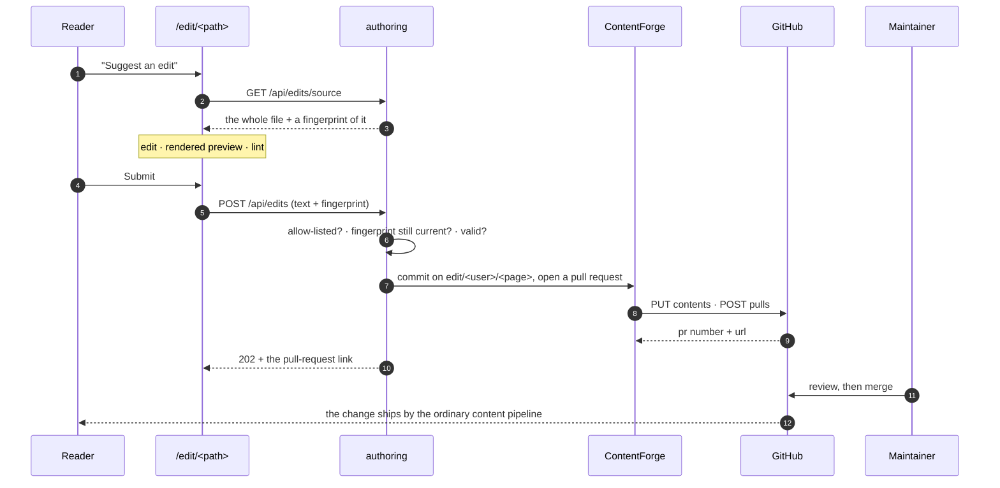

# Content contribution, without git

> **You'll be able to:** add a write path to a system whose correctness depends on having one source
> of truth, without acquiring a second; design optimistic concurrency for a document you do not lock;
> and build a feature whose whole flow is exercisable in CI with no credentials anywhere near it.

## The problem the last chapter predicted

[The content pipeline](/synapse/synapse-app-from-scratch/running-it/the-content-pipeline) chapter
ends by asking when `git push` stops being enough, and answers its own question:

> The first thing to break is **non-technical authors**. Asking a subject-matter expert to resolve a
> merge conflict is asking them to stop contributing.

That is what broke. Fixing a typo on a published page meant cloning a repository, finding the file
under its numeric prefixes, branching, committing, pushing and opening a pull request. Which excludes
every reader who does not already know git — that is to say, most of them. **A learning platform
whose readers can spot the errors but cannot fix them is wasting its best proofreaders.**

The two obvious shortcuts are both wrong, and it is worth being explicit about why, because they are
what a first design reaches for.

| Shortcut | Why not |
|---|---|
| Let the app write to the served content tree | the running process becomes a second source of truth, racing the git-sync sidecar and bypassing review entirely |
| Teach contributors git | that is the problem, restated |

## The shape of the answer

A signed-in, allow-listed reader edits a lesson's Markdown inside Synapse, previews it, and submits.
The server opens — or reuses — a pull request against the content repository on their behalf.



Two properties survive that a naive design would have destroyed. The content repository is still the
only place lesson text lives — step 12 is an ordinary merge, and the change reaches readers by the
same sidecar-and-symlink path as every other commit. And every published word still passes a human
review, because the feature's output is a *proposal*, not a write.

This is a new bounded context, `authoring`, hexagonal like the rest, with four ports:

| Port | Answers |
|---|---|
| `LessonSource` | what is on disk right now, frontmatter fence and all |
| `ContentEditors` | may this person propose? |
| `EditRequestRepository` | which branch, which attempt, what state |
| `ContentForge` | commit this file; open a pull request |

## No `git` binary, no working copy

Every forge operation is a stateless HTTP call. There is no clone on disk, no index, no checkout —
and therefore no half-finished state for a restart to inherit.

That is not a purity preference; it falls out of where this runs. The production image is
debian-slim plus a binary and a Node sidecar, its filesystem is not a place to keep a clone, and a
pod evicted mid-push would leave one in a state nothing knows how to repair. A failed REST call
leaves nothing to clean up, which is the property a process that can disappear mid-request needs.

<div style="border-left:4px solid #195045;background:rgba(25,80,69,0.08);padding:0.6rem 1rem;border-radius:0 0.5rem 0.5rem 0;margin:1.25rem 0">

💡 **Prefer operations whose failure is a no-op.** When a component can die at any point, the useful
question is not "how do I handle the error?" but "what does a half-finished attempt leave behind?".
Stateless calls answer *nothing*, which is the only answer that needs no recovery code.

</div>

## Optimistic concurrency on a file nobody locks

An editor may hold a page open for twenty minutes. Meanwhile the git-sync sidecar can pull a new
commit and the file underneath them changes. Committing their text then would silently discard
whatever landed in between.

Locking is not available — there is no lock to take on a file in a repository someone else can push
to — so the guard is optimistic. The editor is handed a **fingerprint** of the source it loaded, and
a submit carrying a stale fingerprint is a **409 Conflict**: *reload the page and reapply your
change*.

```rust
/// A stable digest of the NORMALISED text, used to notice that the file moved under an editor
/// who has had it open for a while.
///
/// FNV-1a-64, hand-rolled and deliberately not a cryptographic hash: this is a drift detector,
/// not a security boundary. Nothing is authorised by it — the server re-reads the file itself
```

Two details in that comment are load-bearing.

**It fingerprints the normalised text**, not the raw bytes. A contributor on Windows whose browser
submits CRLF line endings would otherwise appear to have rewritten every line of the file, and the
diff a reviewer sees would be useless. Normalisation — CRLF to LF, exactly one trailing newline —
happens before both the fingerprint and the commit, so the diff contains only what the person
actually changed.

**It is deliberately not a cryptographic hash**, and saying so prevents a category of misuse. Nothing
is authorised by this value; a forged fingerprint buys an attacker the right to have their edit
rejected by the forge's own blob-SHA check instead, which is the second guard. Choosing a
non-cryptographic hash *and writing down why* is what stops someone later treating it as a token.

## The preview is the quality gate

The preview is not a convenience. It is step one of the submit dialog and it cannot be skipped.

A contributor who cannot read a diff must still be able to see that their table renders and their
code fence closed, and the cheapest place to catch that is before a reviewer looks at it. So the
dialog renders the proposal through **the reader's exact pipeline, DOM and hydrators** — what they
see is what the page will be — and a blocking lint error disables Submit.

The lint checks exactly what the server's own validation refuses, and no more:

| Refused | Because |
|---|---|
| an empty file | there is nothing to propose |
| over 256 KiB | bounds what one request can push at the forge |
| a lost frontmatter fence | it silently changes the page's title, summary and social tags |
| no title left | the lesson becomes untitled everywhere it is listed |

Notice how short that list is, and notice the conditional in the third row: a lesson that never had a
fence is not required to grow one, but a lesson that had one may not lose it. That is the single
easiest thing to destroy by selecting all and pasting.

Nothing here judges whether the prose is any *good*. That is the reviewer's job on the pull request.
This layer only refuses changes that would break the page for every reader — which is the one thing
human review is bad at catching quickly, and the one thing a machine is good at.

## A branch is derived, not remembered

```
edit/ani2fun/system-design-from-first-principles/foundations/thinking-in-tradeoffs
edit/ani2fun/system-design-from-first-principles/foundations/thinking-in-tradeoffs-2
```

One branch per (contributor, page, attempt), computed from those three values rather than stored and
looked up — so the same edit always lands on the same ref. The `edit/<user>/…` prefix groups a
contributor's proposals in the forge's branch list, which matters because **the branch name is the
first thing a reviewer sees**.

The reuse rule: a second edit to the same page while the pull request is still open is another
*commit on the same branch*, not a second request. Reviewers get one conversation per page instead of
a queue of near-duplicates. Once a request is merged or closed the next edit allocates `attempt + 1`,
which is where the `-2` comes from.

Everything in that name is sanitised rather than trusted. Lesson paths are already slug-like and
usernames arrive canonicalised from the token verifier — but a branch name is a place where "should
be fine" is not good enough, because one stray `~` or `..` makes *every* proposal from that
contributor fail at the forge. The length cap is chosen for a reason worth knowing: git imposes no
ref-length limit, but refs become files in the forge's object store, so an over-long one hits a
filesystem limit rather than a git one.

## A separate allowlist, on purpose

The platform already had an allowlist — who may submit and save judged solutions. Reusing it would
have been one fewer table. It would also have been wrong.

| Grant | Permits | Blast radius |
|---|---|---|
| submit | spend shared compute and storage on judged attempts | this deployment |
| content editor | open pull requests against a **public repository** under the deployment's own token | a public repo, under my name |

Those are different decisions and they deserve different switches. Merging them would mean granting
someone the ability to save their homework silently granted them the ability to push branches to a
repository the world can see — and, worse, that revoking one quietly revoked the other.

The credential behind it is scoped to match: one fine-grained token with `contents: write` and
`pull_requests: write` **on the content repository alone**, held as a sealed secret, never logged and
never returned. It is the only credential in the system whose blast radius extends outside the
cluster, which is why it is the one with the narrowest scope.

## Three modes, and the one that makes it testable

```
CONTENT_FORGE = off | dry-run | github
```

`off` does not gate the routes — it **does not mount them**. The entire `/api/edits` surface and its
admin allowlist are absent, a structural 404 rather than a flag re-checked per request. That is the
same pattern the coach uses, and the reason is that a route which exists but refuses is one
misread boolean away from a route that exists and accepts.

`dry-run` is the interesting one. It runs the **whole** flow — the allowlist gate, the drift guard,
the validation, the branch derivation, the stored history — and skips only the final forge call.
Development, CI and the browser-driven end-to-end suite all run against it.

<div style="border-left:4px solid #195045;background:rgba(25,80,69,0.08);padding:0.6rem 1rem;border-radius:0 0.5rem 0.5rem 0;margin:1.25rem 0">

💡 **A credential-free mode is a design output, not a testing trick.** It only exists because the
port is phrased as *"commit this file, open a pull request"* rather than as the HTTP calls that
implement it. A technology-shaped port — `put_contents`, `post_pulls` — cannot have a meaningful
dry-run twin, because there is nothing to substitute at the level where the behaviour lives.

</div>

The database shape follows from it: `pr_number` and `pr_url` are nullable, so a dry-run deployment
records the branch it *would* have pushed and opens nothing. The row is real, the history is real,
and no credential was involved.

## What it deliberately does not do yet

Being explicit about the boundary is the difference between a scoped v1 and an unfinished feature:

- **Existing lesson `.md` files only.** No sidecars, no `book.json`, no new files, no media uploads,
  no problem-page editor.
- **Merge and close are reflected lazily** — on the contributor's next submit for that page, or their
  next account-page load. There is no webhook yet, so the stored state is a cache that is refreshed
  when someone asks, and the forge is consulted for the live state before anything is reused.
- **Drafts are per-device.** An unsubmitted draft lives in `localStorage`; clearing the browser loses
  it. A drafts table is the follow-up if that ever actually bites someone.
- **A personal access token, not a GitHub App.** The App is the better end state — rotating
  installation tokens, a bot identity — and it is a deferral rather than a dead end: it slots in
  behind `ContentForge` with no change above the infrastructure layer.

<details>
<summary>This adds a write path to a system whose main architectural claim was that it has no authoring backend. Is that claim still true?</summary>

It is, but the sentence needs to be more careful than it used to be — and the distinction is the
whole design.

The original claim had two halves. **There is no content database**: still true, and unchanged. Two
tables were added, and they hold an allowlist and a branch name; the lesson text exists in exactly one
place, git, as it always did. A row records *where a proposal went*, never *what it said*.

**There is no authoring attack surface**: this is the half that changed, and pretending otherwise
would be dishonest. There is now an authenticated endpoint that causes a commit in a public
repository. That is a real surface, and it is why the design spends so much of its budget on the
edges of it — a separate allowlist, a token scoped to one repository, mounting nothing at all when no
forge is configured, and a validation layer that refuses before anything leaves the process.

What is preserved is the property those two claims existed to protect: **the running application
cannot change what the running application serves.** It can only ask a human to. Everything readers
see still arrives through one path — a commit on `main`, pulled by a sidecar, published by a symlink
swap — and that path now has one more door into it, with a review desk in front of the door.

The test I would apply to any feature like this: does it add a second way for content to become
live, or a second way to *propose* content? The first is a new source of truth and the beginning of a
consistency problem. The second is a user interface.

</details>
