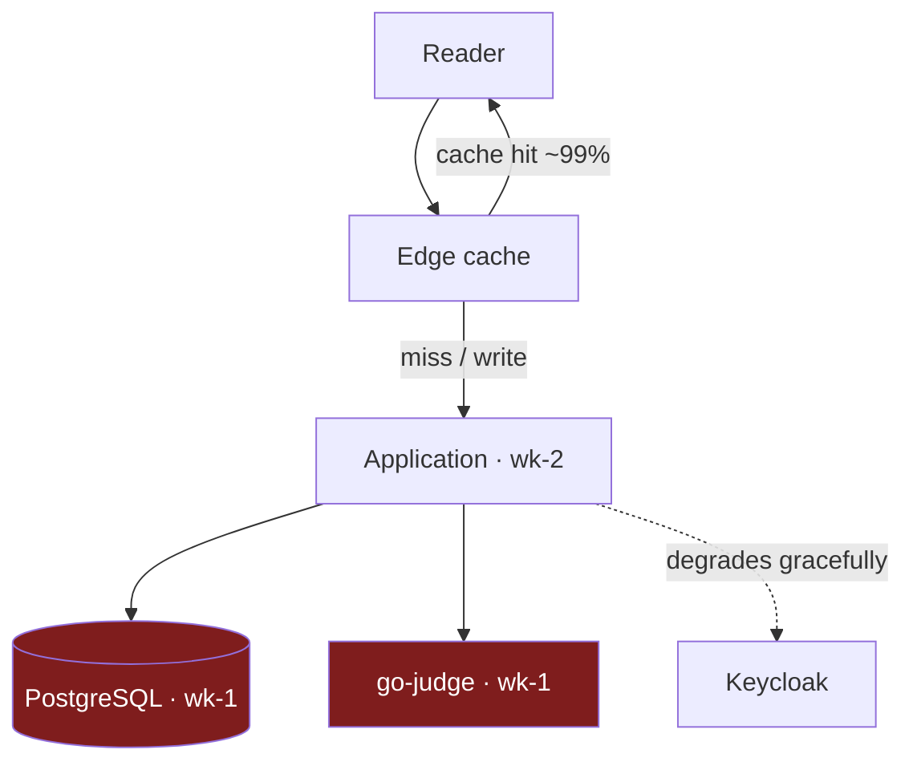

# The homelab case study

> **You'll be able to:** reconstruct an incident from timestamps rather than memory; tell a
> single point of failure apart from a component that merely failed; and evaluate mitigations by
> which failure mode each one actually addresses.

## The cluster

Four nodes joined into one Kubernetes cluster over a WireGuard mesh — one rented VPS at the edge,
three machines at home behind a domestic router.

| Node | Role | Where | CPU | RAM | Ready since |
|---|---|---|---|---|---|
| `ctb-edge-1` | edge | rented VPS | 4 | 8.1 GB | 2026-06-25 |
| `ms-1` | control plane | home | 4 | 8.0 GB | 2026-03-02 |
| `wk-1` | worker | home | 18 | 32.4 GB | **2026-07-18 16:34** |
| `wk-2` | worker | home | 8 | 7.9 GB | 2026-05-23 |

The last column is the story of this chapter. Three nodes have been up for weeks or months. `wk-1`
came up *today*, and this is not the first time.

Utilisation, measured at the same moment:

| Node | CPU | Memory |
|---|---|---|
| `ctb-edge-1` | 3% | 12% |
| `ms-1` | 4% | 32% |
| `wk-1` | 0% | 7% |
| `wk-2` | 2% | 31% |

**Capacity is not the constraint and is nowhere near becoming one.** Measured under load, one replica
sustains 15,440 req/s on less than one of eight cores — enough for millions of monthly readers even
with the CDN switched off ([the arithmetic](/synapse/synapse-app-from-scratch/running-it/scaling-and-maintainability)).
Every real limit in this chapter is about *availability*, not throughput — which is the opposite of
what capacity planning usually assumes.

## Where the pieces run

| Component | Node |
|---|---|
| Application | `wk-2` |
| PostgreSQL | `wk-1` |
| Sandbox (go-judge) | `wk-1` |
| Diagram service | `ctb-edge-1` |

Note what happened here without anyone deciding it: `wk-1` has 18 cores and 32 GB, four times the
memory of any other node, so the scheduler put the resource-hungry things there. **The most capable
node accumulated the most critical state — and it is also the least reliable one.** Nothing chose
that; it is what a default scheduler does with an uneven cluster.

## The outage, from the timestamps

Today the platform was down for roughly an hour and a half. Reconstructed entirely from what the
cluster recorded:

| Time (UTC) | Event |
|---|---|
| 15:03:56 | Application pod starts on `wk-2`; the content sidecar comes up and never restarts |
| 15:04 → 16:31 | Application container crash-loops — **32 restarts** |
| 16:31:26 | Final crash: `exit=1`, `Error: pool timed out while waiting for an open connection` |
| 16:34:07 | `wk-1` becomes `Ready` again |
| 16:36:27 | Next restart succeeds; the application stays up |

Two facts make this worth studying.

**The application was not on the node that failed.** It ran on `wk-2` throughout. `wk-2` was healthy
the entire time. The application still could not serve, because the database it depends on was on
`wk-1`.

**The application behaved exactly as designed.** It fail-fasts when Postgres is unreachable rather
than serving a half-working service with a lying readiness probe. Every one of those 32 restarts was
the intended behaviour, and the error message names the cause precisely.

So this is not a bug report. It is the moment where a correct design decision and a bad availability
outcome are the same event — and pretending otherwise is how systems stay fragile.

## Single points of failure

The outage makes the real dependency graph visible:

| Component | Replicas | If it fails |
|---|---|---|
| PostgreSQL | 1, node-local storage | the application exits — **total outage** |
| Application | 1 (required — per-process rate limiter) | outage until rescheduled |
| go-judge | 1 | runs and submissions fail; reading works |
| `wk-1` | — | takes both the database and the sandbox with it |
| Edge cache | managed | cached reads survive an origin outage |

The genuinely load-bearing observation is the fourth row. `wk-1` is not one component's problem — it
is the node where *everything write-related* lives. A single reboot removes the database and the
sandbox together, and the application's fail-fast turns that into a total outage even though its own
node is fine.

The one bright spot: because reads are edge-cached, a reader browsing already-cached lessons during
the outage would have noticed nothing. The architecture's read-path decision paid out precisely when
it mattered.

## Why `wk-1` keeps rebooting

Three causes, none of them exotic:

1. **Unattended kernel upgrades reboot the machine**, at whatever hour the timer fires.
2. **After a power interruption it did not come back** — the BIOS was set to stay off when power
   returned, so a brief cut meant the node stayed down until someone noticed.
3. **A hung kernel had nothing to recover it** — no watchdog, so a hang meant an indefinite outage
   rather than an automatic reset.

The second and third are the expensive ones, because they turn a *transient* fault into an outage
that lasts until a human intervenes.

## What was actually done

| Mitigation | Failure mode addressed | Status |
|---|---|---|
| BIOS "restore on AC power loss" | node stays off after a power cut | applied |
| Hardware watchdog (`iTCO_wdt`) | kernel hang with no recovery | active on `wk-1`; firmware-locked on `wk-2` |
| Staggered automatic-reboot windows | all nodes rebooting together | configured |
| Node hygiene documented | knowledge living only in my head | written down |

Each targets a *specific* failure mode, which is the standard a mitigation should be held to. Note
that the watchdog could not be enabled on `wk-2` — its firmware does not expose the device. An honest
mitigation table records where the mitigation does not reach.

**None of these prevent today's outage class.** They shorten unattended downtime; they do not remove
the dependency on a single node holding the only copy of the database. That fix is different in kind,
and it is discussed — with its real costs — in
[Trade-offs](/synapse/synapse-app-from-scratch/choices/trade-offs).

The cheapest genuine improvement is not replication but **placement**: anti-affinity so the database
and the sandbox do not share a node, and so neither shares a node with the thing most likely to
reboot. That converts one reboot from a total outage into a partial one, at the cost of a scheduling
constraint.

## What this costs, honestly

| Property | Reality |
|---|---|
| Capacity | 15,440 req/s measured on one replica; millions of monthly readers — not the constraint |
| Availability | no formal target; today's outage was ~92 minutes |
| Redundancy | none for the database; one replica for the application by requirement |
| Recovery | automatic once the failed node returns; no automatic failover |
| Cost | one VPS plus electricity |
| Operator | one person, notified by noticing |

The last row is the real availability limit. There is no on-call rotation and no paging. Mean time to
repair is bounded below by how long it takes me to look — which is why the mitigations that matter
most are the ones that recover *without* a human.

Thirty-two restarts over ninety minutes. Should the application have kept retrying instead of exiting?

It is a fair question, and the answer is that retrying *in-process* would have made the failure
quieter without making it shorter.

Consider what an internal retry loop actually buys. The application starts, cannot reach the
database, and waits. It is now a process that is running but cannot serve — so it must either report
itself unready (which is what the crash loop already communicates, more loudly) or report itself
ready and fail every request that touches the database. The second is strictly worse: readiness would
be a lie, and callers would get errors indistinguishable from application bugs.

Meanwhile the crash loop is doing real work for free. The restart backoff *is* a retry loop, written
by the orchestrator, with exponential backoff, a visible restart count, and an event stream. Thirty-two
restarts is not noise — it is a precise, machine-readable statement of how long the dependency was
missing, which is exactly the number this chapter was reconstructed from.

Where in-process retry genuinely wins is a **brief** interruption: a connection blip or a database
restart lasting seconds, where a short retry avoids a pod restart entirely. That is worth having, and
a bounded startup retry — try for, say, thirty seconds, then exit — would absorb the small cases while
still failing loudly for the large ones. That is a real improvement over the current behaviour.

What no retry policy fixes is the actual problem: the database was gone for ninety minutes because it
lives on one machine that rebooted. Retrying more patiently would have changed 32 restarts into one
long wait, and changed the outage duration by zero.

