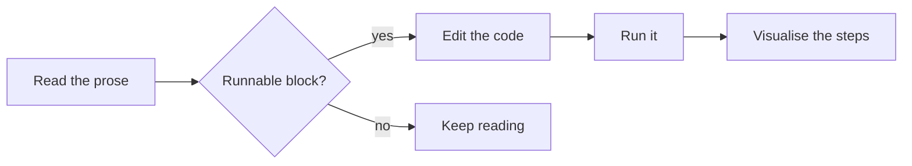

# Reading a Synapse Lesson

A Synapse lesson is prose you can *run*. Alongside ordinary Markdown — headings, lists, tables, links, and
highlighted code — a lesson can embed **diagrams that render**, **code you can execute**, and **step-by-step
visualisations** of that code. This page shows each in turn.

## Mermaid diagrams

A `mermaid` fence renders as an interactive, theme-aware SVG (click **Enlarge** to pan and zoom). It's a good fit
for flows, sequences, and state machines:



## D2 diagrams

A `d2` fence renders through the [D2](https://d2lang.com) engine — a cleaner, more structured look, and a natural
choice for architecture-ish sketches:

```d2
direction: right
reader: "You"
prose: "Prose"
code: "Runnable code"
viz: "Visualiser"
reader -> prose: reads
prose -> code: try it
code -> viz: watch it run
```

## Runnable code, and Visualise

Here's the real magic. A code fence tagged `run` becomes an **editable, runnable** block — Python or Java, executed
in a sandbox — and adding a `viz=<structure>` hint gives it a **Visualise** button that animates the code's
execution.

Below is the two-pointer array reversal (the same *Flip Characters* problem you'll solve on the next page). Press
**Run** to execute it; then press **Visualise** to watch `arr` reverse one swap at a time, with the `left` and
`right` pointers moving inward:

```python run viz=array:arr
arr = ['a', 'e', 'i', 'o', 'u']

left, right = 0, len(arr) - 1
while left < right:
    arr[left], arr[right] = arr[right], arr[left]
    left += 1
    right -= 1

print("[" + ", ".join(arr) + "]")
```

That's a lesson in a nutshell: **read it, run it, watch it.** The next page turns this same idea into an
interactive *problem* with a hidden test suite, and the one after shows how an *architecture diagram* can double as
clickable documentation.
