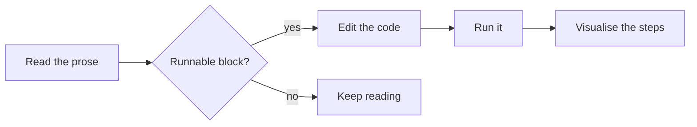

# Reading a Synapse Lesson

A Synapse lesson is prose you can *run*. Alongside ordinary Markdown — headings, lists, tables, links, and
highlighted code — a lesson can embed **diagrams that render**, **code you can execute**, and **step-by-step
visualisations** of that code. This page shows each in turn.

## Mermaid diagrams

A `mermaid` fence renders as an interactive, theme-aware SVG (click **Enlarge** to pan and zoom). It's a good fit
for flows, sequences, and state machines:


```mermaid
flowchart LR
  A[Read the prose] --> B{Runnable block?}
  B -- yes --> C[Edit the code]
  C --> D[Run it]
  D --> E[Visualise the steps]
  B -- no --> F[Keep reading]
```

## D2 diagrams

A `d2` fence renders through the [D2](https://d2lang.com) engine — a cleaner, more structured look, and a natural
choice for architecture-ish sketches:

```d2
direction: right
reader: "You"
prose: "Prose"
code: "Runnable code block"
viz: "Visualiser"
reader -> prose: reads
prose -> code: try it
code -> viz: watch it run
```

## D2 Interactive diagrams

````d2
direction: right

github: GitHub {
  shape: image
  icon: https://icons.d2lang.com/dev%2Fgithub.svg
  style: {
    font-color: green
    font-size: 30
  }
}

github_actions: GitHub Actions {
  lambda_action: Lambda Action {
    icon: https://icons.d2lang.com/dev%2Fgithub.svg
    style.multiple: true
  }
  style: {
    stroke: blue
    font-color: purple
    stroke-dash: 3
    fill: white
  }
}

aws: AWS Cloud VPC {
  style: {
    font-color: purple
    fill: white
    opacity: 0.5
  }
  lambda01: Lambda01 {
    icon: https://icons.d2lang.com/aws%2FCompute%2FAWS-Lambda.svg
    shape: parallelogram
    style.fill: "#B6DDF6"
  }
  lambda02: Lambda02 {
    icon: https://icons.d2lang.com/aws%2FCompute%2FAWS-Lambda.svg
    shape: parallelogram
    style.fill: "#B6DDF6"
  }
  lambda03: Lambda03 {
    icon: https://icons.d2lang.com/aws%2FCompute%2FAWS-Lambda.svg
    shape: parallelogram
    style.fill: "#B6DDF6"
  }
}

github -> github_actions: GitHub Action Flow {
  style: {
    animated: true
    font-size: 20
  }
}
github_actions -> aws.lambda01: Update Lambda {
  style: {
    animated: true
    font-size: 20
  }
}
github_actions -> aws.lambda02: Update Lambda {
  style: {
    animated: true
    font-size: 20
  }
}
github_actions -> aws.lambda03: Update Lambda {
  style: {
    animated: true
    font-size: 20
  }
}

explanation: |md
  ```yaml
  deploy_source:
    name: deploy lambda from source
    runs-on: ubuntu-latest
    steps:
      - name: checkout source code
        uses: actions/checkout@v3
      - name: default deploy
        uses: appleboy/lambda-action@v0.1.7
        with:
          aws_access_key_id: ${{ secrets.AWS_ACCESS_KEY_ID }}
          aws_secret_access_key: ${{ secrets.AWS_SECRET_ACCESS_KEY }}
          aws_region: ${{ secrets.AWS_REGION }}
          function_name: gorush
          source: example/index.js
  ```
| {near: bottom-center}
````

## Stepped image sequences

Not every animation is a diagram Synapse can draw — sometimes the frames already exist as pictures. A run of
consecutive images whose alt text ends `— frame i of N` collapses into **one figure you step through** instead of
N near-identical stills to scroll past, and the `// Interactive Diagram (N frames): …` line above the run becomes
its caption. The reader gets previous/next buttons, a scrubber, a play button, the arrow keys, and **Enlarge**.

The five frames below merge two **binomial heaps**. A binomial heap is a *forest* of trees of distinct rank, so
merging two of them walks both forests in rank order — and whenever two trees of the same rank meet, they are
linked into a single tree of the next rank up. That is exactly the carry in binary addition, which is why merging
an *n*-node and an *m*-node heap costs only O(log n + log m). Press play, or step it a frame at a time:

// Interactive Diagram (5 frames): Merging two binomial heaps, linking trees of equal rank like a binary carry


*Frames by Dimitris131 via [Wikimedia Commons](https://commons.wikimedia.org/wiki/File:Binomial_heaps_merge_step_1.svg),
released under CC0.*

The alt text is the only grouping signal, so two unrelated images that happen to sit next to each other stay two
images. A lone image under a `// Diagram: …` line keeps that line as its caption instead of stepping.

## Runnable code, and Visualise

Here's the real magic. A code fence tagged `run` becomes an **editable, runnable** block — Python or Java, executed
in a sandbox — and adding a `viz=<structure>` hint gives it a **Visualise** button that animates the code's
execution.

Below is the two-pointer array reversal (the same *Flip Characters* problem you'll solve on the next page). Press
**Run** to execute it; then press **Visualise** to watch `arr` reverse one swap at a time, with the `left` and
`right` pointers moving inward:

```python run viz=array:arr
arr = ['a', 'e', 'i', 'o', 'u']

left, right = 0, len(arr) - 1
while left < right:
    arr[left], arr[right] = arr[right], arr[left]
    left += 1
    right -= 1

print("[" + ", ".join(arr) + "]")
```

## One block, many languages

A run group isn't limited to Python and Java — the sandbox speaks eleven languages, and adjacent `run` fences
become a **language picker** on one block. The same FizzBuzz below ships in **Rust**, **Kotlin**, and Python: use
the ▶ pill in the toolbar to switch, then press **Run** — Rust compiles with `rustc -O`, Kotlin with `kotlinc`,
each inside the same sandbox.

```rust run
fn main() {
    for n in 1..=15 {
        match (n % 3, n % 5) {
            (0, 0) => println!("FizzBuzz"),
            (0, _) => println!("Fizz"),
            (_, 0) => println!("Buzz"),
            _ => println!("{n}"),
        }
    }
}
```

```kotlin run
fun main() {
    for (n in 1..15) {
        when {
            n % 15 == 0 -> println("FizzBuzz")
            n % 3 == 0 -> println("Fizz")
            n % 5 == 0 -> println("Buzz")
            else -> println(n)
        }
    }
}
```

```python run
for n in range(1, 16):
    if n % 15 == 0:
        print("FizzBuzz")
    elif n % 3 == 0:
        print("Fizz")
    elif n % 5 == 0:
        print("Buzz")
    else:
        print(n)
```

That's a lesson in a nutshell: **read it, run it, watch it.** The next page turns this same idea into an
interactive *problem* with a hidden test suite, and the one after shows how an *architecture diagram* can double as
clickable documentation.
