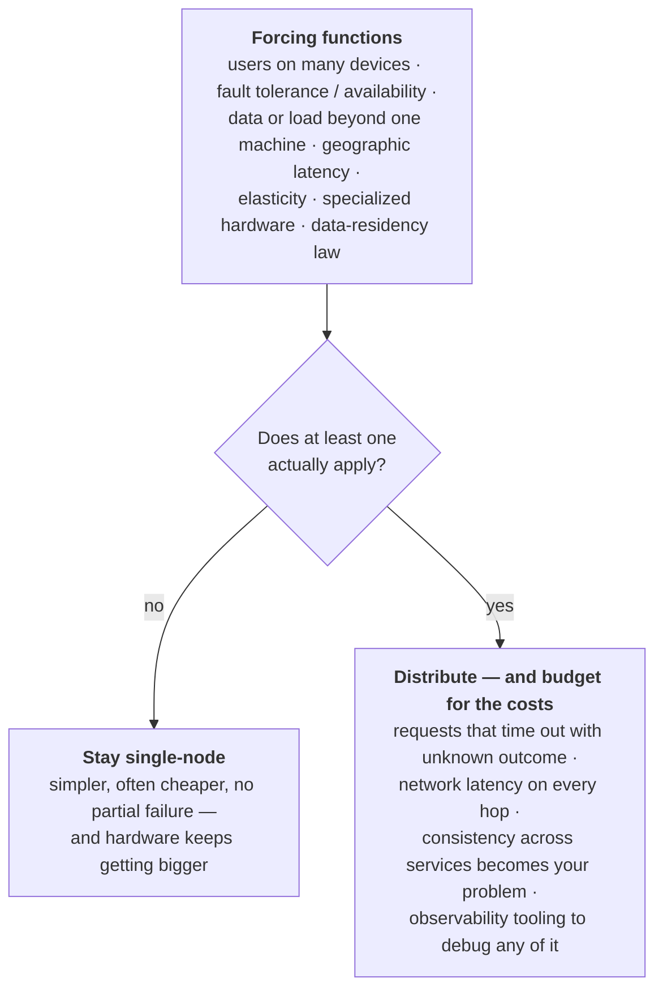

# Thinking in Trade-offs

> **Prerequisites:** none — this is the front door | **You'll be able to:** explain why architecture decisions are trades, not best-practice lookups; place any system on the axes this book is organized around — operational vs analytical, record vs derived, cloud vs self-hosted, single-node vs distributed; argue when *not* to distribute, and defend that choice under follow-up questions.

## The problem (why this exists)

Monday morning at an online retailer. A business analyst launches a query — revenue by product category, every order from the past year. It runs against the same database that handles checkout, because where else would the orders live? While the query grinds through a year of history, checkout requests that normally return instantly start crawling, then timing out. Carts get abandoned. Somebody pages the on-call engineer, who kills the query and glares across the office.

Here is the uncomfortable part: nobody did anything wrong. The analyst genuinely needs to read a year of orders in one pass. Checkout genuinely needs to read and write a handful of small records, immediately, over and over. Both workloads are legitimate — and they are hostile to each other the moment they share a machine. This is a textbook failure mode: analytical queries are expensive, and running them on an operational database degrades the transactions the business lives on. It is one of the main reasons enterprises stopped letting analysts loose on production systems at all.

The instinctive response is to ask, "so what's the *right* database? What's the best architecture?" — and that question is malformed. *Designing Data-Intensive Applications* opens its first chapter with Thomas Sowell's line, "There are no solutions; there are only trade-offs," and then commits to it: no approach is fundamentally better than the others; everything has pros and cons. An application is called **data-intensive** when the hard part is the data — storing a lot of it, managing how it changes, keeping it correct under failure and concurrency, keeping it available — rather than the computation. For such systems there is no catalog of right answers to memorize. There is only a set of recurring contrasts, and the skill of asking which costs your particular workload can afford.

That skill is precisely what a system design interview measures, too. Across thousands of mock interviews, the most common way candidates fail is not missing knowledge — it's failing to deliver a working design because they never structured the problem. Structure comes from knowing the axes on which designs differ. This lesson gives you those axes; the rest of the book teaches you to move along them deliberately.

## Intuition first

Start with a reassuring fact: almost every backend you will ever design is assembled from the same short list of standard building blocks. Databases, to store data and find it again later. Caches, to remember the results of expensive work and speed up reads. Search indexes, to find data by keyword or filter. Stream processing, to react to events as they happen. Batch processing, to periodically crunch everything that accumulated. That's the whole toolbox, and all of it is commodity — you will almost never build these from scratch.

So why is design hard? Because each block is a *bet on an access pattern*. A structure that makes "look up order #4711 right now" fast is a different structure from one that makes "scan all orders from last year" fast, and tuning for one taxes the other — that was the whole problem in our opening story. The blocks are commodities; the *fit* between block and workload is not. Design is matching.

A little vocabulary before we go further, since this book starts from zero. The **frontend** is code running on the user's device — a browser page or mobile app — dealing with one user's data. The **backend** is server-side code, usually reached over HTTP, managing data on behalf of *all* users. Backend code is typically written to be **stateless**: it forgets everything about a request the moment it finishes handling it. Anything that must survive — accounts, orders, messages — gets pushed down into databases, caches, and queues, collectively the *data infrastructure*. This is why "system design" conversations are overwhelmingly conversations about data: the application code is stateless and easy to multiply; the state is where the difficulty concentrates.

One more first-principles observation, and it may be the most useful sentence in this lesson. Inside any company, several different audiences want things from the *same* dataset: end users (through backend engineers) want small, instant lookups; business analysts want aggregate views of history to steer decisions; data scientists want raw material for features and models. Their goals are often never explicitly articulated, which is where the misunderstandings start. Since no single layout of the data serves all of them, nearly all of architecture reduces to two moves: **decide where each fact authoritatively lives, then create purpose-shaped copies for each audience** — and accept, with eyes open, the obligation to keep every copy in sync. Replicas, caches, indexes, warehouses, CDN objects: all copies, differing only in shape and in how expensive the sync bill is. Hold onto that; the whole book unfolds from it.

## How it works

DDIA's first chapter organizes the landscape as a handful of recurring contrasts: operational versus analytical systems, cloud versus self-hosting, distributed versus single-node — plus a fourth, business needs versus the rights of the people in the data, which we'll meet in the production section. Let's walk them mechanically.

### One dataset, two systems: operational vs analytical

**Operational systems** are where data is born: the backend services and infrastructure that read *and modify* data as users act. Their access pattern is called **OLTP** — online transaction processing: look up a small number of records by some key (a *point query*), then insert, update, or delete based on the user's input. A note on the word "transaction": it originally meant a commercial exchange — a sale, a payment — and simply stuck as jargon for a group of reads and writes forming a logical unit. This chapter of the book (and this lesson) uses it loosely to mean fast, small reads and writes; a later module pins down its precise, stronger meaning. Naming that looseness now is deliberate — this book flags its simplifications rather than letting you absorb them as facts.

**Analytical systems** hold a *read-only copy* of the operational data, reorganized for asking big questions. Their pattern, **OLAP** — online analytical processing: scan an enormous number of records, compute aggregates (counts, sums, averages), return a summary rather than individual records. The queries are ad-hoc and analyst-driven, which produces an operational difference worth noticing: OLTP systems mostly execute a fixed set of queries baked into application code (users are not allowed to run arbitrary SQL against production — both to protect data and to stop expensive queries from hurting everyone else), while analytical databases exist precisely so people *can* write arbitrary SQL by hand or through dashboard tools like Tableau, Looker, or Power BI. The data even *means* something different on each side: operational stores hold the latest state of the world; analytical stores hold the history of events that led there.

The standard resolution of our opening incident, then: give analysts a separate **data warehouse** — a read-only copy of data from *all* the company's OLTP systems, which a large enterprise may have dozens or hundreds of. That plural matters: analysts constantly need to combine data across silos (website orders, point-of-sale, inventory, HR), and the warehouse is the one place a single query can span them. Data gets there by **ETL** — extract, transform, load: pull data out (as periodic dumps or a continuous stream), reshape it into an analysis-friendly schema, clean it, load it. Swap the order — load raw, transform later, inside the warehouse — and you have **ELT**. Relax the structure further and you get the **data lake**: a repository of raw files in whatever format — database dumps in Avro or Parquet, but equally text, images, sensor readings, feature vectors — with no schema imposed on write, sitting on cheap object storage. The lake's philosophy is nicknamed the sushi principle — "raw data is better" — keep it raw so each consumer can transform it their own way, particularly data scientists who'd rather reach for Pandas and Spark than warehouse SQL.

Could one system just do both? Vendors sell **HTAP** (hybrid transactional/analytical processing) with exactly that promise, but many HTAP products internally couple a separate OLTP engine and analytical engine behind one interface — so the distinction survives inside the box. And even genuine HTAP doesn't replace the warehouse, because each operational service tends to have its own database while the warehouse's whole point is being the *one* place across all of them. The honest general trend: the greater the scale, the more specialized systems become; general-purpose tools are fine precisely while your volumes are small. And the boundary does blur at the edges — *real-time analytics* stores like Pinot, Druid, and ClickHouse run aggregating workloads inside user-facing products, ingesting continuously and answering fast. The classification is a lens, not a law.

### The anchor: systems of record and derived data

There's a second distinction hiding inside that architecture, and it's the most load-bearing definition in this book. A **system of record** — also called the source of truth — holds the authoritative version of some data: new facts are written *here first*, each fact represented exactly once, and when any other copy disagrees, the system of record is *by definition* the correct one. A **derived data system** holds data produced by transforming data from somewhere else: caches, denormalized values, search indexes, materialized views, even trained ML models. Derived data is technically redundant — it duplicates information — but it's what good read performance is made of, and you can derive several differently-shaped datasets from one source to serve different audiences.

Crucially, this is a statement about *role*, not about technology. Most databases and storage engines are inherently neither — the same engine can be a system of record in one architecture and a derived cache in another. The distinction lives in how *you* use the tool, and being explicit about it is one of the cheapest sources of clarity in a design (and in an interview). Here is the whole picture around one system of record:

```d2
direction: right

classes: {
  client: {style: {fill: "#f3f4f6"; stroke: "#6b7280"}}
  edge:   {style: {fill: "#dbeafe"; stroke: "#2563eb"}}
  svc:    {style: {fill: "#dcfce7"; stroke: "#16a34a"}}
  data:   {style: {fill: "#ffedd5"; stroke: "#ea580c"}}
  async:  {style: {fill: "#f3e8ff"; stroke: "#9333ea"}}
}

users: "End users" {class: client}
analysts: "Analysts &\ndata scientists" {class: client}

op: "Operational side (OLTP)" {
  app: "Backend service" {class: svc}
  sor: "Primary database\n(system of record)" {class: data}
  cache: "Cache\n(derived)" {class: data}
  idx: "Search index\n(derived)" {class: data}
}

etl: "ETL /\nevent stream" {class: async}

an: "Analytical side (OLAP)" {
  lake: "Data lake\n(raw files, derived)" {class: data}
  wh: "Data warehouse\n(derived)" {class: data}
}

users -> op.app: "point reads & writes"
op.app -> op.sor: "new facts written here first"
op.sor -> op.cache: "kept in sync" {style.stroke-dash: 4}
op.sor -> op.idx: "kept in sync" {style.stroke-dash: 4}
op.app -> op.cache: "fast reads"
op.app -> op.idx: "search"
op.sor -> etl: "extract"
etl -> an.lake: "load raw"
etl -> an.wh: "transform & load"
an.lake -> an.wh: "transform later (ELT)"
analysts -> an.wh: "ad-hoc scans & aggregates"
```

Read the diagram from the middle out. Every new fact lands in the system of record first. On the operational side, the cache and the search index are derived copies shaped for fast reads; on the analytical side, the *entire* stack — lake, warehouse, every report on top — is derived. That's why the warehouse can be rebuilt after a disaster, why analysts can't corrupt the truth, and why a discrepancy between warehouse and primary has an automatic verdict. The dashed edges are the fine print: whenever the source changes, *something* must update every derived copy, and most databases assume they're the only database in the world — so keeping multiple systems consistent becomes your application's problem. A later module on event-driven architecture is devoted to exactly that job.

<div style="border-left:4px solid #195045;background:rgba(25,80,69,0.08);padding:0.6rem 1rem;border-radius:0 0.5rem 0.5rem 0;margin:1.25rem 0">

💡 **Insight.** A well-designed system makes losing derived data *boring*. If wiping a store would be a catastrophe, it's a system of record — protect it accordingly. If it would be an inconvenience — rebuild the cache, re-index, re-run the pipeline — it's derived, and you're free to reshape or replace it whenever a new read pattern shows up. If you can't say which of the two a given store is, you don't have an architecture yet.

</div>

### Who builds it, who runs it: cloud vs self-hosting

For every piece of your system there are really two decisions: who *writes* the software, and who *deploys and operates* it. The spectrum runs from bespoke code you build and host yourself, through off-the-shelf software (open source or commercial) that you self-host — on your own hardware (*on premises*) or on rented cloud VMs (*IaaS*) — to fully managed cloud services and SaaS you touch only through an API. The classic rule of thumb for choosing: keep work that is your core competency and competitive advantage in-house; outsource what's routine and commonplace. Nobody fabricates their own CPUs.

The economics are more situational than either vendor pitch admits. If you already know how to operate a system and your load is predictable, buying and running your own machines is often *cheaper* than cloud. If you lack that expertise, a managed service is usually faster and easier than acquiring it, because hiring and training operations staff is expensive. A provider running one service for thousands of customers accumulates operational skill you can't match; equally, they will not tune anything for *your* workload the way your own team could. Cloud's clearest win is elastic load: if demand swings hard — analytics is the classic case, huge parallel bursts then idle — provisioning your own hardware for the peak means paying for machines that sit idle, while cloud lets you return them.

Now the costs, stated as plainly as the benefits. Using a cloud service means giving up control: missing features can only be requested, outages can only be waited out, and performance problems are hard to even diagnose when you can't see the metrics, logs, or internals. If the provider raises prices, deprecates the product, or shuts down, you migrate on their schedule — and the lack of standard APIs across providers is exactly what makes that migration expensive: **vendor lock-in**. There's a geopolitical version, too: a provider in another country can be forced by sanctions to lock you out, and you must trust them with your data's security and your compliance posture. None of this makes cloud wrong — it makes cloud a *trade*, and some businesses rationally refuse it: high-frequency trading runs its own hardware because microseconds of control matter more than elasticity.

The cloud has also changed *how* systems are architected, not just who runs them — this is the expert end of the contrast. **Cloud-native** systems don't merely rent VMs; they build higher-level services out of lower-level ones. Object stores like S3 expose a narrow file API while hiding the physical machines entirely; Snowflake, a warehouse, builds on S3; other products build on Snowflake. Two structural consequences are worth knowing early. First, **separation of storage and compute**: a traditional server owns its disks, and durability means RAID across them; a cloud-native design treats a VM's local disk as an ephemeral cache and keeps durable data in dedicated storage services. Even "disks" may be virtual — services like EBS emulate a block device (blocks of typically 4 KiB) over the network, which means every I/O is a network call with a network call's failure modes. Since object stores prefer fairly large files (hundreds of kilobytes to gigabytes) and database values are much smaller, cloud databases typically keep small values in one service and pack bulk data into object storage. Second, **multitenancy**: your data and computation share hardware with other customers', which is what makes the economics work — and what demands careful engineering so one tenant can't hurt another's performance or security. Cloud-native systems designed this way have shown real advantages: better performance on the same hardware, faster recovery from failure, faster scaling.

Operations doesn't disappear in the cloud; it changes shape. The DevOps/SRE philosophy — automation over manual work, ephemeral machines, frequent deploys, learning from incidents — pairs naturally with services that hide individual machines behind APIs and bill by usage. As DDIA puts it, "capacity planning becomes financial planning, and performance optimization becomes cost optimization." What you still own, unavoidably: choosing and integrating services (standards here are weak, so integration is real work), application security, and tracking down the performance regressions and outages that no vendor dashboard will explain for you.

### Distribution is a cost you pay, not a goal

A **distributed system** is just several machines cooperating over a network — each participating process a *node*. Some forces genuinely leave you no choice: the application is *inherently* distributed (your users are on their own devices, talking over a network by definition); you need fault tolerance — if one machine dies, another carries on; data or load outgrow what one machine can hold or serve; users are worldwide and you want servers near them; load swings and you want elasticity; parts of the workload want specialized hardware (GPU boxes for ML next to disk-heavy storage nodes); or the law itself — data-residency rules that require a jurisdiction's data to stay inside it — forces multiple locations. Real reasons, all of them.

But notice what's *not* on that list: "it's more modern," "it's what big companies do." Because the moment you distribute, you sign up for a new class of problems that single machines simply don't have. Every request across the network can fail: the network drops, the remote service is overloaded or crashed — and when a request times out, you *do not know whether it happened*. Retrying blindly might apply it twice; think about what that means for a payment. Every cross-service call is dramatically slower than a function call, and moving large data across the network can cost more than the computation itself — at volume it's often faster to bring the computation to the data. More machines aren't even reliably faster: a single-threaded program on one computer can outperform a cluster with over 100 CPU cores, once coordination and data movement take their tax. Debugging becomes archaeology — you'll need dedicated *observability* tooling (OpenTelemetry, Zipkin, Jaeger) just to see which service called which, for what, and how long it took. And with each service keeping its own database, keeping data consistent *across* services lands on your application: distributed transactions exist but are rarely used in microservice architectures, because they undermine the independence that was the whole point.

Meanwhile, the case for one machine keeps getting stronger: CPUs, memory, and disks keep growing larger, faster, and more reliable, and embedded single-node engines like SQLite and DuckDB now cover workloads that would have "obviously" needed a cluster a decade ago. Hence this book's posture, which you should carry into every design and every interview:



Most systems in this book *will* be distributed — the forcing functions at real scale are real. The point is the order of reasoning: requirements first, distribution as a priced consequence. Never the other way around.

### Microservices and serverless, at a glance

The dominant way to structure a distributed backend is client/server evolved one step further. **Microservices** (a refinement of what was once called service-oriented architecture): each service has one well-defined purpose, exposes an API callable over the network, and belongs to one team responsible for it. Services usually keep their *own* databases and share nothing — because a shared database effectively makes its whole schema part of every service's API, freezing it, and lets one service's expensive queries degrade everyone else.

What decomposition buys: teams update their services independently instead of coordinating releases; each service gets hardware suited to it; internals hide behind the API and can be rewritten freely. What it costs: a complex system becomes *many* systems — testing needs a fleet of dependency services running; every service needs its own deploy pipeline, resource tuning, log collection, monitoring, and on-call; and evolving an API without breaking existing clients becomes a permanent discipline (this is what OpenAPI and gRPC schemas are for). DDIA's verdict is the one to remember: microservices are "primarily a technical solution to a people problem" — letting many teams make progress without stepping on each other. In a large organization, that's valuable. In a small company with a handful of teams, it's overhead, and the simplest implementation that works is the better engineering.

**Serverless** (function as a service) pushes the outsourcing one notch further: instead of you choosing when to start and stop machines, the provider allocates and frees resources per incoming request, and bills only while your code runs — metered billing applied to execution itself. The costs are characteristic: execution time limits, restricted runtimes, and cold starts when a request arrives and nothing is warm. The name is marketing, not physics — every execution still runs on a server — and the industry has stretched "serverless" to mean little more than "autoscaling with usage-based billing" on products like BigQuery and hosted Kafka. Read the label; ask what's actually being traded.

## Trade-offs

Every contrast in this lesson, as a decision table. This is the lesson in miniature — and the shape every trade-off discussion in this book (and in your interviews) should take: what it gives, what it costs, when it's warranted.

| Option | Gives you | Costs you | Use when |
| --- | --- | --- | --- |
| Separate analytical system (warehouse/lake) | Analysts query freely across all sources; schemas shaped for analysis | A second copy of everything; an ETL pipeline to build and operate; data lags the source | Analytical scans start hurting operational traffic, or data must be combined across silos |
| Derived data (cache, index, materialized view) | Fast reads; several viewpoints on one source of truth | Redundancy plus a sync obligation; staleness windows; rebuild machinery | The record's layout can't serve a read pattern you need |
| Managed cloud service | Elasticity; operational expertise you don't have to hire; metered billing | Control, debuggability, lock-in; trust and geopolitical exposure | Load is bursty or unpredictable; ops skills are scarce; speed matters |
| Self-hosting | Full control and workload-specific tuning; predictable cost at steady load | You own every failure at 3 a.m.; hiring and keeping the expertise | Load is steady and skills exist; special latency or hardware needs |
| Single-node system | Simplicity; no partial failure; often faster and cheaper than a small cluster | A ceiling on size, load, and availability | No forcing function applies — stay here as long as you can |
| Distributed system | Scale, fault tolerance, geographic latency, elasticity | Partial failure; unknown-outcome timeouts; cross-service consistency; observability tooling | A genuine forcing function (scale, availability, geography, law) applies |
| Microservices | Independent team progress; per-service hardware and deploys | Fleet-scale complexity: testing, deploy infra, monitoring, on-call, API evolution | Many teams block each other in one codebase |
| Serverless (FaaS) | Zero capacity management; pay only while code runs | Cold starts; execution limits; restricted runtimes; less control | Spiky or low-duty-cycle request handling; small teams |

## Numbers that matter

Chapter 1 is deliberately qualitative, but the few numbers it does pin down are good scale anchors to carry forward:

- **Operational datasets: gigabytes to terabytes. Analytical datasets: terabytes to petabytes.** When someone says "warehouse," think three orders of magnitude more history than the primary holds.
- **Object stores are built for files of hundreds of kilobytes to several gigabytes**, while virtual disks emulate ~4 KiB blocks and database values are smaller still — this size mismatch is why cloud systems put metadata in a database and bulk data in object storage, a pattern you'll reuse in half the case studies.
- **A single-threaded program on one machine can outperform a cluster of 100+ CPU cores.** Coordination isn't free; quote this the next time someone proposes a cluster reflexively.
- **Interview calibration:** a mid-level candidate completes a design at roughly 80% breadth / 20% depth; a senior candidate at roughly 60/40. Depth is where trade-off reasoning shows.

The numbers habit itself — estimating load before choosing an architecture — gets its own lesson: [Estimation & the Numbers](/synapse/system-design-from-first-principles/foundations/estimation-and-numbers), with the latency ladder in [Latency, Throughput & Percentiles](/synapse/system-design-from-first-principles/foundations/latency-throughput-percentiles).

## In production

You can read the whole operational/analytical divide off the market's shelf labels. Self-hosted OLTP: MySQL, PostgreSQL, MongoDB; their cloud-native counterparts: AWS Aurora, Azure SQL DB Hyperscale, Google Cloud Spanner. Self-hosted analytics: Teradata, ClickHouse, Spark; cloud-native: Snowflake, BigQuery, Azure Synapse. The layering thesis is visible in the same list — Snowflake stores its data in S3 — and an entire connector industry (Fivetran, Airbyte, Singer) exists just to move data from operational SaaS silos into warehouses: ETL as a product category. The loop closes with *reverse ETL*: models trained on the analytical side get deployed back into operational systems (with tooling like TFX, Kubeflow, MLflow) to serve recommendations and risk scores — derived data feeding user-facing requests. And inside user-facing products, real-time analytics engines (Pinot, Druid, ClickHouse) serve aggregations directly to users, deliberately blurring the OLTP/OLAP line where the product demands it.

The counter-currents are just as instructive. High-frequency trading self-hosts on its own hardware because full control over latency beats every cloud convenience. Enterprises weigh vendor lock-in and even geopolitical lock-out — sanctions cutting you off from a foreign provider — as real architectural inputs. And a quiet single-node renaissance is underway: engines like DuckDB and SQLite absorb workloads that a decade of fashion said required clusters.

One production force deserves special mention because architects keep discovering it too late: **the law shapes architecture**. Since 2018, GDPR (and successors like CCPA) gives people legal rights over data about them, and those rights reach into technical foundations — the *right to be forgotten* collides head-on with immutable, append-only logs and with ML models already trained on the data to be erased. There is no official checklist of "GDPR-compliant architectures"; the regulation is deliberately technology-neutral, so the reasoning falls to you. The honest accounting: data's true cost is not the storage bill but the liability — breach risk, fines, compelled disclosure, and real safety risk to users where their data reveals something dangerous to them. *Data minimization* — don't store what you don't have a purpose for — is a design stance, not just a compliance one, and audited standards like PCI DSS and SOC 2 are how the industry proves its posture to customers. This book folds these concerns into the case studies where they bite (retention, deletion, audit trails) rather than preaching a separate sermon.

## Pitfalls & interview traps

**Best-practice cosplay.** Justifying a component with "it's industry standard" or "that's what Netflix uses." The interviewer hears a lookup table, not an engineer. Every component must pay rent: what it gives, what it costs, which requirement demanded it.

**Premature distribution.** Proposing Kafka, microservices, and three databases for a workload one PostgreSQL instance would handle with headroom. DDIA is blunt: a single machine is often simpler *and cheaper*, and microservices solve a people problem you may not have. The senior move is naming the forcing function — or conceding there isn't one yet and designing the seam where you'd split later.

**Treating a derived store as the record.** The cache "has the data," so reads ship from it; months later it disagrees with the database and someone "fixes" the database *from the cache*. Backwards by definition. Say out loud, in every design, which store is the system of record.

**Analytics on the primary.** The opening story. The fix is a copy shaped for analysis — not more indexes, not asking analysts to be careful.

**Retrying a timed-out write blindly.** A timeout means *unknown outcome*, not failure. Until you've made the operation idempotent (a later module), a retry is a bet on a double-charge.

**Assuming cloud is automatically cheaper.** With existing skills and steady load, self-hosting often wins on cost — and in the cloud, remember, performance optimization *is* cost optimization.

<div style="border-left:4px solid #da5233;background:rgba(218,82,51,0.08);padding:0.6rem 1rem;border-radius:0 0.5rem 0.5rem 0;margin:1.25rem 0">

⚠️ **The "which is best?" trap.** Interviewers ask "SQL or NoSQL?", "monolith or microservices?", "cloud or on-prem?" precisely *because* the questions are malformed — they're testing whether you reach for requirements or for fashion. Answering with a brand name first is the yellow flag. The winning shape is always: state the workload, name the trade, then commit to a choice and own its costs. The failure mode is consistent across mock interviews: candidates rarely fail for missing a fact; they fail by never structuring the problem — and over-engineering depth in an unimportant corner reads as poor judgment, not expertise.

</div>

### How this book works

You've just experienced the template every lesson follows: a concrete failure first, intuition before formalism, mechanism with a rendered diagram, an explicit trade-off table, real numbers, how industry actually runs it, and the traps — with quizzes at the end. Every lesson ramps **beginner → expert** inside itself: the opening assumes nothing; the closing sections are senior-interview grade; and simplifications are *named* when made (you saw it with "transaction" above), never smuggled in.

Two source disciplines back the prose. Correctness of data-systems claims follows *Designing Data-Intensive Applications* (2nd ed.), with page-cited sources at the foot of each lesson. Interview framing — what to emphasize, how deep to go, how the 45 minutes actually flow — is this book's own synthesis, calibrated against how real interviews are actually run and scored. Anything web-sourced is flagged inline; anything unverifiable is flagged, not asserted.

Reading paths: new to all of this, read front to back — the next lesson, [Nonfunctional Requirements](/synapse/system-design-from-first-principles/foundations/nonfunctional-requirements), turns today's vague "fast and reliable" into vocabulary you can design against, and the module builds through [Latency, Throughput & Percentiles](/synapse/system-design-from-first-principles/foundations/latency-throughput-percentiles), [Estimation & the Numbers](/synapse/system-design-from-first-principles/foundations/estimation-and-numbers), [Networking Essentials](/synapse/system-design-from-first-principles/foundations/networking-essentials), and [API Design](/synapse/system-design-from-first-principles/foundations/api-design) to [The Interview at 10,000 Feet](/synapse/system-design-from-first-principles/foundations/the-interview-at-10000-feet). Interview on a deadline? Foundations, skim Patterns, then drill Case Studies with the Interview Playbook open. Already running systems for a living? Distributed Data and Production Engineering are where this book earns its keep.

## Check yourself

```quiz
{"prompt": "An analyst's year-long revenue scan keeps timing out the checkout flow that shares the primary database. What is the standard fix?", "options": ["Copy the data into a separate analytical store (via ETL) and point analysts there", "Add an index on the primary database for every query analysts write", "Shard the primary database across more machines so the scans finish faster", "Schedule analyst queries for nighttime and hope traffic stays low"], "answer": "Copy the data into a separate analytical store (via ETL) and point analysts there"}
```

```quiz
{"prompt": "You put a cache in front of the product database. Which new obligation did you just take on?", "options": ["A process that updates or invalidates the cache whenever the source data changes", "Nothing — a cache is a free performance win", "Promoting the cache to system of record, since it now serves most reads", "Rewriting the database schema to match the cache's layout"], "answer": "A process that updates or invalidates the cache whenever the source data changes"}
```

```quiz
{"prompt": "Your whole workload fits comfortably on one machine. Which requirement would still force a distributed design?", "options": ["A law requiring EU users' data to be stored and processed inside the EU while you also serve other regions", "A team preference for smaller code repositories", "A wish to adopt a container orchestrator", "A read-heavy workload of a few gigabytes"], "answer": "A law requiring EU users' data to be stored and processed inside the EU while you also serve other regions"}
```

```quiz
{"prompt": "A write request to a remote payment service times out. What do you actually know about that write?", "options": ["Nothing — it may or may not have been applied, so a blind retry could double-charge", "It failed, so it is always safe to retry", "It succeeded, and only the acknowledgment was lost", "The network is down, so all later writes will fail too"], "answer": "Nothing — it may or may not have been applied, so a blind retry could double-charge"}
```

**1.** Your four-engineer startup serves steady, modest traffic. A teammate proposes splitting the backend into twelve microservices "so we're ready to scale." Argue for the monolith on a single well-provisioned machine — and name the two signals that would later justify revisiting.

<details><summary>Answer</summary>

Microservices are primarily a solution to a *people* problem — letting many teams progress without coordinating. With four engineers there is no such problem, so you'd be paying the costs (per-service deploy pipelines, monitoring, on-call, cross-service testing, API-evolution discipline, and the distributed-systems tax of partial failure and unknown-outcome timeouts) while collecting none of the benefit. A single node is simpler, often cheaper, avoids cross-service consistency problems entirely, and modern hardware gives it a long runway. Revisit when (a) the organization grows enough that teams genuinely block each other in one codebase, or (b) a real forcing function appears — load or data beyond one machine, an availability target one machine can't meet, geographic latency, or data-residency law.

</details>

**2.** Explain why a data warehouse is a *derived* data system, and what that classification buys you operationally.

<details><summary>Answer</summary>

The warehouse holds a read-only copy of data extracted (via ETL) from the operational systems of record — it is produced by transforming other systems' data, which is the definition of derived. Three operational consequences follow. It can be rebuilt from the sources if lost or mis-transformed, so losing it is an inconvenience, not a catastrophe. Analysts querying it can never corrupt the authoritative data, so they can be given free rein with arbitrary SQL. And any discrepancy between warehouse and primary has an automatic verdict: the system of record is correct by definition, so you debug the pipeline, not the source.

</details>

**3.** Your analytics workload is intensely bursty; your OLTP database runs at a steady, predictable load and your team has years of experience operating it. Make the honest case for splitting the deployment: analytics in the cloud, OLTP self-hosted.

<details><summary>Answer</summary>

Cloud economics favor the bursty half: elasticity means you rent a large fleet for the heavy parallel queries and return it when idle, instead of owning peak capacity that sits unused. Self-hosting favors the steady half: with predictable load and existing operational skill, owning the machines is often cheaper, and you keep full control and workload-specific tuning. The honest caveats on each side: the cloud half costs you control, debuggability, and some lock-in (and its ops work becomes service integration and cost optimization rather than zero work); the self-hosted half only stays cheap as long as the team's expertise actually persists — hiring and retaining that skill is part of its true price.

</details>

## Sources

- DDIA2 ch. 1 pp. 1–3 (trade-off thesis; data-intensive applications; building blocks; frontend/backend/stateless terminology)
- DDIA2 ch. 1 pp. 3–11 (operational vs analytical systems; OLTP/OLAP; warehouses, ETL/ELT, lakes, HTAP, real-time analytics; systems of record vs derived data)
- DDIA2 ch. 1 pp. 12–18 (cloud vs self-hosting; cloud-native layering; separation of storage and compute; multitenancy; operations in the cloud era)
- DDIA2 ch. 1 pp. 19–23 (distributed vs single-node; problems with distribution; microservices and serverless)
- DDIA2 ch. 1 pp. 24–25 (data systems, law, and society; right to be forgotten; data minimization; PCI/SOC 2)
