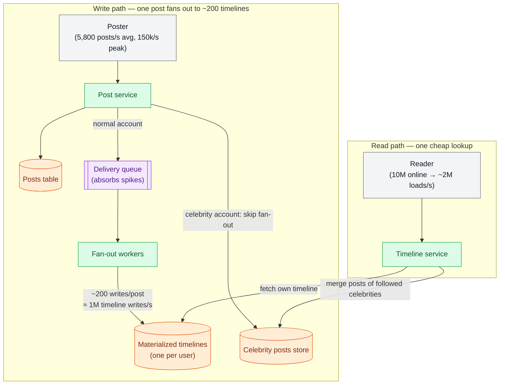

# Nonfunctional Requirements

> **Prerequisites:** [Thinking in Trade-offs](/synapse/system-design-from-first-principles/foundations/thinking-in-tradeoffs) | **You'll be able to:** split any product ask into functional and nonfunctional requirements; trace how a single nonfunctional requirement forces a social feed through three successive architectures; state reliability, scalability, and maintainability requirements crisply enough to drive an interview design.

## The problem (why this exists)

Imagine two teams build the same product: users can post short messages, follow each other, and read a timeline of posts from the people they follow. Same screens, same buttons, same API. Both demos work flawlessly. A year later, one app serves hundreds of millions of users; the other collapsed the first time a moderately famous person joined.

Nothing in the feature list distinguishes them. The spec both teams met — *what the application must do*: screens, buttons, the behavior of each operation — is the **functional requirements**. What differed was everything the spec never wrote down: how fast the timeline loads, what happens when a machine dies mid-operation, whether the design survives ten times the load, whether next year's engineers can change it safely. These are the **nonfunctional requirements (NFRs)**: cross-cutting qualities like being fast, reliable, secure, legally compliant, and maintainable. They usually go unwritten because they sound obvious — yet they matter as much as the features, because an app that is unbearably slow or unreliable might as well not exist.

It matters doubly in interviews: every interesting design decision — cache or no cache, SQL or NoSQL, one region or three — is downstream of an NFR. Functional requirements tell you what to build. Nonfunctional requirements tell you what will kill you.

## Intuition first

Here's a serviceable first cut. Functional requirements are the *verbs* of your system: post a message, follow a user, load a timeline. They map almost one-to-one onto your API (we make that mapping explicit in [API Design](/synapse/system-design-from-first-principles/foundations/api-design)). Nonfunctional requirements are the *adverbs*: do it quickly, reliably, at enormous scale, without losing data, in a way the team can still evolve in five years.

A useful field test: a functional requirement can be verified by one user clicking through the app on a laptop. A nonfunctional requirement only reveals itself under stress — under load, under failure, or under years of change. That is exactly why weak designs pass their demos: demos exercise functions, not qualities.

DDIA chapter 2 gives working vocabulary for four NFR families: **performance**, **reliability**, **scalability**, and **maintainability** (security matters too, but the book scopes it out and so, for now, do we). This lesson covers the last three in depth; performance — response-time distributions, percentiles, tail latency, SLOs — is rich enough to get its own lesson next: [Latency, Throughput & Percentiles](/synapse/system-design-from-first-principles/foundations/latency-throughput-percentiles).

Before the pillars, though, we need to *see* an NFR reshape an architecture. DDIA's social-network case study does this better than any definition.

## How it works

### One requirement, three architectures: the home timeline

DDIA models a service like X (formerly Twitter): users post messages and follow other users. It's a deliberate, drastic simplification of the real thing — we name that simplification and accept it, because it isolates the large-scale issues perfectly. The assumed workload: **500 million posts per day, about 5,800 posts/second on average, spiking as high as 150,000 posts/second**. The social graph: the **average user follows 200 people and has 200 followers**, but the distribution is wildly skewed — most people have a handful of followers, while celebrities have **over 100 million**.

The data fits a textbook relational schema — `users`, `posts`, `follows` — and the core read, the **home timeline** (recent posts by everyone you follow), is a single SQL query: join posts to follows, order by timestamp descending, limit 1000. Functionally, we're done. It works perfectly in the demo.

Now add one nonfunctional requirement: **a post should reach its followers' timelines within about five seconds**. Timeliness. Watch it destroy the design.

The naive way to be timely is **polling**: every online client re-runs the timeline query every five seconds. With **10 million concurrent users**, that's **2 million timeline queries per second**. Each query scans the posts of ~200 followed accounts, so the database performs on the order of **400 million per-sender lookups per second** — and far worse for users who follow tens of thousands of accounts. No amount of index tuning survives that. The functional requirement didn't change; the NFR alone made the architecture untenable.

So invert the work. Instead of computing each timeline when it's read, **precompute it when a post is written**: deliver every new post into each follower's stored timeline, like dropping a letter into each mailbox. Reads become one cheap cache lookup. The cost moves to the write path: each post now multiplies into downstream writes by the **fan-out** factor — the number of followers. At 5,800 posts/second with an average fan-out of 200, that's **just over 1 million timeline writes per second**. A big number, but roughly 400× smaller than the read-side disaster. During spikes, deliveries can be queued — a post arriving a little late is acceptable, and reads stay fast because they're served from the precomputed cache. This is **materialization**: each stored timeline is a **materialized view**, a precomputed query result. It's also **derived data** — a second copy of the truth that the system must now keep up to date, a theme that will follow us through the whole book.



But averages lie, and the skew in the social graph bites twice. First, a user who follows very many high-volume accounts accumulates timeline writes faster than anyone could read them — for them, dropping some deliveries and showing a sample is acceptable. Second, and worse: the **celebrity problem**. One post by an account with 100 million followers means 100 million timeline writes, and *dropping those is not acceptable*. So celebrity posts are handled separately: stored apart, skipped during fan-out, and **merged into each timeline at read time**. The production answer is a hybrid — fan-out on write for the many small accounts, fan-out on read for the few enormous ones — and even that takes substantial infrastructure.

Notice the shape of what happened. The functional requirement never changed. One NFR (timeliness) plus the load's statistical shape (volume, then skew) forced three architectures in a row: query-on-read → fan-out-on-write → hybrid. That is what "NFRs drive architecture" means concretely.

<div style="border-left:4px solid #195045;background:rgba(25,80,69,0.08);padding:0.6rem 1rem;border-radius:0 0.5rem 0.5rem 0;margin:1.25rem 0">

💡 **The move to remember.** Materializing timelines shifts work from the read path to the write path. Caches, indexes, and materialized views are all versions of this one trade: pay more per write to pay less per read. Which side should pay is decided by the read/write ratio and the tails of the load distribution — not by fashion.

</div>

With the case study in hand, the three pillars stop being abstract words.

### Reliability: working correctly when things go wrong

DDIA defines reliability as, roughly, *"continuing to work correctly, even when things go wrong."* The vocabulary is precise: a **fault** is one component deviating from spec — a disk dies, a machine crashes, a dependency has an outage. A **failure** is the system *as a whole* no longer providing the required service — missing its SLO. They're the same event at different zoom levels: a dead disk is a failure *of that disk*, but merely a fault to a storage system holding a copy elsewhere. A system that keeps providing service despite certain faults is **fault-tolerant**; a component whose fault escalates into whole-system failure is a **single point of failure (SPOF)**. Fault tolerance is always bounded — "tolerates the loss of any one of three nodes," never "tolerates anything" — and the way to gain confidence in it is to trigger faults deliberately (**fault injection**, and the discipline built around it, **chaos engineering**). In general, tolerating faults beats trying to prevent them all — except where no cure exists, like a security breach that has already leaked data.

The timeline system makes this concrete: if the machine doing fan-out crashes mid-delivery, fault tolerance means another machine takes over *without missing or duplicating* any follower's copy — exactly-once semantics, a hard problem we meet properly in the streaming chapters.

Faults come in three families, and the ordering of how much they should worry you is the opposite of most people's instincts.

**Hardware faults** are the famous ones, and at scale they are simply weather. Magnetic disks fail at roughly 2–5% per year — a 10,000-disk cluster should expect about **one dead disk per day**. SSDs fail less often (0.5–1% per year) but hit uncorrectable errors about once per drive per year. Roughly 1 in 1,000 machines has a CPU core that occasionally computes the wrong answer; even with ECC, more than 1% of machines per year suffer an uncorrectable memory error. Whole datacenters lose power or burn down. The first-line response is component redundancy — RAID, dual power supplies, generators — but component failures are more correlated than the brochures suggest, so large systems instead tolerate the loss of *whole machines* in software, spread across **availability zones**. A pleasant side effect: a system that survives node loss also supports **rolling upgrades** — patch one node at a time, no downtime.

**Software faults** are nastier because they are *correlated*: every node runs the same code, so one bug can take down all of them at once. The leap second on June 30, 2012 hung many Java applications simultaneously via a Linux kernel bug; one SSD firmware bug made drives fail after exactly 32,768 hours of operation — every drive installed the same week dies the same week. Add runaway processes exhausting shared resources, misbehaving dependencies, and **cascading failures** where one overloaded component topples the next. There is no single fix — only accumulated discipline: testing, process isolation, crash-and-restart designs, avoiding retry feedback loops, and measuring behavior in production.

**Humans dominate.** A study of large internet services found that **operator configuration changes were the leading cause of outages, while hardware faults contributed to only 10–25%**. If your reliability story is "redundant hardware," you've addressed the minority cause. And when a human does trigger an outage, blaming "human error" is a diagnosis-shaped excuse: the mistake is a symptom of the surrounding **sociotechnical system** — the tooling, interfaces, and incentives that made the mistake easy. The countermeasures are systemic: thorough testing, fast rollback for config changes, gradual rollouts, observability, interfaces that make the right thing easy — and **blameless postmortems**, so incidents surface the truth instead of a scapegoat.

### Scalability: coping with growing load

**Scalability** is a system's ability to cope with increased load — and the first expert habit is refusing to use the word as a label. "X is scalable" and "Y doesn't scale" are meaningless sentences. The meaningful questions are conditional: *if load grows along this particular dimension, what are our options for coping? How do we add resources? How far does the current architecture carry us?*

That requires describing load precisely, with **load parameters**: usually a throughput figure (requests/second, gigabytes of new data per day, checkouts per hour), often a peak (simultaneously online users), and — critically — the *statistical shape* of the workload: read/write ratio, cache hit rate, items per user. The timeline case study is the canonical warning: the *average* of 200 followers was fine; the *tail* of the distribution (one account with 100 million) forced the hybrid design. Averages size your fleet; extremes shape your architecture. Two lenses then frame any growth discussion: with resources fixed, how does performance degrade as load rises? And to hold performance constant, how much resource must you add? The ideal is **linear scalability** — double the resources, handle double the load — and reality is usually worse: cost tends to grow faster than linearly.

When load outgrows one machine, there are three ways to organize hardware:

- **Shared-memory** (vertical scaling, scaling up): one bigger machine, many cores and threads over the same RAM. Simple — but a machine with twice the resources costs distinctly more than twice as much, internal bottlenecks mean it often can't even handle twice the load, and it's still one blast radius.
- **Shared-disk**: several machines with independent CPUs and RAM sharing one disk array over a fast network (NAS/SAN). Traditional in on-premises data warehousing, but contention and locking overhead cap how far it goes.
- **Shared-nothing** (horizontal scaling, scaling out): independent nodes — each with its own CPU, RAM, and disks — coordinating only via the network. Potentially linear scaling, commodity price/performance, and fault tolerance across machines and datacenters; the price is **sharding** the data and importing the full complexity of distributed systems.

```d2
direction: right

classes: {
  client: {style: {fill: "#f3f4f6"; stroke: "#6b7280"}}
  edge:   {style: {fill: "#dbeafe"; stroke: "#2563eb"}}
  svc:    {style: {fill: "#dcfce7"; stroke: "#16a34a"}}
  data:   {style: {fill: "#ffedd5"; stroke: "#ea580c"}}
  async:  {style: {fill: "#f3e8ff"; stroke: "#9333ea"}}
}

up: "Shared-memory (scale up)" {
  cores: "Many cores, many threads" {class: svc}
  ram: "One shared RAM" {class: data}
  cores <-> ram
}

sd: "Shared-disk" {
  n1: "Node 1 (own CPU + RAM)" {class: svc}
  n2: "Node 2 (own CPU + RAM)" {class: svc}
  san: "Shared disk array (NAS/SAN)" {class: data}
  n1 -> san: "contention + locking"
  n2 -> san
}

sn: "Shared-nothing (scale out)" {
  a: "Node A" {class: svc}
  da: "Disk A" {class: data}
  b: "Node B" {class: svc}
  db: "Disk B" {class: data}
  a -> da
  b -> db
  a <-> b: "network only"
}
```

A modern footnote: several cloud-native databases now separate storage from compute — many compute nodes over one shared storage *service*. It looks like shared-disk, but sidesteps its scalability problems by exposing a database-tailored API instead of pretending to be a filesystem.

Three principles close the topic. First, **there is no magic scaling sauce**: an architecture serving 100,000 requests/second of 1 kB each and one serving 3 requests/minute of 2 GB each move the same 100 MB/s and look nothing alike — scalable architecture is specific to the load parameters. Second, expect to **rethink the architecture at every order of magnitude** of load growth, and don't plan more than one order ahead. For an early product, obsessing over hypothetical scale is actively harmful: the overriding need is iterating quickly on features, and a premature "web-scale" design is wasted effort at best, an inflexible trap at worst. Third, the general-purpose trick that does exist is decomposing the system into smaller, largely independent components — the seed of sharding, stream processing, and microservices alike — while resisting over-complication: a single-machine database beats an unnecessary distributed contraption.

### Maintainability: the long game

Software doesn't wear out, but requirements shift, platforms move, and bugs surface — and **the majority of a system's cost is this ongoing maintenance, not the initial build**. Every valuable system eventually becomes someone's legacy system; maintainability is how kindly yours treats its inheritors. DDIA breaks it into three principles.

**Operability** — make it easy for operations to keep the system healthy. As the book puts it, *"good operations can often work around the limitations of bad software, but good software cannot run reliably with bad operations."* Concretely: observability into runtime behavior, no dependence on any individual machine (so nodes can be taken down for maintenance), good documentation, sane defaults with overrides, self-healing with manual control preserved, predictable behavior. Automation is essential at scale but two-edged — the un-automatable cases are precisely the hardest ones, and a misbehaving automated system is harder to debug than a manual one.

**Simplicity** — make it easy for new engineers to understand the system. Projects drown in complexity ("a big ball of mud"), which breeds overruns and bugs because hidden assumptions and unexpected interactions go unnoticed. The heavy tool against it is **abstraction**: a good abstraction hides implementation detail behind a clean façade and serves many users — SQL hiding on-disk structures and concurrency, high-level languages hiding machine code. (Simplicity is partly subjective, and even the classic essential-vs-accidental complexity split frays at the edges — the boundary moves as tooling improves.)

**Evolvability** — make change easy. Requirements are never static: new use cases, new regulations, new platforms, growth forcing architectural change. Evolvability rides on simplicity (loosely coupled systems are easier to modify) and on minimizing **irreversibility**: a migration you cannot roll back turns every deploy into a bet-the-company moment. Keeping changes reversible keeps them cheap.

## Trade-offs

The timeline strategies first — this table is worth memorizing, because it generalizes to every feed-shaped system:

| Option | Gives you | Costs you | Use when |
| --- | --- | --- | --- |
| Compute timeline at read time (query per request) | Cheap writes; always fresh; simplest system | Read cost scales with accounts followed — ~400M lookups/s at case-study scale | Read volume is modest, or as the celebrity path inside a hybrid |
| Materialize timelines at write time (fan-out on write) | O(1) reads from cache; meets the 5-second timeliness target | ~1M timeline writes/s; derived data to keep correct; spikes need queueing | Read-heavy, feed-shaped products with mostly small accounts |
| Hybrid: fan-out + read-time merge for celebrities | Caps worst-case fan-out; keeps reads cheap for everyone else | Two code paths; merge logic on every read; more infrastructure | Follower distribution is heavily skewed — i.e., every real social network |

And the machine-organization choice underneath any of them:

| Option | Gives you | Costs you | Use when |
| --- | --- | --- | --- |
| Shared-memory (scale up) | Simplicity; no distributed systems problems | Super-linear cost; bottlenecks below 2× gains; single blast radius | Load fits one machine — which is true surprisingly often |
| Shared-disk | Pooled storage across compute nodes | Contention and locking overhead cap scaling | Niche: traditional on-prem data warehousing |
| Shared-nothing (scale out) | Potentially linear scaling; commodity price/perf; fault tolerance across zones | Sharding, rebalancing, and full distributed-systems complexity | Load or fault-tolerance requirements outgrow one machine |

## Numbers that matter

These figures are the case study's spine and the reliability planning baseline — the kind of numbers you should be able to reproduce on a whiteboard. The estimation method behind them lives in [Estimation & the Numbers](/synapse/system-design-from-first-principles/foundations/estimation-and-numbers).

| Figure | Value | Why it matters | DDIA2 page |
| --- | --- | --- | --- |
| Posts per day | 500 million (≈ 5,800/s avg) | Baseline write throughput | p. 34 |
| Peak posts/second | 150,000 | Spikes are ~25× average — design for peaks | p. 34 |
| Avg follows / followers | 200 / 200 | The fan-out multiplier | p. 34 |
| Celebrity followers | > 100 million | The tail that breaks pure fan-out | p. 34 |
| Timeliness target | ≤ 5 seconds | The NFR that forced materialization | p. 35 |
| Polling read load | 2M timeline queries/s (10M users / 5 s) | Naive design's read demand | p. 35 |
| Naive per-sender lookups | ~400M/s | Why query-on-read dies | p. 35 |
| Fan-out write load | just over 1M timeline writes/s | Cost of materialization (5,800 × 200) | p. 36 |
| HDD annual failure rate | 2–5% → ~1 disk death/day per 10,000 disks | Hardware faults are weather, not surprises | p. 44 |
| SSD annual failure rate | 0.5–1%; ~1 uncorrectable error/drive/year | Redundancy sizing | p. 44 |
| Flaky CPU cores | ~1 in 1,000 machines | Silent wrong answers exist | p. 45 |
| Uncorrectable RAM errors | >1% of machines/year, even with ECC | Ditto | p. 45 |
| Outage causes | Config changes lead; hardware only 10–25% | Where reliability effort should go | p. 47 |
| Architecture shelf life | Rethink every ~10× load growth; plan ≤ 1 order ahead | Scaling roadmap cadence | p. 52 |

## In production

The case study isn't hypothetical — it is a simplified portrait of how X-scale feed systems actually work: fan-out on write for the long tail of small accounts, celebrity posts stored separately and merged at read time, delivery queues absorbing spikes. When an interviewer asks "what happens when a celebrity posts?", they are asking whether you know this hybrid exists.

The reliability numbers translate directly into operational posture. At 10,000 disks, a dead disk per day is *routine maintenance*, not an incident — so large operators treat hardware replacement as a background process and spend their real energy on software fault tolerance across availability zones, with rolling upgrades as the everyday dividend. Correlated software faults are the ones that make headlines precisely because redundancy doesn't help: the 2012 leap-second bug hung fleets of Java applications on the same night, and the 32,768-hour SSD firmware bug killed drives in installation-date cohorts. Fault injection is now standard practice — deliberately killing processes and machines to prove the tolerance machinery works; Netflix's Chaos Monkey, which terminates production instances at random, is the canonical open-source example [web: github.com/Netflix/chaosmonkey].

The human-factors findings are the least glamorous and the most actionable: since configuration changes are the leading cause of outages, mature organizations invest in gradual rollouts, one-click rollback, and blameless postmortems — process, not hardware. And when reliability is neglected, the cost can escape the engineering department entirely: the UK Post Office's Horizon accounting software showed phantom cash shortfalls for two decades (1999–2019), and hundreds of branch managers were wrongly convicted of theft and fraud on its evidence — likely the largest miscarriage of justice in British history, enabled by the legal presumption that the computer was right. Reliability is not only an uptime metric.

Maintainability, finally, is why big operators run fewer, boring technologies: every extra moving part is an operability tax paid nightly by an on-call engineer. When you hear "use boring technology" in a design review, that's operability and simplicity talking.

## Pitfalls & interview traps

**Unquantified NFRs.** "The system should be low-latency and scalable" says nothing — every system wants that. Contextualize and quantify instead. "Search results in under 500 ms" names *which* operation must be fast and *how fast*; "supports 100M DAU with 25× posting spikes" names the scale. Vague NFRs are the single most common requirements-phase mistake.

**Treating scalability as a property, not a direction.** Saying "I'll use X because it's scalable" invites the follow-up you don't want: *scalable along which dimension?* Reads? Writes? Data volume? Fan-out? The timeline system scales reads beautifully and nearly drowned in writes.

**Designing for the average, dying on the tail.** The average user has 200 followers; the design-breaking user has 100 million. Whenever you state a load parameter as an average, an interviewer's favorite move is to ask about its extreme. Volunteer the skew first.

**Premature distribution.** Leaping to horizontal scaling for a system that fits on one machine imports sharding and distributed-systems complexity for nothing — a single-machine database beats a complicated distributed setup when it suffices, and vertical scaling carries further than most candidates think. Don't throw machines at a poor design.

**A hardware-only reliability story.** "We'll add redundancy" addresses the fault family that causes 10–25% of outages and ignores the correlated software faults and the human config changes that cause the rest. Mention rollback, gradual rollout, and blameless postmortems and you'll sound like you've operated something real.

<div style="border-left:4px solid #da5233;background:rgba(218,82,51,0.08);padding:0.6rem 1rem;border-radius:0 0.5rem 0.5rem 0;margin:1.25rem 0">

⚠️ **The ritual-NFR trap.** Many candidates recite "highly available, low latency, scalable" at minute five and never mention any of it again. Interviewers notice. Every NFR you state is a promise that some later design decision will depend on it — timeliness ⇒ fan-out on write; skew ⇒ celebrity path; availability over consistency ⇒ replication choices. If an NFR never changes your design, delete it from your list.

</div>

### Stating NFRs crisply in an interview

Two to three minutes of the requirements phase belongs to NFRs, and the format matters. Phrase each as a "The system should…" statement with a quantity and a context, and pick the **top 3–5 that actually shape this system** — never a boilerplate list. A useful checklist for finding them: CAP posture (consistency vs availability — a later lesson treats this properly), environment constraints, scalability (bursts, read/write ratio), latency on the operations that matter, durability, security, fault tolerance, compliance.

For the timeline system, a crisp trio: *prioritize availability over consistency (a briefly stale timeline is fine); scale to 500M posts/day with spikes to 150k posts/s and a heavily skewed follower graph; deliver posts to followers within 5 seconds.* Each is quantified; each visibly drives an architecture decision ten minutes later. That linkage — requirement stated, requirement used — separates a checklist candidate from a senior one; where this fits in the interview clock is mapped in [The Interview at 10,000 Feet](/synapse/system-design-from-first-principles/foundations/the-interview-at-10000-feet).

## Check yourself

```quiz
{"prompt": "A social network switches from computing timelines at read time to fan-out on write. With 5,800 posts/second and an average of 200 followers per user, roughly what write load does the timeline store now see?", "options": ["About 5,800 timeline writes/second", "About 1.2 million timeline writes/second", "About 400 million timeline writes/second", "About 2 million timeline writes/second"], "answer": "About 1.2 million timeline writes/second"}
```

```quiz
{"prompt": "A disk dies in a replicated storage cluster, and the cluster keeps serving every request within its SLO. In DDIA's terminology, what did the system as a whole experience?", "options": ["A failure, but not a fault", "A fault, but not a failure", "Both a fault and a failure", "Neither a fault nor a failure"], "answer": "A fault, but not a failure"}
```

```quiz
{"prompt": "According to the study of large internet services cited in DDIA, what was the leading cause of outages?", "options": ["Hardware faults such as disk and RAM failures", "Network partitions between datacenters", "Configuration changes made by operators", "Correlated software bugs like the leap-second kernel bug"], "answer": "Configuration changes made by operators"}
```

```quiz
{"prompt": "Why do timeline systems store celebrity posts separately and merge them in at read time, instead of fanning them out like normal posts?", "options": ["Celebrity posts are read too rarely to justify caching them", "One celebrity post would trigger over 100 million timeline writes, and dropping those writes is unacceptable", "Celebrities post far more frequently than average users", "It is acceptable to show followers only a sample of celebrity posts"], "answer": "One celebrity post would trigger over 100 million timeline writes, and dropping those writes is unacceptable"}
```

<details>
<summary><strong>Q:</strong> Your interviewer pushes back: "You said the system should be scalable — what does that actually mean here?" Give the senior answer for the timeline system.</summary>

**A:** Refuse the one-dimensional label and name the load parameters and their growth dimensions. Current load: ~5,800 posts/s average spiking to 150k/s, ~2M timeline loads/s from 10M concurrent users, fan-out averaging 200 with a tail above 100M. Then state the coping strategy per dimension: read growth is absorbed by the materialized-timeline cache; write growth stresses fan-out workers, which scale out shared-nothing since deliveries are independent; skew growth (more mega-accounts) shifts traffic onto the read-time merge path. Close with the planning rule: this architecture is good for roughly one order of magnitude of growth — expect to redesign beyond that rather than pretend it is infinitely scalable.

</details>

<details>
<summary><strong>Q:</strong> Why is "we'll run redundant hardware in two datacenters" an incomplete reliability story?</summary>

**A:** Redundancy addresses hardware faults, which are largely independent and contribute to only 10–25% of outages. It does nothing for the two bigger families: correlated software faults — every node runs the same code, so one bug (a leap-second kernel hang, a firmware time-bomb) can take out all replicas at once — and human faults, since operator configuration changes are the leading cause of outages. A complete story adds software-level fault tolerance (surviving whole-node loss, exactly-once takeover of in-flight work), guardrails for change (gradual rollouts, fast rollback, observability), fault injection to prove the machinery works, and blameless postmortems so the organization actually learns.

</details>

<details>
<summary><strong>Q:</strong> A teammate proposes an irreversible database migration to ship a feature faster. Which maintainability principle is at stake, and what's the argument?</summary>

**A:** Evolvability. Requirements will keep changing, and ease of change depends on keeping decisions reversible: an irreversible migration raises the stakes of this deploy (no rollback if it's wrong) and of every future change built on top of it. The counter-proposal is to stage the migration reversibly — e.g., write to both schemas during a transition window — trading a little speed now for the ability to undo. Operability is the secondary casualty: irreversible changes are exactly the ones that turn incidents into disasters.

</details>

## PoC — Proof of concepts

How teams actually define and measure the "-ilities" this lesson names:

- [Google SRE Book — Service Level Objectives](https://sre.google/sre-book/service-level-objectives/)
  — the canonical treatment of SLIs, SLOs and SLAs, and why you keep a tighter internal target than
  the one you advertise.
- [awesome-scalability](https://github.com/binhnguyennus/awesome-scalability) — real post-mortems and
  scaling write-ups, indexed by the non-functional property (availability, latency, durability) they
  put under stress.
- [System Design Primer](https://github.com/donnemartin/system-design-primer) — availability-in-nines
  arithmetic and the consistency/availability framing, with the worked numbers.

## Sources

- DDIA2 ch. 2 pp. 33–34 (functional vs nonfunctional requirements; case-study workload: 500M posts/day ≈ 5,800 posts/s avg, 150,000/s peak, 200 avg follows/followers, celebrities >100M followers)
- DDIA2 ch. 2 pp. 34–36 (home-timeline query; 5-second timeliness target; polling → 2M queries/s and 400M lookups/s; fan-out ≈ 200 → just over 1M timeline writes/s; materialized views; dropped writes for heavy followers; celebrity read-time merge)
- DDIA2 ch. 2 pp. 43–48 (reliability definition; fault vs failure; SPOF; bounded fault tolerance; fault injection & chaos engineering; hardware fault rates; correlated software faults incl. 2012 leap second and 32,768-hour SSD bug; config changes as leading outage cause; sociotechnical systems; blameless postmortems; Post Office Horizon scandal)
- DDIA2 ch. 2 pp. 48–52 (scalability definition; load parameters; two lenses on growth; linear scalability; shared-memory / shared-disk / shared-nothing; storage–compute separation; no magic scaling sauce; order-of-magnitude planning rule)
- DDIA2 ch. 2 pp. 52–56 (maintainability: majority-of-cost claim; operability; simplicity & abstraction; evolvability & irreversibility)
- [web: github.com/Netflix/chaosmonkey] (Chaos Monkey as the canonical open-source fault-injection tool)
